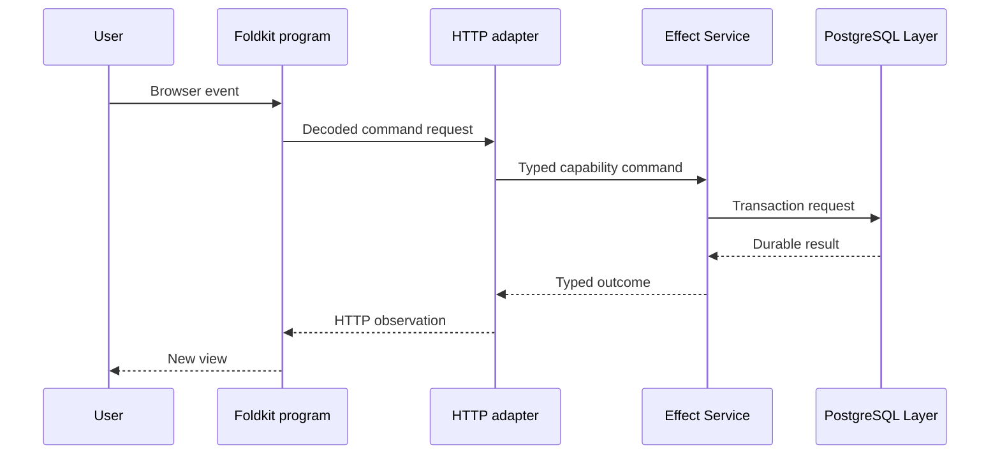

# Effect authority and Foldkit state

Effect and Foldkit own different parts of the system. Their boundary stays clear when messages, effects, and authority are explicit.

## Effect owns backend computation

Effect owns these concerns:

- decoded external input
- capability Services
- typed expected failures
- Layer composition
- scoped resources
- structured concurrency
- PostgreSQL transactions
- effect delivery programs

The backend composition root builds the live graph in [`apps/backend/src/main.ts`](https://github.com/vektorprogrammet/mono-web/blob/0bc4aa3ac5506b6371d25972c9608eee8e35c17d/apps/backend/src/main.ts).

## Foldkit owns finite browser behavior

A Foldkit program has these parts:

- `Model` stores the program state.
- `Message` describes an accepted input.
- `update` returns the next model and effect requests.
- `view` projects the model to HTML.
- the runtime interprets effects and sends result messages.

See the dashboard program in [`apps/dashboard/app/foldkit/dashboard`](https://github.com/vektorprogrammet/mono-web/tree/0bc4aa3ac5506b6371d25972c9608eee8e35c17d/apps/dashboard/app/foldkit/dashboard).

## The route bridge mounts the owner

React Router owns the URL and loader boundary. The route bridge can decode loader input and mount the Foldkit program.

The bridge must not keep a second copy of the Foldkit state. It must not perform hidden synchronization through React lifecycle effects.

A content bridge example is in [`apps/dashboard/app/foldkit/content/main.ts`](https://github.com/vektorprogrammet/mono-web/blob/0bc4aa3ac5506b6371d25972c9608eee8e35c17d/apps/dashboard/app/foldkit/content/main.ts).

## Commands cross the HTTP boundary

A Foldkit event can request an HTTP command. The backend adapter decodes that request and calls the Effect Service.

The browser observes the response. It does not become the write authority because it sent the command.

## Keep one owner for each state

The Foldkit `Model` owns finite browser state. The Effect Service owns capability policy. PostgreSQL owns durable facts.

Do not add a second cache, retry loop, state machine, or authority for the same item without an explicit ownership transfer.
