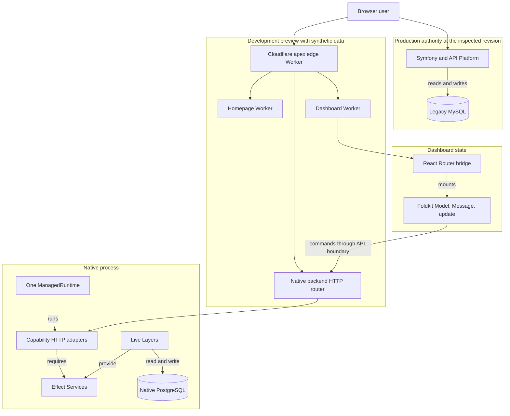

# Runtime and capability graph

The graph separates production authority from the synthetic preview. It also separates browser state from backend write authority.

## Ownership relations

| Item                          | Owner                                                 | Source                                                                                                                                                                                                                                                                                             |
| ----------------------------- | ----------------------------------------------------- | -------------------------------------------------------------------------------------------------------------------------------------------------------------------------------------------------------------------------------------------------------------------------------------------------- |
| Production legacy writes      | Symfony and Doctrine                                  | [`apps/server/src`](https://github.com/vektorprogrammet/mono-web/tree/0bc4aa3ac5506b6371d25972c9608eee8e35c17d/apps/server/src)                                                                                                                                                                    |
| Native HTTP dispatch          | `makeBackendHttp`                                     | [`apps/backend/src/router.ts`](https://github.com/vektorprogrammet/mono-web/blob/0bc4aa3ac5506b6371d25972c9608eee8e35c17d/apps/backend/src/router.ts)                                                                                                                                              |
| Native runtime lifecycle      | `makeBackendRuntime` and the backend composition root | [`apps/backend/runtime.ts`](https://github.com/vektorprogrammet/mono-web/blob/0bc4aa3ac5506b6371d25972c9608eee8e35c17d/apps/backend/runtime.ts), [`apps/backend/src/main.ts`](https://github.com/vektorprogrammet/mono-web/blob/0bc4aa3ac5506b6371d25972c9608eee8e35c17d/apps/backend/src/main.ts) |
| Native capability contracts   | Effect Services                                       | [`packages/domain/src`](https://github.com/vektorprogrammet/mono-web/tree/0bc4aa3ac5506b6371d25972c9608eee8e35c17d/packages/domain/src)                                                                                                                                                            |
| Shared PostgreSQL acquisition | Database Layer                                        | [`packages/database/src/layers.ts`](https://github.com/vektorprogrammet/mono-web/blob/0bc4aa3ac5506b6371d25972c9608eee8e35c17d/packages/database/src/layers.ts)                                                                                                                                    |
| Finite browser state          | Foldkit programs                                      | [`apps/dashboard/app/foldkit`](https://github.com/vektorprogrammet/mono-web/tree/0bc4aa3ac5506b6371d25972c9608eee8e35c17d/apps/dashboard/app/foldkit)                                                                                                                                              |
| Preview routing               | Alchemy apex stack                                    | [`infra/alchemy/alchemy.run.ts`](https://github.com/vektorprogrammet/mono-web/blob/0bc4aa3ac5506b6371d25972c9608eee8e35c17d/infra/alchemy/alchemy.run.ts)                                                                                                                                          |

The preview routing edge is not a production authority edge. Read [Preview and production](/explanation/preview-production-boundary) for this boundary.
