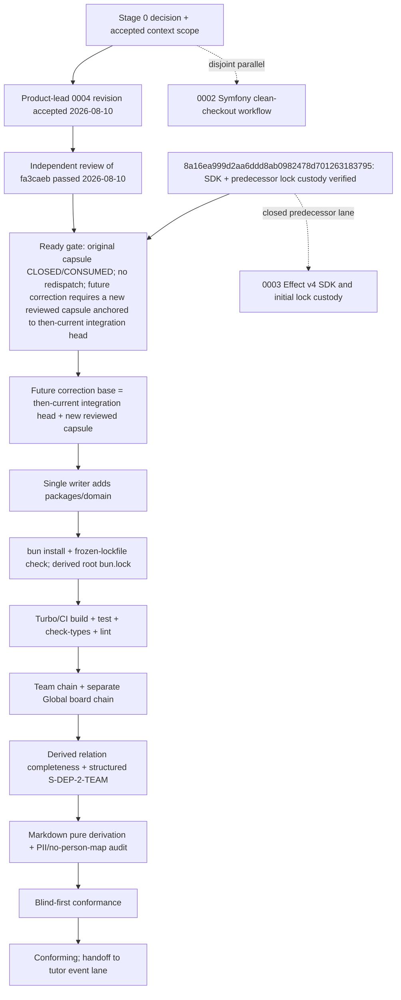

# Live design spec 0004 — Team→department conformance evidence

> **Summary:** A read-only, PII-minimized conformance tracer that traverses both `team_membership.teamId → team.departmentId → department.id` and `executive_board_membership.boardId → executive_board`, measures the team axis of `S-DEP-2`, and keeps national Hovedstyret in `Scope = Global` instead of inventing a local department. This is accepted intent after a product-lead revision on `2026-08-10`; implementation commits `bc7f459`, `897228e`, and `c90ec2d` are covered by independent code-review evidence `agent://TeamDomainCodeReview-2` and runtime evidence `agent://TeamDomainRuntimeVerifier-2`, both passing at `c90ec2d`. Lifecycle is `Conforming`/current for bounded `S-DEP-2-TEAM`; person authority remains unavailable, with no full `S-DEP-1` or temporal claim. No production, database, provider, credential, or network effect is claimed or performed.

## Metadata

| Field | Value |
|---|---|
| Stable ID | `0004` |
| Status | `Conforming` — product-lead acceptance recorded on `2026-08-10`; implementation commits `bc7f459`, `897228e`, and `c90ec2d`; independent code review passed at `agent://TeamDomainCodeReview-2` and runtime verification passed at `agent://TeamDomainRuntimeVerifier-2`, both against `c90ec2d`; bounded `S-DEP-2-TEAM` evidence is current and conformance is recorded; person authority remains unavailable (`INFO`/`PARTIAL`), with no full `S-DEP-1` or temporal claim; no production, database, provider, credential, or network effect is claimed or performed |
| Owner | Product lead/domain owner for acceptance and disposition; product lead remains read-only to implementation |
| Intended implementation lane | Canonical `mono-web/packages/domain/**` package — `@vektorprogrammet/domain` |
| Precursor boundary | `domain-conformance/` is an unversioned, read-only evidence precursor; it is never this slice's implementation target |
| Created | `2026-08-10` |
| Source checkpoint for this revision | Accepted tip `c7524572dcda5851bf9b0b8f2dd0f83b1c35c91b`; branch `spec/0004-team-department-conformance-evidence` |
| Implementation capsule/base | Implementation commits `bc7f459` (canonical capsule), `897228e` (schema repair), and `c90ec2d` (schema-issue classification); independent evidence is recorded at `agent://TeamDomainCodeReview-2` and `agent://TeamDomainRuntimeVerifier-2`, both passing at `c90ec2d`. The capsule is complete/consumed; future correction requires a new independently reviewed capsule anchored to the then-current integration head. |
| Journey count | One retained maintainer journey; current lifecycle is `Conforming`; any future correction requires a new reviewed capsule |
| Evidence boundary | Aggregate counts, source-qualified technical row samples, provenance, and synthetic falsifiers only; no names, emails, credentials, raw backup, person-affiliation table, or provider/production effects |

## Gate before implementation

This document records accepted implementation intent and the current lifecycle status is `Conforming`. Product-lead acceptance was recorded on `2026-08-10`; implementation commits `bc7f459`, `897228e`, and `c90ec2d` are covered by independent code-review evidence `agent://TeamDomainCodeReview-2` and runtime evidence `agent://TeamDomainRuntimeVerifier-2`, both passing at `c90ec2d`. The bounded `S-DEP-2-TEAM` result remains `INFO` for unavailable person authority (`PARTIAL`) with no full `S-DEP-1` or temporal claim. No production, database, provider, credential, or network effect is claimed or performed.

1. Independent review of the accepted product-lead revision passed on `2026-08-10`; final code review passed at `agent://TeamDomainCodeReview-2` and runtime verification passed at `agent://TeamDomainRuntimeVerifier-2`, both at `c90ec2d`. The reviews inspected the domain laws, lifecycle gates, bounded local/Global chains, falsifiers, PII boundary, and explicit D5/D6 limits; the evidence is current and `Conforming`.
2. The product lead owns and has revised/accepted D1–D4 and D7–D9 on `2026-08-10`; D5/D6 remain explicit downstream holds/partial limits in [Domain-owner decisions](#domain-owner-decisions). Independent review verified this disposition and the implementation-status evidence without redefining them.
3. The implementation capsule is **CLOSED/CONSUMED** by commits `bc7f459`, `897228e`, and `c90ec2d`, with independent code/runtime evidence at `agent://TeamDomainCodeReview-2` and `agent://TeamDomainRuntimeVerifier-2`; no writer may redispatch it. Historical implementation Drift records remain retained as resolved history. Any future correction requires a new independently reviewed capsule anchored to the then-current integration head; no production, database, provider, credential, or network effect is authorized here.
4. SDK lock custody is closed at `8a16ea999d2aa6ddd8ab0982478d701263183795`. Because adding `packages/domain/package.json` changes the root workspace graph, a future correction writer under a new reviewed capsule is the sole authorized owner of `packages/domain/**` and the derived root `bun.lock` update. That writer MUST regenerate the lock, run a frozen-lockfile check, and commit the package and lock together. A stale lock is forbidden; root `package.json` remains unchanged. No active writer is authorized by the consumed capsule.
5. The lane remains disjoint from 0002 and the closed 0003 SDK lane: 0002 owns only `mono-web/.github/workflows/ci.yml`; 0003 owns its exact SDK source paths and the predecessor lock custody already integrated into `8a16ea9`. This spec writer changes neither.

A disagreement with the observations, authority, or intended behavior enters `Drift`; it is not repaired by changing this spec or by weakening the law.

## Goal, constraints, and values

### Goal

Give a maintainer one repeatable, read-only journey that can answer this question from a named backup snapshot:

> For every team membership, what container does `teamId` resolve to, which department (if any) owns that container, and does the result represent a valid local tenancy edge or an explicit global Hovedstyret edge?

The journey must add the missing stable team extract/map, exercise the actual membership-to-team-to-department relation, report the team axis of `S-DEP-2` with provenance, preserve the observed national/local hierarchy, and retain the legal set-valued local-affiliation observation without exposing PII.

### Constraints

- **Read-only source:** derive a PII-minimized input outside the canonical package through the existing local backup procedure. Do not write to the backup, a production database, a provider, or any remote service. The package accepts an explicit external/ignored `dataDir`; it never owns the production extract.
- **PII minimization:** input and report output contain technical relation IDs, scope/classification, aggregates, counts, and source/provenance references only. The report MUST NOT serialize a full `userId → departmentIds` affiliation table or any raw person mapping artifact. Emit only bounded, source-qualified technical row samples such as `{ source: team_membership|executive_board_membership, id }`. Do not extract team/board names, email addresses, descriptions, user names, or contact data.
- **Explicit authority:** `S-DEP-1` forbids using `FieldOfStudy` as the person's Department edge. Also reject `team.department` circular authority and `assistant_history.department_id` (placement history, not tenancy). If an explicit person→Department source is unavailable, the real snapshot comparison is `PARTIAL`/`INFO` and any disagreement is `Drift`, never a silent row failure.
- **Set-valued local affiliation:** `S-DEP-2` permits a person to hold active memberships in more than one local Department. `localMultiDepartmentUsers` is an aggregate observation, never a violation and never a reason for `FAIL`. It is distinct from the Global Hovedstyret axis.
- **Local/global distinction:** every extracted `team` row is `Scope=Local` by source-file provenance; every extracted `executive_board`/`executive_board_membership` row is `Scope=Global` by source-file provenance. A null local Department is rejected. Global rows are a separate bounded context, never a null local Team.
- **No temporal claim:** this slice proves only the all-extracted-membership snapshot relation. It does not choose an active/as-of semester; operational temporal authority remains downstream.
- **Honest status:** static row evidence is not event-log evidence, SDK compatibility, Symfony parity, deployment, or production authorization. `domain-conformance/` remains a read-only precursor; the canonical package runs against explicit sanitized input and emits local disposable evidence. Decode errors, duplicate/ambiguous IDs, missing required files, unresolved coverage, and zero-edge runs cannot produce a passing evidence claim.
- **No dependency overlap:** no workflow, SDK source, app/server code, outer document, existing spec, provider path, or precursor implementation path is part of this lane. A future correction writer's root `bun.lock` update is the sole serialized dependency exception, and only a new reviewed capsule anchored to the then-current integration head may authorize it; root `package.json` is not mutable.

### Values

- **Ontology before shape:** a valid integer column is not proof that a membership belongs to the right tenant.
- **One relation, one map:** resolve the relationship once through stable duplicate-safe maps; never re-derive it from user study data or team names.
- **Set-valued affiliation, explicit scope:** aggregate distinct local Departments as a legal set and aggregate Global board edges separately. Global-plus-local is not local multiplicity.
- **Evidence over implication:** every law row identifies its source files/tables, snapshot, derivation, completeness, and PII boundary.
- **Reversible and disposable:** the extraction is a local read; generated data and temporary database state can be deleted without a data rollback.

## Current behavior and implementation status

| Area | Current observation | Consequence for this slice |
|---|---|---|
| Domain authority | `docs/domain-model.md` §1.3 makes Department the tenancy axis, states `S-DEP-1` (explicit person edge, never via `FieldOfStudy`) and `S-DEP-2` (set-valued local affiliation), and distinguishes local departments from `Scope = Global`. | The tracer must preserve these boundaries. Legal local set multiplicity is an observation, not a law failure; Hovedstyret remains Global. |
| Snapshot facts | The 2024 backup/domain context records **5 departments and 2923 users**. It shows **0 users spanning more than one local department**. **42 people are on national Hovedstyret while also holding a local team membership**. | `2923 users` is historical whole-backup/domain context only: this five-file relation tracer has no `user.json`, does not ingest or output a total population, and must not use 2923 as an input/output/reconciliation constant. Named relation evidence uses 5 departments, local relation aggregates (including zero local multi-department users), and the Global board aggregates; later extracts may disagree only with provenance and Drift. |
| Existing input | `domain-conformance` extracts `team_membership` with `teamId`, but `extract.sh` has no `team` query/output and the precursor has no board input. | A membership cannot currently be resolved through `team.department`, and the global chain is absent there too. |
| Existing schema/loader | `TeamMembershipRow` exists; there is no `TeamRow`, `teams` array, `teamById`, `GlobalContainerRow`, or `GlobalMembershipRow`. `loadDataset` reads `team_membership.json` and `user.json` but no team/board inputs. | The missing maps are real missing edges, not missing report labels. |
| Existing law/report | The legacy precursor `S-DEP-2` is `INFO`, checks only the `fieldOfStudy` axis, and reports `2923 checked / 0 violations`. | This is historical user-inclusive precursor context only; the canonical five-file relation tracer has no `user.json` by design and does not reuse that count. Add a distinct canonical team/global-axis row; do not relabel the precursor result as complete. |
| Legacy local mapping | `Team` is table `team`, has a `ManyToOne` `department`, and owns `TeamMembership` rows. `TeamMembership` has a `ManyToOne` `team` with `onDelete="SET NULL"`. | The source relation is `team.department`, traversed by nullable `teamId`; missing/deleted targets remain visible as unresolved evidence. |
| Legacy behavior risk | Legacy `Team::getActiveTeamMemberships()` selects a semester through `$wh->getUser()->getDepartment()`, not the team's department. | The tracer must not copy this user-department derivation or claim an implicit active semester. |
| Legacy global mapping | `ExecutiveBoard` is a separate `executive_board` entity/table and `ExecutiveBoardMembership` is a separate membership type. It implements the old `TeamInterface` but has no local Department relation. | The canonical input must preserve this bounded context as `executive_board.json` + `executive_board_membership.json`; Hovedstyret cannot be a local `Team`. |
| Global snapshot facts | The observed backup has **1 national board, 53 board-membership rows, 42 distinct board users, and all 42 also hold a local team membership**. | The journey must traverse both chains and report Global-plus-local, not invent 42 second local Departments. These exact counts are evidence inputs, not hardcoded implementation truth. |
| Current implementation | Commits `bc7f459`, `897228e`, and `c90ec2d` implement the canonical package and schema-issue boundary. Independent code review at `agent://TeamDomainCodeReview-2` and runtime verification at `agent://TeamDomainRuntimeVerifier-2` both pass at `c90ec2d`; focused build/check-types/lint/test and the fifteen-fixture journey pass. The lifecycle is `Conforming`/current for bounded `S-DEP-2-TEAM`; the snapshot remains `INFO` with relation completeness `FULL`, person completeness `PARTIAL`, unavailable person authority, and `Drift=true`. D5/D6 remain explicit downstream holds. No production, database, provider, credential, or network effect is claimed or performed. |
| Verified integration candidate | `8a16ea999d2aa6ddd8ab0982478d701263183795` independently verifies the integrated SDK and predecessor root-lock custody used by the consumed original capsule. | The original capsule's exact checkpoint is evidence/source lineage only and is not redispatchable as a standalone future base. A future correction requires a new independently reviewed capsule anchored to the then-current integration head; no stale lock and no root `package.json` change are allowed. |

### Evidence lock

These are the exact source lines that freeze the baseline. They are references, not mutable implementation paths for this lane.

| ID | Exact evidence | Claim frozen |
|---|---|---|
| `OBS-01` | `/srv/share/projects/vektorprogrammet/docs/domain-model.md:82-112` (outer workspace evidence; not a mono-web-relative link) | Department is the tenancy axis; `S-DEP-1` is explicit; `S-DEP-2` is set-valued; 5 departments/2923 users, zero local multi-department users, and 42 Hovedstyret-plus-local cases are recorded; Global is distinct from Department. |
| `OBS-02` | `/srv/share/projects/vektorprogrammet/docs/domain-model.md:529-568` (outer workspace evidence; not a mono-web-relative link) | The harness is the executable/test rung; the team axis of `S-DEP-2` is the named next extract, and static snapshots do not prove temporal laws. |
| `OBS-03` | `/srv/share/projects/vektorprogrammet/domain-conformance/extract.sh:16-27` (outer workspace evidence; read-only precursor) | `department`, `field_of_study`, and `team_membership` are extracted; no `team.json` or board extraction exists. |
| `OBS-04` | `/srv/share/projects/vektorprogrammet/domain-conformance/src/schema.ts:210-225` (outer workspace evidence; read-only precursor) | `TeamMembershipRow` has `teamId`; `UserRow` has only `fieldOfStudyId` and activity; no TeamRow/global row types exist. |
| `OBS-05` | `/srv/share/projects/vektorprogrammet/domain-conformance/src/data.ts:23-41,138-175` (outer workspace evidence; read-only precursor) | Dataset has team memberships but no team/global collections or maps; loader reads no team/board inputs. |
| `OBS-06` | `/srv/share/projects/vektorprogrammet/domain-conformance/src/laws.ts:451-471` and `/srv/share/projects/vektorprogrammet/domain-conformance/report.md:31,53` (outer workspace evidence; read-only precursor) | Current `S-DEP-2` is non-gating, field-of-study-only, checked 2923 with 0 violations, and explicitly says a team map is missing. |
| `OBS-07` | `/srv/share/projects/vektorprogrammet/vektorprogrammet/src/AppBundle/Entity/Team.php:11-47,110-114,303-326` (outer workspace evidence) | Legacy `team` has a Department relation and TeamMembership collection; active membership selection uses the user department. |
| `OBS-08` | `/srv/share/projects/vektorprogrammet/vektorprogrammet/src/AppBundle/Entity/TeamMembership.php:8-81,128-149` (outer workspace evidence) | Legacy membership links to `Team` with `onDelete="SET NULL"`; its nullable team target must not be silently repaired. |
| `OBS-09` | `/srv/share/projects/vektorprogrammet/vektorprogrammet/src/AppBundle/Entity/ExecutiveBoard.php:8-47,154-168` and `/srv/share/projects/vektorprogrammet/vektorprogrammet/src/AppBundle/Entity/ExecutiveBoardMembership.php:9-56,186-200` (outer workspace evidence) | National board is a separate container/membership pair implementing the old team interface without a Department edge. |
| `OBS-10` | `/srv/share/projects/vektorprogrammet/vektorprogrammet/src/AppBundle/Entity/Repository/TeamMembershipRepository.php:200-207` (outer workspace evidence) | Existing query semantics join `wh.team` and filter `team.department`; the intended local edge is not `user.department`. |
| `OBS-11` | `/srv/share/projects/vektorprogrammet/domain-conformance/README.md:3-10,27-30,50-55` (outer workspace evidence; read-only precursor) | The harness is the executable form of the model; `src/main.ts` writes a committable aggregate report with counts/row IDs only, while extracted JSON is gitignored and sensitive. |
| `OBS-12` | `/srv/share/projects/vektorprogrammet/domain-conformance/src/main.ts:58-103` and `/srv/share/projects/vektorprogrammet/domain-conformance/tests/schema.test.ts:47-63` (outer workspace evidence; read-only precursor) | The current renderer has a queryable law table but only a free-form Note column; existing tests establish explicit falsifier/rejection patterns. |

## Implementation contract (accepted intent; Conforming/current evidence)

The product lead revised and accepted this contract on `2026-08-10`. Independent code review passed at `agent://TeamDomainCodeReview-2` and runtime verification passed at `agent://TeamDomainRuntimeVerifier-2`, both against `c90ec2d`. The implementation commits `bc7f459`, `897228e`, and `c90ec2d` satisfy the bounded `S-DEP-2-TEAM` contract; the current snapshot remains `INFO`, relation completeness `FULL`, person completeness `PARTIAL`, person authority unavailable, checked `833`, violations `0`, and `drift=true`. Lifecycle is `Conforming`/current. D5/D6 remain explicit downstream limits, with no full `S-DEP-1`, temporal, production, database, provider, credential, or network claim.

### Stable local and global inputs

The canonical package receives an explicit external/ignored `dataDir`. It does not run the unversioned `domain-conformance` precursor and it never commits a production extract. The input keeps the two bounded contexts separate:

```ts
TeamRow = {
  id: number,
  departmentId: number | null,
}

TeamMembershipRow = {
  id: number,
  userId: number,
  teamId: number | null,
  // existing membership fields remain structural and PII-free
}

GlobalContainerRow = {
  id: number,
}

GlobalMembershipRow = {
  id: number,
  userId: number,
  boardId: number | null,
  // existing board-membership fields remain structural and PII-free
}
```

`team.json` rows are `Scope=Local` by **source-file provenance**, not by a `scope` column that does not exist in the legacy `team` table. `executive_board.json` and `executive_board_membership.json` rows are `Scope=Global` by their distinct source-file provenance. The canonical input MUST include all five required files whenever the snapshot is claimed complete; the global input is mandatory, not optional.

- `team.department_id` is the authoritative team→Department source for every extracted Team row, including rows referenced by historical memberships. A null local Department is `LOCAL_DEPARTMENT_NULL`; a Department ID absent from `department.json` is `LOCAL_DEPARTMENT_UNRESOLVED`; both are law failures.
- `TeamMembershipRow.teamId` is nullable so a null legacy FK is retained as `TEAM_UNRESOLVED` and rejected by the law, not lost at schema decode. A non-null ID absent from `team.json` is the separate dangling-target form of `TEAM_UNRESOLVED`.
- `GlobalMembershipRow.boardId` is nullable so a null legacy FK is retained as `GLOBAL_UNRESOLVED`. A non-null ID absent from `executive_board.json` is the separate dangling-target form of `GLOBAL_UNRESOLVED`. A resolved board membership is Global because it came from the board source file, never because a Team row had a null Department.
- `departmentById`, `teamById`, and `executiveBoardById` are separate duplicate-safe maps. Duplicate key IDs are retained in diagnostics and omitted from the affected lookup map; affected memberships resolve as unresolved/ambiguous evidence. Last-write-wins is forbidden.
- Decode failures are retained as safe diagnostics and count toward incomplete coverage; they are never silently dropped. A missing required file or malformed file raises a typed dataset input error exposing only a safe code and file identity, never the row payload.
- The input contains IDs, booleans/enums/ranges required for the relation, and provenance metadata only. Do not extract team/board names, email addresses, descriptions, user names, or contact data. A separately supplied person-authority projection may be used for comparison, but it is external/ignored input and is never serialized to the report.
- No production mutation/deletion semantics are inferred from legacy `SET NULL`; the tracer only records the resulting unresolved edge.

### Workspace and verification contract

The package contract applies only to a future correction writer operating under a new independently reviewed capsule; no active writer is authorized by the consumed capsule. `packages/domain/package.json` MUST declare these direct scripts and direct type/tool dependencies (version ranges follow the verified workspace convention):

```json
{
  "scripts": {
    "report": "bun run src/main.ts",
    "test": "bun run src/main.ts --fixtures",
    "build": "tsc --noEmit",
    "check-types": "tsc --noEmit",
    "lint": "oxlint"
  },
  "devDependencies": {
    "@types/node": "^22",
    "oxlint": "^1.41.0",
    "typescript": "^5"
  }
}
```

The fixture mode behind `test` is strict: it exits nonzero if any expected fixture status, reason code, or predicate differs. Root Turbo/CI MUST discover the package for `build`, `test`, `check-types`, and `lint`; the writer verifies this with the exact package-filtered commands in the journey and the repository-wide Turbo commands. No direct type or tool dependency may be satisfied only by incidental `@vektorprogrammet/sdk` hoisting.

After adding `packages/domain/package.json`, the same writer MUST run `bun install` to regenerate the derived root `bun.lock`, then run `bun install --frozen-lockfile`. The writer MUST commit the package and derived lock update together, MUST leave root `package.json` byte-unchanged, and MUST NOT leave a stale-lock state. The verified SDK/lock candidate remains untouched.

### Membership resolution and law contract

The one journey traverses both membership chains:

```text
team_membership.teamId
  ──lookup──▶ teamById[teamId]
      └─team.department_id──▶ departmentById[departmentId]──▶ Local Department

executive_board_membership.boardId
  ──lookup──▶ executiveBoardById[boardId]
      └─source-file provenance──▶ Global Hovedstyret container
```

The primary structured law result is `S-DEP-2-TEAM`. The resolver keeps two explicit axes: the **relation axis** proves the membership/container/source-file relations, while the separately supplied **person-authority axis** compares a structurally accepted local Department with an explicit person→Department projection when one exists.

1. Resolve every decoded TeamMembership through nullable `teamId`; null and dangling/missing Team targets are retained as `TEAM_UNRESOLVED`, not dropped.
2. Resolve every local `team.department_id`; null is `LOCAL_DEPARTMENT_NULL`, a missing Department is `LOCAL_DEPARTMENT_UNRESOLVED`, and a duplicate/ambiguous Department target is unresolved/ambiguous evidence. These are relation failures. A structurally valid local edge emits `ACCEPT_LOCAL` on the relation axis.
3. Resolve every decoded GlobalMembership through nullable `boardId`; null and dangling/missing board targets are retained as `GLOBAL_UNRESOLVED`, and duplicate/ambiguous board targets fail closed. A resolved board edge emits `ACCEPT_GLOBAL`, is Global, and never adds a local Department.
4. Per user, aggregate only the distinct Departments from structurally accepted local TeamMembership edges. A local set with more than one Department is legal under `S-DEP-2`: record `localMultiDepartmentUsers` as an aggregate observation, do not emit `LOCAL_MULTIPLICITY`, and do not make the law `FAIL`. Aggregate Global board edges separately; Hovedstyret plus one local Team remains `{Global, Local(d)}`, not `{d, invented-local}` and not a local multi-department violation.
5. If an explicit person-authority projection is supplied, compare each structurally accepted local edge independently. A valid local edge may therefore emit both `ACCEPT_LOCAL` (relation axis) and `LOCAL_DEPARTMENT_MISMATCH` (person-authority axis); the mismatch makes the overall law `FAIL`, but it does not retract the structural edge or turn legal local set multiplicity into a violation. If person authority is absent or disputed, report `personAuthority=PARTIAL`, `status=INFO`, and the named D5 hold/Drift; never invent a row failure or claim full `S-DEP-1` conformance.
6. The package MUST reject `user.fieldOfStudyId`, team-derived circular authority, and `assistant_history.department_id` as person-tenancy sources. The latter is placement history, not a Department affiliation edge.
7. Derive relation completeness; never hardcode `FULL`. `relationCompleteness=FULL` only when all five required files are present, every decoded relation-bearing row is accounted for, no decode failure exists, no relation-map key is duplicate/ambiguous, no required target coverage is unresolved, and at least one edge is considered. Any decode failure, duplicate/ambiguous relation ID, missing required file, unresolved coverage, or zero considered edges makes relation completeness `PARTIAL` and the run `Drift`/nonzero. A run with zero considered edges is unproven `INFO`/`Drift`/nonzero and can never be `PASS`.
8. Status is derived from evidence: an explicit relation or person-authority violation is `FAIL`; a complete, nonempty, violation-free requested axis may be `PASS`; absent/disputed person authority, partial relation coverage, input errors, or zero edges produce `INFO` and the applicable `Drift`/nonzero outcome. Expected snapshot counts never decide status and are never hardcoded into the resolver.
9. This slice reports all extracted membership relations in the named snapshot. It makes no active/as-of-semester claim; operational temporal authority remains a downstream decision.

The machine-readable report is the query authority. Markdown is a pure derivation for human reading; both report outputs are local disposable evidence unless a later accepted spec explicitly promotes one. The structured result includes:

| Law | Status | Relation completeness | Person-authority axis | Checked | Violations | Aggregate observations | Sample technical rows | Provenance |
|---|---|---|---|---:|---|---|---|---|
| `S-DEP-2-TEAM` | `PASS`, `FAIL`, or `INFO` derived from evidence | Derived `FULL` or `PARTIAL`; never a literal constant | `FULL` only with an explicit complete projection; current snapshot is `PARTIAL` | Number of decoded TeamMembership + GlobalMembership edges considered, including retained null/dangling edges | Local null/unresolved/ambiguous edges, unresolved global edges, and explicit person-authority mismatches; **never local set multiplicity** | Counts such as local users, `localMultiDepartmentUsers`, Global users, Global-plus-local users, and reason totals; no per-user mapping | Bounded `{ source: "team_membership"|"executive_board_membership", id }` rows only | `snapshot=<named backup>; files=team_membership.json→team.json→department.json; executive_board_membership.json→executive_board.json; tables=team_membership.team_id→team.department_id→department.id and executive_board_membership.board_id→executive_board.id; scope=source-file provenance; pii=none` |

The real snapshot row MUST be `INFO`/`PARTIAL` for the person-affiliation comparison and must not claim full S-DEP-1 conformance. A legal local multi-department observation remains non-gating. Local null/unresolved Team and resolved local mismatches still fail their relation/authority checks. The report MUST NOT contain `userAffiliations`, a full `userId → departmentIds` table, raw `userId` mappings, names, or payloads. Internal synthetic fixture state may inspect affiliation sets and then discard them. The named law ID, reason codes, machine report, source chains, completeness, and bounded source-qualified samples are stable evidence IDs; a prose note cannot replace them.

### Synthetic falsifier matrix

The journey must exercise these PII-free fixtures in addition to the named snapshot. Fixtures use synthetic numeric IDs, may inspect internal affiliation sets, and do not enter the production report. The strict fixture command exits nonzero if any expected status, reason code, or predicate differs.

| Fixture | Input relation | Required observation |
|---|---|---|
| `F-local-valid` | `team_membership m1.teamId=t1`; `team.json[t1].departmentId=d1`; `department.json[d1]` exists; person projection agrees with `d1` | Relation reason `ACCEPT_LOCAL`; status `PASS`; add only `d1` to the internal local set. |
| `F-local-set-valued` | Same user has valid `m1.teamId=t1 → d1` and `m2.teamId=t2 → d2`; both Departments exist; person projection authorizes `{d1,d2}` | Emit `ACCEPT_LOCAL` for both edges; status `PASS`; internal local set is `{d1,d2}` and `localMultiDepartmentUsers=1`; **no `LOCAL_MULTIPLICITY`, no violation, no `FAIL`**. |
| `F-local-wrong` | Structurally valid `t1.departmentId=d1`, but a separately supplied person-authority projection says the user belongs in `d2` | Emit `ACCEPT_LOCAL` on the relation axis and `LOCAL_DEPARTMENT_MISMATCH` on the person-authority axis; status `FAIL`. If the projection is absent/disputed, retain `ACCEPT_LOCAL` and report `INFO`/`PARTIAL` + Drift instead of fabricating a mismatch. |
| `F-local-null` | `team.json[t2].departmentId=null` | Status `FAIL`; emit `LOCAL_DEPARTMENT_NULL`; never classify it as Global. |
| `F-local-unresolved` | `team.json[t3].departmentId=999999`, absent from `department.json` | Status `FAIL`; emit `LOCAL_DEPARTMENT_UNRESOLVED`; retain the affected membership as evidence. |
| `F-team-null` | `team_membership m2.teamId=null` | Status `FAIL`; retain and emit `TEAM_UNRESOLVED`. |
| `F-team-dangling` | `team_membership m3.teamId=999999`, absent from `team.json` | Status `FAIL`; retain and emit the dangling-target form of `TEAM_UNRESOLVED`. |
| `F-global-hovedstyret` | `executive_board_membership b1.boardId=g1`; `executive_board.json[g1]` exists; complete person-authority projection supplies the empty local-Department set for this Global-only user | Status `PASS`; emit `ACCEPT_GLOBAL`; add no local Department and no local-multiplicity violation. |
| `F-global-null` | `executive_board_membership b2.boardId=null` | Status `FAIL`; retain and emit `GLOBAL_UNRESOLVED`; null Global is not a local Team. |
| `F-global-dangling` | `executive_board_membership b3.boardId=999999`, absent from `executive_board.json` | Status `FAIL`; retain and emit the dangling-target form of `GLOBAL_UNRESOLVED`. |
| `F-global-not-team` | A board row and a local Team row have the same numeric ID in their separate files; complete person-authority projection supplies exactly the Department of the accepted local Team | Status `PASS` for each valid edge; keep maps/bounded contexts separate; never let the board row become a local Team or vice versa. |
| `F-zero-edges` | Five valid required JSON collections are present but empty (`[]`), with a complete person-authority projection containing the empty user set | Canonical law path returns `INFO`/`PARTIAL` with `Drift=true`, `checked=0`, and nonzero; the strict fixture gate records this deliberate unproven result and never accepts `PASS`. |
| `F-duplicate-targets` | Duplicate IDs in each subcase: a `team` target, a `department` target, and an `executive_board` target, with memberships pointing at the duplicated IDs | For every subcase, omit the ambiguous map entry, retain the duplicate diagnostic, and fail closed as unresolved/ambiguous (`TEAM_UNRESOLVED`, `LOCAL_DEPARTMENT_UNRESOLVED`, or `GLOBAL_UNRESOLVED` with ambiguity evidence); relation completeness `PARTIAL`, `Drift=true`, status `FAIL`, nonzero. Never last-write-wins. |
| `F-input-decode` | One required JSON row has an invalid shape/type | No payload is emitted. Expose a safe dataset error code plus the failing file identity; relation completeness `PARTIAL`, `Drift=true`, nonzero. |
| `F-input-missing` | Disposable sanitized `DATA_DIR` contains all five expected inputs except the named Global file `executive_board.json` | Invoke the real production `loadDataset`/file-read path against this directory, not a helper-only preflight; assert a safe `DatasetInputError` code plus `executive_board.json` identity and nonzero with no payload, then remove the disposable directory. |

The production snapshot must include both membership chains. The board reconciliation is **1 board / 53 board-membership rows / 42 distinct board users / all 42 also local TeamMembership users**. The person-mismatch part remains `PARTIAL`/`INFO` because no authoritative explicit person→Department edge exists. Named relation reconciliation is **5 departments / 0 local multi-department users / 1 board / 53 rows / 42 distinct board users / all 42 local**; these are relation evidence inputs, never a total-population input or hardcoded resolver truth. Do not infer a total population from the membership union.

## Exact maintainer journey

The original implementation journey is retained as consumed evidence; it is closed and is not a dispatch instruction. A future correction may repeat it only under a new independently reviewed capsule anchored to the then-current integration head. The current spec author does not run it, edit the precursor, or edit the canonical package.

1. **Enter the verified integration checkpoint.** The consumed capsule used exact candidate `8a16ea999d2aa6ddd8ab0982478d701263183795` and is now **CLOSED/CONSUMED**; do not redispatch from it. For any future correction, the new reviewed capsule must name the then-current integration head and clean worktree. Raw `f207ed53`, `f92d87eb`, and `e653713` tips, plus historical `da6a652`/`084f4e0`, are evidence/source lineage only, not standalone bases. SDK lock custody is closed at the consumed candidate.
2. **Own and close the workspace lock edge.** The single 0004 writer adds only `packages/domain/**` and the derived root `bun.lock`; root `package.json` remains unchanged. After adding the package manifest, run `bun install`, then `bun install --frozen-lockfile`; verify the lock contains the `packages/domain` workspace and that no stale-lock state remains. Run `bun turbo build --filter=@vektorprogrammet/domain`, `bun turbo test --filter=@vektorprogrammet/domain`, `bun turbo check-types --filter=@vektorprogrammet/domain`, and `bun turbo lint --filter=@vektorprogrammet/domain`; the package scripts must also be discovered by unfiltered repository Turbo/CI. Commit the package and lock together before handoff.
3. **Preflight the external input.** The operator names a local, sanitized `DATA_DIR` containing `department.json`, `team.json`, `team_membership.json`, `executive_board.json`, and `executive_board_membership.json`. Record the backup snapshot identifier/hash and source-table provenance. The canonical package accepts this explicit external/ignored directory; it does not create or own a production extract.
4. **Preserve both bounded contexts.** Confirm all **five** inputs are present. `team.json` has only technical Team rows and is Local by file provenance; the two executive-board files are Global by file provenance. The board input is mandatory. Missing local or Global input is an incomplete/Drift run, not an optional feature path. Dataset failures must expose safe code plus file identity and no payload.
5. **Decode and build maps.** Run the canonical `@vektorprogrammet/domain` package against `DATA_DIR`. Decode nullable `TeamMembershipRow.teamId` and `GlobalMembershipRow.boardId` without dropping nulls. Build separate `departmentById`, `teamById`, and `executiveBoardById` maps; retain decode failures and duplicate/ambiguous IDs as diagnostics; keep affected null, dangling, and ambiguous references visible.
6. **Run the strict falsifier matrix.** Execute `F-local-valid`, `F-local-set-valued`, `F-local-wrong`, `F-local-null`, `F-local-unresolved`, `F-team-null`, `F-team-dangling`, `F-global-hovedstyret`, `F-global-null`, `F-global-dangling`, `F-global-not-team`, `F-zero-edges`, `F-duplicate-targets`, `F-input-decode`, and `F-input-missing`. The fixture command exits nonzero if any expected status, reason, or predicate differs. A fixture that merely decodes is insufficient; both membership chains and both null/dangling forms must be traversed.
7. **Query the structured law result.** Invoke the package's deterministic runner with the explicit data directory (`bun run packages/domain/src/main.ts --data-dir "$DATA_DIR"`). The named snapshot is expected to return `INFO`/`Drift` with a nonzero status because current person authority is absent; capture that status deliberately (`set +e; bun run packages/domain/src/main.ts --data-dir "$DATA_DIR"; status=$?; set -e` or equivalent), assert the expected nonzero fail-closed result, and continue the report/Markdown/PII evidence checks rather than aborting the journey. A nonzero here is expected evidence, not a shell failure. Query machine-readable `S-DEP-2-TEAM`, then derive Markdown from that same result. Record status, relation/person completeness, checked/violations, reason-code totals, aggregate observations, bounded source-qualified technical samples, both source chains, snapshot ID/hash, and `pii=none`. Confirm no full person-affiliation map is present.
8. **Reconcile the frozen facts.** Compare relation output with **5 departments, zero local multi-department users, 1 national board, 53 board-membership rows, 42 distinct board users, and all 42 also in a local TeamMembership**. These relation aggregates are expected evidence inputs, not constants: a different result is not “fixed” by editing the law or hardcoding counts; record source evidence and enter Drift. The 42 cases MUST remain Global-plus-local, not 42 second local Departments. This five-file tracer has no `user.json`, does not report a total population, and never infers one from the membership union. A later extract may legitimately show local set multiplicity; that observation is legal and non-gating.
9. **Audit the PII boundary.** Inspect only metadata/field names and sanitized machine/Markdown output. Prove that `DATA_DIR`, the report, and the evidence record contain technical relation IDs, aggregates, counts, and provenance only. Prove that samples are bounded and source-qualified, with no `userId → departmentIds` table, raw person mapping, names, emails, or payloads. Do not print, commit, or upload raw backup rows.
10. **Independent review.** A blind-first verifier receives this frozen spec revision, the corrected canonical package commit, the derived lock, fixture output, and structured law result before author rationale. The verifier runs all fixtures, checks both chains, checks local set-valued legality and independent mismatch axes, checks relation completeness/zero-edge behavior, checks the path/lock boundary, checks package `build`/`test`/`check-types`/`lint` scripts and direct dependencies, and confirms the partial person-authority status. The writer cannot self-accept.
11. **Clean up and hand off.** Remove the external/ignored `DATA_DIR` and any temporary logs/state unless an owner explicitly retains a sanitized fixture. Leave the mono-web implementation worktree clean, with only `packages/domain/**` and the authorized derived root `bun.lock` in the one-to-one commit; root `package.json`, SDK paths, and all other paths remain unchanged. Report evidence IDs, lock regeneration/frozen-check output, base/branch/paths, downstream holds, the resolved `f207ed53`/historical `da6a652`/`084f4e0` Drift corrections, and the next lifecycle state.

## Dependency and resource graph



**Legend:** solid arrows are prerequisites; dotted arrows are disjoint lanes or closed predecessor custody. The original 0004 implementation capsule is closed/consumed by verified `f207ed53`/`f92d87eb`/`e653713` evidence and cannot be redispatched. A future correction requires a new reviewed capsule anchored to the then-current integration head; raw `f207ed53`/`f92d87eb`/`e653713` and historical `da6a652`/`084f4e0` remain evidence/source lineage, not standalone bases. The new capsule must preserve one-writer package/lock custody, regenerate and freeze the root lock, and leave root `package.json` unchanged. A stale lock, an inert fixture command, a missing `build`/`test`/`check-types`/`lint` script, or an open implementation Drift blocks that future lane.

| Dependency/resource | Required boundary |
|---|---|
| Stage 0 decision/context | Accepted before `Ready`; it does not grant production or provider access. |
| Revision review | Passed on `2026-08-10` for the accepted revision; final independent code review passed at `agent://TeamDomainCodeReview-2` and runtime verification passed at `agent://TeamDomainRuntimeVerifier-2`, both at `c90ec2d`. The implementation commits `bc7f459`/`897228e`/`c90ec2d` are current Conforming evidence; historical Drift records are superseded/resolved and retained. |
| Verified integration candidate | The exact candidate `8a16ea999d2aa6ddd8ab0982478d701263183795` is the consumed original capsule's SDK/predecessor-lock checkpoint, not a redispatchable standalone future base. A future correction requires a new independently reviewed capsule anchored to the then-current integration head; raw `f207ed53`/`f92d87eb`/`e653713` and historical `da6a652`/`084f4e0` are evidence/source lineage only. |
| Future 0004 writer | No active writer is authorized by the consumed capsule. A future correction writer is the sole owner of `mono-web/packages/domain/**` and the derived root `mono-web/bun.lock` only when assigned by the new reviewed capsule; one writer and one implementation commit. |
| Workspace/lock commands | After package creation: `bun install`, then `bun install --frozen-lockfile`; stale-lock state is forbidden; root `package.json` is unchanged. |
| Package verification | `packages/domain` declares direct `build`, `test`, `check-types`, and `lint` scripts plus direct `@types/node`, `typescript`, and `oxlint`; Turbo/CI must execute all four. |
| Backup snapshot | Operator-named, local, read-only, with a provenance/hash record; raw contents never enter Git or evidence. |
| Explicit `DATA_DIR` | Must contain `department.json`, `team.json`, `team_membership.json`, `executive_board.json`, and `executive_board_membership.json`; external/ignored and never committed. |
| Team chain | `team_membership.teamId → team.department_id → department.id`; Team rows are Local by source-file provenance. |
| Global chain | `executive_board_membership.boardId → executive_board.id`; board rows are Global by source-file provenance and remain a separate bounded context. |
| `S-DEP-1`/`S-DEP-2` | Domain-law authority; no FieldOfStudy, team-derived circular, or assistant-history fallback; local set multiplicity is legal; current person comparison is partial. |
| Relation completeness | Derived from required files, decode results, duplicate/ambiguity diagnostics, target coverage, and nonzero considered edges; never hardcoded `FULL`. |
| Report boundary | Aggregates and bounded `{source,id}` row samples only; no full person-affiliation mapping or payload. |
| 0002 | Owns only `mono-web/.github/workflows/ci.yml`; no overlap. |
| 0003 | SDK/source and predecessor lock custody are closed at the verified candidate; 0004 does not mutate SDK paths. |
| Tutor event lane | Downstream consumer; starts only after this lane exits `Conforming` with the team/global evidence, legal set-valued semantics, and explicit partial limit. |

## Scope and exact path authority

### This spec writer (closed lane)

The current writer MAY create or modify **only**:

- `mono-web/design-specs/0004-team-department-conformance-evidence.md`

The current writer MUST NOT edit `domain-conformance`, any mono-web source/config/lock/workflow, the legacy repository, the backup, or any existing document/spec. This branch is for this accepted-spec revision and its cumulative spec-only commit series.

### Later implementation writer (no active dispatch; new reviewed capsule required)

The future correction writer under a new independently reviewed capsule MAY modify only:

- `mono-web/packages/domain/**` — the versioned `@vektorprogrammet/domain` package, including the relevant migrated harness schema/data/law/tests/runner source, package manifest/scripts/direct dependencies, and report projection required by this journey.
- `mono-web/bun.lock` — the derived workspace-lock update required after adding `packages/domain`; this is the sole authorized root-lock mutation for 0004.

The original implementation capsule used exact candidate `8a16ea999d2aa6ddd8ab0982478d701263183795` and is now **CLOSED/CONSUMED**; it is not redispatchable. Raw `f207ed53`/`f92d87eb`/`e653713` and historical `da6a652`/`084f4e0` are evidence/source lineage only, not standalone future bases. A future correction requires a new independently reviewed capsule anchored to the then-current integration head. Only that new capsule may name `/tmp/mono-web-team-department-impl-0004-20260810`, the branch, one writer, and one implementation commit. The coordinator records the concrete base commit and clean status before mutation. Under that new capsule, the writer MUST regenerate `bun.lock`, run `bun install --frozen-lockfile`, and commit the package plus derived lock together. Root `package.json` remains unchanged. PR, commit, worktree, rollback, and evidence all belong to `mono-web`.

`domain-conformance/` remains an unversioned, read-only precursor/evidence source. A future correction writer under a new capsule MUST NOT edit its source, tests, runner, report, lockfile, or data. It may be read to understand the existing laws and to compare evidence, but it is never the implementation target.

Every other path is forbidden: root `package.json`; all mono-web apps/server/SDK/workflow paths outside `packages/domain/**` and the authorized root lock update; all outer docs/specs; the legacy `vektorprogrammet` source/migrations; raw backup and raw/PII-bearing extracts; provider/production/remote state; credentials; and unrelated generated data. No production extract, person mapping, or stale lock is committed. An external/ignored sanitized `DATA_DIR` is input only and is deleted after the journey.

The 0002 and 0003 lanes remain disjoint: 0002 owns only `.github/workflows/ci.yml`; 0003 SDK and predecessor lock custody are closed at `8a16ea9`. 0004 cannot mutate any SDK path and the current writer cannot mutate any lock.

## Domain-owner decisions

The product lead revised and accepted D1–D4 and D7–D9 on `2026-08-10`; independent code review passed at `agent://TeamDomainCodeReview-2` and runtime verification passed at `agent://TeamDomainRuntimeVerifier-2`, both at `c90ec2d`. D5 and D6 are explicit downstream evidence holds, not alternate authorities or hidden blockers. The current implementation commits provide Conforming evidence for bounded `S-DEP-2-TEAM`; the snapshot remains `INFO`/`PARTIAL` for unavailable person authority and makes no full `S-DEP-1`/temporal claim or production/database/provider/network claim.

| ID | Accepted decision | Remaining downstream hold | Authority / gate consequence |
|---|---|---|---|
| `D1` | **Authoritative team→department source/table:** legacy `team.department_id` in the named backup is canonical for every extracted Team row, including historical membership references. Null/unresolved local targets fail. No production mutation/deletion semantics are inferred. | None for this slice; retirement/history semantics remain outside the read-only relation claim. | Product lead owns; data operator records source provenance. |
| `D2` | **Hovedstyret/global representation:** read separate `executive_board.json` and `executive_board_membership.json`; project those rows to Global at the resolver boundary. Never fold board rows into Team and never represent Global with a Team `scope` column. | None for this slice; future one-construct domain modeling may consume the explicit Global edge. Snapshot expectation: 1 board, 53 rows, 42 distinct users, all 42 also local. | Product lead owns; global input is mandatory and its provenance is independent of local affiliation. |
| `D3` | **Nullable/global treatment:** Team `departmentId=null` is always a local relation failure. Global is valid only through the separate board source-file provenance. Null alone never means Hovedstyret. Both null and dangling Team/board targets must be retained and rejected. | None for this slice. | Product lead owns; local null is `LOCAL_DEPARTMENT_NULL`, not `ACCEPT_GLOBAL`; board null/dangling is `GLOBAL_UNRESOLVED`. |
| `D4` | **Mismatch and multiplicity disposition:** a structurally valid local edge emits `ACCEPT_LOCAL`. Once an authoritative explicit person→Department edge exists, a separate local mismatch emits `LOCAL_DEPARTMENT_MISMATCH` and makes the law `FAIL`; absence/disagreement of that authority is `Drift`/`PARTIAL`. Legal set-valued local affiliation is an aggregate observation, never `LOCAL_MULTIPLICITY`, a violation, or `FAIL`. | D5 names the absent source for the current snapshot. | Product lead owns; relation and person-authority axes remain explicit and no authority mismatch may be hidden or used to reject legal multiplicity. |
| `D5` | **Person-affiliation authority:** no current snapshot source is authoritative. Reject `field_of_study`, team-derived circular authority, and `assistant_history.department_id` as substitutes. | Current report is `INFO`/`PARTIAL`; a future explicit person→Department projection is required before full S-DEP-1 conformance is claimed. | Downstream domain-owner hold; independent review verifies the partial limit, not the missing authority. |
| `D6` | **Temporal semantics:** this slice reports the all-extracted-membership snapshot relation only; it makes no active/as-of-semester claim. | Operational active-membership/time authority is a downstream event/domain decision. | Downstream domain-owner hold; no `currentOrLatestAdmissionPeriod` derivation is allowed here. |
| `D7` | **Evidence IDs/provenance:** stable law ID `S-DEP-2-TEAM`, named reason/fixture IDs, and `E0`–`E8` are the evidence identifiers. Generated machine-readable report is query authority; Markdown is a pure derivation; both are local disposable evidence. Reports contain aggregates and bounded source-qualified row samples only, never a full person-affiliation map. | None for this slice; a later authority may promote a report artifact explicitly. | Product lead owns; verifier independently checks structured evidence and the no-person-map boundary. |
| `D8` | **Canonical placement and custody:** the original implementation capsule is CLOSED/CONSUMED from exact candidate `8a16ea999d2aa6ddd8ab0982478d701263183795`; raw `f207ed53`/`f92d87eb`/`e653713` and historical `da6a652`/`084f4e0` are evidence/source lineage, not standalone future bases. A future correction requires a new independently reviewed capsule anchored to the then-current integration head; no active writer is authorized by the consumed capsule, and that new writer owns `mono-web/packages/domain/**` plus the derived root `bun.lock`, regenerates and frozen-checks the lock, and commits both; root `package.json` remains unchanged. | Any relocation or shared lock ownership requires a new accepted spec/revision and path capsule. | Product lead owns; stale-lock state, SDK edits, root-manifest edits, or a second lock owner block `Ready`/Conforming. |
| `D9` | **Report, completeness, and automation shape:** machine-readable structured law result is the query interface and includes separately derived relation/person completeness, status, checked/violations, aggregate set-valued observations, reason codes, source-qualified bounded samples, and both-chain provenance. Zero edges are `INFO`/`Drift`/nonzero; decode/duplicate/missing/unresolved coverage is `PARTIAL`/Drift; package `build`, `test`, `check-types`, and `lint` scripts/direct tools are mandatory; fixture failure is nonzero. | Exact serialization is implementation detail inside `packages/domain/**`; it cannot remove the stable law/reason/provenance fields, serialize a person map, or make a legal local set a failure. | Product lead owns; verifier independently checks the query/derivation, script discovery for all four tasks, strict fixture exit, and no-hardcoded-completeness contract. |

## Evidence plan (`E0`…`E8`)

Every item names one claim and one sanitized destination. `E0` records this accepted spec revision; `E1`–`E8` record the current Conforming evidence at `c90ec2d`, with independent code-review evidence `agent://TeamDomainCodeReview-2` and runtime evidence `agent://TeamDomainRuntimeVerifier-2`. The record remains bounded to local disposable evidence and makes no production, database, provider, credential, or network claim.

| ID | Artifact / observation | Claim it must verify | Gate |
|---|---|---|---|
| `E0` | Accepted spec authority tip/ancestry record: accepted tip `c7524572dcda5851bf9b0b8f2dd0f83b1c35c91b` is the authority ancestor, this branch's cumulative ancestry is recorded, status is clean, and the cumulative diff from that authority contains only `design-specs/0004-team-department-conformance-evidence.md`; it makes no literal-parent or one-commit claim. | Product-lead revision isolation and exact path authority. | Specified → Ready |
| `E1` | Operator-held snapshot identifier/hash, explicit `DATA_DIR` manifest, and source-table/file provenance for all five required inputs. | The input is the named backup snapshot; both local and Global chains are present; no provider/production access or raw data publication occurred. | Ready → Building |
| `E2` | Canonical package decoder/map output: nullable Team/Global membership IDs, separate maps, duplicate/ambiguity diagnostics, decode-failure counts, required-file errors with safe code+file identity, and retained relation coverage. | The two bounded contexts are stable; null/dangling/ambiguous references remain evidence; no last-write-wins or dropped membership; incomplete input is `PARTIAL`/Drift. | Building |
| `E3` | Strict synthetic falsifier output for the fifteen named fixture cases, including both null and dangling Team/board targets, legal local set multiplicity, zero edges, duplicate targets, decode failure, and missing-file cases. | Ontology boundaries reject wrong/null/unresolved local edges and global targets, preserve legal set-valued affiliation, make zero-edge evidence `INFO`/`PARTIAL` + `Drift`/nonzero, prevent a board row from becoming a local Team, and fail the fixture command nonzero on any status/reason/predicate mismatch. | Building |
| `E4` | Queryable machine-readable `S-DEP-2-TEAM` result plus Markdown pure derivation, with derived relation/person completeness, status, aggregates, provenance, and bounded source-qualified technical row samples. | The structured law result is the query authority and traces both chains without PII or a full person-affiliation mapping. | Experienceable → Conforming |
| `E5` | Named-snapshot relation aggregate reconciliation: 5 departments, zero local multi-department users, 1 board, 53 board-membership rows, 42 distinct board users, all 42 also local, and person comparison `INFO`/`PARTIAL`. Capture the expected `INFO`/`Drift` nonzero status with `set +e`/status capture or equivalent so report, Markdown, and PII evidence checks continue. No `user.json` or total-population count is an input/output of this relation tracer. | The tracer measures the observed hierarchy and states the S-DEP-1 limit honestly. These relation aggregates are evidence inputs; a difference requires source evidence/Drift, not hardcoded truth; the expected nonzero is deliberate fail-closed evidence, not a shell abort. | Experienceable |
| `E6` | PII audit of external input, machine report, Markdown derivation, and evidence metadata. | No names, email, description, contact data, credentials, raw backup rows, full `userId → departmentIds` mapping, or payload escaped the local read. | Experienceable |
| `E7` | Independent final code review passed at `agent://TeamDomainCodeReview-2`; independent runtime verification passed at `agent://TeamDomainRuntimeVerifier-2`; both cover implementation commits `bc7f459`, `897228e`, and `c90ec2d` and the accepted conformance evidence. | Independent source/runtime findings, deterministic fixtures, schema boundary, path scope, PII boundary, and explicit D5/D6 limits pass; lifecycle is `Conforming`. | Conforming |
| `E8` | Runtime evidence at `c90ec2d` passed the focused domain build/check-types/lint/test gates and the strict fifteen-fixture journey. The report remains `INFO`/`FULL` relation/`PARTIAL` person with no production, database, provider, credential, or network effect. | The executable evidence is current, bounded, reproducible, and honest about unavailable person authority and temporal semantics. | Conforming |

## Falsifiers and required Drift behavior

The following observations falsify this intent. The writer stops, records the exact sanitized artifact/source row IDs, and routes to `Drift`; it does not broaden scope or edit domain authority to make the run pass.

- Any of the five required input files is absent, the Global board input is treated as optional, or the implementation edits/depends on the unversioned `domain-conformance` precursor as its target.
- The future base is not exact candidate `8a16ea999d2aa6ddd8ab0982478d701263183795`, the writer starts from `f207ed53`, historical `da6a652`, or `084f4e0`, or a second writer mutates `packages/domain/**`/`bun.lock`.
- The canonical package does not expose a nullable `TeamMembershipRow.teamId` or `GlobalMembershipRow.boardId`; either null target is dropped at decode instead of retained as unresolved evidence.
- A local membership with a null, dangling, ambiguous, or wrong `team.department_id` is accepted, silently dropped, or converted to a different valid Department.
- A board membership is folded into Team, a Team row receives a nonexistent `scope` column, or Global is inferred from a null local Department.
- Hovedstyret membership is counted as a second local Department, or the observed 42 Global-plus-local users become local multi-department violations.
- A legal local set-valued affiliation is emitted as `LOCAL_MULTIPLICITY`, counted as a violation, or made `FAIL` without an independent person-authority mismatch.
- The implementation uses `user.fieldOfStudyId`, a team-derived circular edge, or `assistant_history.department_id` as authoritative person tenancy, contrary to `S-DEP-1`.
- A structurally valid local edge lacks `ACCEPT_LOCAL` on the relation axis, or a supplied person-authority mismatch is hidden/downgraded instead of `LOCAL_DEPARTMENT_MISMATCH`/`FAIL`; conversely, absent/disputed authority is fabricated into a row mismatch.
- Swapping two valid `team.department_id` values leaves the law PASS when the trace has an authoritative expected Department; this proves only row shape was tested.
- Duplicate relation IDs overwrite one another, ambiguous targets are treated as resolved, unresolved/ambiguous references disappear from `checked`, or duplicate diagnostics are absent.
- A decode failure, missing required file, or unresolved relation coverage reports `FULL` or `PASS`; relation completeness is a hardcoded literal; a zero-considered-edge dataset returns `PASS`, `drift=false`, or exit code 0.
- Dataset errors omit the safe code or file identity, or expose row payload/content. The Global missing-file case is treated as optional.
- The fixture command does not exercise both null and dangling Team/board forms, the explicit `F-zero-edges` case, the duplicate subcases, or the input-boundary cases, or exits 0 when any expected status, reason, or predicate differs.
- The machine report is absent/not queryable by `S-DEP-2-TEAM`, Markdown is not a pure derivation, provenance omits one chain, or the current person comparison claims full S-DEP-1 conformance.
- The report serializes a full `userId → departmentIds`/`userAffiliations` table, raw person mapping, unbounded user rows, or unqualified numeric samples; samples must be bounded and source-qualified.
- `packages/domain/package.json` lacks `build`, `test`, `check-types`, or `lint`; Turbo/CI skips any of the four domain tasks; direct type/tool dependencies rely on SDK hoisting; or fixture failures do not set a nonzero exit.
- `bun.lock` is stale or hand-wrong after the package enters the root workspace graph, `bun install --frozen-lockfile` fails, root `package.json` changes, or the lock is mutated before the sole 0004 writer owns the edge.
- Snapshot relation aggregates differ from the exact evidence inputs 5 departments/0 local span/1 board/53 rows/42 users/all local without source hash/provenance and a Drift disposition, or the implementation hardcodes those relation aggregates. Never infer a total population from the membership union.
- Any credential, provider, production, remote database, public route, deployment, or destructive cleanup effect occurs.
- A writer edits a forbidden path, touches 0002/0003 ownership, starts before independent review/product acceptance, promotes `f207ed53` or historical `da6a652`/`084f4e0` without all corrections/reverification, or changes this frozen intent silently.

## Rollback and cleanup

This slice has no production rollback because it has no production write or deployment effect.

- Remove the external/ignored sanitized `DATA_DIR` and temporary logs/state after the canonical package run unless an owner explicitly retains a PII-free fixture. Never delete or alter the raw backup.
- If the source, board reconciliation, law, completeness, person-authority status, or expected aggregate counts disagree with the evidence inputs, preserve only sanitized evidence, record Drift, and return the lane to `Specified` or `Building` after product/domain disposition.
- If implementation is rejected, revert only the one-to-one 0004 commit's authorized `packages/domain/**` and derived root-lock paths; leave the verified candidate/SDK work untouched. Do not revert unrelated 0003 work or touch the precursor.
- The corrected implementation source `f207ed53` and verification HEAD `f92d87eb292124d9a973fbd73088bb3e82ccf27a` close the prior implementation Drift entries through the named compile, fixture, runtime, lock, PII, reconciliation, and cleanup verification; historical `da6a652`/`084f4e0` findings remain retained records and are not active Drift.
- No generated PII-bearing artifact or full person mapping is an evidence destination. PR/commit/worktree/rollback remain in mono-web; no remote cleanup or provider action is permitted.

## Lifecycle gates

| State | Entry and required artifact | Exit gate |
|---|---|---|
| `Need` | The missing team/global axis is selected by the migration plan. | A complete draft exists at this path. |
| `Specified` | This product-lead revision contains one journey, domain references, accepted decisions/holds, exact candidate/lock custody, path capsule, evidence, falsifiers, cleanup, and Drift route. | Independent review of this revision passed on `2026-08-10`; the separate implementation capsule is recorded. |
| `Ready` | Accepted spec revision, independent review, implementation capsule record, evidence destinations, and operator read-only boundary are recorded; current commits `bc7f459`/`897228e`/`c90ec2d` and historical `da6a652`/`084f4e0` records are retained with historical Drift clearly separated. | The implementation capsule is CLOSED/CONSUMED and cannot be redispatched. Any future correction requires a new independently reviewed capsule anchored to the then-current integration head; historical tips remain evidence/source lineage, not standalone bases. |
| `Building` | The sole implementation writer edited only `mono-web/packages/domain/**` and the derived root lock, regenerated/frozen-checked the lock, verified direct package scripts/dependencies, and ran the one journey against explicit sanitized input. The resulting commits `bc7f459`/`897228e`/`c90ec2d` and independent evidence are complete. | The complete local/Global fixture and snapshot journey, derived completeness/status, path/lock review, and evidence boundary pass; the lane advances to `Experienceable`. |
| `Experienceable` | The accepted spec, implementation, and objective evidence are available as the one-to-one conformance record at `c90ec2d`, with independent code/runtime evidence. | Deterministic results, independent findings, and reconciled evidence are passed to the blind-first verifier; no external effect is authorized. |
| `Conforming` | The blind-first verifier receives the frozen spec, implementation, and objective evidence before author rationale. | Deterministic results, independent findings, and reconciled evidence pass; no unresolved Drift linked to this spec, its dependency predecessors, or a shared mutable resource remains, and the verifier confirms the intended behavior. |
| `Release-ready` | Not a deployment gate for this read-only tracer. It would require an explicit operator action record if any external effect were ever proposed. | No operator effect is authorized by this spec. |
| `Drift` | Any source disagreement, falsifier, path/lock overlap, PII leak, inert verification, stale lock, legal-multiplicity contradiction, or disagreement with the explicit partial/temporal limits; prior `f207ed53`, `da6a652`, and `084f4e0` records are retained as closed history. | Product lead/domain owner records disposition and routes to `Specified` for intent/review or `Building` for implementation correction; the lane stays blocked while an active Drift is open. |

The current artifact is `Conforming` with current implementation commits `bc7f459`/`897228e`/`c90ec2d`: product-lead acceptance is recorded on `2026-08-10`; independent code review passed at `agent://TeamDomainCodeReview-2`; independent runtime verification passed at `agent://TeamDomainRuntimeVerifier-2`; and the focused package gates plus fifteen fixtures pass. The final snapshot is `INFO` with relation completeness `FULL`, person completeness `PARTIAL`/unavailable, checked `833`, violations `0`, and `drift=true`; reconciliation is `5`/`0` local multi-department/`1`/`53`/`42`/all `42` local. D5/D6 remain explicit downstream holds; no full `S-DEP-1` or temporal claim is made. No production, database, provider, credential, or network effect is claimed or performed.

## Consumed implementation capsule (closed; not redispatchable)

The implementation capsule is **CLOSED/CONSUMED** by commits `bc7f459`, `897228e`, and `c90ec2d`, with independent evidence at `agent://TeamDomainCodeReview-2` and `agent://TeamDomainRuntimeVerifier-2`. It is retained as current Conforming evidence; no writer may redispatch it. Any future correction requires a new independently reviewed capsule anchored to the then-current integration head. No production, database, provider, credential, or network effect is authorized here.

| Field | Recorded value |
|---|---|
| Spec ID/path | `0004`; `mono-web/design-specs/0004-team-department-conformance-evidence.md` |
| Role/objective | Consumed canonical-package implementation capsule for the read-only, PII-minimized team/global conformance tracer in `@vektorprogrammet/domain`; implementation commits `bc7f459`/`897228e`/`c90ec2d` and independent code/runtime evidence establish the current `Conforming` lifecycle, while D5/D6 remain explicit downstream limits. |
| Base checkpoint/worktree | Current evidence tip `c90ec2d`; implementation lineage is `bc7f459` → `897228e` → `c90ec2d`. The capsule is consumed and not a future correction base; any correction requires a new independently reviewed capsule anchored to the then-current integration head. |
| Allowed mutations | Historical scope of the consumed implementation: only `mono-web/packages/domain/**` and the required derived root `mono-web/bun.lock` update, with one writer owning both and root `mono-web/package.json` unchanged. This row authorizes no new mutation; a future correction receives its own scope in a new reviewed capsule. |
| Forbidden mutations | `domain-conformance/**` (read-only precursor); root `package.json`; all other mono-web paths including SDK-owned files, apps/server, workflows, and docs; outer docs/specs; legacy source/migrations; raw backup/extracts; credentials; production/provider/remote state; and unrelated generated data. |
| Dependencies/conflicts | D1–D4 and D7–D9 were accepted by the product lead on `2026-08-10`; independent code review passed at `agent://TeamDomainCodeReview-2` and runtime verification passed at `agent://TeamDomainRuntimeVerifier-2`, both at `c90ec2d`. D5 is the current-snapshot `INFO`/`PARTIAL` hold; D6 limits this slice to all-extracted snapshot evidence; 0002 remains workflow-disjoint; 0003 SDK/initial lock custody remains closed. |
| Context/law/interface refs | `docs/domain-model.md` §1.3 (`S-DEP-1`, set-valued `S-DEP-2`, local/Global), derivation plan §7, lifecycle gates/capsule, read-only `domain-conformance` precursor, legacy Team/TeamMembership/ExecutiveBoard mappings, independent evidence `agent://TeamDomainCodeReview-2` and `agent://TeamDomainRuntimeVerifier-2`, and this spec's stable law/reason/fixture IDs. |
| Package automation contract | Manifest declares `report`, strict `build`, `test`, `check-types`, and `lint`; `build` and `check-types` both run `tsc --noEmit`; direct `@types/node`, `typescript`, and `oxlint` dependencies are present. Verify `bun turbo build --filter=@vektorprogrammet/domain`, `bun turbo test --filter=@vektorprogrammet/domain`, `bun turbo check-types --filter=@vektorprogrammet/domain`, and `bun turbo lint --filter=@vektorprogrammet/domain`, plus unfiltered Turbo/CI discovery. |
| Sensitive-data policy | Accept only explicit external/ignored `DATA_DIR`; never load credentials; emit aggregates/counts/provenance and bounded source-qualified `{source,id}` samples only; commit no production extract or person map; delete input/state after the journey unless a sanitized fixture is explicitly retained. |
| Verification scenarios | Run all fifteen named fixtures, including local set-valued legality, explicit mismatch axes, the explicit zero-edge `INFO`/`PARTIAL` + `Drift`/nonzero gate, both Team/board null and dangling forms, duplicate targets, decode failure through the real loader, missing `executive_board.json` through the real `loadDataset`/read path with cleanup, the named snapshot with deliberate non-aborting status capture, derived relation completeness, structured `S-DEP-2-TEAM`, Markdown derivation comparison, 5 departments/0 local-span/1/53/42/all-local relation reconciliation as evidence inputs, PII audit, strict fixture exit, `build`/`test`/`check-types`/`lint` script/direct-dependency checks, and forbidden-path/lock review. |
| Exit criteria | Separate Team and Global maps resolve every retained membership; local wrong/null/dangling/ambiguous cases fail closed; nullable null IDs remain visible; explicit Hovedstyret is not local; legal local sets never fail for multiplicity; supplied person mismatch is independent `FAIL`; relation completeness is derived; zero edges are `INFO`/Drift/nonzero; machine report has both-chain provenance, no full person map, and `INFO`/`PARTIAL` person status; package `build`/`test`/`check-types`/`lint` and Turbo/CI discovery are verified; root lock is regenerated/frozen-checked/committed; clean mono-web worktree; `E1`–`E8` handed off. |
| Evidence destination | Local disposable machine-readable report plus Markdown derivation for review; source-qualified bounded row samples and aggregate counts only; one-to-one mono-web package+lock commit evidence. No precursor report/data, raw backup, or person mapping is committed. |
| Drift path | Notify product lead/domain owner and feature lead; link conflicting sanitized source row IDs, snapshot hash, structured law result, completeness/error code+file, lock/base commit, script/fixture output, and decision ID; return to `Specified` for intent/authority or `Building` for implementation correction. |
| Cleanup | Remove external input/temp state, verify clean mono-web path scope, unchanged root `package.json`, regenerated/frozen-checked lock custody, strict fixture and Turbo/CI evidence, preserve only authorized package/lock changes, and report D5/D6 downstream holds. |
| Operator authorization | None for the read-only local journey. Any request for credentials, provider access, production query, data cleanup, deployment, or publication is outside this capsule and requires a separate operator-authorized spec. |

## Why this journey tests ontology, not merely row shape

A row-shape check can prove only that `teamId`, `departmentId`, and `boardId` are numbers or nulls. It cannot prove that a TeamMembership points to the right Team/Department, that a GlobalMembership points to the right board, that duplicate/dangling targets remain unresolved, that a null local Department is not being used as a fake Hovedstyret marker, or that a valid local set is being treated as legal under `S-DEP-2`.

This journey changes the semantic relations while keeping row shapes valid: swap two valid `team.department_id` values, point a TeamMembership at a different valid Team, point a GlobalMembership at a different valid board, present local-null/global-source cases with identical scalar nullability, duplicate a relation target, and vary zero/partial coverage. The package must traverse both source chains, keep separate maps/bounded contexts, reject local null/unresolved/ambiguous edges, classify board provenance as Global, aggregate local Department sets separately from Global edges, and compare a separately supplied person authority without conflating the axes. A structurally valid edge can remain `ACCEPT_LOCAL` while an explicit authority projection yields `LOCAL_DEPARTMENT_MISMATCH`/`FAIL`; legal set multiplicity never becomes a violation. The same-shaped swaps therefore fail, while the explicit Hovedstyret chain remains Global. That tests what the records *mean and relate to*, not only whether they decode.

## Definition of done for the corrected implementation

- [x] Product lead acceptance recorded on `2026-08-10`; implementation commits `bc7f459`/`897228e`/`c90ec2d` are current; independent code review `agent://TeamDomainCodeReview-2` and runtime verification `agent://TeamDomainRuntimeVerifier-2` both pass at `c90ec2d`; lifecycle is `Conforming` for bounded `S-DEP-2-TEAM`; D5/D6 remain downstream holds with no full `S-DEP-1`/temporal claim.
- [x] Implementation capsule is CLOSED/CONSUMED at commits `bc7f459`/`897228e`/`c90ec2d`; independent code/runtime evidence is recorded at `agent://TeamDomainCodeReview-2`/`agent://TeamDomainRuntimeVerifier-2`; any future correction requires a new independently reviewed capsule anchored to the then-current integration head. Historical implementation tips remain retained lineage, not future bases.
- [x] Canonical `@vektorprogrammet/domain` package runs against an explicit external/ignored sanitized `DATA_DIR`; no implementation or data commit lands in `domain-conformance`.
- [x] `packages/domain/package.json` declares strict `build`, `test`, `check-types`, and `lint` scripts (`build` and `check-types` both `tsc --noEmit`) plus direct `@types/node`, `typescript`, and `oxlint`; Turbo/CI executes all four and fixture failure exits nonzero.
- [x] `TeamRow`/`departmentById`/`teamById` is single-source and duplicate-safe, uses authoritative `team.department_id`, and retains nullable/dangling `TeamMembershipRow.teamId` as evidence.
- [x] Separate `GlobalContainerRow`/`GlobalMembershipRow` maps traverse `executive_board.json` and `executive_board_membership.json`; board rows are never Team rows and Scope=Global comes from source provenance.
- [x] Every retained local membership resolves through `team.department`; local wrong/null/dangling/ambiguous cases fail closed; unresolved global null/dangling/ambiguous targets remain visible.
- [x] Valid local edges emit `ACCEPT_LOCAL`; legal local multi-department sets are aggregate observations with no `LOCAL_MULTIPLICITY` violation or `FAIL`; explicit person-authority mismatch independently emits `LOCAL_DEPARTMENT_MISMATCH`/`FAIL`; absent/disputed authority is `INFO`/`PARTIAL` + Drift; no FieldOfStudy/team-circular/assistant-history fallback occurs.
- [x] Strict matrix covers all fifteen named fixtures, including the real `loadDataset`/read-path missing-Global-input case with safe code+file and cleanup, both null and dangling local/global forms, zero-edge `INFO`/`PARTIAL` + `Drift`/nonzero behavior, duplicate targets, decode failure, and expected status/reason/predicate exit behavior.
- [x] Relation completeness is derived from input/coverage evidence; decode/duplicate/missing/unresolved coverage is `PARTIAL`/Drift; zero considered edges are `INFO`/Drift/nonzero and never `PASS`.
- [x] Explicit Hovedstyret fixture is not misclassified as local; snapshot relation reconciles 1 board/53 rows/42 distinct users/all 42 local plus 5 departments/0 local span without inventing local Departments. Expected relation aggregates remain evidence inputs, not hardcoded truth; no total population is inferred.
- [x] `S-DEP-2-TEAM` is a structured machine-readable query result with both-chain provenance, stable reason/fixture IDs, derived completeness, checked/violations, aggregate set-valued observations, safe dataset error code+file identity, and bounded source-qualified technical samples; Markdown is a pure derivation and no full person-affiliation map is serialized.
- [x] Snapshot relation output records the 5 departments/0 local span/1 board/53 rows/42 distinct users/all-local baseline and keeps person comparison `INFO`/`PARTIAL`; it does not report a total population. Final snapshot evidence is `INFO`/`FULL` relation/`PARTIAL` person with `drift=true`.
- [x] PII audit, independent source/runtime verification, cleanup, `build`/`test`/`check-types`/`lint` script/lock/path review, regenerated/frozen-checked root lock, unchanged root `package.json`, and the current implementation commits `bc7f459`/`897228e`/`c90ec2d` pass. The report remains `INFO`/`FULL` relation/`PARTIAL` person; no production, database, provider, credential, or network effect is claimed or performed.
- [x] Product-lead conformance acceptance and the implementation/evidence record are current at `c90ec2d`; the accepted spec is the active conformance authority for this bounded read-only slice, with no deployment or external effect authorized.
- [x] Independent code review `agent://TeamDomainCodeReview-2` and runtime verification `agent://TeamDomainRuntimeVerifier-2` received the accepted spec, implementation, and objective evidence; deterministic results and reconciled evidence pass, so `Conforming` is claimed.
- [x] 0002/0003 path disjointness is preserved; the consumed implementation commit's only paths were `packages/domain/**` and the authorized derived root `bun.lock`; no provider/production/credential effect occurs, and no active future writer is authorized by the consumed capsule. A correction requires a new reviewed capsule.

## Drift log

- Product-lead acceptance was recorded on `2026-08-10`; implementation commits `bc7f459`/`897228e`/`c90ec2d` and independent evidence `agent://TeamDomainCodeReview-2`/`agent://TeamDomainRuntimeVerifier-2` establish current `Conforming` status. No active implementation Drift remains; D5/D6 remain explicit downstream holds, and no production, database, provider, credential, or network effect is claimed or performed.
- `DRIFT-0004-IMPL-F207ED53`: prior `27e984a` independent runtime produced `TS2687`, `TS2352`, and two `TS2345` diagnostics. The source repairs (modifier, bounded record loop, and `Pick` views) were independently reviewed by `agent://TeamDomainCodeReview`; post-repair compile, Turbo gates, direct help/fixtures, all fifteen fixtures, and the full sanitized snapshot journey passed at implementation HEAD `f92d87eb292124d9a973fbd73088bb3e82ccf27a` under `agent://TeamDomainFinalVerifier`. Status: **closed** for bounded `S-DEP-2-TEAM` evidence; no active implementation Drift remains. Historical diagnostic evidence and the original source-review links are retained.
- `DRIFT-0004-IMPL-084F4E0`: historical implementation tip `084f4e039e4bbc4283fd7f62ae378fae20033f85` on branch `impl/0004-team-department-evidence-v2` was non-conforming for the recorded strict-compile, zero-edge, real-loader, and non-aborting snapshot defects. It is superseded/resolved by the clean-base `f207ed53`/`f92d87eb` implementation and final runtime PASS; the original finding and `agent://TeamDomainCodeReview` evidence remain retained history, not active Drift.
- `DRIFT-0004-DA6A652`: historical implementation tip `da6a652b16ec4fb6bace6132817ff7164e41f427` on `impl/0004-team-department-evidence` was non-conforming for the recorded lock, automation, completeness, zero-edge, dangling-target, error-boundary, legal-multiplicity, and PII defects. It is superseded/resolved by the clean-base `f207ed53`/`f92d87eb` implementation and final runtime PASS; the original finding and `agent://TeamDomainCodeReview` evidence remain retained history, not active Drift.
- Required correction resolution: the clean-base `f207ed53`/`f92d87eb` implementation supplies direct package scripts/tools, the regenerated/frozen-checked derived lock with unchanged root manifest, derived completeness/status and zero-edge behavior, all fifteen fixtures including real missing-input and non-aborting snapshot capture, safe dataset code+file errors, duplicate/null/dangling fail-closed forms, explicit relation/person axes, and bounded aggregate/source-qualified samples without a person map.
- Required re-verification: completed by independent source review and `agent://TeamDomainFinalVerifier`; Bun/Turbo gates, fixture matrix, full local/Global snapshot journey, legal local set multiplicity, mismatch axes, exact reconciliation inputs, PII boundary, path/lock review, cleanup, and downstream `INFO`/`PARTIAL` limits all pass. No active implementation Drift remains; D5/D6 remain explicit downstream holds.
- Downstream holds: `D5` (no authoritative person→Department source; current law result is `INFO`/`PARTIAL` and authority disagreement is Drift) and `D6` (no active/as-of temporal claim; future operational authority remains downstream).
- No later writer may edit domain authority, fold Global into Team, weaken nullable-target failures, convert legal local set multiplicity into a violation, serialize a person map, leave relation completeness hardcoded, leave a stale lock, or treat a handoff summary as permission to exceed the canonical package/path/lock capsule.
