# Live design spec 0005 — Cloudflare Alchemy v2 non-production preview

> **Summary:** One post-checkpoint-1 maintainer/operator journey that deploys the existing synthetic PreviewSpine Worker to one isolated, non-production Cloudflare stage through Alchemy v2, proves the returned preview URL, and destroys the stage before an explicit expiry. The draft separates credential-free local implementation checks from provider-bound plan, deploy, reachability, rollback, and destroy evidence. It is not a production deployment, route cutover, domain decision, domain-conformance proof, or standing authorization.

## Metadata

| Field | Value |
|---|---|
| Stable ID | `0005` |
| Status | `accepted` — 2026-08-10 after independent review and product-lead acceptance; local implementation/evidence at source HEAD `8ab3d5cc` is Building-complete and pre-freeze; no feature-lead freeze, one-to-one PR, objective journey under authority, blind-first frozen-spec gate, operator provider authorization, provider run, Cloudflare URL, or deployment claim |
| Checkpoint | 2 — isolated non-production Cloudflare deployment after accepted checkpoint 1 |
| Predecessor | [`0001-cloudflare-local-preview-spine.md`](./0001-cloudflare-local-preview-spine.md), accepted checkpoint 1 |
| Owner | Feature lead/specifier; product lead remains read-only to production code |
| Intended implementation lane | Alchemy v2 Cloudflare preview spine |
| Journey count | One maintainer/operator journey; one future implementation PR |
| Draft date | `2026-08-10` |
| Base for the future writer | Exact verified integration candidate `8a16ea999d2aa6ddd8ab0982478d701263183795`; verify its `infra/preview.worker.ts` is byte-identical to checkpoint-1 tip `af069395` before mutation; this draft changes no implementation path |

## Authority and source routing

This is a live design spec for one journey. It does not copy authority owned by the accepted architecture decision, program charter, lifecycle, or domain model.

| Concern | Authority | Use in this spec |
|---|---|---|
| Accepted topology and preview order | [`ADR 0001`](../../docs/decisions/0001-cloudflare-topology-and-migration-architecture.md), especially §§1, 3, 5, 6, 11, 12, 14–16 | Checkpoint 1 precedes checkpoint 2; Alchemy is the sole Cloudflare declaration/deployment spine; no provider authority is implied; PR stages are non-production and synthetic. |
| Program order and operator boundary | [`Product lead charter`](../../docs/product-lead-charter.md), especially §§2, 4–7, 9–10, 12 | Checkpoint 2 follows checkpoint 1; product lead is read-only; operator owns credentials, provider effects, cleanup, rollback closure, and retirement. |
| Lifecycle, gates, capsules, evidence, and Drift | [`Agentic development lifecycle`](../../docs/agentic-development-lifecycle.md), especially §§2, 4–10, 12 | This accepted spec's local implementation/evidence is Building-complete and pre-freeze; Experienceable requires a feature-lead freeze, one-to-one PR, and objective journey under authority, while Conforming requires blind-first review of frozen spec/implementation/objective evidence before rationale and no linked Drift; provider work remains blocked on scoped authority. |
| Domain meaning | [`Domain model`](../../docs/domain-model.md) | The health response is an operational synthetic fixture. This journey invokes no domain law, SDK contract, backend, persistence, authorization, or production data. |
| Checkpoint-1 HTTP contract and local boundary | [`0001` accepted local spine](./0001-cloudflare-local-preview-spine.md), especially §§4, 6, 8, 9, 11, 13, 16 | Reuse the exact raw Worker and its credential-free local evidence; do not turn the local Alchemy falsifier into a credential workaround. |
| Implementation | Future writer's named branch/worktree and one-to-one PR | The implementation cannot silently change this intent or add a resource, route, credential, state store, or data source. |
| Provider/runtime observation | Operator's sanitized observation record named by the future PR | It proves only the stated stage, action, URL, time window, and fixture response. |

The accepted checkpoint-1 spec records that credential-free `alchemy plan`/`alchemy dev` was falsified: the CLI required Cloudflare credentials before starting a Worker, and synthetic account values were not a workaround. This draft therefore does **not** prescribe an Alchemy local run. The first local checkpoint remains the official Wrangler path in `0001`; this checkpoint is deliberately provider-bound.

## Goal, constraints, and values

### Goal

After checkpoint 1 evidence passes, give one operator and one bounded writer a repeatable way to:

1. install and locally inspect the exact Alchemy v2 dependency graph without provider credentials;
2. declare exactly one existing synthetic Worker in a future root `alchemy.run.ts`;
3. obtain an operator-scoped, non-production authorization before any provider call;
4. run a read-only Alchemy plan and an explicitly approved Alchemy deploy against one explicit PR stage;
5. reach the returned non-production `workers.dev` preview and observe the inherited health/404/405 contract; and
6. roll back or destroy the stage before its recorded expiry, revoke the temporary authority, and leave no remote preview resource.

### Constraints

- **Ordered checkpoint:** checkpoint 1's accepted local evidence is a hard predecessor. No provider command, profile use, remote state bootstrap, deploy, public preview, or cloud observation may begin until the predecessor evidence and this spec have both passed their applicable gates.
- **Verified implementation base:** the future writer starts at exact candidate `8a16ea999d2aa6ddd8ab0982478d701263183795` and proves `infra/preview.worker.ts` is byte-identical to checkpoint-1 tip `af069395`; the writer must not recreate or alter that file.
- **Single deployment spine:** Alchemy v2 is the only Cloudflare resource declaration and cloud deployment tool in this slice. Do not add Wrangler deploy, Wrangler versions upload, dashboard edits, Terraform, another IaC tool, or a second resource declaration.
- **One resource:** the future declaration contains one `Cloudflare.Worker` logical resource, `PreviewSpine`, whose `main` is the existing `./infra/preview.worker.ts` from checkpoint 1. It has no bindings, assets, storage, queues, Durable Objects, Hyperdrive, D1, secrets, service bindings, `Cloudflare.Website.Vite`, gateway, or origin.
- **One explicit stage:** every provider command supplies an operator-recorded stage such as `pr-<number>` and an operator-recorded profile. Never use Alchemy's implicit `dev_$USER`, `dev_unknown`, `staging`, or `prod` stage for this journey. The stage name must satisfy Alchemy's documented grammar and be unique to this run.
- **Local state, no bootstrap:** the Stack uses `Alchemy.localState()` and stores disposable state under `.alchemy/`. It does not use `Cloudflare.state()`, remote state, or the state-store bootstrap. If a writer needs remote state, account-wide state-store resources, or a shared state owner, stop and enter `Drift`; that is a separately accepted decision, not an implementation detail.
- **Reachability boundary:** `workersDev: { enabled: true, previewsEnabled: false }` is the only permitted cloud reachability surface for this preview: it exposes the stable synthetic `workers.dev` URL and disables version preview URLs. The Worker declares no `routes` and no `domain`; there is no zone route, custom domain, DNS action, API gateway route, public production endpoint, route manifest, or route cutover. A `workers.dev` URL is a non-production preview surface and may be publicly reachable; it must serve only the synthetic fixture. `PreviewSpine` is the ADR §8 raw preview candidate, not a private context Worker.
- **No production:** the stack, stage, profile, account, zone, domain, data, credentials, bindings, and observations are non-production. No production identifier may appear in code, output, URL, request, log, or fixture. The writer must not infer that an account, workers.dev subdomain, quota, plan, Access policy, zone, or token scope exists; the operator records what is actually available.
- **Credential boundary:** no credential, token, API key, `.env`, `.env.*`, `.dev.vars`, `.dev.vars.*`, profile file, PII, production data, or account identifier enters the repository or the writer's evidence. The operator keeps credentials in an operator-controlled profile or environment and invokes provider commands. Dummy or synthetic provider values are forbidden.
- **Telemetry boundary:** every future provider-bound Alchemy plan, deploy, and destroy command is prefixed with `ALCHEMY_TELEMETRY_DISABLED=1`. The operator records that the observed `https://otel.alchemy.run/v1/{traces,metrics,logs}` boundary was disabled and that no unlisted telemetry path occurred; this is an egress boundary, not provider authorization.
- **No standing authority:** this spec, the accepted ADR, a declaration, a package install, a plan output, or a deployment log grants no Cloudflare/Alchemy authority. Authority is a separate, time-bounded operator record for the named stage and actions.
- **No domain claim:** the response is synthetic operational output. It does not claim API parity, SDK compatibility, frontend buildability, domain conformance, authorization, data isolation beyond the observed boundary, availability, performance, or production readiness.
- **No current app repair:** `apps/homepage`, `apps/dashboard`, `apps/server`, `packages/sdk`, the SDK's workspace-wide `effect@4.0.0-beta.107` dependency, React Router compatibility, MySQL, and all application data remain outside this slice. The SDK has no `@effect/platform` dependency; none of these current app/SDK facts is a root Alchemy version authority.
- **No provider action in this drafting task:** this change creates only this draft spec. It does not install dependencies, invoke Alchemy, invoke Wrangler, contact Cloudflare, read a profile, change a package, alter a lockfile, or create a cloud resource.

### Values

- **Local-first, provider-honest:** perform every credential-free check before the operator boundary, and do not pretend the provider-bound part is local.
- **Least authority:** authorize one stack, one stage, one Worker, one preview surface, one bounded time window, and only the commands needed for this journey.
- **One journey, one spine:** one future `alchemy.run.ts`, one declarative resource graph, one objective health journey, and one cleanup path.
- **Evidence over implication:** plan output proves a plan; deploy output proves provisioning; an HTTP observation proves only the observed URL and fixture; none proves domain behavior.
- **Disposable and reversible:** the stage, local state, URL, and operator capability are temporary; the Symfony line and production routes remain untouched.
- **Honest uncertainty:** unknown account capabilities are inputs for the operator, not assumptions for the writer.

## Current behavior and intended behavior

### Current behavior (baseline)

At the accepted repository checkpoint used for this draft:

- The root `package.json` declares Bun `1.3.10` as the package manager and has no `alchemy.run.ts`, Alchemy dependency, or cloud-preview script. At exact base `8a16ea999d2aa6ddd8ab0982478d701263183795`, the SDK manifest pins `effect@4.0.0-beta.107` and declares no `@effect/platform` dependency; that SDK pin is not the root Alchemy lane's separate version authority, while the future root Alchemy pins may resolve alongside the same workspace-wide Effect beta.
- Accepted checkpoint 1 supplies the raw Worker at `infra/preview.worker.ts` in its implementation tip (`af069395`), and the verified integration candidate for this lane is exact commit `8a16ea999d2aa6ddd8ab0982478d701263183795` with that file byte-identical. The exact `wrangler@4.120.0`/Node `>=22`/local-workerd contract remains in `0001`; this draft must not alter or recreate that local contract.
- No Alchemy state, Cloudflare profile, Cloudflare account, zone, domain, route, remote state store, cloud Worker, or production preview is claimed to exist.
- No account capability is known from the repository: workers.dev availability, account limits, token permissions, Cloudflare Access policy, naming availability, billing, and state-store permissions are all operator-owned inputs.

### Intended behavior after an accepted implementation

A bounded writer may add the Alchemy declaration and exact root dependency/ignore entries named in [Task capsule](#task-capsule). The writer must preserve checkpoint 1's local Worker behavior and must produce no provider evidence without an operator's scoped action record.

The future implementation must realize this graph:

```mermaid
flowchart LR
    L[0001 accepted local evidence] --> S[0005 accepted + exact local checks]
    S --> A[Operator scope record]
    A --> P[Alchemy plan<br/>read-only provider action]
    P --> D[Operator-approved Alchemy deploy<br/>apply path]
    D --> U[One workers.dev URL<br/>synthetic health]
    U --> R[Reachability + failure observations]
    R --> X[Operator rollback or destroy<br/>before expiry]
    X --> C[No live Worker + local state discarded<br/>authority revoked]
```



**Reading the diagram:** Local implementation checks precede the provider boundary. Plan, deploy, reachability, rollback, and destroy are provider-bound evidence owned or performed by the operator. A deployment output cannot skip the URL journey or cleanup.

## Dependency and version authority

The future writer must use exact direct versions, not `next`, `latest`, `^`, `~`, or an unresolved range. The authority chain is recorded here so the root manifest and `bun.lock` cannot silently drift:

| Direct package | Exact pin for this draft | Official authority and interpretation |
|---|---:|---|
| `alchemy` | `2.0.0-beta.70` | The official npm registry currently reports `latest` and `next` as `2.0.0-beta.70` at the draft date: [`alchemy` dist-tags](https://registry.npmjs.org/alchemy) and [`alchemy@2.0.0-beta.70` metadata](https://registry.npmjs.org/alchemy/2.0.0-beta.70). The manifest must pin the exact release rather than the moving `next` tag. |
| `effect` | `4.0.0-beta.107` | Alchemy's official install/peer authority requires `effect@>=4.0.0-beta.102 || >=4.0.0`, so the already accepted workspace-wide SDK pin `4.0.0-beta.107` satisfies the floor; see [`Getting started — Install`](https://alchemy.run/getting-started/#install) and the [`alchemy@2.0.0-beta.70` metadata](https://registry.npmjs.org/alchemy/2.0.0-beta.70). This is the one Effect version allowed in the root lock. |
| `@effect/platform-bun` | `4.0.0-beta.107` | Alchemy's official install/peer authority requires the Effect platform family at `>=4.0.0-beta.102`; official npm metadata currently publishes this package at `4.0.0-beta.107`, so pin the current exact publication: [`Getting started — Install`](https://alchemy.run/getting-started/#install) and [`@effect/platform-bun` metadata](https://registry.npmjs.org/@effect%2fplatform-bun). It shares the root's single `effect@4.0.0-beta.107` peer; do not add another Effect beta. |
| `@effect/platform-node` | `4.0.0-beta.107` | Alchemy's official install/peer authority requires the Effect platform family at `>=4.0.0-beta.102`; official npm metadata currently publishes this package at `4.0.0-beta.107`, so pin the current exact publication: [`Getting started — Install`](https://alchemy.run/getting-started/#install) and [`@effect/platform-node` metadata](https://registry.npmjs.org/@effect%2fplatform-node). It shares the root's single `effect@4.0.0-beta.107` peer; do not add another Effect beta. |
| `wrangler` | `4.120.0` | Inherited unchanged from accepted checkpoint 1; see [`0001` exact dependency boundary](./0001-cloudflare-local-preview-spine.md#dependency-and-resource-graph). Do not add a second Wrangler deployment path. |

The official Alchemy page intentionally publishes the moving `alchemy@next` tag and compatible Effect/platform requirements. The exact lock choice above is the reproducible checkpoint-2 baseline: root `effect@4.0.0-beta.107` is the already accepted SDK/workspace pin and satisfies Alchemy's `>=4.0.0-beta.102` peer floor; `@effect/platform-bun` and `@effect/platform-node` are pinned to their current exact beta.107 publications. The root lock must contain one Effect-family version (`4.0.0-beta.107`) and no duplicate `effect@4.0.0-beta.102` or mixed platform beta. Before implementation, the writer must re-read the official install page, peer metadata, and exact registry metadata. If either authority changes, or the exact pins no longer install together, stop and record `Drift`; do not silently substitute a newer package or relax the lock.

The accepted workspace SDK's `effect@4.0.0-beta.107` pin is not a version authority for the Alchemy lane by itself; the official peer floor is the authority, and the root uses that same beta.107 pin so Alchemy/platform packages can resolve alongside the SDK without a duplicate Effect beta. The future writer changes only the root manifest/lock entries named by the capsule; no app or SDK manifest may be migrated in this slice.

## Dependency and resource graph

| Graph item | Required shape | Evidence/boundary |
|---|---|---|
| Entrypoint | Root `alchemy.run.ts` | Alchemy CLI default entrypoint; no alternate stack file, workflow, or Wrangler config. |
| Stack | `Alchemy.Stack("MonoWebPreview", ...)` | Stable logical stack identity; never use a production stack name. |
| Provider layer | `Cloudflare.providers()` only | Alchemy sole Cloudflare provider declaration; no AWS, GitHub, Neon, or other provider. |
| State layer | `Alchemy.localState()` | `.alchemy/` local state, scoped by stack and explicit stage; no `Cloudflare.state()` bootstrap or remote state. |
| Worker | `Cloudflare.Worker("PreviewSpine", { main: "./infra/preview.worker.ts", workersDev: { enabled: true, previewsEnabled: false } })` | Exactly one raw ADR §8 preview resource; no private context-Worker role, bindings, assets, storage, route, domain, or production reference. |
| Stage | Explicit `pr-<number>` or operator-approved equivalent matching Alchemy's documented grammar | Never default, `staging`, or `prod`; one writer/operator per stage. |
| Profile | Explicit operator-controlled non-production profile | Never rely on default profile discovery; no profile file enters the worktree. |
| Reachability | `worker.url` output, expected to be a workers.dev preview only if the operator's account supports it | Account capability is unknown until observed; no custom domain/zone route fallback is permitted. |
| Local state | `.alchemy/state/<stack>/<stage>/...` (ignored and disposable) | Keep until remote destroy is observed; then discard locally and do not commit. |

### Future `alchemy.run.ts` declaration shape

The following is the intended declaration shape, not an implementation in this draft. The future writer must validate it against the exact pinned packages and may not add omitted properties without a product-lead-reviewed revision:

```typescript
import * as Alchemy from "alchemy";
import * as Cloudflare from "alchemy/Cloudflare";
import * as Effect from "effect/Effect";

export default Alchemy.Stack(
  "MonoWebPreview",
  {
    providers: Cloudflare.providers(),
    state: Alchemy.localState(),
  },
  Effect.gen(function* () {
    const worker = yield* Cloudflare.Worker("PreviewSpine", {
      main: "./infra/preview.worker.ts",
      workersDev: { enabled: true, previewsEnabled: false },
    });

    return { url: worker.url.as<string>() };
  }),
);
```

This shape follows the official [Alchemy Stack composition-root guidance](https://alchemy.run/infrastructure-as-code/stack/) and [Cloudflare Worker resource guidance](https://alchemy.run/providers/cloudflare/workers/worker/). `workersDev: { enabled: true, previewsEnabled: false }` explicitly enables the stable synthetic `workers.dev` URL while disabling version preview URLs. `PreviewSpine` is the ADR §8 raw preview candidate, not a private context Worker. `routes`, `domain`, `env`, `bindings`, `assets`, `version.parent`, and all storage/resource declarations are intentionally absent.

## Synthetic Worker behavior

The cloud preview reuses the accepted checkpoint-1 `infra/preview.worker.ts`; it must not call the SDK, Symfony, MySQL, an external API, a queue, a secret, or a domain service. The body is an operational fixture, not domain data:

| Request | Required provider-bound observation |
|---|---|
| `GET <worker.url>/health` | `200`; JSON content type equivalent to `application/json; charset=UTF-8`; `Cache-Control: no-store`; body exactly `{ "service": "mono-web", "purpose": "cloudflare-local-preview-spine", "status": "ok" }`. |
| `GET <worker.url>/unknown-route` | `404`; it must not be accepted as a health or success path. |
| `POST <worker.url>/health` (and any non-GET method) | `405` with `Allow: GET`; it must not execute the health path. |
| Any other route/method | No success claim; record the observed status and enter `Drift` if it exposes an unexpected success or data path. |

The inherited `purpose` value names the raw synthetic fixture from checkpoint 1. It is deliberately not a stage, account, domain, user, department, receipt, application, production, or release identifier. A future writer who wants a different body must revise this spec through `Drift`; do not mutate the local contract as an incidental cloud change.

## One objective journey

This is one end-to-end maintainer/operator journey. It has a credential-free local lane and a provider-bound operator lane; those lanes are evidence boundaries within the same journey, not separate feature journeys.

### Lane A — credential-free local implementation verification

1. Start from the accepted checkpoint-1 clean checkout and record the exact base commit, branch, worktree, and `0001` evidence reference. Do not start from a dirty or unknown base.
2. Run the checkpoint-1 filename-only credential preflight. A root `.env`, `.env.*`, `.dev.vars`, or `.dev.vars.*` match is `Drift`; never open, inspect, copy, or load the matching file. No provider profile or credential may be present in the writer's worktree.
3. Re-read the official install/version sources, add the exact pins from [Dependency and version authority](#dependency-and-version-authority) only to the root manifest, and regenerate `bun.lock` before the frozen install. This is credential-free dependency work; no Cloudflare request is allowed.
4. Run the locked dependency install with `bun install --frozen-lockfile`. Installation traffic to npm is installation evidence, not provider or production evidence.
5. Verify the root manifest and lockfile contain exact `alchemy@2.0.0-beta.70`, `effect@4.0.0-beta.107`, `@effect/platform-bun@4.0.0-beta.107`, and `@effect/platform-node@4.0.0-beta.107` pins, with only that one Effect-family version, preserve `wrangler@4.120.0`, preserve the root package manager, and leave every app/package manifest unchanged.
6. Review or type-check the future `alchemy.run.ts` without importing a profile or invoking a provider command. Confirm the Stack has exactly `Cloudflare.providers()` + `Alchemy.localState()` and exactly one `PreviewSpine` Worker pointing at `./infra/preview.worker.ts`; confirm no route, domain, binding, resource, production string, `Cloudflare.state()`, `Alchemy.remote()`, `--adopt`, `unsafe nuke`, dashboard, or Wrangler deploy path is introduced.
7. Verify `.alchemy/` is ignored before any local state is generated. Reuse checkpoint 1's already accepted local Worker evidence; if the writer re-runs it, inherit `0001`'s exact Node-hosted Wrangler command, all four egress controls, pinned compatibility date, HTTP/stop contract, and closed-port checks—not `0001`'s dependency boundary. Never use `alchemy dev` as a substitute or a provider credential workaround.
8. Stop here and hand the local transcript to the feature lead. The writer does not run any provider/remote command. The local lane cannot claim a cloud URL, provider authorization, deployment, or destroy.

### Boundary — operator authorization before provider work

9. Before any provider-bound command, the operator creates and signs the scope record in [Operator decision record](#operator-decision-record). The record must name the exact stack, stage, account/profile/environment, Worker/resource set, commands/actions, actor, expiry, revocation path, and `ALCHEMY_TELEMETRY_DISABLED=1` egress boundary. The record must explicitly exclude production, custom domains, zone routes, route cutover, application data, secrets in the Worker, and any unlisted resource.
10. The operator configures the named profile or short-lived capability outside the repository and inspects the credential-free `.alchemy/` local state path before provider work. The writer receives no raw token, API key, profile file, `.env`, or account secret. The operator uses explicit `--stage` and `--profile` values and does not rely on Alchemy defaults or a repository `--env-file`.
11. If the operator cannot establish the exact non-production account, profile, workers.dev policy, permission scope, telemetry-disabled boundary, or credential-free local-state inspection, stop with `Drift`. Do not insert a dummy account ID, synthetic token, guessed zone, or alternate provider command.

### Lane B — provider-bound plan, deploy, reachability, and cleanup

12. The operator runs the official Alchemy **plan** command as `ALCHEMY_TELEMETRY_DISABLED=1 bun alchemy plan alchemy.run.ts --stage "$PREVIEW_STAGE" --profile "$PREVIEW_PROFILE"`. `plan` is read-only with respect to desired resource changes, but it is still a provider-bound authenticated action and needs the scope record. Capture sanitized output and the disabled-telemetry observation.
13. The operator verifies that the plan contains exactly one `Cloudflare.Worker` create/update for `PreviewSpine` in the named stage, with no `Cloudflare.state()` bootstrap, state-store Worker, Durable Object, Secrets Store, route, domain, binding, storage, gateway, or production resource. Any additional resource or unexpected stage is a falsifier.
14. Only after the operator approves that exact plan does the operator run Alchemy **deploy** as `ALCHEMY_TELEMETRY_DISABLED=1 bun alchemy deploy alchemy.run.ts --stage "$PREVIEW_STAGE" --profile "$PREVIEW_PROFILE" --yes`, which is the official plan/approval/apply path. A standalone `alchemy apply` command is not assumed; the official CLI documents `deploy` as the command that computes a plan, asks for approval, and applies it. `--yes` is allowed only when the operator's record explicitly authorizes that apply action. Capture the redacted output and returned `worker.url`.
15. The operator probes the returned URL over HTTPS. The probe must record the URL, timestamp, stage, response status, relevant headers, and exact body for `GET /health`, `GET /unknown-route`, and `POST /health`. It must not send credentials or production data. A `workers.dev` URL may be public; the fixture contains no secrets or domain data.
16. If any response, URL, resource count, route surface, stage, state path, or output differs from this spec, stop requests and enter `Drift`. Do not repair by adding a route, changing the Worker body, using Wrangler, opening the dashboard, adding credentials, or redeploying an unreviewed declaration.
17. If the operator observes a failing deployment or incorrect response, the operator may invoke the pre-authorized rollback path in [Rollback](#rollback). Rollback evidence must identify the action actually taken; this spec never claims that rollback happened merely because a plan or deploy log exists.
18. Before `expiresAt`, the operator uses the exact checkout/commit, root `alchemy.run.ts`, stack `MonoWebPreview`, stage, profile, and `.alchemy/` local state that recorded deploy. The operator first runs `ALCHEMY_TELEMETRY_DISABLED=1 bun alchemy destroy alchemy.run.ts --stage "$PREVIEW_STAGE" --profile "$PREVIEW_PROFILE" --dry-run` from that same checkout/state and requires explicit `PreviewSpine` deletion; an empty or no-op destroy plan is `Drift`. Only then may the operator run the pre-authorized `ALCHEMY_TELEMETRY_DISABLED=1 bun alchemy destroy alchemy.run.ts --stage "$PREVIEW_STAGE" --profile "$PREVIEW_PROFILE" --yes` from the same boundary. Capture sanitized plan and deletion output for the one Worker, verify the old URL is unreachable (connection failure or a non-success response, never the health `200`), and verify no live resource remains in the named Alchemy state.
19. After remote absence is observed, the operator discards `.alchemy/` local state, records residual risk, revokes or expires the temporary provider capability, and reports the final evidence. The writer never deletes a profile, rotates a token, or claims revocation without the operator's record.

## Operator decision record

The following is a required input, not a default. The product lead charter and lifecycle require the operator to record scope, actor, environment, action, expiry, and revocation for external effects. A missing field blocks the provider lane.

| Field | Required decision/evidence | Not allowed |
|---|---|---|
| Scope | Exact stack `MonoWebPreview`; exact stage `pr-<number>`; exact one Worker `PreviewSpine`; exact output URL policy; exact local-state owner; exact checkout/commit and `.alchemy/` state path used for plan/deploy/destroy; explicit exclusion of production, routes, domains, data, and extra resources | Broad account access, wildcard stages, inferred branch/hostname scope, or account-wide cleanup |
| Actor | Named operator or named operator-controlled automation; identify who approves plan, apply, reachability observation, rollback, destroy, and revocation | Anonymous agent authority, writer self-approval, or authority inferred from product-lead acceptance |
| Environment | Named non-production Cloudflare account/profile/environment and the stage; account ID may remain operator-held and redacted in repository evidence | Guessed account, production profile, default profile, `prod`/`staging` stage, or unrecorded account capability |
| Action | `ALCHEMY_TELEMETRY_DISABLED=1 bun alchemy plan` (read-only provider action), approved `ALCHEMY_TELEMETRY_DISABLED=1 bun alchemy deploy` apply, HTTPS synthetic probes, stage-scoped `ALCHEMY_TELEMETRY_DISABLED=1 bun alchemy destroy`, and any rollback command actually authorized | `alchemy login` by the writer, Wrangler deploy, dashboard edits, `--adopt`, `unsafe nuke`, route/DNS actions, or unlisted resources |
| Expiry | Absolute `expiresAt` and a destroy-by time at or before it; no indefinite preview | Missing expiry, “until someone remembers,” or an automatic assumption about budget/cost |
| Revocation | Who revokes the profile/token/capability, when, and how the revocation result is recorded after destroy | Credential copy into the repo, standing profile authority, or a claim that cleanup revoked credentials without operator evidence |
| Data | Synthetic fixture only; no application payload, PII, production data, secret, database, or external binding | Seeded production data, dummy provider credentials, or credentials treated as fixture data |

The operator must decide whether the named account can provide the workers.dev preview surface and the requested least-privilege permission set. This draft does not assert that it can. If the account cannot satisfy the decision, the correct result is `Drift` or deferral, not a route/domain workaround.

## Authenticated plan/apply boundary

Alchemy's official docs distinguish stage from profile: a stage isolates **what** is deployed, while a profile controls **how** Alchemy authenticates. Both values are explicit inputs here. The plan and deploy commands are provider calls even when the Worker graph is synthetic. Every provider-bound Alchemy plan, deploy, and destroy command below uses `ALCHEMY_TELEMETRY_DISABLED=1`; the operator records the disabled `https://otel.alchemy.run/v1/{traces,metrics,logs}` boundary and enters `Drift` if an unlisted telemetry path is observed.

| Phase | Credential visibility | Allowed actor | Claim it can support |
|---|---|---|---|
| Local manifest/lock/declaration checks | None; no profile, token, `.env`, or provider request | Future writer | Exact local dependency and declaration shape only |
| `ALCHEMY_TELEMETRY_DISABLED=1 bun alchemy plan` | Operator-controlled profile/capability; no raw secret in evidence | Operator | Redacted provider plan for the named stage; no resource mutation claim |
| `ALCHEMY_TELEMETRY_DISABLED=1 bun alchemy deploy` | Same bounded capability and explicit operator approval | Operator | Provider provisioning of the planned one-Worker graph for the named stage; not journey/domain proof |
| HTTPS probes | No deployment credential in request; URL is a provider output | Operator or named probe under operator scope | Observed synthetic HTTP behavior at one URL/time; not production reachability |
| `ALCHEMY_TELEMETRY_DISABLED=1 bun alchemy destroy --dry-run` / `--yes` / rollback | Operator-controlled capability with explicit action in the record | Operator | Recorded stage-scoped deletion or rollback action and its output; not authority to destroy anything else |
| Profile/token revocation | Operator-controlled credential store | Operator | Revocation/expiry observation only when recorded by the operator |

Use the official CLI's explicit form in the future capsule (the exact profile/stage values are operator inputs, never committed values):

```sh
# Provider-bound; operator only; no command is run by this drafting task.
ALCHEMY_TELEMETRY_DISABLED=1 bun alchemy plan alchemy.run.ts --stage "$PREVIEW_STAGE" --profile "$PREVIEW_PROFILE"
ALCHEMY_TELEMETRY_DISABLED=1 bun alchemy deploy alchemy.run.ts --stage "$PREVIEW_STAGE" --profile "$PREVIEW_PROFILE" --yes
ALCHEMY_TELEMETRY_DISABLED=1 bun alchemy destroy alchemy.run.ts --stage "$PREVIEW_STAGE" --profile "$PREVIEW_PROFILE" --dry-run
ALCHEMY_TELEMETRY_DISABLED=1 bun alchemy destroy alchemy.run.ts --stage "$PREVIEW_STAGE" --profile "$PREVIEW_PROFILE" --yes
```

The `--yes` flags are not authorization. They only suppress an Alchemy prompt after the operator has already approved the exact action. The official [plan](https://alchemy.run/cli/plan/) command makes no changes; official [deploy](https://alchemy.run/cli/deploy/) computes a plan and applies after approval; official [destroy](https://alchemy.run/cli/destroy/) supports a `--dry-run` deletion plan before the explicitly approved `--yes` deletion of all resources in that stack/stage. Never use `ALCHEMY_TELEMETRY_DISABLED=1 bun alchemy destroy --stage prod`, account-wide `unsafe nuke`, or a profile/default not named in the record.

## Stage, state, and ownership

### Stage isolation

- Stack name is stable: `MonoWebPreview`.
- Every run uses an explicit, unique non-production stage such as `pr-<number>`, matching Alchemy's documented `[a-z0-9][-_a-z0-9]*` grammar.
- State and physical names are stage-scoped by Alchemy. A destroy action must carry the same stack, stage, profile, exact checkout/commit, and `.alchemy/` state that plan/deploy used.
- No command may infer a stage from the branch, user, hostname, missing variable, or account default. No run may target `staging` or `prod`.
- One writer and one operator own one stage at a time. A second run cannot reuse the stage while the first run has open rollback or cleanup.

These properties follow the official [Alchemy stages](https://alchemy.run/environments/stages/) and [Stack](https://alchemy.run/infrastructure-as-code/stack/) documentation. They do not prove that an operator's account has any particular quota, workers.dev subdomain, or permission; the operator must observe those facts.

### State ownership

- `Alchemy.localState()` is explicit in the declaration. The local state path is `.alchemy/`, with stack/stage namespacing documented by Alchemy. The future writer adds `.alchemy/` to the root ignore rules and proves it is ignored. The operator preserves this exact state path from the deploying checkout through destroy and does not substitute a fresh state directory.
- The operator owns the live state record and the capability that can mutate it. The writer may inspect only redacted state/plan output required by the capsule; no profile or secret is copied into the worktree.
- Keep local state until the operator has observed successful stage-scoped destroy. Discard it only after remote absence is recorded. Never commit it or add an evidence file containing state payloads.
- `Cloudflare.state()` is deliberately absent. The official remote state store can bootstrap an account-scoped Worker, Durable Object, Secrets Store, token, and encryption key on first use. That is an additional resource graph and an account-level ownership decision, so it is outside this one-Worker journey. If remote state becomes necessary, stop with `Drift` and create a separately reviewed decision/spec rather than silently enabling it.
- The local state directory is disposable coordination state, not a production source of record, domain state, data store, or authorization record. The operator's authorization/observation record remains the authority for external actions.

### Reachability and no-route limits

- `workersDev: { enabled: true, previewsEnabled: false }` is the only permitted URL surface. Alchemy's Worker output must resolve a non-production `workers.dev` URL if the operator's account supports it; the URL is captured as evidence, not hard-coded. Version preview URLs are deliberately disabled.
- `routes`, `domain`, DNS, zone IDs, custom domains, aliases, redirects, service bindings, gateway manifests, and public API routes are forbidden. A `workers.dev` preview is not a production route and must never receive production traffic or become a route-cutover target.
- Cloudflare documents workers.dev and preview URLs as potentially public. Therefore the Worker returns only the fixed synthetic fixture and no credentials, PII, application payload, or production identifier. Access policy configuration is not added here; the operator records the observed account policy/capability and stops if the requested exposure is not acceptable.
- A missing workers.dev subdomain, a plan that proposes a custom route/domain, or any unexpected URL is `Drift`. Do not claim that a route can be created, that a subdomain is enabled, or that the account permits the requested action without an operator observation.
- The cloud probe is HTTPS reachability of one exact output URL. It is not proof of global availability, DNS ownership, production routing, public API behavior, or an authenticated application journey.

## Rollback, expiry, and cleanup

### Rollback

Rollback is an operator action with evidence, not a promise in this document:
Rollback and destroy must use the exact clean checkout/commit, `alchemy.run.ts`, stack, stage, profile, and `.alchemy/` state path that produced the provider observation. A command from another checkout or a freshly initialized state path is not evidence for this deployment and enters `Drift`. Every provider-bound rollback/destroy plan or apply command is prefixed with `ALCHEMY_TELEMETRY_DISABLED=1`; the operator records the disabled telemetry observation.
1. If plan output is wrong, reject it; no resource has been authorized to apply.
2. If deploy fails before a healthy URL, stop and preserve the output. From that exact checkout/state, the operator may run `ALCHEMY_TELEMETRY_DISABLED=1 bun alchemy destroy alchemy.run.ts --stage "$PREVIEW_STAGE" --profile "$PREVIEW_PROFILE" --dry-run`, require the partially created `PreviewSpine` deletion, and—only with the authorization record—run `ALCHEMY_TELEMETRY_DISABLED=1 bun alchemy destroy alchemy.run.ts --stage "$PREVIEW_STAGE" --profile "$PREVIEW_PROFILE" --yes`; do not broaden the graph.
3. If the health/404/405 observation fails after deploy, stop probes. The operator may redeploy the last-known-good accepted declaration to the same stage **only if that action is explicitly in the scope record**, or run `ALCHEMY_TELEMETRY_DISABLED=1 bun alchemy destroy alchemy.run.ts --stage "$PREVIEW_STAGE" --profile "$PREVIEW_PROFILE" --dry-run` from the exact checkout/state, require explicit deletion, and then run the same command with `--yes`. Record the chosen action and resulting observation; the draft claims neither rollback nor destroy until its output is observed.
4. This preview owns no production route and performs no cutover, so there is no route rollback to claim. The existing Symfony line remains untouched and is not switched by this spec.
5. A failed or partial rollback is `Drift`; the operator may perform an already authorized emergency destroy, but the product lead owns the later lifecycle disposition.

Cloudflare version/deployment behavior is useful context, but this slice does not add `version`, gradual traffic, parent Workers, or a production deployment. A version/deployment log alone cannot prove this journey.

### Expiry and destroy

- The operator records an absolute expiry before plan/apply. The preview must be destroyed at or before that deadline; “temporary” without a timestamp is invalid.
- The destroy path is the official, stage-scoped `ALCHEMY_TELEMETRY_DISABLED=1 bun alchemy destroy alchemy.run.ts --stage "$PREVIEW_STAGE" --profile "$PREVIEW_PROFILE" --dry-run` followed, only after explicit `PreviewSpine` deletion is observed and authorized, by `ALCHEMY_TELEMETRY_DISABLED=1 bun alchemy destroy alchemy.run.ts --stage "$PREVIEW_STAGE" --profile "$PREVIEW_PROFILE" --yes` from the same exact checkout/commit, `alchemy.run.ts`, `.alchemy/` state, stage, and profile. It must be authorized separately or included explicitly in the original action scope.
- Destroy evidence must show the named `PreviewSpine` Worker deletion, no successful health `200` at the old URL after the provider has settled, and no remaining live resource in the named Alchemy state. A deployment log, local file deletion, or URL disappearance alone is insufficient.
- If expiry is reached before destroy, stop all probes and enter `Drift`; the operator performs the authorized cleanup and records the lateness. Do not extend the expiry by conversation or silently renew authority.

### Cleanup

1. Stop probes and any local process.
2. From the exact deploying checkout/state, the operator runs `ALCHEMY_TELEMETRY_DISABLED=1 bun alchemy destroy alchemy.run.ts --stage "$PREVIEW_STAGE" --profile "$PREVIEW_PROFILE" --dry-run`, verifies explicit `PreviewSpine` deletion, then completes the authorized same-boundary `ALCHEMY_TELEMETRY_DISABLED=1 bun alchemy destroy alchemy.run.ts --stage "$PREVIEW_STAGE" --profile "$PREVIEW_PROFILE" --yes` and records the output.
3. Operator verifies no live Worker remains for `MonoWebPreview`/the explicit stage and that the old health path no longer returns the expected `200` fixture.
4. Only then discard `.alchemy/` local state and generated logs; do not commit them.
5. Operator revokes or lets the named capability expire and records the result. The writer never reads, copies, deletes, or edits operator credentials.
6. Report any residual remote state, URL, profile, secret, or unknown account effect as `Drift`; do not hide it with an account-wide cleanup command.

## Lifecycle gates and Drift

### Gate mapping

| Lifecycle state | This spec's condition |
|---|---|
| `Need` | ADR/charter identify checkpoint 2 as the next proving slice. |
| `Specified` | This complete accepted spec names one journey, exact declaration/resource graph, dependency authority, local/provider evidence boundary, rollback, expiry, cleanup, falsifiers, and capsule. Independent review and product-lead acceptance were recorded on 2026-08-10; no provider authority is implied. |
| `Ready` | Independent review and explicit product-lead acceptance; checkpoint-1 predecessor evidence, base, conflicts, and operator inputs are known. No provider authority is implied. |
| `Building` | Source HEAD `8ab3d5cc` has implementation and local evidence complete, but this checkpoint remains pre-freeze; no one-to-one PR, objective journey under authority, or provider authorization/run is recorded. |
| `Experienceable` | Feature-lead freeze, one-to-one implementation PR, and one objective journey under applicable authority with sanitized complete evidence must all exist before this gate; current local evidence does not enter it. |
| `Conforming` | A blind-first verifier must receive the frozen spec, implementation, and objective evidence before rationale; no linked Drift may remain before this gate. Current local evidence is not `Conforming`; provider work remains unperformed and blocked on scoped operator authorization. |
| `Release-ready` / `Operating` | Not entered by this preview. Production deployment, public route, cutover, or route rollback require later lifecycle authority. |
| `Drift` | Any falsifier, authority conflict, version/source change, unexpected resource/effect, runtime disagreement, missing expiry, or incomplete destroy blocks this lane. Product lead routes back to `Specified` for intent change or `Building` for implementation correction. |

### Drift log for this draft

- **Resolved predecessor Drift:** checkpoint 1 records the 2026-08-10 credential-free Alchemy local-preview failure and deliberately routes Alchemy to this operator-authorized cloud slice. Do not reproduce the failed credential-free Alchemy command or add synthetic provider values.
- **Closed local implementation Drift (Building-complete/pre-freeze):** source HEAD `8ab3d5cc` is the completed local declaration artifact; independent review and local verification PASS were recorded on 2026-08-10. No feature-lead freeze, one-to-one PR, objective journey under authority, blind-first frozen-spec gate, provider authorization, or provider action is recorded.
- **Unknown account inputs:** workers.dev availability, account/token permissions, Access policy, quota, naming, billing, and state ownership are intentionally unknown. They are not defects until an operator attempts the scoped action; an observation that contradicts this spec becomes `Drift`.
- **No provider evidence:** local implementation evidence is recorded below; no Cloudflare URL, provider plan, deployment, reachability, rollback, or destroy is claimed. Provider credentials, account/profile use, telemetry, and provider effects remain blocked on scoped operator authorization.

On Drift, preserve the exact conflicting artifact/observation, actor, stage, timestamp, and proposed disposition; notify the product lead and operator; do not resolve the conflict by editing the easiest file or broadening authority.

## Evidence plan and boundaries

### Credential-free local evidence (writer-owned)

The future PR/handoff must contain sanitized evidence for:

- checkpoint-1 acceptance and exact base commit/worktree;
- root credential-file filename preflight with no matching root `.env`, `.env.*`, `.dev.vars`, or `.dev.vars.*` file and no file contents loaded or inspected;
- Bun/package-manager preflight and frozen install result, with npm installation traffic distinguished from provider/production traffic;
- exact direct dependency pins in the root manifest and `bun.lock`, including the official source/version review date;
- a local declaration/type/module check that does not resolve a provider profile or make a provider call;
- one `Alchemy.Stack` with `Cloudflare.providers()`, `Alchemy.localState()`, and exactly one `PreviewSpine` Worker; no route/domain/binding/storage/remote state/bootstrap;
- `.alchemy/` ignore proof and path-scope proof;
- unchanged checkpoint-1 local Worker evidence or a fresh credential-free Wrangler run under `0001`'s exact command.

This lane proves only local files, dependency resolution, declaration shape, and local synthetic behavior. It cannot prove a cloud plan, provider permission, deployment, workers.dev URL, remote state, account isolation, reachability, rollback, or destroy.

### Recorded local implementation evidence — Building-complete/pre-freeze (2026-08-10)

- Accepted spec blob is exact: `design-specs/0005-cloudflare-alchemy-preview.md` blob `fbb402c4487a5999f13e258ff7126fe41894e83b` at the accepted spec commit and source HEAD. Worker blob is exact: `infra/preview.worker.ts` blob `506df65772912f33973a008c66ac10901e44dd77` at source HEAD, integration base `8a16ea999d2aa6ddd8ab0982478d701263183795`, and checkpoint-1 tip `af069395`.
- Implementation started and completed locally at that source HEAD; this is Building-complete/pre-freeze, not `Experienceable` or `Conforming`. [AlchemyPreviewCodeReview](agent://AlchemyPreviewCodeReview) is `PASS`; [AlchemyLocalVerifier](agent://AlchemyLocalVerifier) is `PASS`.
- Credential-free local checks recorded: exact Bun `1.3.10` frozen install completed twice, including an isolated cache; scoped TypeScript diagnostics `0`; external bundle diagnostics `0`; declaration audit found exactly one `Alchemy.localState()` Worker; provider effect count `0`; cleanup, hash, and worktree checks are clean.
- Disclosed non-gating observation: the verifier's default full Bun bundle failed on missing optional native `msgpackr-extract`/`lightningcss`; temporary artifacts were removed. The scoped external-package bundle target passed. This observation yields no deploy-path or provider conclusion.
- This evidence closes only local implementation Drift. It does not authorize or claim credentials, account/profile use, telemetry/provider effects, a Cloudflare URL, plan, deploy, reachability, rollback, destroy, or any provider action.

### Provider-bound evidence (operator-owned/observed)

The sanitized PR/handoff must separately contain:

- the operator decision record with scope, actor, environment, action, expiry, and revocation;
- the exact stack/stage/profile inputs, with secrets and account identifiers redacted;
- Alchemy plan output showing exactly one Worker and no route/domain/binding/storage/state-bootstrap resource, with the `ALCHEMY_TELEMETRY_DISABLED=1` boundary observed;
- approved Alchemy deploy output showing the one Worker and returned URL, with exact checkout/commit, stack/stage/profile, `.alchemy/` state path, and disabled-telemetry observation;
- time-stamped HTTPS observations for `/health`, unknown route, and non-GET `/health`, including status, relevant headers, and exact synthetic body;
- any rollback action and result, or an explicit statement that no rollback was needed for the successful run (not a claim that rollback capability was exercised);
- exact-checkout/state telemetry-disabled destroy plan showing explicit `PreviewSpine` deletion, destroy output, post-destroy no-health observation, local-state discard, and operator revocation/expiry record;
- a path/resource review proving no Wrangler deploy, dashboard edit, custom route/domain, production account/data, extra resource, or unlisted provider effect occurred.

Provider evidence proves only the named stack/stage/action/window and the observed fixture. It does not prove production isolation beyond the recorded account/data boundary, domain laws, API/SDK parity, frontend behavior, route cutover safety, availability, performance, or release readiness. No credential, token, profile file, raw URL containing a secret, or production payload may enter the evidence artifact.

## Falsifiers and definition of done

### Falsifiers

Any observation below falsifies this slice or enters `Drift`, even if `/health` returns `200`:

- checkpoint 1 evidence is missing, superseded, or not the base used by the writer;
- root `.env`, `.env.*`, `.dev.vars`, or `.dev.vars.*` exists, is loaded, or is inspected in the writer lane;
- package pins use `next`, `latest`, `^`, `~`, unresolved ranges, or differ from the official source authority without a reviewed revision;
- the current root package manager, current SDK/app manifests, or unrelated apps/packages are changed; the accepted SDK manifest must retain only `effect@4.0.0-beta.107` and no `@effect/platform` dependency, and the root lock must not introduce `effect@4.0.0-beta.102`, any platform package at a mixed beta, or more than one Effect-family version;
- the writer runs `alchemy plan`, `alchemy deploy`, `alchemy destroy`, `alchemy login`, `alchemy dev`, Wrangler deploy, a dashboard action, or any provider/remote command;
- any provider-bound Alchemy plan/deploy/destroy or rollback command is run without the exact `ALCHEMY_TELEMETRY_DISABLED=1` prefix, or the operator cannot record the disabled telemetry boundary and absence of unlisted telemetry;
- the plan or deploy targets an implicit/default stage/profile, `staging`, `prod`, an unknown account, or an unrecorded environment;
- the operator record lacks exact scope, actor, environment, action, expiry, or revocation;
- any dummy/synthetic account ID, API token, key, credential file, or standing authority is introduced;
- the Stack uses a provider other than Cloudflare, a state layer other than `Alchemy.localState()`, `Cloudflare.state()`, remote state, or a state-store bootstrap;
- more or fewer than one Worker resource is planned/applied, or any binding, asset, storage, gateway, origin, service binding, Durable Object, queue, secret, route, domain, or extra state resource appears;
- `routes`, `domain`, custom DNS, zone route, route manifest, production URL, route cutover, or public production effect appears;
- `workersDev: { enabled: true, previewsEnabled: false }` is absent or false when no other reachability is authorized, version preview URLs are enabled, or the returned URL is not an operator-observed non-production workers.dev preview; a missing account capability must not be bypassed;
- synthetic response body/status/headers differ from the inherited contract, an unknown route succeeds, a disallowed method succeeds, or any external data/secret is returned;
- plan output is treated as apply evidence, deploy output is treated as journey evidence, or a deployment log is treated as domain/conformance evidence;
- rollback or destroy is performed without recorded scope, expiry, actor, or action; `unsafe nuke` or account-wide cleanup is used;
- the stage survives beyond `expiresAt`, the old URL still returns the health `200` after destroy settles, the destroy plan is empty/no-op when deletion is expected, or local state is discarded before remote absence is recorded;
- capability/profile revocation is assumed rather than observed and recorded;
- any authority conflict, source/version change, runtime disagreement, or predecessor regression is not entered as `Drift` and routed to the product lead.

### Definition of done

The future PR may claim this draft's journey complete only when all are observed and recorded:
**Applicable local DoD result (2026-08-10):** Items 1–4 and the local review/evidence portions of 11–12 are complete at source HEAD `8ab3d5cc`; implementation/evidence is Building-complete and pre-freeze. Feature-lead freeze, one-to-one PR, objective journey under authority, blind-first frozen-spec gate, and provider-bound items 5–10 are not claimed.

1. `0001` accepted checkpoint-1 evidence, exact implementation candidate `8a16ea999d2aa6ddd8ab0982478d701263183795`, and byte-identical `infra/preview.worker.ts` at `af069395` are linked.
2. Local credential-file preflight, frozen install, exact version-source review, declaration check, ignore proof, and path-scope review pass without provider/remote commands.
3. The exact root pins (`alchemy@2.0.0-beta.70`, `effect@4.0.0-beta.107`, `@effect/platform-bun@4.0.0-beta.107`, `@effect/platform-node@4.0.0-beta.107`) are present in the lockfile, the root lock contains only the one Effect-family version `4.0.0-beta.107`, and the accepted SDK remains at that same beta.107 with no `@effect/platform` dependency; an explicitly reviewed source change returns this spec through `Drift` before implementation.
4. `alchemy.run.ts` uses the declared Stack/provider/local-state/one-Worker shape and preserves the checkpoint-1 Worker contract.
5. An operator decision record authorizes exactly one non-production stack/stage/profile and names scope, actor, environment, plan/deploy/probe/rollback/destroy actions, expiry, and revocation.
6. Redacted plan output shows exactly one `Cloudflare.Worker` and no extra resource, route, domain, binding, state bootstrap, production reference, or data source.
7. Operator-approved deploy output returns one observed non-production workers.dev URL, with no production or custom route effect.
8. The URL probe observes exact health `200` JSON/headers, unknown-route `404`, and non-GET `/health` `405`/`Allow: GET`.
9. Any failure has an explicitly recorded operator rollback or destroy action; successful completion does not overclaim rollback exercise.
10. Stage-scoped destroy occurs at or before expiry from the exact deploying checkout/state; the operator records the telemetry-disabled `ALCHEMY_TELEMETRY_DISABLED=1 bun alchemy destroy alchemy.run.ts --stage "$PREVIEW_STAGE" --profile "$PREVIEW_PROFILE" --dry-run` with explicit `PreviewSpine` deletion before the same-boundary `ALCHEMY_TELEMETRY_DISABLED=1 bun alchemy destroy alchemy.run.ts --stage "$PREVIEW_STAGE" --profile "$PREVIEW_PROFILE" --yes` action, and records deletion output, post-destroy no-health observation, local-state discard only after remote absence, and capability revocation/expiry.
11. For the current local checkpoint, independent review and local verification are complete and local implementation Drift is closed, but no feature-lead freeze, one-to-one PR, objective journey under authority, or blind-first frozen-spec gate is recorded. Provider plan/deploy/reachability/rollback/destroy remain blocked on scoped operator authorization; `Experienceable` and `Conforming` are not claimed.
12. Evidence is sanitized and limited to this journey; no credentials, PII, production data, or unreviewed account capability claim is present.

## Task capsule — future bounded writer

| Field | Capsule content |
|---|---|
| Spec ID/path | `0005`; `mono-web/design-specs/0005-cloudflare-alchemy-preview.md` |
| Role/objective | Engineer; realize one Alchemy v2 non-production PreviewSpine deployment after checkpoint 1, preserving the synthetic Worker, and hand off local and operator-owned evidence without receiving credentials. |
| Base/worktree | Start from exact candidate `8a16ea999d2aa6ddd8ab0982478d701263183795`; prove `infra/preview.worker.ts` is byte-identical to checkpoint-1 tip `af069395`; record commit, branch, worktree, and predecessor evidence before mutation. One writer owns this capsule; one operator owns provider actions. |
| Mutable authority | Root `package.json`; root `bun.lock`; root `.gitignore` for `.alchemy/`; new root `alchemy.run.ts`. Generated `.alchemy/` and logs are disposable local state. Do not edit `infra/preview.worker.ts`, apps, packages, workflows, routes, docs, or authority files. |
| Forbidden actions | Any provider/remote command by the writer; credentials/profile files; dummy values; `alchemy login`; `alchemy dev`; `alchemy plan/deploy/destroy`; Wrangler deploy/versions upload; dashboard; `Cloudflare.state()`/bootstrap; extra resources; routes/domains/DNS; production/staging; production data; SDK/backend/frontend changes; `--adopt`; `unsafe nuke`; PR/push/deploy without operator authority; silent spec/authority edits. |
| Dependencies/conflicts | Accepted ADR 0001 §§3, 5–6, 11–16 → accepted `0001` local checkpoint evidence → this draft's independent review and product-lead acceptance → this capsule. Root pins are `alchemy@2.0.0-beta.70`, `effect@4.0.0-beta.107`, and `@effect/platform-bun`/`@effect/platform-node` at exact beta.107; the SDK's same beta.107 has no `@effect/platform` dependency. The resolved credential-free Alchemy local Drift is a predecessor constraint, not a workaround. Any predecessor regression pauses this capsule. |
| Context/law/interface references | ADR 0001; product lead charter §§2, 4–7, 9–10, 12; lifecycle §§2, 4–10, 12; domain model as a no-law boundary; `0001` HTTP contract; official Alchemy Stack/Worker/stages/state/CLI docs; official Cloudflare workers.dev/preview/permissions docs. |
| Exact skills | Alchemy v2/Effect deployment specification; Cloudflare Worker preview and lifecycle evidence; lifecycle capsule/Drift procedure. No provider action skill is authority to execute a command. |
| Sensitive-data policy | No credentials, secrets, PII, production data, profile contents, or raw account identifiers. Filename-only credential preflight; operator holds the profile/capability; synthetic fixture only; sanitize URLs/output; stop on any prompt, unexpected resource, route/domain, production reference, or capability mismatch. |
| Verification scenarios | Credential-free frozen install and exact-pin/source review; static/type declaration check; `.alchemy/` ignore proof; link/re-run checkpoint-1 local smoke only under `0001`; operator-authorized telemetry-disabled plan; one-Worker plan review; operator-approved telemetry-disabled deploy; exact health/404/405 probes; pre-authorized rollback if needed from the same checkout/state; telemetry-disabled stage-scoped destroy `--dry-run` with explicit deletion followed by same-boundary `--yes` before expiry; post-destroy no-health and revocation evidence. |
| Exit criteria | All [Definition of done](#definition-of-done) items pass; no linked Drift; local state discarded only after remote destroy; sanitized evidence handed to the one-to-one PR/handoff; no claim beyond the observed stage and fixture. |
| Evidence destination | Sanitized one-to-one PR evidence section and task handoff; do not add a repository evidence file or credential artifact. Operator keeps the authority record and raw secret-bearing material outside the repository. |
| Drift path | Stop on falsifier; preserve artifact, observation, actor, stage, and time; notify product lead/operator. Return to `Specified` when intent/source/authority changes, or `Building` when implementation alone is corrected. A product lead does not resolve Drift by editing the easiest file. |
| Cleanup | Operator uses the exact deploying checkout/state, runs `ALCHEMY_TELEMETRY_DISABLED=1 bun alchemy destroy alchemy.run.ts --stage "$PREVIEW_STAGE" --profile "$PREVIEW_PROFILE" --dry-run` and requires `PreviewSpine` deletion before the same-boundary `ALCHEMY_TELEMETRY_DISABLED=1 bun alchemy destroy alchemy.run.ts --stage "$PREVIEW_STAGE" --profile "$PREVIEW_PROFILE" --yes`, destroys the exact stack/stage before expiry, verifies no health response, discards `.alchemy/` after remote absence, revokes/expires the capability, and reports residual risk. Writer leaves no generated state or logs tracked. |
| Operator authorization | Required before any provider/remote effect. Record scope, actor, environment, action, expiry, revocation, and the exact one-Worker resource graph. Product-lead acceptance is not operator authority. |

## Official sources

Primary sources reviewed for this draft on `2026-08-10`:

### Repository authorities

- [ADR 0001 — Cloudflare topology and migration architecture](../../docs/decisions/0001-cloudflare-topology-and-migration-architecture.md)
- [Product lead charter](../../docs/product-lead-charter.md)
- [Agentic development lifecycle](../../docs/agentic-development-lifecycle.md)
- [Domain model](../../docs/domain-model.md)
- [Accepted checkpoint 1 local preview spine](./0001-cloudflare-local-preview-spine.md)

### Alchemy v2

- [Getting started — exact official install command](https://alchemy.run/getting-started/#install)
- [Alchemy Stack composition root](https://alchemy.run/infrastructure-as-code/stack/)
- [Alchemy CLI command map](https://alchemy.run/cli/)
- [Alchemy plan](https://alchemy.run/cli/plan/)
- [Alchemy deploy (plan/approval/apply path)](https://alchemy.run/cli/deploy/)
- [Alchemy destroy](https://alchemy.run/cli/destroy/)
- [Alchemy stages](https://alchemy.run/environments/stages/)
- [Alchemy profiles](https://alchemy.run/environments/profiles/)
- [Alchemy state store and local/remote ownership](https://alchemy.run/state-store/)
- [Alchemy Cloudflare Worker resource](https://alchemy.run/providers/cloudflare/workers/worker/)
- [Alchemy local development](https://alchemy.run/environments/local-development/) — not used as credential-free checkpoint evidence
- [Official npm `alchemy` dist-tags](https://registry.npmjs.org/alchemy)
- [Official npm `alchemy@2.0.0-beta.70` metadata](https://registry.npmjs.org/alchemy/2.0.0-beta.70)

### Cloudflare

- [Workers versions and deployments](https://developers.cloudflare.com/workers/versions-and-deployments/)
- [Workers preview URLs](https://developers.cloudflare.com/workers/versions-and-deployments/preview-urls/)
- [Workers.dev routing surface](https://developers.cloudflare.com/workers/configuration/routing/workers-dev/)
- [Cloudflare API token permissions](https://developers.cloudflare.com/fundamentals/api/reference/permissions/)
- [Workers secrets](https://developers.cloudflare.com/workers/configuration/secrets/)

These sources document mechanics and permission vocabulary. They do not establish that this repository's operator account has the required workers.dev surface, token scope, quota, billing, Access policy, or domain capability. Those remain explicit operator decisions and runtime observations.
