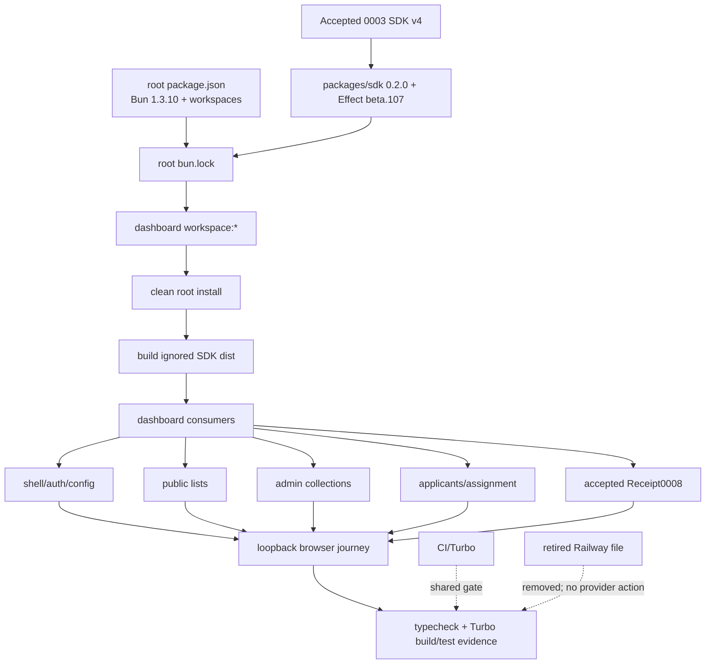

# Live design spec 0010 — Dashboard Effect v4 SDK cutover

> **Summary:** One atomic, whole-dashboard cutover that makes the canonical local `@vektorprogrammet/sdk` Effect v4 Promise surface executable for every dashboard consumer. The accepted maintainer journey is complete at exact implementation HEAD `4c63580`: dashboard dependency authority, root lock, README, hook, ignored SDK `dist/`, Receipt0008 lineage, consumer migration, and bounded local evidence are recorded below. Provider, backend, production, and broad dashboard typecheck behavior remain outside this conformance claim.

## Metadata

| Field | Value |
|---|---|
| Stable ID | `0010` |
| Title | `Dashboard Effect v4 SDK cutover` |
| Status | `accepted` — conformance recorded at implementation HEAD `4c63580f0fc19354556923980542f5b91a810802`; independent final code PASS (`agent://DashboardW0FinalCodeReview`) and cold final runtime PASS (`agent://DashboardW0FinalRuntimeVerifier`); lifecycle `Conforming` current |
| Owner | Whole-dashboard dependency and consumer cutover lane |
| Intended lane | One atomic umbrella PR with non-overlapping felt slices |
| Draft revision | Replaces the narrow dependency-only draft committed as `96ecd83` |
| Base checkpoint | `39579d9` clean repository base; implementation lineage completed at exact HEAD `4c63580f0fc19354556923980542f5b91a810802` |
| Spec worktree | `/tmp/mono-web-dashboard-sdk-resolution-spec-0010-20260810` |
| Spec branch | `spec/0010-dashboard-sdk-resolution` |
| Runtime authority | `agent://DashboardW0FinalRuntimeVerifier` |
| Discovery authority | `agent://DashboardSdkCutoverScout` |
| Review inputs | `agent://DashboardSdkResolutionFeasibilityReview`; `agent://DashboardSdkResolutionSpecReview`; `agent://DashboardW0FinalCodeReview` |
| Predecessors | Accepted `design-specs/0003-effect-v4-receipt-sdk-compatibility.md`; accepted `design-specs/0008-dashboard-receipt-sdk-consumer-seam.md` |
| Journey count | One completed umbrella maintainer journey; one implementation lineage ending at `4c63580f0fc19354556923980542f5b91a810802` |
| Product boundary | Product lead is read-only; Railway dashboard configuration removal is authorized by operator decision; provider/service state is unobserved |
| Implementation lineage | `8fa0ec5` W0 merge; S5 Receipt commits `61212b2`, `37cacd2`, `c70128e`, `fcd3122`, `52d0481`, `e995513`, `a22bb2c`, `e579d26`, `8b502e0`, `4c63580` |
| Final evidence | Cold install/SDK build/W0/Receipt PASS and cleanup recorded in `EVIDENCE-0010`, `TYPECHECK-0010`, `CLEAN-0010` |

This file records final conformance for exact implementation HEAD `4c63580f0fc19354556923980542f5b91a810802`. Independent final code review and cold runtime verification both passed. The implementation consumed the capsule, recorded exact cold install/SDK/W0/Receipt evidence, disclosed nine external typecheck diagnostics without a broad-green claim, and cleaned capsule-local artifacts. No provider, production, deployment, publication, credential, remote-state, or other external effect is claimed or authorized.

### 1.1 Goal

A clean root install and one complete dashboard migration must produce one coherent dependency and consumer boundary:

```text
root package.json (Bun 1.3.10 + apps/*/packages/* workspaces)
  → apps/dashboard/package.json: @vektorprogrammet/sdk = workspace:*
  → root bun.lock regenerated by exact Bun 1.3.10
  → local packages/sdk 0.2.0, Effect 4.0.0-beta.107
  → SDK dist/ built before any consumer check
  → every dashboard SDK caller uses the accepted Promise surface
  → no dashboard apiClient alias or raw API transport remains
  → accepted schemas own paths, query, auth, forms, errors, and decoding
  → typed failures remain visible; mocks/empty-success fallbacks are gone
  → one local loopback browser journey exercises shell, public, admin, applicants, and Receipt
  → full dashboard typecheck/build evidence is recorded without backend/provider/production claims
```

The cutover is atomic at the product boundary: a published SDK link, an unmigrated caller, a raw `/api` fetch, a stale mock-success fallback, or a hidden schema cast is a failed checkpoint. Felt slices may be developed in parallel in isolated worktrees, but the umbrella is not complete until all slices are merged into one PR and the final journey passes.

### 1.2 Required authority changes

1. Change only the dashboard SDK dependency edge to `"@vektorprogrammet/sdk": "workspace:*"`.
2. Regenerate the one root `bun.lock` with exact Bun `1.3.10`; do not hand-edit generated lock content.
3. Delete `apps/dashboard/pnpm-lock.yaml`. The hook may continue to sync **extant** pnpm locks for other apps, but it must never recreate this dashboard lock or stage an unrelated app lock from a dashboard-only change.
4. Delete retired `apps/dashboard/railway.toml`. No provider command, deployment, Railway API call, or production claim is part of this spec.
5. Rewrite every dashboard README pnpm command, package-manager statement, rationale, and anchor into executable Bun/root-Turbo guidance. The README must not retain a dangling `#pnpm-...` link or a pnpm authority statement.
6. Update the tracked `.githooks/pre-commit` lock-sync block so it derives only extant `apps/*/pnpm-lock.yaml` paths and runs/stages pnpm only when that lock's own `apps/*/package.json` is staged. The block must be exactly equivalent to:

   ```sh
   while IFS= read -r lockfile; do
     [ -f "$lockfile" ] || continue
     app="${lockfile%/pnpm-lock.yaml}"
     if git diff --cached --name-only -- "$app/package.json" \
       | grep -Fxq "$app/package.json"; then
       (cd "$app" && COREPACK_ENABLE_PROJECT_SPEC=0 pnpm install --no-frozen-lockfile --silent)
       git add "$lockfile"
     fi
   done < <(printf '%s\n' apps/*/pnpm-lock.yaml)
   ```

   No hard-coded app list is allowed. Because `apps/dashboard/pnpm-lock.yaml` is deleted, a dashboard-only manifest change cannot run pnpm for dashboard, recreate its lock, or stage `apps/homepage/pnpm-lock.yaml`. Partial slices explicitly bypass this external whole-repository gate; the final integrator runs hook-equivalent lint/build/test gates with the updated hook active. Any mismatch is `Drift`.
7. Build `packages/sdk/dist/**` from the accepted SDK source before any dashboard typecheck/build/browser check. `dist/` is ignored and must not be committed.
8. Migrate every dashboard SDK caller and raw API transport listed in §5. Remove `apiClient`, active route `fetch`, route-owned API `FormData`, casts hiding wire mismatches, and mock/empty-success fallbacks. Do not add aliases or compatibility shims.
9. Keep accepted Receipt0008 implementation paths unchanged except for independently genuine fixture/harness type repairs required to integrate and run the umbrella journey. Its accepted route behavior and evidence contract are not rewritten by this umbrella.
10. Preserve accepted labels, route URLs, form intents, and behavior where the accepted SDK schema still provides the same meaning. When a current UI field has no accepted source field, remove the invented field rather than fabricate a value.

### 1.3 Explicit non-goals

This cutover does **not** change:

- `packages/sdk/**` source, schemas, transports, Effect implementation, exports, version, or API names;
- Symfony/API Platform/OpenAPI/backend code, database/persistence/domain laws, Workers, Cloudflare/Alchemy/Wrangler, providers, credentials, production data, or public API contracts;
- route URLs, Norwegian labels, form intents, or Receipt0008's accepted personal/admin implementation except narrow fixture/harness repairs;
- homepage dependency/consumer semantics, its own pnpm lock, or homepage Railway configuration;
- deployment, Railway state, DNS, publication, release, production traffic, or operating status;
- a compatibility layer for old published SDK `0.1.2`, `apiClient`, generic status methods, local duplicate schemas, or raw transport;
- an inference that a green local build means backend parity, production health, or deployment success.

## 2. Frozen facts and authority

The following are baseline observations. They are not a green result. Causal or future-resolution statements are marked `[INFERENCE]`.

| ID | Frozen observation | Evidence |
|---|---|---|
| `O-0010-1` | Root workspaces are `apps/*` and `packages/*`; root package authority declares Bun `1.3.10`. | `package.json:4,38`; `CLAUDE.md:35-38,55-58`. |
| `O-0010-2` | Dashboard manifest declares `@vektorprogrammet/sdk` as `^0.1.2`. | `apps/dashboard/package.json:63`. |
| `O-0010-3` | Root Bun lock dashboard importer also requests `^0.1.2`; the local workspace record is `packages/sdk`, `@vektorprogrammet/sdk` `0.2.0`, and the lock contains both workspace and per-importer published records. | `bun.lock:22-47,155-175,1254,2612,2618`. |
| `O-0010-4` | Local SDK package is version `0.2.0`, exact Effect dependency `4.0.0-beta.107`, default Promise export `.` and Effect export `./effect`. | `packages/sdk/package.json:1-23`. |

| `O-0010-5` | `packages/sdk` exports only `dist/promise.*` and `dist/effect-client.*`; `files` is `["dist"]`, build is `tsc -b`, and no `dist/` is present in the clean checkout because `dist` is ignored. | `packages/sdk/package.json:5-19`; `.gitignore:6-9`; `.github/workflows/release-sdk.yml:25-30`. |
| `O-0010-6` | Dashboard pnpm importer requests and pins published SDK `0.1.2` with a registry integrity entry. | `apps/dashboard/pnpm-lock.yaml:74-76,1719-1723`. |
| `O-0010-7` | Frozen Bun `1.3.10` runtime install exited `0` and resolved `apps/dashboard/node_modules/@vektorprogrammet/sdk` to `node_modules/.bun/@vektorprogrammet+sdk@0.1.2+d1096969542f45a5/node_modules/@vektorprogrammet/sdk`; installed version was `0.1.2`, not workspace `0.2.0`. This resolution-only observation needed no local SDK `dist/`. | `agent://ReceiptConsumerRuntimeVerifier` (`install`: exit `0`; `dependency_resolution`: `0.1.2`); temporary install was cleaned. |
| `O-0010-8` | `[INFERENCE]` The `^0.1.2` range excludes local `0.2.0`, so the frozen install selects published SDK `0.1.2` for the dashboard. | Causal classification in `agent://ReceiptConsumerRuntimeVerifier` and `agent://DashboardSdkCutoverScout`; symlink/version are observed. |
| `O-0010-9` | Receipt0008 changed-path typecheck against published SDK exited `2` with `33` changed-path diagnostics, including missing `ClientOptions`, v4 errors/types, Receipt types, and personal/admin methods. | `agent://ReceiptConsumerRuntimeVerifier`, `typecheck.changed_path_diagnostics`; not a green result for this draft. |
| `O-0010-10` | Receipt0008 also reported independent fixture defects (BodyShape fields/file errors, missing Bun type, implicit-any request) and `23` unrelated known `apiClient` diagnostics. | `agent://ReceiptConsumerRuntimeVerifier`; `agent://DashboardSdkCutoverScout`. |
| `O-0010-11` | Receipt0008 has no browser proof: config preflight exited `1` before tests because Playwright could not find `playwright.config.ts.esm.preflight`; stub was not started and Chromium count was `0`. | `agent://ReceiptConsumerRuntimeVerifier`, `config_preflight` and `fixed_port_stub_and_browser`. |
| `O-0010-12` | CI installs root Bun frozen and runs `bun turbo lint`, `bun turbo build`, and `bun turbo test` on push/PR to `main`; Turbo build depends on upstream package builds. | `.github/workflows/ci.yml:3-36`; `turbo.json:5-9`. |
| `O-0010-13` | SDK release workflow explicitly builds `packages/sdk` after install, confirming ignored `dist/` is a generated prerequisite. | `.github/workflows/release-sdk.yml:25-30`; `packages/sdk/package.json:15-19`. |
| `O-0010-14` | `.githooks/pre-commit` currently loops hard-coded `apps/homepage apps/dashboard`, runs pnpm for every extant app lock when any `package.json` is staged, stages both locks, and separately runs quality commands from root scripts. | `.githooks/pre-commit:42-56,76-98`; `.havn.json:1-5`. In this clone `core.hooksPath` is unset and shared hooks are samples; tracked hook remains an intended consumer. |
| `O-0010-15` | Dashboard README contains pnpm in required programs, install/dev/lint/format/check/e2e/build/start blocks, browser table/e2e install, package-manager row/anchor, and rationale section. | `apps/dashboard/README.md:7-18,24-78,82-96,203-220,315-320`. |
| `O-0010-16` | `apps/dashboard/railway.toml` exists at the base with a pnpm build command and per-app relative start command. | `apps/dashboard/railway.toml:1-10`. Operator decision for this draft: removal of the dashboard Railway configuration is authorized; provider/service state is unobserved, and no provider or deployment claim follows. |
| `O-0010-17` | Existing e2e scripts include `test:e2e: "playwright test"` but `e2e:test`, UI/browser variants, codegen, report, and install scripts are prefixed with `exec`; Playwright uses `bun run dev`, `http://localhost:5174`, and `reuseExistingServer: !process.env.CI`. | `apps/dashboard/package.json:16-24`; `apps/dashboard/playwright.config.ts:14-82`. `exec` behavior under Bun and a Node CLI invocation remain unresolved observations. |
| `O-0010-18` | Accepted Promise API exports `createClient`, `ClientOptions`, config, typed errors, schemas, `context`, `me`, receipts, admin, and public domains; transport owns auth, URL/query, JSON/multipart, status/error mapping, decode, and void operations. | `packages/sdk/src/promise.ts:25-126`; `packages/sdk/src/transport.ts:21-183`; accepted 0003. |
| `O-0010-19` | Stale `apiClient` imports, shape assumptions, direct browser fetches, and fallback/mock semantics are whole-dashboard consumer Drift. | `agent://DashboardSdkCutoverScout`; accepted 0008: `design-specs/0008-dashboard-receipt-sdk-consumer-seam.md:58-60,97-99,289-306`. |

### Authority rules

| Concern | Authority | Cutover rule |
|---|---|---|
| Package manager/workspace graph | Root `package.json`, `CLAUDE.md`, root `bun.lock` | Bun `1.3.10` from repository root is the only dashboard install authority. |
| SDK API/schemas | Accepted `0003`, read-only `packages/sdk/**` | Use existing Promise exports/domain methods; do not weaken or extend SDK. |
| Data meaning | Accepted SDK `Schema` classes | UI projects fields that exist; it never invents legacy fields. |
| Transport | SDK `transport.ts` and domain modules | SDK owns URL paths, query names, auth, JSON/multipart, errors, decoding, and void responses. |
| SSR config/auth | `API_URL`, `createAuthenticatedClient`, `requireAuth`, accepted `AuthOption` | Loaders/actions pass cookie auth; missing/invalid config is typed and visible. |
| CI/build graph | `.github/workflows/ci.yml`, `turbo.json` | SDK build precedes dashboard consumers; final evidence includes CI-equivalent commands. |
| Lock sync | `.githooks/pre-commit` | Extant app pnpm locks only; per-app staged manifest gate; dashboard deletion cannot be recreated. |
| Dashboard deployment | Operator decision | Railway config is retired and deleted; no provider state is inferred. |
| Receipt consumer | Accepted `0008` implementation/evidence contract | Consume unchanged; only genuine fixture/harness integration repairs. |

### Dependency graph



**Legend:** Solid arrows are required local dependencies. Dotted arrows are authority/cleanup boundaries, not deployment or production edges.

## 3. Product and representation decisions

Accepted SDK schemas are the only wire-to-view authority. A route may parse browser form input and map an accepted value to a display value, but may not cast, default, rename into an invented field, or turn a typed failure into an empty/mock success.

| UI area | Accepted source | Required projection | Forbidden invention |
|---|---|---|---|
| Field studies/profile edit | `public.fieldOfStudies()` → `{ id, name }` | Display `name`; use `id`. | `shortName`, abbreviations, mock rows. |
| Sponsors | `public.sponsors()` → `{ id, name, logoUrl, url }` | Display name; render non-null logo/link. | `size` or fabricated logo/link. |
| Teams | `public.teams()` → `{ id, name }` | Display `name`. | `description`. |
| Shell/profile role | `client.context.role`; `UserProfile` has no role | Use context for UI visibility only. | Profile-derived role, default admin, raw `ROLE_*`. |
| Profile/summary | `me.profile()` / `me.dashboard()` | Render accepted fields and visible errors. | Fallback user/dashboard. |
| Assistants | `admin.scheduling.assistants()` | id/name/email/doublePosition/preferredGroup/availability/score/suitability/previousParticipation/language. | `school`, `phone`. |
| Schools | `admin.scheduling.schools()` | name and actual `capacity[]`. | `assistantCount`, invented scalar capacity. |
| Substitutes | `admin.scheduling.substitutes()` | name/email/yearOfStudy/language/weekdays. | `phone`, fabricated status. |
| `Users` | `admin.users.list()` → active/inactive `User[]` | Real active/inactive groups, id/firstName/lastName/email/role. | Mock users, ignored loader data, local lower-case shape. |
| Mailing lists | `admin.mailingLists()` → `{ name, emails[] }` | List name and real email members. | One invented `email`. |
| Interviews | `admin.interviews.list()` → accepted `Interview` | applicationId/interviewerName/schedulingStatus/interviewTime/room/campus/schemaId with explicit mapping. | `applicant`, invented date/status fields. |
| Statistics | `admin.admissionStats()` | totalApplicants/accepted/rejected/interviewed/assignedAssistants. | Mock statistics. |
| Team interest | `admin.teams.interest()` → `{ id, userName, teamName }` | `userName` and `teamName`. | `name`, `team`, `semester`. |
| Applicants | `admin.applications.list`, `admin.users.list`, `admin.interviews.schemas` | SSR loader passes real options to assignment dialog; action calls SDK. | Browser raw fetch, mock applications, fabricated options. |
| Receipts | Accepted 0008 `Receipt`/`AdminReceipt` | Preserve accepted Date/input/status/void/error mappings and Norwegian labels. | Rewriting 0008 semantics. |

Schema references: `packages/sdk/src/schemas/common.ts:3-63`; `scheduling.ts:3-33`; `user.ts:11-28`; `interview.ts:9-99`; `application.ts:9-139`; `packages/sdk/src/context.ts:6-80`; domain methods in `packages/sdk/src/domains/**` as listed in `agent://DashboardSdkCutoverScout`.

### Error/transport law

- `API_URL` is the SSR authority. An absent/invalid URL yields typed `ConfigurationError` before fetch; no Railway/default fallback.
- `requireAuth` handles missing-cookie `/login`; a cookie token passes through `AuthOption`; no token logging/persistence/URL copying.
- SDK `UnauthorizedError` maps to `/login?expired=true`. Configuration, validation, conflict, not-found, rate-limit, network, and other HTTP errors remain safe visible errors.
- Routes parse browser forms and map accepted views. SDK owns URL/query, auth headers, JSON/multipart, form field names, status mapping, schema decode, and 204/void handling.
- Remove active route `fetch`, URL interpolation, hand-built API `FormData`, and `apiClient`. `auth.server.ts:createAuthHeaders` may be deleted only after reference proof.
- Applicant options are SSR-loaded through SDK; browser never fetches `/api/admin/users` or `/api/admin/interview-schemas`.

## 4. Exact dashboard caller and transport inventory

This is the frozen source map. Each listed symbol has an owner in §6. A caller is not omitted because it currently uses fixture mode or catches an error.

### 4.1 Shared helpers, shell, profile, and auth

| Path and symbol | Baseline evidence | Required cutover |
|---|---|---|
| `apps/dashboard/app/lib/api.server.ts:createAuthenticatedClient` | Imports `createClient`/`apiUrl`; creates a client with URL and cookie auth (`:1-5`). | Receipt0008's accepted helper is the shared read-only seam; all SSR authenticated loaders/actions use it. |
| `apps/dashboard/app/lib/auth.server.ts:createAuthHeaders` | Dead/legacy `:11-13`; no current caller observed. | Delete only if a reference search proves dead; SDK owns auth headers. |
| `apps/dashboard/app/routes/dashboard.tsx:loader`, `Layout`, `UserMenu` | `loader:78-100`; profile call plus fallback/legacy role presentation. | Use accepted profile fields and `client.context.role`; typed errors visible; no fallback user/admin role. |
| `apps/dashboard/app/routes/dashboard._index.tsx:loader`, `Index` | `loader:29-41`; `mockDashboard` and `me.dashboard()`. | Remove fixture/mock success path and casts; project accepted `DashboardStats`; visible error state. |
| `apps/dashboard/app/routes/dashboard.profile._index.tsx:loader`, `Profile` | `loader:18-40`; fixture `getProfileData()` and `me.profile()`. | Use accepted `UserProfile`; no mock profile or empty success. |
| `apps/dashboard/app/routes/dashboard.profile.rediger._index.tsx:loader`, `RedigerProfil` | `loader:38-48`; direct `createClient(apiUrl)`, `public.fieldOfStudies() as FieldOfStudy[]`, and mock `linjer`. | Use explicit public client/config boundary; remove cast/mock; project only `FieldOfStudy.name`. |
| `apps/dashboard/app/routes/login.tsx:loader`, `action`, `Login` | `loader:12-16`, `action:18-40`; direct `createClient(apiUrl)`, login/rate-limit handling. | Keep SDK auth operation; typed configuration/network/validation/rate errors; preserve cookie/redirect behavior. |
| `apps/dashboard/app/routes/glemt-passord.tsx:action`, `GlemtPassord` | `action:7-23`; direct `auth.resetPassword`. | Keep SDK operation with visible typed failures; no fallback success. |
| `apps/dashboard/app/routes/tilbakestill-passord.$code.tsx:action`, `TilbakestillPassord` | `action:7-34`; direct `auth.setPassword`. | Keep SDK operation with visible typed failures; no fallback success. |

### 4.2 Public consumers

| Path and symbol | Baseline mismatch | Required cutover |
|---|---|---|
| `apps/dashboard/app/routes/dashboard.linjer._index.tsx:loader`, `Linjer` | `:17-26`; named `apiClient`, mock `{ name, shortName }`, `catch → null`. | Call `public.fieldOfStudies()`; render `{ id, name }`; remove `apiClient`, `shortName`, mock, and empty-success catch. |
| `apps/dashboard/app/routes/dashboard.sponsorer._index.tsx:loader`, `Sponsorer` | `:17-26`; named `apiClient`, mock `{ name, size }`, `result.items`, `catch → null`. | Call `public.sponsors()`; render accepted name/logo/link; remove `size`, Page assumption, mock, and empty-success catch. |
| `apps/dashboard/app/routes/dashboard.team._index.tsx:loader`, `Team` | `:17-26`; named `apiClient`, mock `{ name, description }`, `result.items`, `catch → null`. | Call `public.teams()`; render id/name; remove `description`, Page assumption, mock, and empty-success catch. |

### 4.3 Authenticated admin collections

| Path and symbol | Baseline mismatch | Required cutover |
|---|---|---|
| `apps/dashboard/app/routes/dashboard.assistenter._index.tsx:loader`, `Assistenter` | `:22-34`; mock/local school/phone shape. | `client.admin.scheduling.assistants()`; unwrap accepted page and map accepted scheduling fields only. |
| `apps/dashboard/app/routes/dashboard.skoler._index.tsx:loader`, `Skoler` | `:21-34`; mock scalar capacity/assistantCount. | `client.admin.scheduling.schools()`; render actual capacity records, no assistant-count invention. |
| `apps/dashboard/app/routes/dashboard.vikarer._index.tsx:loader`, `Vikarer` | `:22-34`; mock phone/status shape. | `client.admin.scheduling.substitutes()`; render accepted email/year/language/weekdays. |
| `apps/dashboard/app/routes/dashboard.brukere._index.tsx:loader`, `columns`, `Brukere` | `:12-33,35-65`; loader returns fixture/null while component reads `mock/api/data-brukere`. | `client.admin.users.list()`; render real active/inactive groups; remove mock imports and ignored loader. |
| `apps/dashboard/app/routes/dashboard.epostliste._index.tsx:loader`, `Epostliste` | `:20-33`; mock has one email per row. | `client.admin.mailingLists()`; render each list and real `emails[]`. |
| `apps/dashboard/app/routes/dashboard.intervjuer._index.tsx:loader`, `Intervjuer` | `:22-35`; local applicant/interviewer/date/status and mock rows. | `client.admin.interviews.list()`; render accepted fields with explicit status/date mapping. |
| `apps/dashboard/app/routes/dashboard.statistikk._index.tsx:loader`, `Statistikk` | `:29-41`; mock and fallback cast. | `client.admin.admissionStats()`; render accepted stats; typed failure, no fallback. |
| `apps/dashboard/app/routes/dashboard.teaminteresse._index.tsx:loader`, `Teaminteresse` | `:21-34`; local name/team/semester and missing `admin.teamInterest`. | `client.admin.teams.interest()`; unwrap `userName/teamName`; remove semester and mock. |

### 4.4 Applicant assignment and active raw transport

| Path and symbol | Baseline evidence | Required cutover |
|---|---|---|
| `apps/dashboard/app/routes/dashboard.sokere._index.tsx:loader`, `action`, `AssignInterviewDialog`, `ActionsCell`, `Sokere` | `loader:63-82`, `action:84-117`, dialog `:142-265`; mock applications and browser `fetch("/api/admin/users")` / `fetch("/api/admin/interview-schemas")` at `:165-167`. | Loader uses authenticated `admin.applications.list`, `admin.users.list`, `admin.interviews.schemas`; dialog receives typed options; action uses `admin.interviews.assign` and application verbs. Remove browser fetch, mock, casts, and swallowed failures. |
| `apps/dashboard/app/mock/api/data-sokere.ts` | Applicant mock source. | Delete only after a reference search proves no remaining consumer. |

The applicant loader is SSR-only for all three data/option calls. The browser receives serialized options from the loader; it never becomes a second transport owner.

### 4.5 Accepted Receipt0008 boundary

Receipt0008 is accepted as a separate bounded implementation. Its runtime authority is `agent://ReceiptConsumerRuntimeVerifier`, whose observed result is `BLOCKED/DRIFT`: changed-path diagnostics and no browser proof. That result is not inherited as green evidence. The accepted source seam must be replayed in the future implementation worktree before any Receipt evidence is resumed.

#### Replay lineage and nine-path split

The accepted source lineage is the exact ordered commit chain:

1. `9b14ed5` — `feat(dashboard): migrate Receipt flows to Effect SDK`.
2. `7b86275` — `fix(dashboard): close Receipt SDK journey gaps`.
3. `b1491d4` — `fix(dashboard): make Receipt preflight reachable`.

After `S0` and `W0`, the `ReceiptConsumerIntegrator` replays those commits in that order with no source substitution; this establishes the shared `apps/dashboard/app/lib/api.server.ts` seam before Wave A.

```sh
git cherry-pick 9b14ed5 7b86275 b1491d4
git show -s --format='%H %P %s' 9b14ed5 7b86275 b1491d4
git merge-base --is-ancestor 9b14ed5 7b86275
git merge-base --is-ancestor 7b86275 b1491d4
git diff --name-only 9b14ed5^ b1491d4 | sort
```

The final command must yield exactly these nine paths, split as follows:

| Classification relative to clean base `39579d9` | Paths |
|---|---|
| Introduced by the accepted Receipt lineage | `apps/dashboard/app/lib/receipt-view.ts`; `apps/dashboard/e2e/fixtures/receipt-api.ts`; `apps/dashboard/e2e/receipts.spec.ts`. |
| Already present in the clean base and edited by the lineage | `apps/dashboard/.env.example`; `apps/dashboard/app/components/receipts/DeleteReceiptDialog.tsx`; `apps/dashboard/app/components/receipts/ReceiptFormDialog.tsx`; `apps/dashboard/app/lib/api.server.ts`; `apps/dashboard/app/routes/dashboard.mine-utlegg._index.tsx`; `apps/dashboard/app/routes/dashboard.utlegg._index.tsx`. |

The integrator verifies the nine-path set and commit ancestry before repairing anything. Only genuine fixture/harness defects may then be repaired: BodyShape/Bun-type/request diagnostics or the exact Playwright reachability issue proven by `W0`. No Receipt route semantic rewrite, alias, mock fallback, or broad dashboard repair may hide behind this exception. New runtime evidence must be produced from the final post-replay integration worktree; no `BLOCKED/DRIFT` verifier result or prior fixture output may be reported as browser proof.

The umbrella consumes its accepted personal list/create/update/delete and admin list/approve/reject/reopen seam without redesigning it. The nine paths remain the complete Receipt ownership boundary.
Feasibility nonblocker: the lineage base `1ddfefa` is not an ancestor of clean base `39579d9` (39 commits apart), but the six pre-existing touched paths in the table above are byte-identical at the required preimage. Replay must stop on any conflict or non-identical preimage; never auto-resolve. Evidence: `agent://DashboardSdkResolutionFeasibilityReview`.

### 4.6 Mock/fallback file inventory

Current non-Receipt mock sources are `apps/dashboard/app/mock/api/data-profile.ts`, `data-sokere.ts`, `data-brukere.ts`, and `linjer.ts`; route-local mock constants appear in dashboard summary, public lists, admin collections, applicants, and the pre-accepted Receipt baseline. Remove non-Receipt mocks and `catch` branches returning `null`, `[]`, or fixture data only after each slice proves no remaining reference. Accepted Receipt loopback fixture state is evidence instrumentation, not a production success fallback, and remains governed by 0008.

## 5. SDK-owned boundary and route behavior

### 5.1 One client boundary

`apps/dashboard/app/lib/api.server.ts:createAuthenticatedClient` is the only shared authenticated factory. It accepts the cookie token in the SDK's `AuthOption` shape and uses SSR `API_URL`. Public/auth routes may construct the accepted client for explicit operations, but no route may create a second transport abstraction. `apiClient` is removed rather than re-exported.

### 5.2 Domain ownership

| Boundary | SDK/core owns | Dashboard route owns |
|---|---|---|
| URL/config | Base URL validation, no fallback, path joining | Select SSR `API_URL`; render configuration error |
| Auth | Bearer header, static/async `AuthOption`, auth error mapping | Read current cookie; never log/store token |
| Query | Query key names, pagination, status encoding | Read route/search params and pass typed params |
| Forms | JSON/multipart encoding, `file` field, method/path, schema/void decode | Parse browser `FormData`, validate input, call domain verb |
| Errors | HTTP/network/schema/config classes | Redirect unauthorized; render all other typed failures |
| Data | Schema decode, Date/enum/status transformations | Project accepted values into existing labels/columns |
| Termination | Abort signal, request ownership, 204/void | Stop local stub/process; no unbounded retry |

### 5.3 No fake success

Migrated loaders/actions must return typed errors or the accepted redirect on failure. They must not return mock records, fallback users/roles, empty tables, `null`, `[]`, legacy casts, invented fields, or suppressed `ConfigurationError`, `UnauthorizedError`, `ValidationError`, `ConflictError`, `NotFoundError`, `RateLimitedError`, or `NetworkError`.


## 6. Parallel slices, ownership, and merge order

### 6.1 Isolation rules

- One integrator owns the umbrella branch/PR. Every writer works in a dedicated worktree; no writer edits another worktree or the shared base.
- Root `bun.lock`, dashboard manifest, README, Railway deletion, and `.githooks/pre-commit` have one owner. No concurrent lock writer.
- No more than **three** implementation slices run concurrently. Slices deliver isolated commits/patches; none is a partial green umbrella.
- Partial slice commits explicitly use `git commit --no-verify` because the repository pre-commit quality hook is an external whole-repository gate that cannot validate an incomplete assembly. This bypass is not validation and is not a green claim. After every slice is merged, the final integrator runs the hook-equivalent lint/build/test gates on the complete artifact and commits with the installed hook active; any hook-created lock or unrelated staged path is `Drift`, not a reason to edit this spec's authority boundary.
- Receipt0008 is not reimplemented by a parallel writer. Its accepted paths are consumed; only permitted fixture/harness repairs enter the umbrella.
- Generated `packages/sdk/dist/**`, `node_modules`, caches, Playwright output, and logs are local artifacts, never shared source.

### 6.2 Ownership slices

| Slice | Owner | Exact files/symbols | Boundary |
|---|---|---|---|
| `W-1` Clean-base visual baseline | `DashboardCutoverEvidenceWriter` | Capsule-local `agent-browser` baseline scope/capture and provenance only; no tracked source | From either exact clean pre-cutover `39579d9` or the accepted 0010 spec commit whose only tree differences are under `design-specs/` and whose executable app/package/lock blobs are byte-identical to `39579d9`; before S0, use deterministic loopback/fixture inputs with all external network denied; fixed `1440x900`; attempt public routes first; retain reachable before artifacts and record exact failure/`Drift` for unreachable states. |
| `S0` Dependency/repository authority | `DashboardCutoverAuthorityWriter` | `apps/dashboard/package.json` SDK edge; delete `apps/dashboard/pnpm-lock.yaml`; delete `apps/dashboard/railway.toml`; full `apps/dashboard/README.md`; update `.githooks/pre-commit`; root `bun.lock` | Only package-manager/config authority owner; no route/SDK source. |
| `W0` Harness reachability gate | `DashboardCutoverEvidenceWriter` | Capsule-local Playwright login runner probe only; no tracked source | After S0 dist build, must prove one exact Bun script or explicit Node 22 Playwright CLI reaches a browser/test with login importing the SDK before S5/Wave A; Playwright is automation authority; no baseline capture or product/e2e pass claim. |
| `S5` Receipt0008 integration | `ReceiptConsumerIntegrator` | The exact nine Receipt paths in §4.5; only genuine fixture/harness repairs | Runs immediately after S0/W0; replays `9b14ed5`, `7b86275`, `b1491d4` and establishes the shared `api.server.ts` seam before Wave A; no Receipt route/API semantic redesign. |
| `S1` Shell/auth/config | `DashboardShellConsumerWriter` | `app/lib/auth.server.ts:createAuthHeaders` if dead; `routes/dashboard.tsx`; `dashboard._index.tsx`; `dashboard.profile._index.tsx`; `dashboard.profile.rediger._index.tsx`; `login.tsx`; `glemt-passord.tsx`; `tilbakestill-passord.$code.tsx`; related mocks after reference proof | Reads the replayed Receipt0008 `api.server.ts`; owns profile/context/config/error UX. |
| `S2` Public projections | `DashboardPublicConsumerWriter` | `dashboard.linjer._index.tsx`; `dashboard.sponsorer._index.tsx`; `dashboard.team._index.tsx` | Accepted public arrays and field projection. |
| `S3` Admin collections | `DashboardAdminConsumerWriter` | `dashboard.assistenter._index.tsx`; `dashboard.skoler._index.tsx`; `dashboard.vikarer._index.tsx`; `dashboard.brukere._index.tsx`; `dashboard.epostliste._index.tsx`; `dashboard.intervjuer._index.tsx`; `dashboard.statistikk._index.tsx`; `dashboard.teaminteresse._index.tsx`; `data-brukere.ts` if unreferenced | Accepted admin page/array unwrap and view mapping. |
| `S4` Applicants/assignment | `DashboardApplicantsConsumerWriter` | `dashboard.sokere._index.tsx`; `data-sokere.ts` if unreferenced | SSR applications/users/schemas, dialog options, assignment action, raw-fetch removal. |
| `S6` Browser/evidence | `DashboardCutoverEvidenceWriter` | Owned `apps/dashboard/playwright.config.ts` test/evidence settings; new `e2e/fixtures/dashboard-api.ts` and `e2e/dashboard-cutover.spec.ts` only if needed; deterministic sanitized after/video paths; no production source | S6 captures matched AFTER screenshots and successful Playwright video at fixed viewport using loopback data; Playwright is automation authority. Foldkit stories are not available in this app; do not invent them. |

### 6.3 Merge order

1. Fresh review and product acceptance move this draft toward `Ready`; no writer starts before that gate.
2. `W-1` runs first on either exact clean pre-cutover `39579d9` or the accepted 0010 spec commit with only `design-specs/` differences and byte-identical executable app/package/lock blobs: before network denial, run the frozen resolution baseline in §7.1.1; then deny all external network, use deterministic loopback/fixture inputs, attempt public routes before any `apiClient` removal, retain reachable baseline/provenance, and record exact failure/`Drift` for any unreachable route.
3. `S0` lands after W-1: workspace edge, dashboard lock/Railway deletion, README, updated hook, root lock. No consumer usability claim yet.
4. In the integration worktree, build ignored `packages/sdk/dist/**` with exact Bun immediately after `S0`; this build is mandatory before the W0 login/browser gate.
5. **Wave 0:** run the bounded Playwright login reachability spike in §7.2.2. W0 login imports the built SDK; if no exact runner reaches a browser/test, stop in `Drift`.
6. `S5` runs immediately after `S0`/`W0`: cherry-pick `9b14ed5`, `7b86275`, and `b1491d4` in order; verify the nine-path set, byte-identical preimages, and ancestry. The replayed `api.server.ts` is authoritative for every later consumer slice.
7. **Wave A:** `S1 || S2 || S3` (three isolated writers, distinct files, consuming the replayed shared seam).
8. **Wave B:** `S4` (applicant/assignment consumer).
9. **Wave C:** `S6` captures matched after screenshots and successful video, then adds only neutral fixture/test support.
10. Integrator merges all slices into one clean worktree, rebuilds SDK dist, runs full evidence and hook-equivalent gates, cleans artifacts, and creates the one implementation PR. No shared-tree writes or partial-slice green claims.

## 7. Exact future maintainer journey

This is the one journey the future umbrella writer consumes. It is a plan, not execution evidence for this draft.

### 7.1 Freeze and isolate

1. Start from the accepted spec commit in a dedicated worktree. Record base, branch, writer, and ownership.
2. Confirm accepted 0003/0008, product read-only boundary, and retired Railway decision.
3. Confirm exact Bun:

   ```sh
   bunx --bun bun@1.3.10 --version
   ```

   Output must be `1.3.10`; another version is `Drift`.
4. Pin a capsule-local cache before install/test:

   ```sh
   export BUN_INSTALL_CACHE_DIR=/tmp/dashboard-effect-v4-sdk-cutover-0010-bun-cache
   ```
5. Verify installed hook behavior cannot run dashboard pnpm or stage homepage from a dashboard-only change. If installed hook differs from tracked `.githooks/pre-commit`, stop before commit.

### 7.1.1 W-1 clean-base visual baseline

Run W-1 in a dedicated worktree at either exact clean pre-cutover `39579d9` or the accepted 0010 spec commit whose only tree differences are under `design-specs/`; before installing, verify root `bun.lock` and all executable app/package blobs are byte-identical to `39579d9`. Run before S0 and before any `apiClient` removal:

1. Before enabling external network denial, set an isolated cache and run this exact frozen install from the repository root:

   ```sh
   export BUN_INSTALL_CACHE_DIR=/tmp/dashboard-effect-v4-sdk-cutover-0010-bun-cache
   bunx --bun bun@1.3.10 install --frozen-lockfile
   ```

   This is a resolution-only baseline; do not build or require local SDK `dist/`. Record the observed Receipt verifier result: exit `0`, dashboard SDK resolution `0.1.2` (O-0010-7). Retain the install for W-1 route attempts; clean temporary install artifacts only under §9.3 after evidence and provenance are recorded.
2. After the install completes, enable a network-deny policy that rejects every non-loopback connection; start only deterministic loopback inputs: `API_URL=http://127.0.0.1:8787` and fixture seed `DASHBOARD_CUTOVER_FIXTURE_SEED=dashboard-cutover-0010`. Record the denial policy in provenance.
3. Set the fixed viewport to `1440x900` and use `agent-browser` to attempt route-group states in this order: public first (field studies, sponsors, teams), then shell/auth, admin, applicants, and Receipt. Public attempts are mandatory before any `apiClient` removal.
4. For every currently reachable changed route-group/state, capture the matched BEFORE image at `artifacts/dashboard-cutover/0010/before/<route-group>/<state>.png`. Retain `artifacts/dashboard-cutover/0010/before/provenance.json` with the selected base, executable blob-equality check against `39579d9`, route/state, viewport, fixture seed, loopback URL, network-deny result, and observed outcome.
5. If a baseline route is truly unreachable on the selected pre-cutover base, record the exact observed failure and mark that state `Drift`; never fabricate a screenshot or silently skip the public attempt. A route introduced or newly reachable only after S5 receives its before capture after replay and before S1–S4, as specified in §7.5/§7.6.
6. Keep sanitized BEFORE artifacts and provenance until attached or linked in the one PR. Agent-browser logs/reports are disposable and separate; never retain or commit credentials, raw payloads, or PII.

Only after W-1's route attempts, artifacts, and provenance are recorded may the maintainer proceed to S0.


### 7.2 Apply authority spine

1. Set only dashboard SDK dependency to `workspace:*`.
2. Delete `apps/dashboard/pnpm-lock.yaml`; never invoke pnpm for dashboard and never create a nested Bun lock.
3. Delete retired `apps/dashboard/railway.toml`; do not invoke Railway.
4. Rewrite all README pnpm regions: `:7-18`, `:20-46`, `:48-78`, `:82-96`, `:203-220`, and `:315-320`. Replace deployment text with “Dashboard Railway configuration is retired by operator decision; provider/service state is unobserved; this README has no deployment command.” Remove the old pnpm anchor and rationale. Do not claim provider retirement was observed.
5. Target executable root guidance:

   ```sh
   # from repository root
   bunx --bun bun@1.3.10 install
   bun turbo -F @monoweb/dashboard dev
   bun turbo -F @monoweb/dashboard lint
   bun --cwd apps/dashboard run format
   bun --cwd apps/dashboard run typecheck
   bun run check
   ```

   `bun run check` writes formatting (`oxfmt --write`); it is not a read-only proof. Do not add an e2e command or browser-install command to README until `W0` proves it. Then freeze the exact observed command—either the Bun manifest script or an explicit Node 22 Playwright CLI—and document only the browser-install command actually observed, if one is needed. Never turn the unverified `exec` variants or `bunx playwright install` into evidence.
6. Update only the `.githooks/pre-commit` lock-sync block using the exact extant-lock/staged-own-manifest implementation in §1.2.6. Verify before final commit that a dashboard-only staged manifest cannot recreate the deleted dashboard lock or stage the homepage lock; if the installed hook differs from the tracked updated hook, stop in `Drift`.
7. Generate root lock once and reproduce frozen:

   ```sh
   bunx --bun bun@1.3.10 install
   bunx --bun bun@1.3.10 install --frozen-lockfile
   ```

   `test:e2e` and `e2e:test:*` remain runtime observations for `W0`; no README command is authoritative until one exact invocation reaches a browser/test.

### 7.2.1 Build SDK dist before Wave 0

Immediately after `S0` and before the W0 login/browser gate:

```sh
bunx --bun bun@1.3.10 --cwd packages/sdk run build
```

Assert `packages/sdk/dist/promise.js`, `promise.d.ts`, `effect-client.js`, and `effect-client.d.ts` exist. Keep ignored dist through W0 and all consumer checks; do not commit it. W0 login imports this built SDK, so a missing export is `Drift` before browser reachability is assessed.

### 7.2.2 Wave 0: bounded Playwright login reachability

Run this gate after `S0` and the mandatory SDK dist build, and before `S5`/Wave A in a dedicated capsule worktree. W0 is a post-cutover login runner probe, not a baseline capture, product result, Receipt result, or regression suite:

1. Use the deterministic loopback fixture inputs and fixed `1440x900` viewport. Keep external network denied; do not use agent-browser for W0 evidence.
2. Use `apps/dashboard/e2e/auth.spec.ts` as the single reachability probe. Its login path must import and exercise the freshly built SDK. `e2e/password-reset.spec.ts` remains a separate regression suite and is not silently included in this gate or the dashboard cutover DoD.
3. Try the existing Bun manifest runner first, with one named login test/project. The manifest's `test:e2e` script is observed, but its ability to reach a browser is not yet proven.
4. If Bun cannot reach the browser, try an explicit Node 22 Playwright CLI using the installed package/config. Do not infer `exec` compatibility, `bunx`, or a browser-install command.
5. Success requires observed browser launch, SDK-backed login assertion progress, Playwright control of the test, and sanitized output. Record runtime versions, exact command, config, project, fixed viewport, and fixture provenance; only then may the exact invocation be frozen in README/package evidence.
6. If browser binaries are missing, record and run only the installation command actually observed during this spike; never document `bunx playwright install` merely as a candidate.
7. Any runner, fixture, bind, install, viewport, or evidence ambiguity stops the journey in `Drift`; no `S5` or Wave A writer may proceed on inferred reachability.

### 7.2.3 Replay Receipt0008 before Wave A

Immediately after the successful `W0` gate and before any Wave A consumer writer:

```sh
git cherry-pick 9b14ed5 7b86275 b1491d4
git show -s --format='%H %P %s' 9b14ed5 7b86275 b1491d4
git merge-base --is-ancestor 9b14ed5 7b86275
git merge-base --is-ancestor 7b86275 b1491d4
git diff --name-only 9b14ed5^ b1491d4 | sort
```

Verify the exact nine-path split and the six byte-identical preimages in §4.5. Stop on any cherry-pick conflict or non-identical preimage; never auto-resolve. The replayed `apps/dashboard/app/lib/api.server.ts` is the authoritative shared seam for S1–S4. Only after this checkpoint may those consumer slices start.


### 7.3 Resolution checks

| Check | Required observation |
|---|---|
| Bun | Exact `1.3.10`. |
| Locks | One root `bun.lock`; no dashboard pnpm lock/nested lock. Homepage lock is not silently removed. |
| Importer | Manifest and root dashboard importer use `workspace:*`; no dashboard `^0.1.2`. |
| Link/version | Dashboard SDK realpath equals `packages/sdk`; resolved version `0.2.0`; exact Effect beta.107. |
| Registry absence | No dashboard node-module or dashboard-specific lock/package record names published `0.1.2`; no global absence claim while homepage is out of scope. |
| Dist | Promise/Effect JS and declaration files exist before consumer checks. |
| Hook | Dashboard-only staged manifest creates no dashboard lock and stages no homepage lock; explicit homepage change may sync extant homepage lock. |
| Retired Railway | `apps/dashboard/railway.toml` absent; no provider command. |
| README | No pnpm text, old pnpm anchor, dangling package-manager link, or deployment command. |

### 7.4 Full consumer and CI-equivalent checks

Only after all slices merge and SDK dist exists:

```sh
bunx --bun bun@1.3.10 --cwd apps/dashboard run typecheck
bun turbo lint
bun turbo build
bun turbo test
```

Dashboard typecheck must resolve local v4 exports. `turbo build` must follow `turbo.json:5-9` and build SDK before dashboard; CI uses the same root frozen install and Turbo commands (`.github/workflows/ci.yml:26-36`). Any red check is `Drift`, not a cast/mock/route exclusion.

### 7.5 Visual evidence contract

`S6` is explicitly authorized to edit only owned test/evidence configuration and use settings in `apps/dashboard/playwright.config.ts`, plus the named dashboard fixture/spec files. Playwright is the automation authority: `W-1` owns clean-base BEFORE scope/capture, while `S6` owns matched AFTER screenshots and the successful full-journey video. Agent-browser does not replace Playwright evidence.

Use the fixed `1440x900` viewport and sanitized loopback data for every capture. Maintain this route-group/state ledger:

| Route group | Required journey states |
|---|---|
| Shell/auth | Login, shell/profile/context, dashboard summary. |
| Public | Field studies, sponsors, teams. |
| Admin | Assistants, schools, substitutes, users, mailing lists, interviews, statistics, team interest. |
| Applicants | Applications list, assignment dialog/options, assignment success and typed failure. |
| Receipt | Personal list/create/update/delete and admin list/approve/reject/reopen. |

For every state changed by S1–S5, `W-1` captures the BEFORE image and `S6` captures the AFTER image at the matched paths: `artifacts/dashboard-cutover/0010/before/<route-group>/<state>.png` and `artifacts/dashboard-cutover/0010/after/<route-group>/<state>.png`. If W-1 records a clean-base failure/`Drift`, retain that exact provenance; for a route introduced or newly reachable only after S5, capture its before image after replay and before S1–S4 changes. Missing either pair side, provenance, or fixed-viewport generation is `Drift`.

Configure Playwright's owned evidence settings to produce explicit successful screenshots and video, including at least one successful full-journey recording from `e2e/dashboard-cutover.spec.ts` at `artifacts/dashboard-cutover/0010/journeys/dashboard-cutover.webm`. The test must assert the named journey states and verify the retained files exist; a report-only pass is not visual evidence.

The existing app is not Foldkit; record `Foldkit stories: not available` and do not invent Foldkit stories. Playwright reports, traces, raw agent-browser session logs, and test-results are disposable. Retained sanitized screenshots/video stay at the deterministic paths until attached or linked in the one PR, then may be removed locally. Never commit secrets, credentials, raw payloads, or PII. The PR description maps each §7.6 journey step to its screenshot pair and, where applicable, the full-journey recording.

### 7.6 One loopback browser journey

Use only synthetic data and fixed loopback fixtures at the fixed `1440x900` viewport. No Symfony, Worker, Railway, Cloudflare, Alchemy, provider, or production host.

1. Start a bounded neutral dashboard API fixture with readiness/reset/sanitized evidence, covering accepted shell/profile/dashboard, public, admin, users/schemas, applications/assignment, and typed error responses. Reject non-loopback binds and nested fetch.
2. Run missing-`API_URL` SSR preflight: typed visible configuration failure and zero fixture request; keep missing-cookie `/login` separate from API expiry.
3. With inherited `API_URL` and synthetic cookie, drive shell/profile/context role and dashboard summary; assert accepted fields only.
4. Drive public field studies/sponsors/teams; assert name/logo/link projections and no invented fields/mocks.
5. Drive admin assistants/schools/substitutes/users/mailings/interviews/statistics/team-interest; assert accepted unwrap/mapping/errors.
6. Drive applicants: SSR applications/users/schemas, real dialog options, SDK assignment, no browser `/api` fetch; exercise typed failure matrix.
7. Run `S6` only for the named `e2e/dashboard-cutover.spec.ts` and `e2e/receipts.spec.ts` journeys. `e2e/auth.spec.ts` is the W0 login reachability probe and `e2e/password-reset.spec.ts` is a separate regression suite; neither is silently included in the cutover visual DoD.
8. For every route-group/state changed by S1–S5, retain matched `W-1` BEFORE and `S6` AFTER screenshots at `artifacts/dashboard-cutover/0010/before/<route-group>/<state>.png` and `artifacts/dashboard-cutover/0010/after/<route-group>/<state>.png`; for a route introduced by S5, capture its before state after replay and before S1–S4 changes. Missing either side or W-1 provenance is `Drift`.
9. Produce at least one successful full-journey Playwright recording from S6 at `artifacts/dashboard-cutover/0010/journeys/dashboard-cutover.webm`; screenshot/video files must be explicit successful outputs, not report-only claims.
10. Run accepted Receipt0008 personal/admin journeys only after the three-commit replay and its nine-path/ancestry check. Repair only genuine fixture/harness defects; do not rewrite Receipt semantics.
11. Use the exact invocation frozen by `W0`; if `W0` did not reach a browser/test, stop in `Drift`. Keep retained visual evidence until attached or linked in the one PR, map each journey step to its artifacts in the PR description, then stop fixtures, await shutdown, and clean only capsule-local artifacts.


## 8. Falsifiers and definition of done

### 8.1 Falsifiers

Any one of these fails the umbrella, even if a happy-path page renders:

- Dashboard manifest/root importer is not `workspace:*`, or dashboard resolves published `0.1.2`.
- Root lock is absent/duplicated/hand-edited, Bun is not exact `1.3.10`, or dashboard pnpm lock is recreated.
- SDK `dist` is absent before consumers, generated dist is committed, or Effect is not exact beta.107.
- Hook can recreate dashboard lock or stage homepage from a dashboard-only package change.
- Any README pnpm text/anchor/deployment command remains, or README documents unproven `exec`/Node/browser-install invocation as executable.
- Retired `apps/dashboard/railway.toml` remains or a provider/Railway command is run.
- Any dashboard `apiClient`, active raw `/api` fetch, URL interpolation, route-owned API FormData, or compatibility alias remains.
- Any route casts wire values into legacy shapes, invents `shortName`, `size`, `description`, `phone`, `status`, `semester`, or profile `role`, or derives a value without an accepted source.
- Any loader/action catches typed errors into mocks, `null`, `[]`, empty tables, generic success, or silent fallback.
- Applicant options are fetched in the browser rather than SSR through authenticated SDK.
- Receipt0008 accepted paths are semantically rewritten, or prior absence of browser proof is reported as a pass.
- CI/Turbo build graph is excluded, SDK build is skipped, or full dashboard typecheck/build is claimed without local dist.
- Browser evidence contacts a non-loopback host, uses real credentials/data, runs provider/deploy, or relies only on fixture-mode arrays.
- W-1 does not run on exact clean pre-cutover `39579d9` or the accepted 0010 spec commit with only `design-specs/` differences and byte-identical executable app/package/lock blobs, before S0; the frozen install is not run before network denial; external network is not denied after install; deterministic loopback/fixture provenance is absent; public routes are not attempted before `apiClient` removal; or an unreachable baseline route lacks its exact observed failure/`Drift` record.
- Any changed route-group/state lacks a matched fixed-viewport `W-1` BEFORE/`S6` AFTER screenshot pair, W-1 provenance, the successful full-journey Playwright recording, deterministic retained evidence path, or PR artifact mapping; any invented Foldkit story is also `Drift`.
- Any backend/SDK/provider/production change, unrelated homepage lock mutation, source outside ownership, or shared-tree concurrent write occurs.

### 8.2 Definition of done

The one implementation PR is done only when:

1. Fresh review and product acceptance preceded implementation; one base, integrator, slice owners, and merge order are recorded.
2. Dashboard dependency, root lock, dashboard pnpm lock deletion, retired Railway deletion, complete README rewrite, and the tracked `.githooks/pre-commit` extant-lock/staged-own-manifest update match §1/§7; no unrelated hook behavior or lock mutation exists.
3. Exact Bun `1.3.10` frozen install resolves dashboard to local SDK `0.2.0`; SDK dist is built before consumers and remains uncommitted.
4. Every inventory item in §4 uses accepted Promise methods/schemas/transport/error semantics or accepted Receipt0008 behavior; no `apiClient`, raw transport, mismatch cast, or mock-success fallback remains.
5. Product projections show only accepted fields and preserve labels/intents only where meaning is equivalent.
6. Applicants use SSR authenticated SDK loading for applications/users/schemas and pass options to the dialog; browser raw fetch is absent.
7. W-1 captured sanitized clean-base BEFORE states on exact clean pre-cutover `39579d9` or the accepted 0010 spec commit with only `design-specs/` differences and byte-identical executable app/package/lock blobs, after the observed resolution-only install and before network denial, with fixed `1440x900`, deterministic loopback inputs, external network denied, public attempts first, and provenance; no local SDK `dist/` was needed for W-1; S6 captured matched AFTER states and at least one successful full-journey Playwright recording. Exact Playwright invocation is observed, not inferred.
8. SDK build, dashboard typecheck, `bun turbo lint`, `bun turbo build`, and `bun turbo test` evidence is recorded. No green claim precedes these checks.
9. Deterministic retained BEFORE/AFTER screenshots, W-1 provenance, and successful video stay available until attached or linked in the one PR; afterward disposable reports/traces/raw agent-browser logs/test-results, generated dist, fixture processes, logs, and browser artifacts are cleaned. No secrets, credentials, raw payloads, or PII are committed; only intended tracked changes and one PR remain.
10. No backend, provider, Railway, production, deploy, publication, or remote-state claim is made.

## 9. Rollback, cleanup, and retired Railway

### 9.1 Local rollback

- The contract is frozen at reviewed spec commit `edc8836`; changes to this spec require a new accepted spec rather than an in-place implementation edit.
- If a slice fails, stop in `Drift`, preserve evidence, and revert only that isolated slice.
- If the atomic PR is rejected before publication, revert the one PR/commit. Restore the dashboard pnpm lock or Railway file only as a deliberate rollback to the pre-cutover baseline, not as a new authority or deployment action.
- A rollback restores dependency edge and all source callers together. Reintroducing `^0.1.2` without its old lock, or restoring the lock while retaining v4-only callers, is an invalid half-rollback.

### 9.2 Provider boundary

`apps/dashboard/railway.toml` is config-as-code, and the historical ADR describes per-app Railway deployment (`docs/adr/0000-migrate-tech-stack-to-typescript-from-php.md:18-26`). The current operator decision authorizes removal of the dashboard Railway configuration. This spec does not know whether a provider watches this branch or whether the provider service still exists; no provider command is run, no deployment state is asserted, and the README must not claim provider retirement was observed. If a provider reports an active dashboard service or reacts to deletion, stop in `Drift` and obtain a separate operator-scoped decision. Restoring the file would require explicit reactivation authority.

### 9.3 Cleanup

Use only capsule-local paths:

- preserve `artifacts/dashboard-cutover/0010/before/**` including `before/provenance.json`, `after/**`, and `journeys/**` at deterministic paths until the sanitized screenshots/video and provenance are attached or linked in the one PR;
- after the PR link is recorded, remove retained visual evidence locally, plus worktree `node_modules`, ignored `packages/sdk/dist`, generated route artifacts, and temporary fixtures;
- remove disposable `playwright-report/**`, `test-results/**`, traces, raw agent-browser session logs, and other reports after evidence is attached;
- stop loopback fixtures and await listener/process shutdown;
- after the one PR's checks and evidence are attached or linked, remove capsule-local `/tmp/dashboard-effect-v4-sdk-cutover-0010-bun-cache`;
- never clear a shared global Bun cache, kill unrelated processes, remove homepage lock, or record/commit secrets, credentials, raw payloads, or PII.

## 10. Lifecycle and Drift

### 10.1 Lifecycle gates

| Gate | State for 0010 | Meaning |
|---|---|---|
| `Draft` | Passed | Drafting complete; independent review and product acceptance are recorded below. |
| `Specified` | Passed | Review confirms authority, inventory, product mappings, ownership, and falsifiers; no build has started. |
| `Ready` | Passed | Independent review PASS and product-lead acceptance on `2026-08-10` authorized the exact capsule and one-to-one implementation PR. |
| `Building` | Passed | Integrator consumed W0 and S5 lineage through exact HEAD `4c63580f0fc19354556923980542f5b91a810802`; no shared-tree or out-of-scope source changes remain. |
| `Experienceable` | Passed | Cold loopback W0 and the named Receipt browser journey passed with exact transitions/raw evidence at fixed local fixture boundaries; no provider/product behavior is inferred. |
| `Conforming` | **Current** | Independent final code PASS and cold final runtime PASS confirm the accepted capsule at exact HEAD; typecheck has nine external diagnostics and is not claimed broadly green. |
| `Release-ready` / `Operating` | Not entered/out of scope | No deployment, production, publication, or operation is authorized. |

### 10.2 Drift log

| ID | Observation/conflict | Owner and return path |
|---|---|---|
| `D-0010-1` | Dashboard resolves registry SDK `0.1.2` while workspace SDK is `0.2.0`/Effect beta.107. | `S0`; resolve with `workspace:*`, one root lock, realpath/version evidence. |
| `D-0010-2` | Workspace package has no tracked `dist/`; exports point only at ignored generated files. | Integrator; build dist before consumers, never edit SDK source. |
| `D-0010-3` | CI/Turbo builds dashboard against workspace SDK; stale `apiClient` and shape semantics are shared-gate blockers. | `S1`–`S4`; migrate inventory before CI-equivalent checks; no CI edit. |
| `D-0010-4` | Hook runs pnpm lock sync for hard-coded apps and can stage homepage on dashboard manifest change. | `S0` replaces the hard-coded loop with the tracked extant-lock/staged-own-manifest block; final integrator proves dashboard-only changes cannot recreate/stage unrelated locks. |
| `D-0010-5` | README pnpm exists outside initial command ranges, including browser table/e2e install, package-manager anchor, rationale. | `S0`; rewrite full ranges and preserve no dangling anchors. |
| `D-0010-6` | `e2e:test:*` has `exec`; prior Bun preflight failed before browser; Node invocation is unverified inference. | `W-1` owns clean-base agent-browser scope/provenance; Playwright W0 must prove one SDK-backed login invocation and S6 must produce after pairs/video, or remain in `Drift`. |
| `D-0010-7` | Railway file is retired by operator decision but historical ADR describes Railway deployment. | Operator boundary; delete file locally, make no provider claim, require new decision for reactivation. |
| `D-0010-8` | Homepage retains SDK range/pnpm lock and may leave published records in root lock. | Whole-repository successor; no homepage mutation/global absence claim. |
| `D-0010-9` | Receipt0008 changed-path diagnostics include published-SDK cascade and independent fixture defects; no browser proof. | `S5`; consume accepted implementation and repair only genuine fixture/harness defects. |
| `D-0010-10` | Current routes use legacy fields and mock/empty fallbacks with no accepted schema source. | `S1`–`S4`; apply product projection table and typed errors. |
| `D-0010-11` | Route reachability and visual state may differ between exact clean base and the post-S5 consumer surface. | `W-1` records reachable/unavailable baseline states and public attempts before `apiClient` removal; `S6` captures any missing before state after S5 and before S1–S4, then requires matched fixed-viewport pairs and a successful full-journey recording. |

Any new conflict among SDK authority, product decisions, route meaning, CI/Turbo, hook behavior, dependency resolution, fixture evidence, or provider status enters `Drift` with owner, evidence, and return path. A writer must not solve an authority conflict by editing the easiest file.

## 11. Consumed-once implementation capsule

This is the exact handoff and authorization boundary for lifecycle `Ready`. It was consumed by the one implementation lineage ending at `4c63580f0fc19354556923980542f5b91a810802`; later changes require a new accepted spec.

| Field | Capsule content |
|---|---|
| Capsule ID | `0010-dashboard-effect-v4-sdk-cutover` |
| One PR | One integrator implementation lineage, W0 merge `8fa0ec5` through exact final HEAD `4c63580`; no partial-green PRs |
| Start gate | Fresh independent review pass + product-lead acceptance; lifecycle `Ready` |
| Base/worktree | Integration: `/tmp/mono-web-dashboard-effect-v4-sdk-cutover-impl-0010-20260810` at exact HEAD `4c63580f0fc19354556923980542f5b91a810802` |
| Integrator | `DashboardEffectV4CutoverIntegrator`; records every owner/merge |
| Concurrent width | Maximum three isolated writers; no shared-tree writes |
| Authority slice | Dashboard `workspace:*`; delete dashboard pnpm lock/Railway file; full README; update `.githooks/pre-commit` lock-sync block; root lock |
| Consumer slices | Shell/auth/config; public; admin; applicants; accepted Receipt0008 integration |
| Evidence slice | W0 exact login pass; cold loopback Receipt journey with fixed `1440x900` evidence; no provider/backend |
| SDK boundary | Read-only accepted 0003 `packages/sdk/**`; cold build of ignored dist before consumers; no SDK source/API change |
| Required checks | Cold Bun `1.3.10` frozen install; SDK `tsc -b`; W0 exact Playwright login pass; two consecutive cold Receipt passes with `--retries=0`; exact six transitions/raw evidence; cleanup; independent code/runtime PASS |
| README target | No pnpm text/anchor/command; root Bun/Turbo commands; executable/proven e2e command; retired deployment statement |
| Hook target | `.githooks/pre-commit` derives extant app locks and runs/stages only the app whose own manifest is staged; dashboard-only changes cannot recreate/stage dashboard or homepage lock |
| Receipt boundary | Accepted nine paths unchanged except genuine fixture/harness repairs |
| Forbidden effects | Backend/API/provider/production/deploy/publication/credentials/remote state; no Railway CLI |
| Evidence destination | One implementation PR description maps each §7.6 journey step to deterministic sanitized BEFORE/AFTER screenshot pairs, W-1 provenance, and S6 video; disposable reports/traces are not retained; no evidence file from this spec |
| Stop condition | Any falsifier, unresolved W-1/W0 browser invocation, missing baseline failure/provenance, missing before/after pair or full-journey recording, red CI/Turbo check, ownership collision, registry link, dist failure, or provider ambiguity returns to Drift |
| Consumption | **Consumed** after the one implementation lineage recorded final journey/evidence and cleanup at exact HEAD `4c63580f0fc19354556923980542f5b91a810802`; later changes require a new accepted spec. |

## 12. Acceptance and freeze

| Marker | Frozen record |
|---|---|
| `REVIEW-0010` | Independent review PASS: `agent://DashboardSdkResolutionSpecReview` reviewed commit `edc8836`; final code PASS: `agent://DashboardW0FinalCodeReview`. |
| `PRODUCT-0010` | Product lead accepted this exact umbrella on `2026-08-10`; product remains read-only during implementation. |
| `CAPSULE-0010` | **Consumed** by the exact implementation lineage ending at `4c63580f0fc19354556923980542f5b91a810802`; lifecycle `Conforming` current. |
| `PR-0010` | One-to-one implementation lineage: W0 merge `8fa0ec5`, S5 through `4c63580`; no partial-green PR, second umbrella, or scope expansion. |
| `EVIDENCE-0010` | Cold exact Bun `1.3.10` frozen install passed (`2318 packages`, `10.65s`); SDK `tsc -b` passed; direct Node 22/Playwright 1.58.2 W0 passed (`1 passed`, `4.2s`); Receipt fixture on `127.0.0.1:8787` passed twice from cold state with retries `0` (`16.9s`, `15.7s`), six required transitions, `62` requests, statuses `200×47/201×1/204×5/401×1/404×1/409×3/422×2/429×1/500×1`, multipart/file true, privacy false; runtime `agent://DashboardW0FinalRuntimeVerifier`. |
| `TYPECHECK-0010` | Dashboard typecheck exited `2` with exactly nine diagnostics outside S5: assistenter, epostliste, intervjuer, linjer, skoler, sponsorer, team, teaminteresse, vikarer. No whole-dashboard typecheck green claim. |
| `CLEAN-0010` | Exact HEAD clean; status empty; ports `8787/8788/5174` free; verifier processes exited; installs, dist, reports, caches, fixtures, and logs removed. |
| `FREEZE-0010` | Preserve the exact dependency/lock/README/hook/route ownership, merge order, evidence gates, and forbidden effects; changes outside the consumed capsule require a new accepted spec. |
| `OPERATOR-0010` | Backend/API/provider/production/deploy/publication/credentials/remote state remain forbidden; no Railway CLI or external effect is authorized. |
| `CONFORMANCE-0010` | Final independent code PASS (`agent://DashboardW0FinalCodeReview`) and cold runtime PASS (`agent://DashboardW0FinalRuntimeVerifier`) at exact HEAD `4c63580f0fc19354556923980542f5b91a810802`; first detached-DOM cold failures were fixed by `4c63580`, with no unresolved cold flake. |
| `SCOPE-0010` | Conformance is limited to the accepted Receipt seam and recorded local evidence; no provider, product, backend, production, or broad dashboard typecheck claim. |
