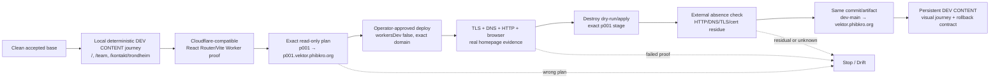
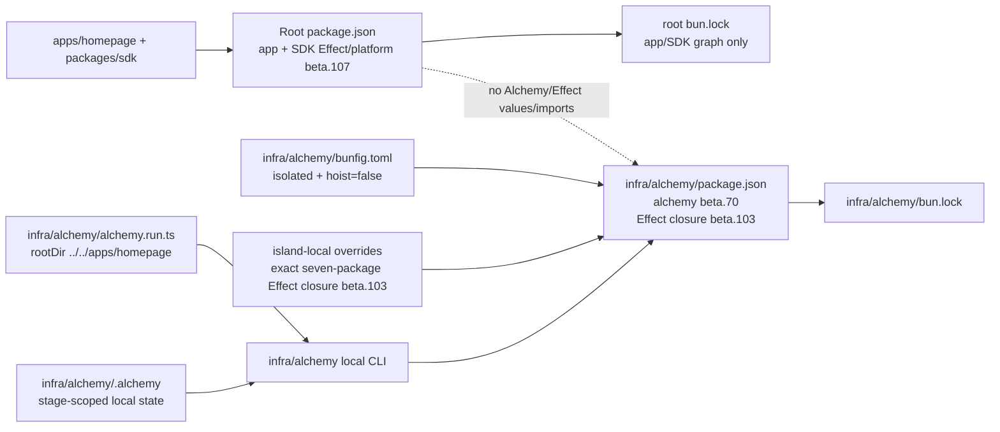
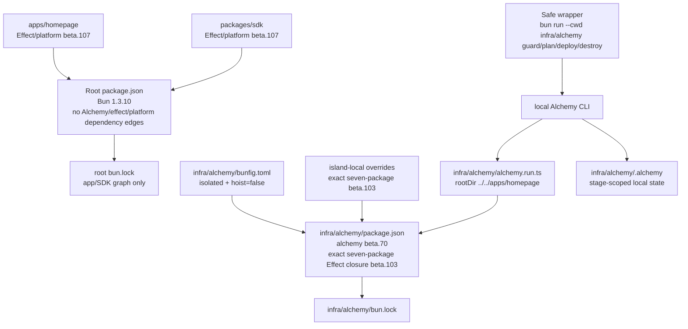
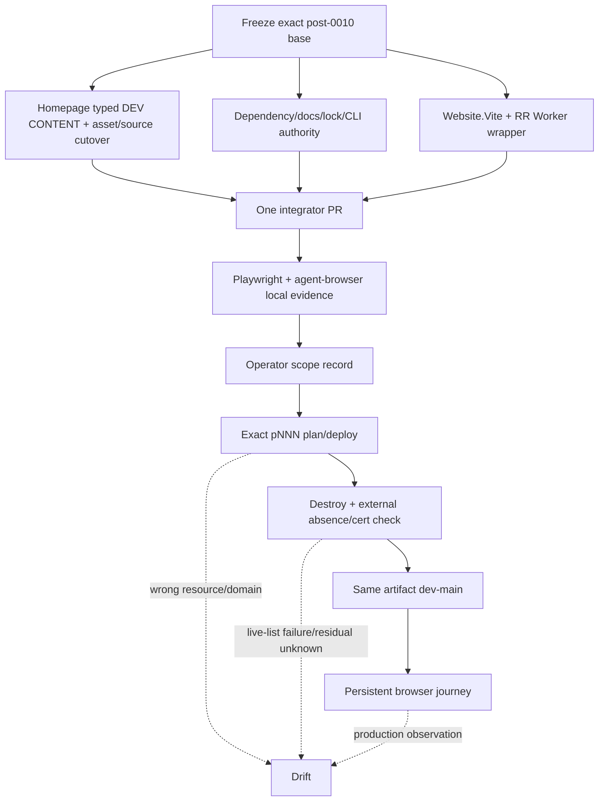

# Live design spec 0011 — Cloudflare homepage development deployment

> **Summary:** One source-grounded, non-production checkpoint for the first real mono-web development surface: prove a deterministic homepage locally, deploy the same sanitized **DEV CONTENT** artifact to one disposable exact `p001.vektor.phibkro.org` canary (or the operator-recorded `pNNN.vektor.phibkro.org` mapping), prove its Cloudflare custom-domain/TLS/HTTP/browser behavior, destroy it and verify external absence, then deploy the byte-identical commit/artifact to persistent `vektor.phibkro.org`. The homepage is a real React Router journey built through `Cloudflare.Website.Vite` and a `createRequestHandler` Worker wrapper. Its four public content domains (sponsors, statistics, teams, departments) come from one explicit typed, sanitized dev-content module selected as the sole source for both non-production stages. This is **not** API/SDK conformance and is never represented by the accepted health-only Worker, an unsafe API fallback, or production assets. `vektorprogrammet.no` remains untouched. The app/SDK workspaces remain on exact Effect `4.0.0-beta.107`; the Alchemy `2.0.0-beta.70` CLI runs only from the dedicated `infra/alchemy` compatibility island with exact Effect/platform `4.0.0-beta.103`, isolated linking, and no Effect-value crossing.

## Metadata

| Field | Value |
|---|---|
| Stable ID | `0011` |
| Title | `Cloudflare homepage development deployment` |
| Status | **`accepted` — product lead accepted local implementation only on `2026-08-11`; local DEV CONTENT conformance current; provider deployment remains unperformed** |
| Draft date | `2026-08-11` |
| Base observed for this revision | Clean spec tree at `cfa767d5556c69256a664817d3682a2a2f8422cf` in `/tmp/mono-web-cloudflare-homepage-dev-spec-0011-20260810` |
| Lifecycle position | **`Specified / Ready / Building / Experienceable / Conforming complete-current` for local DEV CONTENT scope** |
| Reviewed spec | `cfa767d5556c69256a664817d3682a2a2f8422cf` — accepted frozen spec head |
| Prior reviewed spec | `a866799` — prior `Ready` revision, superseded and preserved in history |
| Failed implementation under review | `dd151c0` — final implementation review **FAILED**; remains failed history |
| Final independent safety reviews | [`agent://Homepage0011FinalSemanticPass`](agent://Homepage0011FinalSemanticPass), [`agent://Homepage0011FinalFeasibilityPass`](agent://Homepage0011FinalFeasibilityPass) — both **PASS** |
| Product lead acceptance | Accepted `2026-08-11` for local implementation only; no provider or external-action authority |
| Review/implementation state | Exact implementation `859c52f924e4737712a4b6d7180d5ce2e75b8778` is accepted for local DEV CONTENT conformance. Provider deployment, canary/main-dev evidence, and external action remain unperformed. Failed implementation `dd151c0` remains preserved history. |
| Capsule state | **Consumed** by the exact implementation HEAD above; no provider execution or external-action authority was granted |
| Predecessors | Accepted `design-specs/0001-cloudflare-local-preview-spine.md`; accepted `design-specs/0005-cloudflare-alchemy-preview.md`; accepted `design-specs/0010-dashboard-bun-sdk-resolution.md` |
| Intended lane | One future homepage implementation PR, followed by one operator-owned canary and one persistent development deployment |
| Owner | Homepage deployment integrator; operator owns every provider effect |
| Journey count | One felt journey with local, disposable canary, destroy/absence, and persistent main-development stages |
| Production boundary | `vektorprogrammet.no`, its DNS, routes, data, assets, credentials, certificates, and traffic are explicitly excluded |
| Provider state | **Deployment unperformed and authorization absent.** The accepted evidence records only credential-free local checks and pure wrapper guards; no provider deploy, DNS/TLS observation, canary, destroy, or persistent main-dev action occurred. |
This file records the accepted local implementation at exact HEAD `859c52f924e4737712a4b6d7180d5ce2e75b8778` against frozen spec head `cfa767d5556c69256a664817d3682a2a2f8422cf`. The failed `dd151c0` review remains preserved history. Product lead acceptance is local-only; provider authorization is absent. The capsule is consumed once by this implementation, and no provider claim is made.

## 1. Atomic felt contract

### 1.1 The one sequence

The future implementation and operator must preserve this order. A green sub-step never authorizes the next provider step by implication.



**Legend:** Solid arrows are required sequence edges. Dotted edges stop the journey in `Drift`; they never route around a failed evidence or authority gate.

1. **Freeze and isolate.** Start from the exact accepted 0010 implementation base after its workspace SDK/root-lock/hook cutover has actually landed. Record commit, branch, worktree, integrator, and capsule. If 0010 is only a spec and not implemented, stop; do not silently mix its intended state with this draft.
2. **Local deterministic homepage.** Run the named public pages against one structurally compiled, synthetic PII-free DEV CONTENT dataset on the reserved local-only `p000.vektor.phibkro.org` Host/stage. The exact local browser origin is `http://127.0.0.1:8787`; only the fresh loopback harness sends this Host, and it must never reuse an existing server or accept another port/origin. Capture matched local-before screenshots and a successful unfiltered recording at `1440x900`.
3. **Worker compatibility proof.** Prove the same React Router SSR build can execute as a Cloudflare Worker through the official Cloudflare Vite React Router SSR environment (`viteEnvironment: { name: "ssr" }`, Vite 8) and a `createRequestHandler` wrapper. The Worker must delegate asset-shaped requests to the local `ASSETS` binding, which simulates Website.Vite's intrinsic provider binding; it must not pass assets to React Router. A passing Node `react-router-serve` process, a config that sets `builder.buildApp`, a Vite compile, or the old health Worker alone is not this proof.
4. **Disposable canary.** The operator records a cloud stage in `p001`–`p999` and its exact hostname mapping. The provider lane uses a separate non-production stage and direct singular `domain: "pNNN.vektor.phibkro.org"`, with `workersDev: false`, no routes, wildcard, aliases, preview URL, adoption, production reference, or user-declared binding.
5. **Plan before apply.** Run only the safe Bun wrapper in §6.2 and the operator commands in §7.4/§7.7/§7.8 from the exact standalone `infra/alchemy` cwd. The wrapper parses an explicit stage/profile grammar before importing or running Alchemy; cloud commands reject ambient/default/adopt/env-file/unknown inputs. The p000 guard is a pure pre-Alchemy check with no Alchemy import, version check, log creation, config/profile read, network, state, or provider effect. The island still owns Alchemy `2.0.0-beta.70` through its exact Effect/platform `4.0.0-beta.103` graph and seven-package closure.
6. **Canary evidence.** Only after exact plan acceptance does the operator deploy. Within a bounded propagation/TTL window, capture DNS, TLS, headers, `/health`, `/`, unknown-route `404`, disallowed-method `405`, every response status, console/page errors, hydration/client navigation, browser/network ledger, matched cloud-after screenshots, and a successful unfiltered recording for the same named pages. The homepage, not the synthetic health fixture, is the felt artifact.
7. **Destroy and verify.** Before the canary expiry, run the safe wrapper's stage-scoped destroy dry-run and approved apply from the same standalone cwd, checkout, profile, and state. Preserve state until independent before/after domain/certificate inventory and external absence are verified. A failed or empty provider list is never proof of absence. Record any residual Advanced Certificate.
8. **Persistent main development.** Only after canary destruction and absence evidence pass may the operator deploy the exact same byte artifact to `dev-main` at exact `vektor.phibkro.org`; stage/host are request-derived at runtime. This stage persists with an explicit rollback/redeploy contract. It does not replace or route `vektorprogrammet.no`.
9. **Main-dev visual capture.** Repeat the named journey on `vektor.phibkro.org` with the same fixed `1440x900`, fresh-server/blocked-service-worker policy, full response/console/pageerror/hydration assertions, sanitized ledger, matched screenshots/video, and no raw trace retention. This is persistent non-production DEV CONTENT evidence, not API/SDK conformance, release, production, or operating evidence.

### 1.2 What “real homepage” means

A real homepage journey must render SSR HTML, client assets, layout/banner, and named content projections through the new homepage Worker. It must exercise one typed `DevContent` object containing all four public content domains:

| Domain | Typed dev-content field | Current migration endpoint (observed, **not called by this spec**) | Named page/use |
|---|---|---|---|
| Sponsors | `sponsors` | `GET /api/sponsors` | `/` sponsor section |
| Statistics | `statistics` (`assistantCount`, `teamMemberCount`) | `GET /api/statistics` | `/` assistant/team counts |
| Teams | `teams` | `GET /api/teams` | `/team` and department tabs |
| Departments | `departments` | `GET /api/departments` | `/team` and `/kontakt/trondheim` |

The current migration document records these endpoints as the future public API contract (`docs/migration/homepage.md:1-27`). This checkpoint deliberately does **not** call them and does not claim their API/SDK parity. The content module owns the same user-facing projections with synthetic, non-production values so the Cloudflare surface can be felt without an unsafe origin.

The operational `/health` response described in §7.4 is an auxiliary check in this same homepage Worker. It is not the product surface, is not the content source, and cannot pass the journey by itself. A Worker that serves only health JSON is the accepted 0005 `PreviewSpine` and is forbidden as either named domain.

### 1.3 Explicit non-claim: API/SDK integration is successor Drift

The current canonical SDK exposes public methods and schemas for several domains, but the current homepage imports stale `apiClient`/`isFixtureMode`, and the SDK does not expose the exact homepage statistics method. The homepage's resolved published SDK and its `@tanstack/react-query` peer are separately source-evidenced in `O-0011-09`/`O-0011-10`; this draft must not invent or extend the accepted SDK. Instead:

- After accepted 0010 has landed, remove the obsolete published homepage SDK dependency and all homepage SDK imports **only if** a source search proves every homepage consumer is replaced by the one explicit typed dev-content module.
- Do not add `public.statistics()`, alter `packages/sdk`, add a second transport, or claim public API/SDK conformance in this slice.
- A future API/SDK integration is a separate successor spec/lane. It is `Drift` for this checkpoint if any code tries to call the public API, use the SDK as a content source, or hide the absence of API/SDK proof behind this deployment. It also blocks any future production promotion until separately specified and evidenced.
- This does not make the dev-content deployment unsafe: the Cloudflare canary/main-dev artifact has no API origin, no SDK transport, and no production/Railway network dependency.

## 2. Authority, labels, and current evidence

This section separates facts from design choices and provider prerequisites.

### 2.1 Repository observations

| ID | Label | Observed fact | Source |
|---|---|---|---|
| `O-0011-01` | **[OBSERVED]** | The target root `alchemy.run.ts` declares `Alchemy.Stack("MonoWebPreview")`, `Cloudflare.providers()`, `Alchemy.localState()`, and exactly one `Cloudflare.Worker("PreviewSpine")` with `main: "./infra/preview.worker.ts"` and workers.dev enabled. | `alchemy.run.ts:1-19` |
| `O-0011-02` | **[OBSERVED]** | `infra/preview.worker.ts` serves only fixed `/health` JSON, returns `404` for other paths, and returns `405`/`Allow: GET` for non-GET `/health`; it imports no homepage, SDK, backend, data, asset, or auth. | `infra/preview.worker.ts:1-29`; accepted `0001` observable contract |
| `O-0011-03` | **[OBSERVED]** | Homepage package scripts use `react-router dev`, `react-router build`, and Node `react-router-serve build/server/index.js`; the package currently declares `@vektorprogrammet/sdk: ^0.1.0`, nested pnpm-style e2e scripts, and no Cloudflare Worker entry. | `apps/homepage/package.json:1-84` |
| `O-0011-04` | **[OBSERVED]** | Homepage uses React Router SSR; `/kontakt/trondheim` is explicitly listed in the prerender configuration, while `/` and `/team` are supplied by `getStaticPaths()` **[INFERENCE]**. | `apps/homepage/react-router.config.ts:3-19` |
| `O-0011-05` | **[OBSERVED]** | Homepage Vite config has only the React Router plugin, `build.outDir: "./build"`, and aliases; it has no Cloudflare Vite plugin or Worker wrapper. | `apps/homepage/vite.config.ts:1-20` |
| `O-0011-06` | **[OBSERVED]** | Homepage hosting is still described by `apps/homepage/railway.toml`, which runs `pnpm install && pnpm run build` and `react-router-serve`; the operator has authorized this file's future source retirement, but no Railway service state is observed. | `apps/homepage/railway.toml:1-11`; operator decision in task context |
| `O-0011-07` | **[OBSERVED]** | `apps/homepage/src/routes/_home._index.tsx` uses stale `apiClient`/`isFixtureMode`, hardcoded default statistics and sponsor fallback, then calls `/api/sponsors` and `/api/statistics`; its current implementation can turn missing/empty API data into fallback success. | `apps/homepage/src/routes/_home._index.tsx:1-18,66-110` |
| `O-0011-08` | **[OBSERVED]** | Team and contact loaders use stale `apiClient`/`isFixtureMode`, return `null` in fixture/error branches, and call `/api/teams`/`/api/departments`. | `apps/homepage/src/routes/_home.team.tsx:7-28`; `apps/homepage/src/routes/_home.kontakt.tsx:1-23` |
| `O-0011-09` | **[OBSERVED]** | The homepage declares the published range `@vektorprogrammet/sdk: ^0.1.0`; the root lock resolves that importer to published `@vektorprogrammet/sdk@0.1.2` with `openapi-fetch`, `openapi-react-query`, and a peer on `@tanstack/react-query`. The workspace `packages/sdk` is a distinct `0.2.0` package and does not satisfy that homepage range, so it is not the homepage's resolved SDK. The published `0.1.2` internals are not inspected or claimed here. | `apps/homepage/package.json:35-84`; `bun.lock:2618`; `packages/sdk/package.json:1-5` |
| `O-0011-10` | **[OBSERVED]** | The homepage root imports `QueryProvider` from the resolved published SDK and the homepage package directly declares `@tanstack/react-query`; the workspace SDK index is not evidence about the published `0.1.2` artifact. All homepage SDK/apiClient/QueryProvider consumers and the orphan query package must be removed only after an exhaustive homepage reference search. | `apps/homepage/src/root.tsx:1-7,40-43`; `apps/homepage/package.json:75`; `bun.lock:2618` |
| `O-0011-11` | **[OBSERVED]** | The migration contract names exactly four live public endpoints: sponsors, statistics, teams, and departments. Most remaining informational content is code-owned fixture/static content. | `docs/migration/homepage.md:1-27` |
| `O-0011-12` | **[OBSERVED]** | The homepage contains production-origin metadata/image URLs, including root `og:url`, API fixture modules, a profile page, and multiple team route modules. | `apps/homepage/src/root.tsx:21-23`; `apps/homepage/src/api/{assistenter.ts,foreldre.ts,kontakt.ts,om-oss.ts,team.ts}`; `apps/homepage/src/pages/soknader.tsx`; route inventory in §5.2 |
| `O-0011-13` | **[OBSERVED]** | The homepage `.env.example` documents `VITE_API_MODE=remote` and says API configuration defaults to Railway staging. The behavior of the separately resolved published `@vektorprogrammet/sdk@0.1.2` is unobserved; this wording and every API/SDK edge are removed before the dev-content artifact is built. | `apps/homepage/.env.example:1-5`; `bun.lock:2618` |
| `O-0011-14` | **[OBSERVED]** | Accepted 0010 is a dashboard-only SDK/workspace cutover. Its explicit non-goals exclude homepage dependency/consumer semantics and homepage Railway configuration; its base is `39579d9` and accepted spec commit is `edc8836`. | `design-specs/0010-dashboard-bun-sdk-resolution.md:9-25,76-86,606-642` |
| `O-0011-15` | **[OBSERVED]** | Root Bun `1.3.10`, Node `>=22`, Alchemy `2.0.0-beta.70`, Effect `4.0.0-beta.107`, and Wrangler `4.120.0` are declared in the target root manifest. The root's Alchemy/effect/platform CLI dependency edges are the obsolete single-root graph that this compatibility revision must split: app/SDK Effect remains beta.107, while the Alchemy CLI moves to the standalone infra package/runtime island. | `package.json:21-39`; compatibility finding `agent://AlchemyEffectCompatibility` |
| `O-0011-16` | **[OBSERVED]** | Root `.gitignore` already ignores `.wrangler/` and `.alchemy/`; it does not yet ignore `.dev.vars*`. No credential or provider state may be committed. | `.gitignore:11-14,36-40` |
| `O-0011-17` | **[OBSERVED]** | Root `preview:dev` invokes Wrangler against `infra/preview.worker.ts` on loopback, and accepted 0001 makes that exact command a local health-spine contract. This predecessor command and Worker are explicitly retired by the future homepage implementation capsule; the homepage local Worker command replaces them. | `package.json:8`; `design-specs/0001-cloudflare-local-preview-spine.md:54,183,223,323` |
| `O-0011-18` | **[OBSERVED]** | The homepage manifest is an unmodified Create React App scaffold (`short_name`/`name` are `React App`/`Create React App Sample`), declares a relative `favicon.ico`, and no `favicon.ico` exists in the observed public tree. The manifest contains no production absolute URL. | `apps/homepage/public/manifest.json:1-13`; `apps/homepage/src/root.tsx:34-36`; public asset inventory |
| `O-0011-19` | **[OBSERVED]** | Homepage dependency resolution currently uses Vite `6.4.1` with `@react-router/dev`/React Router `7.13.1`; Alchemy `2.0.0-beta.70` supplies the optional Vite peer floor `^8.0.7`. The future app range `@cloudflare/vite-plugin: ^1.13.12` is not a pin: the observed lock-compatible resolution is `1.51.2`, whose declared peers admit Vite 8 and require Wrangler alignment at `^4.120.1`. The future lock must prove that resolved peer-compatible pair; the broad Effect peer range does not prove runtime compatibility. | `apps/homepage/package.json:35-84`; `bun.lock`; pinned Alchemy beta.70 package/source inspection; `agent://AlchemyEffectCompatibility`; `agent://HomepageCloudflareViteResearch` |
| `O-0011-20` | **[OBSERVED]** | Homepage scripts expose Vitest `run`/watch and Playwright e2e commands, but the observed homepage package/lock has no `@vitest/browser-playwright`, browser provider, or Browser Mode configuration. Vite/Vitest Browser Mode therefore cannot be a current hard gate without an explicitly authorized dependency/config addition. | `apps/homepage/package.json:13-18,78-83`; `bun.lock:78-130,2516` |
| `O-0011-21` | **[OBSERVED]** | The published Alchemy `2.0.0-beta.70` `AuthProvider` evaluates top-level `Schema.TaggedErrorClass` while defining `AuthError`. With root/app Effect `4.0.0-beta.107`, the imported `effect/Schema` namespace has no `TaggedErrorClass`; module evaluation throws before the user's declaration and before provider work. This blocks the former same-root beta.107/beta.70 graph. | `agent://AlchemyEffectCompatibility`; Alchemy beta.70 `packages/alchemy/src/Auth/AuthProvider.ts`; Effect beta.107 `packages/effect/src/Schema.ts` |
| `O-0011-22` | **[OBSERVED]** | Effect `4.0.0-beta.103` still exports `Schema.TaggedErrorClass`; the published beta.70 peer range admits beta.103. Effect beta.104 renamed `Schema.TaggedErrorClass` to `Schema.TaggedError`, which beta.107 exposes. Beta.103 is the last source-verified compatible version selected for this capsule. | `agent://AlchemyEffectCompatibility`; Effect beta.103/beta.104 source and diff |
| `O-0011-23` | **[OBSERVED]** | Upstream Alchemy commit `6bbadc1b86b0cd3ecdf97fe4f6c34ffc9180eb0b` changes the schema error constructors to `Schema.TaggedError` and raises the Effect/platform peer floor to beta.105, but the first published Alchemy release containing it is not yet available in this evidence. The capsule therefore forbids an unreleased git dependency and defers island collapse to that first published release. | `agent://AlchemyEffectCompatibility`; upstream commit `6bbadc1b86b0cd3ecdf97fe4f6c34ffc9180eb0b`; Alchemy release `v2.0.0-beta.70` |
| `O-0011-24` | **[OBSERVED]** | Bun supports a standalone project manifest, lockfile, and install configuration, and its isolated linker can place dependency/peer graphs in versioned store paths. | `https://bun.com/docs/pm/workspaces`; `https://bun.com/docs/pm/isolated-installs`; `https://bun.com/docs/runtime/bunfig` |
| `O-0011-25` | **[INFERENCE]** | A standalone `infra/alchemy` project with its own `package.json`, `bun.lock`, and `bunfig.toml` can keep the Alchemy beta.70/Effect beta.103 closure independent from the root app/SDK beta.107 graph. The exact checked closure is the seven published packages `effect`, `@effect/platform-bun`, `@effect/platform-node`, `@effect/platform-node-shared`, `@effect/sql-d1`, `@effect/sql-sqlite-do`, and `@effect/vitest`, all pinned to beta.103; re-derive this set from the generated island lock if the closure changes. This is topology isolation, not an API shim. | `https://bun.com/docs/pm/isolated-installs`; `agent://AlchemyEffectCompatibility` |
| `O-0011-26` | **[OBSERVED]** | Final review of implementation `dd151c0` found its raw p000 command reached Alchemy config/logger setup before the in-declaration rejection; a zero-byte `.alchemy/log/out` was observed before rejection. No Cloudflare URL/action was observed. This raw path is failed and is not the contract. | [`agent://Homepage0011RuntimeVerify`](agent://Homepage0011RuntimeVerify); [`agent://Homepage0011SecurityReview`](agent://Homepage0011SecurityReview) |
| `O-0011-27` | **[OBSERVED]** | Bun `1.3.13` accepts `bun run --cwd <dir> <script> -- <args>`: `--cwd` changes the script working directory, resolves the script from that package manifest, and the separator forwards only `<args>` to the script. This is the command form used by the safe wrapper and homepage scripts; no space-form `bun --cwd ... run ...` is accepted. | `https://bun.com/docs/pm/scripts`; credential-free command transcript in `agent://Homepage0011SafetyFeasibility` |

### 2.2 Authority rules

| Concern | Authority | Rule for this spec |
|---|---|---|
| Homepage content meaning | `docs/migration/homepage.md` plus the existing homepage view projections | Preserve four domain meanings in the typed dev-content object; do not claim those API endpoints were called. |
| Dev content | This spec's `DevContent` module and its schema/tests | One explicit, sanitized, bundled source for both non-production stages; no fallback/default/catch source. |
| SDK/workspace predecessor | Accepted 0010 and root package/lock/hook authority | Remove obsolete homepage published SDK edge only after all homepage SDK consumers are gone; no SDK source extension in 0011. |
| Cloud declaration | `infra/alchemy/alchemy.run.ts`, evaluated only after the safe wrapper accepts a cloud command | The future declaration remains one `MonoWebHomepage`/`Website.Vite` resource rooted at `../../apps/homepage`; the standalone project owns `alchemy@2.0.0-beta.70`, the exact beta.103 Effect closure, and `infra/alchemy/.alchemy` local state. Root app/SDK Effect values never cross into it. |
| React Router Worker shape | Official Cloudflare Vite React Router SSR documentation plus the compatibility observation `O-0011-19` | Use the official Cloudflare Vite plugin's `viteEnvironment: { name: "ssr" }`; Vite 8 is an unconditional floor from the Alchemy/catalog peer and lock-compatible package evidence, not a conditional Cloudflare-documentation claim. `workers/app.ts` wraps `virtual:react-router/server-build` with `createRequestHandler`. Do not set `builder.buildApp`; let the Cloudflare plugin install its default build hook. No unsupported `prerender()` or Node server start is accepted. |
| Stage/state | Official Alchemy stages/state docs plus the safe wrapper | Cloud commands require explicit stage and profile; `Alchemy.localState()` is rooted at `infra/alchemy/.alchemy` per stack/stage; preserve the same standalone cwd/state for plan, deploy, destroy; no `Cloudflare.state()` bootstrap. The p000 guard is pre-Alchemy and has no state. |
| Host routing | Official Cloudflare Custom Domains docs | Direct exact Custom Domain; active zone and no conflicting CNAME prerequisite; no wildcard Custom Domain, route, or DNS wildcard. |
| Provider authority | Existing operator authority + a new exact scope record | Product/spec acceptance is not provider authority. The operator approves the exact plan, apply, canary TTL, destroy, external absence check, residual certificate handling, and main-dev persistence. |
| UI evidence | This spec's evidence contract | Playwright is required automation authority for the unfiltered e2e journey; agent-browser scopes and captures the exact felt journey. Exact origin/port, fresh server, blocked service workers, response ledger, console/pageerror/hydration assertions, `1440x900`, sanitized evidence, and no raw trace retention are hard gates. |
| Dependency/version graph | Root `package.json`, app/SDK workspace manifests, and `infra/alchemy/package.json` | Root app/SDK workspaces remain exact Effect/platform `4.0.0-beta.107`; root has no `alchemy`, `effect`, `@effect/platform-bun`, or `@effect/platform-node` dependency edges; standalone infra owns exact `alchemy@2.0.0-beta.70`, direct `effect: 4.0.0-beta.103`, required `@effect/platform-bun: 4.0.0-beta.103`, and only required additional platform peer `@effect/platform-node: 4.0.0-beta.103`. Its generated lock must enumerate the exact seven-package beta.103 closure. No root override, node_modules patch, compatibility shim, or unreleased git dependency. |
| Linker/lock authority | `infra/alchemy/bunfig.toml` and `infra/alchemy/bun.lock` | The standalone island uses isolated linking with hoisting disabled; its own lock records the beta.70/beta.103 closure. The root lock is app/SDK-only and never installs or resolves the island. Do not hand-edit either generated lock. |
| Safe CLI/cwd | `infra/alchemy/scripts/homepage-cli.ts`, `infra/alchemy/package.json`, and root Bun wrappers | Root wrappers use valid `bun run --cwd infra/alchemy {guard, plan, deploy, destroy}`. The safe wrapper is the sole authority, parses a closed argument grammar, requires explicit cloud stage/profile, rejects env/default/adopt/env-file/unknown input before Alchemy import, and invokes the local `alchemy` binary with `alchemy.run.ts` only for accepted cloud commands. |

### 2.3 Non-observed/provider-dependent facts

The following are **[PROVIDER-DEPENDENT]** and remain unknown until the operator observes them under authority: ownership and active status of the `phibkro.org` Cloudflare zone; the non-production account; whether exact hostnames are available; existing DNS/CNAME/custom-domain owners; TLS issuance/propagation; account quota; token scopes; profile identity; cost/billing; Access policy; current live Worker/domain/certificate inventory; and any production or non-production API state. This draft makes none of those claims.

The following are **[INFERENCE]** design consequences, not observations: the requested exact names require direct custom-domain attachment rather than workers.dev aliases; a dedicated non-production account/zone is safer than account-level logical isolation; the bundled dev-content artifact removes the need for a cloud API origin in this checkpoint; and deterministic artifact hashing is necessary to substantiate “byte-identical.”
### 2.4 Compatibility finding and frozen version boundary

The prior accepted capsule assumed one root runtime graph containing Alchemy `2.0.0-beta.70` and Effect `4.0.0-beta.107`. That assumption is superseded. The published beta.70 `AuthProvider` executes `Schema.TaggedErrorClass` at module evaluation, while beta.107 exposes only the renamed `Schema.TaggedError`; the package's broad peer range does not encode this breaking API window. The observed failure occurs before a declaration can reach provider work, so changing the declaration or adding a root guard cannot repair the graph.

The executable replacement is a standalone compatibility project, not a downgrade of the application:



**Boundary:** only the standalone `infra/alchemy` project imports and executes Alchemy/Effect values for the provider declaration, and only after the safe wrapper has accepted an explicit cloud command. The root app/SDK workspaces remain exact beta.107, and the root manifest/lock has no `alchemy`, `effect`, `@effect/platform-bun`, or `@effect/platform-node` dependency edges. The declaration lives at `infra/alchemy/alchemy.run.ts`, is evaluated from the standalone cwd, and uses `rootDir: "../../apps/homepage"`; no Effect value, schema class, layer, runtime, fiber, or error crosses. The p000 guard does not import this declaration or Alchemy. The island-local `overrides` map must enumerate exactly the generated seven-package closure (`effect`, `@effect/platform-bun`, `@effect/platform-node`, `@effect/platform-node-shared`, `@effect/sql-d1`, `@effect/sql-sqlite-do`, and `@effect/vitest`) and pin each to `4.0.0-beta.103`; the generated island lock and realpath report must prove that closure. A root override/resolution, root `node_modules` patch, compatibility shim, or unreleased git dependency is forbidden. The first published Alchemy v2 release containing upstream `6bbadc1b86b0cd3ecdf97fe4f6c34ffc9180eb0b` is the successor cleanup point: upgrade the standalone project to that release's supported exact Effect beta (beta.107 if supported), prove one graph, then collapse the project. Until then, preserve the island.

The standalone project is deliberately mechanical and has no compatibility logic beyond dependency pinning:

```ts
// infra/alchemy/alchemy.run.ts
import * as Alchemy from "alchemy";
import * as Cloudflare from "alchemy/Cloudflare";

// declaration uses rootDir: "../../apps/homepage" and Alchemy.localState()
```
### 2.5 Final-gate findings recorded; repairs are contract gates

The implementation at `dd151c0` is **not accepted**. The three exact implementation-gate review records are [`agent://Homepage0011CodeReview`](agent://Homepage0011CodeReview), [`agent://Homepage0011RuntimeVerify`](agent://Homepage0011RuntimeVerify), and [`agent://Homepage0011SecurityReview`](agent://Homepage0011SecurityReview). The prior independent safety reviews are [`agent://Homepage0011SafetySemanticReview`](agent://Homepage0011SafetySemanticReview) and [`agent://Homepage0011SafetyFeasibility`](agent://Homepage0011SafetyFeasibility); this revision closes their residuals as rechecked by [`agent://Homepage0011SafetySemanticRecheck`](agent://Homepage0011SafetySemanticRecheck) and [`agent://Homepage0011SafetyFeasibilityRecheck`](agent://Homepage0011SafetyFeasibilityRecheck). Their findings are requirements for the next implementation attempt, not provider observations or implementation approval:

| Finding | Required contract repair before any implementation/provider gate |
|---|---|
| Code review: Worker assets were sent to React Router and local Wrangler lacked `ASSETS`; relative asset paths also crashed route factories; root loader/error handling was unsafe. | `wrangler.jsonc` declares local `assets.binding: "ASSETS"` only as a simulation of Website.Vite's intrinsic provider binding. `workers/app.ts` accepts `env.ASSETS`, delegates asset-shaped requests to `env.ASSETS.fetch(request)`, preserves `.data`/SSR routing, and never routes static assets through React Router. All retained asset paths are plain same-origin strings, and root error rendering is loader-safe. |
| Code/runtime review: React Router/React peer floor and Vite/plugin shape were inconsistent; a config-level `builder.buildApp` override and unsupported prerendering obscured the official Cloudflare path. | Use official Cloudflare Vite React Router SSR environment with `viteEnvironment: { name: "ssr" }`, do not set `builder.buildApp` so the plugin's default build hook remains active, Vite 8 (`>=8.0.7`), and React/ReactDOM peer floor `>=19.2.7`. Remove custom builder overrides and all unsupported `prerender()` configuration; every route is SSR/Worker-rendered. |
| Code review: the legacy e2e example was stale; tests did not assert assets, response status, hydration, console/page errors, or unfiltered green execution; viewport was effectively 1280x720. | Retire or rewrite `apps/homepage/e2e/example.spec.ts`; run the unfiltered e2e command; enforce exact `1440x900`; assert every response, asset status, console error, pageerror, hydration signal, and a real client navigation. |
| Security `PROVIDER-001`: raw Alchemy CLI accepted ambient stage/profile/default/adopt/env inputs. | The safe Bun wrapper at `infra/alchemy/scripts/homepage-cli.ts` is the sole plan/deploy/destroy authority. It accepts only the exact grammar in §6.2, requires explicit stage/profile for cloud commands, rejects `--adopt`, env-file/ambient/default selectors, and unknown args before Alchemy import. |
| Security `PROVIDER-002`: p000 declaration guard ran after Alchemy config/logger/provider setup; a zero-byte `.alchemy/log/out` was observed before rejection. | Replace raw p000 Alchemy invocation with the pure pre-Alchemy `guard` command. It must reject p000 before importing/running Alchemy and before version/log/config/profile/network/state/provider effects. The guard proof requires the wrapper transcript, independent pre/post filesystem identity for `infra/alchemy/.alchemy/` (absent or byte-identical), an outbound-network observation, and separate source/unit proof; the transcript alone is insufficient. Declaration stage mapping is source/unit-tested separately. |
| Security `INTEGRITY-001`: implementation provenance used a constant commit and non-cryptographic content-only hash. | Require a full clean 40-hex `HEAD` SHA, compiled SHA-256 canonical content/route digests, and independent post-build emitted client/server/output digest evidence as defined in §4.1 and §7.8; reject dirty/short/fallback commit values and digest coverage gaps. |
| Security `NETWORK-001`: browser fixture allowed arbitrary loopback ports and reused existing servers. | Pin the exact local origin tuple `http://127.0.0.1:8787` plus `Host: p000.vektor.phibkro.org`; require a fresh server (`reuseExistingServer: false`), block service workers, deny all other origins/ports, and retain a complete response ledger. |
| Security `EVIDENCE-001`: raw traces/videos exposed local paths/profile/tooling details and were not ignored. | Write raw trace/video only to an operator-held temporary directory outside the worktree, delete it after sanitization, and publish only sanitized screenshots/video/ledger with relative paths, hashes, and redacted user/path/env/query/cookie/header data. Ignore coverage is a pre-capture gate. |
| Security `PRIVACY-001`: real people names/roles remained in seventeen static team detail modules and could be publicly emitted. | Every emitted static route and people-bearing module, not only the three named pages and `DEV_CONTENT`, derives people content from the synthetic source or is removed. No real names, roles tied to real people, contact data, or production records survive the source/build/route census. |
### 2.6 Accepted implementation evidence at exact HEAD

The implementation at exact clean HEAD `859c52f924e4737712a4b6d7180d5ce2e75b8778` passes the local DEV CONTENT acceptance gates. The source-tree delta is the accepted four-file repair from the prior reviewed implementation head; no provider deployment or external action is included.

| Gate | Accepted evidence |
|---|---|
| Code | [`agent://Homepage0011AcceptanceCode859`](agent://Homepage0011AcceptanceCode859) reports **PASS**. It closes all three prior blockers: locale-independent census ordering, early-failure ledger export, and synchronized sanitized header coverage. Two nonblocking forward warnings remain: (1) a reused evidence directory can retain stale `provenance.json` when a later run has no build literals; future cleanup should remove that file in the early-return path; (2) allowlisted `Location` header values bypass `redactedPath`; future evidence hardening should sanitize that value symmetrically. |
| Security | [`agent://Homepage0011AcceptanceSecurity859`](agent://Homepage0011AcceptanceSecurity859) reports **PASS** with no surviving security or integrity blocker. It independently recomputes the source digests, emitted-output digests, all 22 evidence-file hashes, aggregate hash, wrapper boundary, sanitization, locale results, and clean state. |
| Runtime | [`agent://Homepage0011AcceptanceRuntime859`](agent://Homepage0011AcceptanceRuntime859) reports **PASS** for frozen Bun `1.3.10` root/infra installs, Node `22.23.1`, Chromium `150.0.7871.128`, both locale runs, builds, local browser journey, failure exporter, wrapper guard, and cleanup. |
| Source counts | 24 approved assets, 36 route sources, 30 routes, 17 teams, 4 departments, and 41 synthetic people projections. |
| Compiled and independent digests | Content `sha256:02f57211fd04b7474166e8be172d9e4373b0ec743cbeb913450b79d575acd3b4`; route `sha256:4988844cca58abfd65fb5b3446e4489236e2a9e21c43b65910873282031406b4`. Independent recomputation matches both values. |
| Emitted output | C and `nb_NO.UTF-8` output is identical: 88 client files, 3,033,076 client bytes, client `sha256:efafb289f81062c4bef11241491360ad9152255db4402107c21774dfa92f7d4d`; 6 server files, 1,783,825 server bytes, server `sha256:59e629bad626f53a0d800597ba9c77cba3345df6ed23947b50315013d89f8833`; 94 whole-output files, 4,816,901 bytes, whole-output `sha256:925dfc1235bf98ff992df7d47e0cd195cb6770da66c69e74ec00be2bd5e20f20`. |
| Evidence root and aggregate | Operator-held sanitized root `/tmp/mono-web-homepage-dev-evidence-0011-20260811-final`; `evidence-hash-manifest.json` records exact HEAD, 22 files, and aggregate `sha256:5bf938ddc8478f6d04665b18bd876431bd2db3bc44f977a6de6e500b3d5e5e9f`. |
| Browser and HTTP | Two direct Node 22/system Chromium runs, retries `0`, viewport `1440x900`, exact origin `http://127.0.0.1:8787`, Host `p000.vektor.phibkro.org`; named pages `/`, `/team`, `/kontakt/trondheim`, detail route `/team/aas/skolekoordinering`, two asset requests, `/health` `200`, missing route `404`, method-not-allowed `405`, zero forbidden requests, zero page/console errors, hydration and client navigation passed, and service workers were absent. Security review records 183 status-200 responses plus five explicit probes in each successful ledger. |
| Guard and failure exporter | Pure p000 guard, default guard, and default-profile rejection all passed; outbound INET socket/connect count was `0`; Alchemy was not imported and state was not touched. The intentional early-failure run retained a ledger, recorded exit code `1`, and retained no provenance. |
| Cleanup | Generated outputs, raw evidence, builds, logs, helpers, and stale roots were removed; sanitized ledgers, provenance, screenshots, videos, digest/census, HTTP contract, locale proof, verdict, and manifest remain. Port `8787` is closed, and tracked plus ignored checkout state is clean. |
| Runtime warnings | The runtime record lists three non-blocking warnings: `nb_NO.UTF-8` is absent from the libc locale inventory although Node full ICU resolved `nb-NO` and outputs remained identical; Browserslist data is six months old; an unrelated dashboard typecheck fails on pre-existing SDK API mismatches, while root `check-types` excludes that package because it has no such script. |

This acceptance is local DEV CONTENT evidence only. It does not prove API/SDK parity, Cloudflare account ownership, DNS, TLS, canary deployment, destroy/absence, or persistent main-dev deployment.

## 3. Scope and hard boundaries

### 3.1 In scope

- One explicit typed `DevContent` module containing synthetic, PII-free sponsors, statistics, teams, departments, and every retained people projection, directly imported as the sole source for local, canary, and persistent main-dev content.
- Every emitted static route/module is in the route census. People-bearing route content either derives from `DEV_CONTENT` or is removed; no real name, role tied to a real person, contact detail, production record, or copied profile survives.
- One real public homepage Worker, not dashboard and not the health-only preview spine.
- Structurally fail-closed content validation, visible non-production banner, full clean-commit provenance, compiled cryptographic content/route digests plus post-build emitted-output digest evidence, and no production/Railway network or asset dependency.
- Cloudflare.Website.Vite declaration with official Cloudflare Vite React Router SSR environment, Vite 8, no user-defined `builder.buildApp`, `createRequestHandler`, and a Worker that delegates asset-shaped requests to simulated local `ASSETS`.
- One exact branch canary at `p001.vektor.phibkro.org` or the operator-recorded `pNNN.vektor.phibkro.org`, then one persistent `vektor.phibkro.org` main-dev stage.
- Exact safe-wrapper plan/deploy/destroy commands and flags, TLS/DNS/HTTP/browser evidence, destroy/absence/certificate-residue evidence, matched screenshots/recording, and sanitized PR artifact map.
- Retirement of the homepage Railway configuration as source cleanup only. Provider/service retirement is not observed or claimed.

### 3.2 Out of scope and forbidden

| Boundary | Forbidden change/effect |
|---|---|
| Production | Any DNS, route, custom domain, certificate, deploy, traffic, asset, API, database, credential, secret, or data change involving `vektorprogrammet.no` or a production account. |
| Existing health spine | Do not attach `PreviewSpine` to `vektor.phibkro.org`, any `pNNN` host, or reserved local-only `p000.vektor.phibkro.org`. Do not present `/health` from the old Worker as homepage evidence. Remove/replace `alchemy.run.ts`/`infra/preview.worker.ts` only in the future implementation capsule. |
| Dashboard | No dashboard source, route, package, auth, JWT, cookie, deployment, host, or edge-routing change. Dashboard remains a separate future surface. |
| Backend/API | No Symfony, API Platform, database, D1, migration, fixture loader, production API, or data migration. The current public API endpoints are recorded but not called. |
| SDK | No new SDK public statistics method, schema, transport, adapter, or package API. A future API/SDK integration is a separate successor spec and production-promotion prerequisite. |
| Auth | No auth provider, dashboard token, session, cookie, login, Access policy, or credential flow. Homepage content is bundled and unauthenticated. |
| Routing architecture | No wildcard route, route dispatcher, path-prefix multiplexing, preview alias, CNAME workaround, DNS wildcard, aliases, redirects, `routes` property, or `--adopt`. |
| Provider state | No raw Alchemy CLI, `alchemy login`, profile inspection, Wrangler deploy, dashboard action, `unsafe nuke`, account-wide cleanup, or provider command in this drafting task. Only the safe wrapper may invoke cloud commands after review acceptance and operator authority. |
| Remote state | No `Cloudflare.state()` or state-store bootstrap. Preserve `Alchemy.localState()` separately for each named stage. |
| Product scope | No application form, registration, admission-period migration, dashboard path, public API parity, SDK conformance, or production replacement claim. |

## 4. Typed sanitized DEV CONTENT contract

### 4.1 One source, structurally compiled, no selector/default

The future implementation adds one explicit module at `apps/homepage/src/lib/dev-content.ts`, with a source-verified type equivalent to:

```ts
type DevContent = {
  readonly sponsors: readonly SponsorContent[];
  readonly statistics: {
    readonly assistantCount: number;
    readonly teamMemberCount: number;
  };
  readonly teams: readonly TeamContent[];
  readonly departments: readonly DepartmentContent[];
};
```

The module exports one validated `DEV_CONTENT` value and compiled provenance constants:

```ts
export const DEV_CONTENT_SOURCE = "dev-content" as const;
export const BUILD_COMMIT = /* full 40-hex clean git HEAD SHA */;
export const BUILD_CONTENT_DIGEST = /* sha256: canonical DEV_CONTENT + approved source-asset manifest */;
export const BUILD_ROUTE_DIGEST = /* sha256: canonical route-census/people projection */;
```

Routes import that one object directly for the four domains and every retained people projection. There is no runtime selector, environment binding, default, second fixture file, remote adapter, generated SDK client, catch branch, empty-success branch, or fallback. The module is intentionally **DEV CONTENT**, not a fallback for an unavailable API. Structural compilation and content validation fail before a Worker artifact exists if the value is incomplete or invalid.
Build-time provenance injection is authorized only in `apps/homepage/vite.config.ts`: its `define` entries supply `BUILD_COMMIT`, `BUILD_CONTENT_DIGEST`, and `BUILD_ROUTE_DIGEST` from the clean-tree and canonical source inputs at build time. The implementation must never generate or write these values into tracked source; `dev-content.ts` remains a stable source module and the build fails rather than dirtying the tree.

Required properties:

1. All IDs, names, counts, links, emails, descriptions, people records, and asset references are synthetic or neutral. No production payload, PII, real person name, real-person role/contact, live member photo, secret, account identifier, or copied production record may enter `DEV_CONTENT` or any emitted static route/module.
2. Every static route/module that can be emitted is covered by a route census. People-bearing modules derive their values from `DEV_CONTENT` or are deleted; named-page coverage is not sufficient.
3. Content is schema-shaped and typed at compile time. Invalid data fails the local build/test or explicit module validation; it is not coerced to `null`, `[]`, a hardcoded statistic, an invented legacy field, or a null-success route.
4. The four domains are complete enough for `/`, `/team`, and `/kontakt/trondheim`. The visible values are stable across runs.
5. `BUILD_COMMIT` is supplied by the `apps/homepage/vite.config.ts` build-time `define` injection from a clean tree's full `git rev-parse --verify HEAD^{commit}` result and matches `/^[0-9a-f]{40}$/`; the build fails if `git status --porcelain --untracked-files=all` is non-empty. The injection never writes generated values into tracked source. No literal, short SHA, username, branch, timestamp, or fallback is accepted.
6. `BUILD_CONTENT_DIGEST` and `BUILD_ROUTE_DIGEST` are compiled SHA-256 values over the exact canonical source-owned inputs below. Evidence must independently recompute and match both values; a generic/non-cryptographic or partial digest is Drift. The emitted client/server asset and whole-output digest is post-build evidence only, never a compiled value:
   - content: UTF-8 canonical JSON object containing `DEV_CONTENT` and the approved source-asset manifest (sorted object keys, source array order, no insignificant whitespace, terminal newline);
   - route: UTF-8 canonical JSON of the sorted source route census, each route's synthetic people/content projection, and referenced asset paths;
   - post-build output: after `worker:build`, UTF-8 canonical lines sorted by normalized relative path for every emitted client/server asset/output, each containing path, byte length, and SHA-256 of the exact emitted bytes; the aggregate is SHA-256 of those lines plus terminal newline. This value is evidence-only and is never fed back into the build or exposed as a compiled constant, so no digest cycle exists.
7. The same built bytes, full commit SHA, two compiled SHA-256 digests, approved source-asset manifest, and post-build output-digest evidence are used for canary and `dev-main`. Stage/host are request-derived at runtime, so they do not alter those bytes.
8. `DEV_CONTENT_SOURCE` is a build-time literal, never a runtime setting. The source search must find no read or definition of `HOMEPAGE_DATA_SOURCE`, `API_URL`, `VITE_API_URL`, `API_MODE`, or `VITE_API_MODE` under the homepage artifact. Their absence is structural fail-closed behavior; there is no API call in this checkpoint.
9. A future public API/SDK lane may replace the source only under a separate spec. Its absence is honest `Drift` for API/SDK conformance, not a reason to add a fallback here.

### 4.2 Route projections

| Route | Required projection from `DevContent` | Forbidden behavior |
|---|---|---|
| `/` | Sponsor cards/links and deterministic assistant/team statistics; visible `DEV CONTENT` banner/provenance. | `apiClient`, raw `/api`, hardcoded API defaults, empty/fallback sponsor groups, production image URL. |
| `/team` | Team tabs/list and department tabs from `teams`/`departments`; local/sanitized card asset. | Hydra wrapper assumptions, `shortName`/invented fields, null-success, API call. |
| `/kontakt/trondheim` | Department/contact projection from `departments`; local/sanitized card asset. | API call, production asset, hidden error, raw production email data. |
| Asset-shaped request (`/assets/**`, emitted files with an extension except `.data`) | Worker receives the request first and delegates it to `env.ASSETS.fetch(request)`; local `ASSETS` exists only to simulate Website.Vite's intrinsic provider binding. | Passing assets to React Router, a user-declared Alchemy binding, a cross-origin asset, or a static response that bypasses Worker provenance. |
| `/health` | Auxiliary JSON provenance from current homepage Worker: stage, host, `dev-content`, full commit SHA, content/route SHA-256 digests; `Cache-Control: no-store`. | Old health body, production identifier, secret, API/SDK claim, or health-only deployment. |

### 4.3 Request-time host/stage and fail-closed boundary

- There is no runtime data-source selector or environment binding. `DEV_CONTENT_SOURCE`, `DEV_CONTENT`, `BUILD_COMMIT`, `BUILD_CONTENT_DIGEST`, and `BUILD_ROUTE_DIGEST` are compiled imports/constants; any missing or invalid value fails the build before a Worker artifact exists. The emitted client/server/whole-output digest is post-build evidence only and is not compiled or served as runtime provenance.
- The Worker derives stage and host from the normalized request `Host` only: `vektor.phibkro.org` maps to `dev-main`; when the loopback harness sends reserved `p000.vektor.phibkro.org`, the request identifies local-only stage `p000`; exactly `p[0-9]{3}.vektor.phibkro.org` other than `p000` maps to that `pNNN` cloud stage; every other host fails before page success. Only the loopback harness sends the `p000` Host. The safe wrapper rejects `p000` for cloud commands before importing/running Alchemy; no provider plan/deploy/destroy may receive it. No environment, branch, hostname fallback, or default stage is allowed.
- The page body/banner and response headers are request-time. Every named-page response (`/`, `/team`, `/kontakt/trondheim`) and `/health` carries `X-Mono-Web-Stage: <stage>` and `X-Mono-Web-Host: <exact host>`; a response without both headers is static-only evidence and fails the Worker proof. Asset responses receive those same headers after `env.ASSETS.fetch(request)` returns, so the Worker path is observable.
- Remove stale `HOMEPAGE_DATA_SOURCE`, `API_URL`, `VITE_API_URL`, `API_MODE`, `VITE_API_MODE`, and Railway-default instructions from all homepage runtime/docs for this checkpoint. These names must not be read, defined, or bound; no stale input may become a production default.
- The Worker must not import the published SDK, workspace SDK, `apiClient`, `isFixtureMode`, `QueryProvider`, or construct an API transport after source replacement. An exhaustive source search is a prerequisite before removing the app dependencies and root-lock importers.
- The banner/provenance exposes only `{ stage, host, dataSource: "dev-content", commit, contentDigest, routeDigest }`; `commit` is a full clean SHA and each compiled digest is `sha256:`. The post-build emitted-output digest remains evidence-only and is not a runtime constant. No account, profile, token, API URL, cookies, or payload is exposed. Invalid Host fails closed with no homepage body.

### 4.4 Zero production/Railway calls and assets

The deployed artifact has no API origin and no external data dependency. Prove all of the following:

- No browser request, Worker subrequest, prefetch, redirect, image, stylesheet, script, font, manifest, Open Graph image, or CSS `url()` targets `vektorprogrammet.no`, a Railway host, or an unlisted origin.
- All named-page images are same-origin relative paths or bundled repo assets. Existing local assets may be reused; any new neutral asset must be created from original/licensed material with license evidence. Never download/copy production media or profile photos without license evidence; absence of a network request is not permission to copy.
- The root metadata no longer hardcodes `http://vektorprogrammet.no/`; canonical/OG URLs are request-host-derived or exact non-production values.
- External sponsor/contact hyperlinks may remain only as inert user-directed links if they are not fetched during the journey. The evidence run must not click them. They are not content/data sources.
- Playwright aborts any forbidden request and records every request/response. It uses exactly `http://127.0.0.1:8787` with `Host: p000.vektor.phibkro.org`, blocks service workers, starts a fresh server with no reuse, and deletes raw trace/video after sanitization. A denied forbidden request, non-2xx/3xx same-origin response, console error, pageerror, missing hydration signal, or incomplete ledger is a failure, not a successful zero-network result.

## 5. Exact future implementation inventory

This is the source-inspected mutation boundary for one future implementation PR. Paths outside this table are `Drift`. Generated `build/**`, `.alchemy/**`, `.wrangler/**`, SDK `dist/**`, browser traces/videos, and local caches are disposable artifacts and are not committed.

### 5.1 Root and Alchemy authority (one owner)

| Path | Future operation | Boundary |
|---|---|---|
| `alchemy.run.ts` | Delete the accepted root `MonoWebPreview`/`PreviewSpine` declaration only after its baseline is recorded; replace it with the standalone `infra/alchemy/alchemy.run.ts` declaration. | No root Alchemy declaration or dependency-resolution path remains; no provider command in this draft. |
| `infra/alchemy/alchemy.run.ts` | Add one standalone `MonoWebHomepage` Website.Vite declaration with explicit stage-to-host function in §6, `rootDir: "../../apps/homepage"`, and `Alchemy.localState()` rooted under `infra/alchemy/.alchemy`. | Sole Cloudflare declaration and Alchemy/Effect value owner; imports only local-island packages; no app/SDK Effect values. |
| `infra/preview.worker.ts` | Delete explicitly after the baseline is recorded; this accepted health-only Worker is not rebound. The implementation PR must prove no source references remain. | Retiring this predecessor is paired with removing root `preview:dev`; the new homepage local Worker proof replaces both. |
| `package.json` | Remove root `preview:dev` with `infra/preview.worker.ts`; remove root `alchemy`, `effect`, `@effect/platform-bun`, and `@effect/platform-node` dependency edges; preserve Bun `1.3.10`, Node `>=22`, app/SDK workspace pins at exact beta.107, and accepted 0010 scripts. Align root Wrangler from the observed `4.120.0` to exact `4.120.1` for the selected Vite-8-compatible Cloudflare plugin peer; record the lock-resolved peer check and do not add root cloud/provider wrappers beyond valid workspace scripts. | Root package/lock authority; no source/provider command |
| `infra/alchemy/package.json` | Add one private standalone Bun project. Own exact `alchemy: 2.0.0-beta.70`, direct `effect: 4.0.0-beta.103`, `@effect/platform-bun: 4.0.0-beta.103`, and only required additional platform peer `@effect/platform-node: 4.0.0-beta.103`; declare island-local overrides for exactly the generated seven-package closure; expose `guard`, `plan`, `deploy`, and `destroy` scripts that run `scripts/homepage-cli.ts`; the safe wrapper invokes local `alchemy` with `alchemy.run.ts` only after validation. Do not declare app/SDK dependencies or export Effect values. | Sole owner of beta.70/beta.103 provider CLI graph; no root/default/ambient selector. |
| `infra/alchemy/scripts/homepage-cli.ts` | New pure Bun wrapper. Parse only the closed grammar in §6.2 before importing Alchemy; reject ambient/default/adopt/env-file/unknown args. `guard` rejects p000 without importing/running Alchemy; cloud subcommands require exact explicit stage/profile and command-specific confirmation flags. | Sole plan/deploy/destroy authority; no version/log/config/profile/network/state/provider effect before p000 rejection. |
| `infra/alchemy/bunfig.toml` | Add `[install] linker = "isolated"` and `hoist = false` for the standalone compatibility project. | Island-local linker authority; no hoisted root fallback, no nested project outside this path, and no hand-edited lock. |
| `.gitignore` | Add `.dev.vars*`, `artifacts/`, and raw-evidence/temp patterns; protect generated `infra/alchemy/.alchemy/` state/artifacts from commits. | No credentials, provider state, raw traces, raw videos, or local-path evidence may be committed. |
| `infra/alchemy/bun.lock` | Generate from the standalone `infra/alchemy` cwd with Bun `1.3.10`; record exact Alchemy beta.70, the exact seven-package beta.103 Effect closure, override resolutions, peer-store paths, and package realpaths. Re-derive the enumerated set only when the generated lock proves a closure change. | Sole island lock; no hand edit, root lock substitution, or unreleased dependency. |

### 5.2 Homepage application/config/content paths

Every route/module row below may preserve only sanitized route meaning and provenance-known asset ownership. Any people-bearing value in a retained emitted route/module must come from `DEV_CONTENT`; otherwise remove the route/module. Real names, real-person roles/contact details, production records, and copied profiles are never permitted merely because a route is not in the named browser journey.

| Path | Future operation | Boundary |
|---|---|---|
| `apps/homepage/package.json` | After 0010 and exhaustive source search, remove only published SDK and `@tanstack/react-query` edges. Add `@cloudflare/vite-plugin: ^1.13.12` as a range (not a pin), Vite `^8.0.7` or a stricter Vite 8 pin, React Router packages compatible with the official Cloudflare Vite SSR environment, and `react`/`react-dom` satisfying `>=19.2.7`. Expose exact scripts: `worker:build`: `vite build`; `worker:dev`: `vite preview --host 127.0.0.1 --port 8787 --strictPort`; `e2e:test`: `playwright test`; `check-types`: `tsc --noEmit`; `test:dev-content`: `vitest run test/dev-content.test.ts`. The generated lock must resolve `@cloudflare/vite-plugin` to a version whose declared peers admit Vite 8 (the observed compatible resolution is `1.51.2`) and the selected Wrangler peer; regenerate root lock only after source cleanup. | Vite 7/6, unsatisfied React peer, unresolved plugin peer, or a lock that resolves an incompatible plugin/Wrangler pair is Drift. |
| `apps/homepage/pnpm-lock.yaml` | Delete; no hook or script may recreate it. | |
| `apps/homepage/railway.toml` | Delete under the operator-authorized source retirement decision; do not claim Railway service deletion. | |
| `apps/homepage/README.md` | Rewrite install/dev/build/e2e/deployment guidance to Bun/root-Turbo and the non-production Cloudflare DEV CONTENT contract; remove pnpm, API fallback, env-selector, and unproven deployment commands. | |
| `apps/homepage/.env.example` | Delete the stale API/Railway environment example; this checkpoint has no homepage env selector or environment binding. | |
| `apps/homepage/vite.config.ts` | Use the official Cloudflare Vite plugin with `cloudflare({ viteEnvironment: { name: "ssr" } })` before `reactRouter()`. Add the mandatory named Alchemy injection guard: only register the app-declared plugin when `process.env.ALCHEMY_CLOUDFLARE_VITE_INJECTED !== "1"`; when it is `"1"`, rely on Alchemy's injected Cloudflare plugin fork and do not register a second stack. Do not set `builder.buildApp`; let the Cloudflare plugin install its default build hook. Keep only proven React Router plugin/aliases and no unsupported ordering workaround. Set both `server.allowedHosts` and `preview.allowedHosts` to exactly `["p000.vektor.phibkro.org"]`; no other host, wildcard, or `true` value is allowed. Its build-time `define` injection is authorized to supply `BUILD_COMMIT`, `BUILD_CONTENT_DIGEST`, and `BUILD_ROUTE_DIGEST` from clean-tree/canonical source inputs without generating or modifying tracked source. | Official SSR environment and Vite 8 only; mandatory injection guard, exact p000 allowed-host entries for server and preview, build-time provenance define injection without tracked-source writes, no custom builder. |
| `apps/homepage/wrangler.jsonc` | New local Worker config for exact origin `http://127.0.0.1:8787`, loopback-only, no secrets or production vars, `workers/app.ts` entry, and `assets: { "directory": "./build/client", "binding": "ASSETS", "run_worker_first": true }`. This binding is a local simulation of Website.Vite's intrinsic provider binding, not an Alchemy user binding; local proof uses the Vite preview script, not standalone `wrangler dev`. | `ASSETS` is consumed by `env.ASSETS.fetch(request)`; no user-declared Alchemy binding and no alternate Wrangler runtime. |
| `apps/homepage/react-router.config.ts` | Remove `prerender()` and unsupported static prerender configuration. Keep the official React Router SSR route graph; every emitted route is Worker-rendered and included in the synthetic people/route census. | No prerender claim, static-only bypass, or custom build-order workaround. |
| `apps/homepage/workers/app.ts` | New Worker wrapper around generated React Router server build and `createRequestHandler`; accepts `env.ASSETS`, delegates asset-shaped requests to `env.ASSETS.fetch(request)`, preserves `.data`/SSR routing, derives stage/host from exact `Host`, emits provenance headers, and includes health/404/405/noindex contract. | Never pass static assets to React Router; never require a user-declared provider binding. |
| `apps/homepage/playwright.config.ts` | Set exact origin `http://127.0.0.1:8787`, Host `p000.vektor.phibkro.org`, viewport `1440x900`, `reuseExistingServer: false`, service-worker blocking, deterministic fresh web server, sanitized external evidence sink, and no raw trace/video under the worktree. | No localhost/alternate port/origin, server reuse, or raw evidence publication. |
| `apps/homepage/vitest.config.ts` | Configure deterministic source/unit tests for host/stage, typed `DEV_CONTENT`, and canonical source content/route digest inputs. Post-build emitted-output digest is separate evidence, never a unit/build input. Browser Mode is not a substitute for Playwright; add it only under a separate accepted dependency/config revision. | Unit checks may not import provider credentials or execute raw Alchemy. |
| `apps/homepage/e2e/homepage-dev-journey.spec.ts` | Unfiltered Playwright journey for `/`, `/team`, `/kontakt/trondheim`, visible banner/content, response status ledger for every request, asset success, request-time headers/noindex, console/pageerror empty, explicit hydration/client navigation, service-worker absence, network allow-list, screenshot/video capture, health/404/405 checks. | Filtered green subset, SSR-only assertions, or missing response/hydration checks is Drift. |
| `apps/homepage/e2e/example.spec.ts` | Delete as retired API-backed assertions or rewrite against synthetic DEV CONTENT. The documented unfiltered e2e command must pass without any legacy real names/API assumptions. | A stale/ignored legacy spec is forbidden. |
| `apps/homepage/e2e/fixtures/homepage-dev.ts` | New local-only helper for exact loopback TCP `127.0.0.1:8787` plus `Host: p000.vektor.phibkro.org`, strict same-origin response ledger, service-worker denial, and no API/provider calls. | Reject all other ports/origins and any existing process. |
| `apps/homepage/src/lib/host.ts` | Pure host/stage mapping shared by Worker, wrapper tests, and declaration source; no imports with provider/config side effects. | Invalid hosts/stages reject before page/provider success. |
| `apps/homepage/test/host.test.ts` | Credential-free unit tests for exact local/cloud host mapping and p000 rejection boundary. | No raw Alchemy import or profile/env read. |
| `apps/homepage/test/dev-content.test.ts` | New credential-free Vitest validation of the typed `DEV_CONTENT` schema, canonical source/approved-asset digest inputs, route census, and absence of selectors/fallbacks. | Must run as an executable unit gate before `worker:build`; no provider import, network, or emitted-output digest cycle. |
| `apps/homepage/src/root.tsx` | Remove stale `QueryProvider`/published-SDK import after the exhaustive source search; derive non-production metadata from request-time host/stage and render banner/provenance. | Root loader and error-boundary rendering must be loader-safe: error rendering must not dereference missing loader data or assume a successful loader. |
| `apps/homepage/src/routes/_home._index.tsx` | Replace `apiClient`/`isFixtureMode`/fallback loader with the one typed `DEV_CONTENT` module. | |
| `apps/homepage/src/routes/_home.team.tsx` | Replace API/fixture/null loader with the one typed `DEV_CONTENT` module. | |
| `apps/homepage/src/routes/_home.team._index.tsx` | Replace outlet-context assumptions with the typed `teams`/`departments` projections and preserve request-time provenance on `/team`. | |
| `apps/homepage/src/routes/_home.team.$department.tsx` | Keep the team department route inside the same typed projection/asset ownership boundary; remove any eager production asset or legacy shape. | |
| `apps/homepage/src/routes/_home.kontakt.tsx` | Replace API/fixture/null loader with the one typed `DEV_CONTENT` module. | |
| `apps/homepage/src/routes/_home.kontakt.$department.tsx` | Replace hardcoded/API-dependent department selection with the typed `departments` projection and preserve request-time provenance on `/kontakt/trondheim`. | |
| `apps/homepage/src/routes/_home.foreldre.tsx` | Replace any production people/image projection with typed `DEV_CONTENT` or remove the route; update same-origin asset consumers. | No real people content, external asset URL, or unlisted consumer. |
| `apps/homepage/src/routes/_home.om-oss.tsx` | Replace any production people/image projection with typed `DEV_CONTENT` or remove the route; update same-origin asset consumers. | No real people content, external asset URL, or unlisted consumer. |
| `apps/homepage/src/routes/_home.tsx` | Preserve shell/footer semantics while rendering the banner and removing eager production asset dependencies. | |
| `apps/homepage/src/components/team-tabs.tsx` | Align component types/projections with `DevContent`; remove invented `shortName`/legacy Hydra assumptions. | |
| `apps/homepage/src/components/kontakt-tabs.tsx` | Align department projection with `DevContent`; remove null-success behavior and invented fields. | |
| `apps/homepage/src/components/team-template.tsx` | Use same-origin neutral asset references and sanitized member projections. | |
| `apps/homepage/src/components/text-picture-paragraph.tsx` | Change retained asset URL type to a plain same-origin `string` and update all consumers to the approved local/neutral asset projection. | No `URL` object, cross-origin asset, or stale consumer outside the inventory. |
| `apps/homepage/src/lib/dev-content.ts` | New sole structurally compiled source for sponsors/statistics/teams/departments, literal `DEV_CONTENT_SOURCE`, compiled commit/content/route-digest constants, approved source-asset manifest, and no selector/fallback. Emitted client/server/output digest is computed only after `worker:build` for evidence and is never compiled. | |
| `apps/homepage/src/api/assistenter.ts` | Replace production image URLs or remove unreachable external-image sections. | |
| `apps/homepage/src/api/foreldre.ts` | Replace production image URLs or remove unreachable external-image sections. | |
| `apps/homepage/src/api/kontakt.ts` | Replace production image URL with local/neutral asset; preserve only approved static contact meaning. | |
| `apps/homepage/src/api/om-oss.ts` | Replace production image URLs or remove unreachable external-image sections. | |
| `apps/homepage/src/api/team.ts` | Replace production map/member/image URLs with local/neutral asset references; preserve route meaning. | |
| `apps/homepage/src/pages/soknader.tsx` | Remove production profile-image URL or keep the route explicitly out of the named journey with no eager asset fetch. | |
| `apps/homepage/src/routes/_home.assistenter.tsx` | Replace every eager production image with a provenance-known bundled/local neutral asset, or remove the non-eager section; no copied/downloaded production media. | |
| `apps/homepage/src/routes/_home.team.aas.evaluering-rekruttering-profilering.tsx` | Replace every eager production image with a provenance-known bundled/local neutral asset; preserve only sanitized route meaning. | |
| `apps/homepage/src/routes/_home.team.aas.skolekoordinering.tsx` | Replace every eager production image with a provenance-known bundled/local neutral asset; preserve only sanitized route meaning. | |
| `apps/homepage/src/routes/_home.team.aas.sosialt.tsx` | Replace every eager production image with a provenance-known bundled/local neutral asset; preserve only sanitized route meaning. | |
| `apps/homepage/src/routes/_home.team.aas.sponsor-okonomi.tsx` | Replace every eager production image with a provenance-known bundled/local neutral asset; preserve only sanitized route meaning. | |
| `apps/homepage/src/routes/_home.team.aas.styret.tsx` | Replace every eager production image with a provenance-known bundled/local neutral asset; preserve only sanitized route meaning. | |
| `apps/homepage/src/routes/_home.team.bergen.rekruttering.tsx` | Replace every eager production image with a provenance-known bundled/local neutral asset; preserve only sanitized route meaning. | |
| `apps/homepage/src/routes/_home.team.bergen.skolekoordinering.tsx` | Replace every eager production image with a provenance-known bundled/local neutral asset; preserve only sanitized route meaning. | |
| `apps/homepage/src/routes/_home.team.bergen.styret.tsx` | Replace every eager production image with a provenance-known bundled/local neutral asset; preserve only sanitized route meaning. | |
| `apps/homepage/src/routes/_home.team.hovedstyret.tsx` | Replace every eager production image with a provenance-known bundled/local neutral asset; preserve only sanitized route meaning. | |
| `apps/homepage/src/routes/_home.team.trondheim.evaluering.tsx` | Replace every eager production image with a provenance-known bundled/local neutral asset; preserve only sanitized route meaning. | |
| `apps/homepage/src/routes/_home.team.trondheim.it.tsx` | Replace every eager production image with a provenance-known bundled/local neutral asset; preserve only sanitized route meaning. | |
| `apps/homepage/src/routes/_home.team.trondheim.okonomi.tsx` | Replace every eager production image with a provenance-known bundled/local neutral asset; preserve only sanitized route meaning. | |
| `apps/homepage/src/routes/_home.team.trondheim.profilering.tsx` | Replace every eager production image with a provenance-known bundled/local neutral asset; preserve only sanitized route meaning. | |
| `apps/homepage/src/routes/_home.team.trondheim.rekruttering.tsx` | Replace every eager production image with a provenance-known bundled/local neutral asset; preserve only sanitized route meaning. | |
| `apps/homepage/src/routes/_home.team.trondheim.skolekoordinering.tsx` | Replace every eager production image with a provenance-known bundled/local neutral asset; preserve only sanitized route meaning. | |
| `apps/homepage/src/routes/_home.team.trondheim.sponsor.tsx` | Replace every eager production image with a provenance-known bundled/local neutral asset; preserve only sanitized route meaning. | |
| `apps/homepage/src/routes/_home.team.trondheim.styret.tsx` | Replace every eager production image with a provenance-known bundled/local neutral asset; preserve only sanitized route meaning. | |
| `apps/homepage/public/manifest.json` | Replace the CRA `name`/`short_name` with non-production homepage identity and either add an actual provenance-known local favicon asset or remove the missing `favicon.ico` entry and corresponding root link. Do not claim it contains a production URL. | |
| `apps/homepage/public/robots.txt` | Replace allow-all policy with `User-agent: *` plus `Disallow: /` for both non-production hosts. | |
| `apps/homepage/public/images/dev/**` | New neutral/original/licensed assets for every retained route currently referencing `vektorprogrammet.no`; no downloaded/copied production media without license evidence. | |

### 5.3 Exact external-asset source set

The following source-inspected paths currently contain production-origin image references or own a loader/component that eagerly reaches them. Each must be replaced with bundled repo assets, neutral local replacements with license evidence, or an explicitly non-eager route disposition before any cloud host is called isolated:

```text
apps/homepage/src/api/assistenter.ts
apps/homepage/src/api/foreldre.ts
apps/homepage/src/api/kontakt.ts
apps/homepage/src/api/om-oss.ts
apps/homepage/src/api/team.ts
apps/homepage/src/pages/soknader.tsx
apps/homepage/src/routes/_home.assistenter.tsx
apps/homepage/src/routes/_home.team.aas.evaluering-rekruttering-profilering.tsx
apps/homepage/src/routes/_home.team.aas.skolekoordinering.tsx
apps/homepage/src/routes/_home.team.aas.sosialt.tsx
apps/homepage/src/routes/_home.team.aas.sponsor-okonomi.tsx
apps/homepage/src/routes/_home.team.aas.styret.tsx
apps/homepage/src/routes/_home.team.bergen.rekruttering.tsx
apps/homepage/src/routes/_home.team.bergen.skolekoordinering.tsx
apps/homepage/src/routes/_home.team.bergen.styret.tsx
apps/homepage/src/routes/_home.team.hovedstyret.tsx
apps/homepage/src/routes/_home.team.trondheim.evaluering.tsx
apps/homepage/src/routes/_home.team.trondheim.it.tsx
apps/homepage/src/routes/_home.team.trondheim.okonomi.tsx
apps/homepage/src/routes/_home.team.trondheim.profilering.tsx
apps/homepage/src/routes/_home.team.trondheim.rekruttering.tsx
apps/homepage/src/routes/_home.team.trondheim.skolekoordinering.tsx
apps/homepage/src/routes/_home.team.trondheim.sponsor.tsx
apps/homepage/src/routes/_home.team.trondheim.styret.tsx
apps/homepage/src/routes/_home.team.$department.tsx
```
Every route module in this list is also a people/content source boundary. The implementation must remove hardcoded member arrays and real names, then import the corresponding synthetic `DEV_CONTENT` projection, or remove the route. “Preserve route meaning” never permits retaining real people content. The route census and `BUILD_ROUTE_DIGEST` must include every emitted route, including routes outside the three named browser pages.

`apps/homepage/src/api/sponsor.ts` contains external sponsor **links**, not eagerly loaded production assets; it is not a content source and may remain only as an inert user-directed link projection. Any later source search finding an eager `http(s)` asset/API reference outside this set is a falsifier, not permission to expand scope silently.

The inventory is closed by an exhaustive repository search before the cloud lane:
`git grep -nE "https?://|//[^[:space:]\"']+" -- 'apps/homepage/src/**' 'apps/homepage/public/**'`.
Record every hit, classify it as an inert user-directed link, an approved bundled/local asset, or a forbidden eager consumer, and reconcile the result with this exact set; an unlisted eager hit is Drift.

### 5.4 SDK/workspace cutover boundary (no SDK source edits)

| Path | Future operation |
|---|---|
| `apps/homepage/src/root.tsx` | Remove stale published-SDK provider import after all homepage consumers are replaced. |
| `apps/homepage/src/routes/_home._index.tsx` | Remove stale `apiClient`/`isFixtureMode` and fallback data. |
| `apps/homepage/src/routes/_home.team.tsx` | Remove stale `apiClient`/`isFixtureMode` and null-success data. |
| `apps/homepage/src/routes/_home.team._index.tsx` | Remove any SDK-shaped outlet assumptions; consume typed `DEV_CONTENT`. |
| `apps/homepage/src/routes/_home.kontakt.tsx` | Remove stale `apiClient`/`isFixtureMode` and null-success data. |
| `apps/homepage/src/routes/_home.kontakt.$department.tsx` | Preserve the typed `departments` projection and request-time provenance for `/kontakt/trondheim`; remove hardcoded/API-dependent selection. |
| `bun.lock` | S1 alone regenerates the root lock after the root Alchemy/effect/platform dependency edges are removed; it remains app/SDK-only and preserves exact beta.107 workspace pins. The standalone island lock is `infra/alchemy/bun.lock` and is generated only from that cwd. |
| `apps/homepage/package.json` | Remove only the declared published SDK and `@tanstack/react-query` edges after exhaustive reference search. Transitive `openapi-fetch`/`openapi-react-query` entries fall out through root lock regeneration; they are not manifest removals. |
| `packages/sdk/**` | **Forbidden in 0011.** No new method/schema/transport or compatibility shim. |

This is the homepage consumer cutover that follows 0010; it is not a claim that the SDK now conforms to the homepage public API.
### 5.5 Dependency graph and compatibility proof

The future dependency graph is intentionally split into an app/SDK root and a standalone provider project:



**Graph invariant:** root `package.json` has no `alchemy`, `effect`, `@effect/platform-bun`, or `@effect/platform-node` dependency edges; app/SDK workspace manifests and root app/SDK lock entries remain exact Effect/platform `4.0.0-beta.107`. The standalone `infra/alchemy/package.json` owns exact `alchemy@2.0.0-beta.70`, direct `effect@4.0.0-beta.103`, `@effect/platform-bun@4.0.0-beta.103`, and the only required additional platform peer `@effect/platform-node@4.0.0-beta.103`; its island-local `overrides` map pins exactly the generated seven-package closure (`effect`, `@effect/platform-bun`, `@effect/platform-node`, `@effect/platform-node-shared`, `@effect/sql-d1`, `@effect/sql-sqlite-do`, and `@effect/vitest`) to `4.0.0-beta.103`. `infra/alchemy/bun.lock` and realpath evidence must prove that closure and no beta.107 package. No app/SDK Effect value, schema, layer, runtime, fiber, error, or other value crosses into the standalone declaration. No root override/resolution, root `node_modules` patch, compatibility shim, or unreleased git dependency is allowed.

The successor cleanup is ordered: wait for the first **published** Alchemy v2 release containing upstream `6bbadc1b86b0cd3ecdf97fe4f6c34ffc9180eb0b`; upgrade the standalone `infra/alchemy` project to that release and its supported exact Effect beta (collapse to beta.107 only after source/lock/runtime proof), then remove the island only when one graph is executable. The unreleased commit itself is never a dependency.


## 6. Provider topology and exact host contract

### 6.1 One stack, two provider stages plus one local sentinel

The future declaration is loaded by the standalone `infra/alchemy` CLI from `infra/alchemy/alchemy.run.ts`, with one new logical stack name, `MonoWebHomepage`, to avoid silently adopting the accepted `MonoWebPreview` health stack. It uses `Alchemy.localState()` under `infra/alchemy/.alchemy` and one `Cloudflare.Website.Vite("Homepage", ...)` resource. The declaration imports only the standalone infra package/runtime island's `Alchemy`/`Cloudflare` loader exports; that loader resolves the exact infra graph (`alchemy@2.0.0-beta.70`, direct `effect`/`@effect/platform-bun`/`@effect/platform-node` at beta.103, and the exact seven-package beta.103 closure) from its isolated project. App/SDK workspaces retain exact Effect/platform beta.107 and provide no Effect values/imports to this boundary. The only binding is Website.Vite's intrinsic static-assets binding; user-declared bindings, service bindings, redirects, a second Worker, D1, KV, R2, Durable Objects, secrets, API routes, aliases, wildcard routes, and production resources are forbidden.

The only allowed stages are:

| Stage | Exact host | Lifetime | Purpose |
|---|---|---|---|
| `p000` (local-only sentinel) | `p000.vektor.phibkro.org` | Loopback-only local-before Host/stage; only the fresh harness sends this Host; never provisioned, deployed, destroyed, or passed to a provider command; never attached to a Custom Domain | Deterministic local proof distinct from the cloud canary and persistent main-dev |
| `pNNN` (canary default `p001`) | `pNNN.vektor.phibkro.org` (default `p001.vektor.phibkro.org`) | Disposable; absolute expiry and destroy-by required, recommended ≤30 minutes and hard stop ≤60 minutes unless operator records stricter bound | First cloud proof for exact homepage DEV CONTENT artifact |
| `dev-main` | `vektor.phibkro.org` | Persistent non-production development stage | Same proven artifact after canary destruction/absence evidence |

`p000` is reserved for the local harness and is not a provider stage. The only p000 command is the pure safe-wrapper guard `bun run --cwd infra/alchemy guard -- --stage p000`, which validates the sentinel and rejects before importing or running Alchemy. It must perform no version check, logger/config initialization, profile/credential read, network request, state write, or provider action. No authenticated/provider plan, deploy, or destroy may receive `p000`. No implicit `dev_$USER`, `dev_unknown`, `staging`, `prod`, branch-derived stage, hostname-derived fallback, default profile, or ambient environment selector is allowed. `vektorprogrammet.no` is not a valid input.

The declaration must receive its stage from Alchemy's `Stage` service, which the standalone infra package/runtime island CLI supplies from the explicit `--stage` flag. The stack effect uses `yield* Alchemy.Stage`; it must not read an environment variable or infer stage from a branch, user, hostname, or default:

```ts
const stage = yield* Alchemy.Stage;
const domain = homepageDomain(stage);
console.info(`[MonoWebHomepage] stage=${stage} domain=${domain}`);
```

The declaration and Worker share one source of truth equivalent to this contract:

```ts
const LOCAL_ONLY_STAGE = "p000" as const;
const DEV_MAIN_STAGE = "dev-main" as const;

function homepageDomain(stage: string): string {
  if (stage === LOCAL_ONLY_STAGE) {
    throw new Error("p000 is reserved for local-only proof");
  }
  if (stage === DEV_MAIN_STAGE) return "vektor.phibkro.org";
  if (/^p[0-9]{3}$/.test(stage)) return `${stage}.vektor.phibkro.org`;
  throw new Error(`Unsupported homepage stage: ${stage}`);
}

function stageFromHost(rawHost: string): "dev-main" | typeof LOCAL_ONLY_STAGE | `p${string}` {
  const host = rawHost.toLowerCase().replace(/:[0-9]+$/, "");
  if (host === "vektor.phibkro.org") return DEV_MAIN_STAGE;
  const match = /^p([0-9]{3})\.vektor\.phibkro\.org$/.exec(host);
  if (match?.[1] === "000") return LOCAL_ONLY_STAGE;
  if (match) return `p${match[1]}`;
  throw new Error(`Unsupported homepage host: ${rawHost}`);
}

```

The loopback local harness sends the reserved `p000` Host and the Worker derives local-only stage `p000` for that local journey; the provider mapping must reject `p000` before the resource declaration. Cloud stages accept exactly `p001` through `p999`. Use the same exact cloud mapping in a credential-free unit/source test and reject every other provider stage/input before resource declaration or page success. The optional numeric-port normalization is only for a loopback local harness; the semantic host remains exact. The stack log must include the resolved stage/host so the operator can correlate a logical plan with source-level host proof.
### 6.2 Safe wrapper grammar and command authority

`infra/alchemy/scripts/homepage-cli.ts` is the sole plan/deploy/destroy authority. The wrapper parses the complete `process.argv` grammar before importing any Alchemy module. It sets `ALCHEMY_TELEMETRY_DISABLED=1` internally for accepted cloud commands and does not read ambient stage/profile/credential selectors. Any unknown argument, duplicate flag, positional token, `--adopt`, `--env-file`, `--stage=...`, `--profile=...`, default, or environment selector is rejected before Alchemy import.

The only accepted commands are:

```text
guard  --stage p000
plan   --stage <p001..p999|dev-main> --profile <explicit-profile-token>
deploy --stage <p001..p999|dev-main> --profile <explicit-profile-token> --yes
destroy --stage <p001..p999|dev-main> --profile <explicit-profile-token> --dry-run
destroy --stage <p001..p999|dev-main> --profile <explicit-profile-token> --yes
```

The exact repository-root invocations are:

```sh
# Pure pre-Alchemy local guard; no profile and no Alchemy import.
bun run --cwd infra/alchemy guard -- --stage p000

# Cloud commands; substitute literal operator-recorded values, never defaults.
bun run --cwd infra/alchemy plan -- --stage "$PREVIEW_STAGE" --profile "$PREVIEW_PROFILE"
bun run --cwd infra/alchemy deploy -- --stage "$PREVIEW_STAGE" --profile "$PREVIEW_PROFILE" --yes
bun run --cwd infra/alchemy destroy -- --stage "$PREVIEW_STAGE" --profile "$PREVIEW_PROFILE" --dry-run
bun run --cwd infra/alchemy destroy -- --stage "$PREVIEW_STAGE" --profile "$PREVIEW_PROFILE" --yes
```

`plan` is read-only and accepts no `--yes` or `--dry-run`; `deploy` requires exactly `--yes`; `destroy` requires exactly one of `--dry-run` or `--yes`; `guard` accepts only `--stage p000` and no profile. The wrapper invokes the local `alchemy` binary with `alchemy.run.ts` only for accepted cloud commands, from the standalone cwd. Raw `alchemy plan/deploy/destroy`, `bun x`, direct `wrangler deploy`, and raw p000 Alchemy invocations are forbidden.


### 6.3 Exact Website.Vite resource contract

The future declaration must be source-verified against Alchemy `2.0.0-beta.70` loaded through `infra/alchemy` and the exact infra Effect graph: `effect`, `@effect/platform-bun`, and the required `@effect/platform-node` are direct beta.103 dependencies, with the exact seven-package beta.103 closure proven by the island lock and realpaths, plus official docs. Its semantic inputs are fixed:

```ts
Cloudflare.Website.Vite("Homepage", {
  rootDir: "../../apps/homepage",
  main: "workers/app.ts",
  domain: homepageDomain(stage),
  workersDev: false,
  assets: { runWorkerFirst: true },
});
```

The snippet is a contract, not current implementation or provider evidence. The final source may use an equivalent wrapper path proven relative to `rootDir`; it must preserve all of these facts:

- `domain` is the singular exact hostname, not `domains`, aliases, a wildcard, or a route pattern.
- `workersDev: false`; there is no workers.dev or version-preview alias standing in for the requested host.
- `routes` is absent; no route object, wildcard, zone route, path prefix, or dispatcher exists.
- `--adopt` is forbidden; an existing owner/CNAME/custom domain is a stop condition.
- One Website.Vite resource owns all paths on the exact hostname; Cloudflare Custom Domains are appropriate when the Worker is the origin.
- `assets.runWorkerFirst: true` is mandatory so the Worker receives asset-shaped requests and delegates them to Website.Vite's intrinsic static-assets binding while preserving request-time provenance. The React Router config has no unsupported `prerender()`; every named route is SSR/Worker-rendered. The pinned beta.70 source, loaded with infra beta.103, must confirm the exact camelCase property and injected static-assets mapping; if the pinned surface does not accept it, stop in `Drift` rather than silently dropping it or substituting an unverified spelling.
- Website.Vite's intrinsic generated static-assets binding and `assets.runWorkerFirst: true` are one provider mechanism, not a user-declared binding. The local Wrangler `ASSETS` binding is only a simulation for local proof. The observable plan may show at most one `[Homepage/<sid>] <action>` intrinsic binding row: a fresh canary is expected to show `create`; an update may be a no-op with the row absent; any other binding action is Drift.
- The Worker must add request-time `X-Mono-Web-Stage` and `X-Mono-Web-Host` headers to every named-page response and `/health`, and must add them after `env.ASSETS.fetch(request)` for asset responses; a static response that bypasses the Worker is not proof.

### 6.4 Operator authorization record

Before any authenticated plan, the operator records a sanitized scope entry with:

| Field | Required value |
|---|---|
| Stack | `MonoWebHomepage` |
| Canary stage/host | Exact `pNNN` and `pNNN.vektor.phibkro.org`; default `p001` unless operator records another mapping |
| Main stage/host | Exact `dev-main` and `vektor.phibkro.org` |
| Account | Dedicated non-production Cloudflare account preferred; actual account ID remains operator-held/redacted |
| Zone | Active Cloudflare `phibkro.org` zone; ownership and no-CNAME prerequisite observed before apply |
| `Read-only inventory` | Separate operator-held credential with only account/zone metadata, `Zone:Read`, DNS record read, Worker script read, and Worker Custom Domains read; it independently verifies account/zone/domain ownership before plan and domain/certificate absence after destroy. No write scope. |
| `Profile/token` | Separate external deploy/destroy profile or short-lived least-privilege token with only the exact Worker script/custom-domain/DNS write scopes required by the accepted resource plus corresponding reads; record provider permission labels and keep credentials outside repository/evidence. No production scope and no writer profile read. |
| Resource | Exactly one `Cloudflare.Website.Vite("Homepage")`; no state-store bootstrap or extra resource |
| Data | One bundled typed DEV CONTENT module; no production/Railway/API source |
| Commands | Exact safe-wrapper `guard`, plan, deploy, and destroy commands in §6.2/§7; cloud commands require explicit stage/profile; deploy requires `--yes`; destroy requires exactly one of `--dry-run` or `--yes`; no raw CLI or ambient selector |
| CLI startup effects | The p000 guard is pre-Alchemy and has no version check, log creation, config/profile read, network, state, or provider effect. Accepted cloud commands may perform the beta.70 CLI's npm dist-tags/version-check request and `.alchemy/version-check.json` cache write before command evaluation; record that expected network/state effect separately from telemetry and provider effects. The guard transcript must prove only the guard boundary and must not be used to characterize cloud startup. |
| Telemetry | The safe wrapper sets `ALCHEMY_TELEMETRY_DISABLED=1` internally before an accepted cloud command; the p000 guard imports no Alchemy and performs no telemetry or network activity |
| TTL | Absolute `expiresAt` and destroy-by at or before it for canary; no indefinite canary |
| Actor | Named operator approves plan, apply, evidence, destroy, residual-certificate disposition, and main-dev persistence |
| Exclusions | `vektorprogrammet.no`, production account/data/credentials, wildcard/routes/aliases/adopt, dashboard/backend/D1/auth changes, API/SDK conformance |

A product/spec acceptance, source commit, plan output, or `--yes` flag is not provider authorization. `--yes` only suppresses a prompt after the operator approved the exact action.

## 7. Exact future maintainer/operator journey

The provider-bound commands below remain future and have not run for this revision. Accepted local implementation evidence is recorded in §2.6; no provider deployment or external action is claimed.

### 7.1 Freeze and preflight (writer; no provider)

1. Start from the exact post-0010 implementation base and one dedicated worktree. Record commit, branch, integrator, and capsule ID. Verify the 0010 workspace SDK/root-lock/hook cutover is present; if not, stop.
2. Confirm only this spec is being implemented in the one PR; inspect all paths in §5 before mutation. Preserve the current `alchemy.run.ts` and `infra/preview.worker.ts` health-only baseline, and record that accepted 0001's root `preview:dev` command is retired and replaced by the homepage local Worker proof.
3. Verify Node `>=22`, Bun `1.3.10`, Vite 8 (`>=8.0.7`), root Wrangler `4.120.1`, the `@cloudflare/vite-plugin: ^1.13.12` range, the lock-resolved peer-compatible plugin (observed `1.51.2`), and the exact split dependency graph. Root app/SDK workspaces must remain on exact Effect/platform `4.0.0-beta.107`; `infra/alchemy/package.json` must own exact `alchemy@2.0.0-beta.70`, direct `effect@4.0.0-beta.103`, `@effect/platform-bun@4.0.0-beta.103`, and the only required additional platform peer `@effect/platform-node@4.0.0-beta.103`. Its island-local override map must pin exactly the generated seven-package closure (`effect`, `@effect/platform-bun`, `@effect/platform-node`, `@effect/platform-node-shared`, `@effect/sql-d1`, `@effect/sql-sqlite-do`, and `@effect/vitest`) to exact `4.0.0-beta.103`; no root override, patch, shim, or unreleased dependency is accepted.
4. S1 is the sole dependency/lock owner: remove the published SDK/query/API edges only after exhaustive source search, add `infra/alchemy/package.json`, `infra/alchemy/bunfig.toml`, `infra/alchemy/alchemy.run.ts`, and `infra/alchemy/bun.lock`, regenerate the root `bun.lock` once, and record both exact version graphs, importer records, peer-store paths, package realpaths, and loader-import proof. Do not introduce a homepage pnpm lock, `.env.example`, nested lock, root `bunfig.toml`/override, node_modules patch, compatibility shim, unreleased git dependency, or provider state.
5. Verify no credential files are loaded: no `.env`, `.env.*`, `.dev.vars`, `.dev.vars.*`, profile, token, account identifier, or provider environment is copied into the worktree/evidence. Do not inspect secret contents.
6. Confirm there is no provider command in the writer lane. The writer can build/test locally with structurally compiled DEV CONTENT and network denial; only the operator can use the external profile.

### 7.2 Local deterministic homepage journey (writer; DEV CONTENT)

The source is a direct import of `DEV_CONTENT`; no environment value selects it. The package scripts are the exact binary/flag contract: `worker:build` runs `vite build`; `worker:dev` runs `vite preview --host 127.0.0.1 --port 8787 --strictPort`; `e2e:test` runs `playwright test`; `check-types` runs `tsc --noEmit`; `test:dev-content` runs `vitest run test/dev-content.test.ts`. The exact local Worker commands and browser origin are:

```sh
bun run --cwd apps/homepage check-types
bun run --cwd apps/homepage test:dev-content
bun run --cwd apps/homepage worker:build
bun run --cwd apps/homepage worker:dev
```

The local sequence is:

1. Preflight `127.0.0.1:8787` as closed, then start a fresh Worker bound only to that address/port. `reuseExistingServer` is always `false`; an occupied port is a failure, never a server to reuse. Every browser request uses origin `http://127.0.0.1:8787` and `Host: p000.vektor.phibkro.org`, never `localhost`, IPv6, another port, `p001`, a cloud host, or an inferred `local` stage.
2. Start the actual homepage Worker with the structurally compiled synthetic `DEV_CONTENT` artifact and request-time `p000` host/stage derivation. Do not set `HOMEPAGE_DATA_SOURCE`, `API_URL`, `VITE_API_URL`, `API_MODE`, or `VITE_API_MODE`; these names must not exist in the build.
3. Configure Playwright with `serviceWorkers: "block"` and a strict request/response ledger. Allow only the exact origin and same-origin bundled assets; abort and record any request to `vektorprogrammet.no`, any Railway host, any non-loopback IP, any other port, or any unlisted origin.
4. Run the unfiltered suite from the repository root: `bun run --cwd apps/homepage e2e:test`. A filtered `-g` subset is not evidence. At fixed `1440x900`, visit `/`; assert SSR HTML, title/metadata, visible `DEV CONTENT` banner, synthetic sponsor/statistics labels, exact request-time headers/noindex, every response status, all asset responses, empty console error collection, no `pageerror`, no service worker, and an explicit hydration signal. Capture only sanitized `artifacts/homepage-dev/0011/local-before/home.png`.
5. Perform real hydrated client navigation to `/team`; assert synthetic teams/departments, all response statuses, headers/noindex, empty console/pageerror/hydration errors, and no null/empty-success state. Capture `team.png`.
6. Navigate to `/kontakt/trondheim`; assert the synthetic department/contact projection, same-origin/local neutral image with successful response, same assertions, and capture `kontakt-trondheim.png`.
7. Exercise the named browser journey as one successful unfiltered recording. The recording must complete at `1440x900`; a screenshot-only or SSR-only result is not enough.
8. Probe local `/health`, unknown route, and method behavior through this actual homepage Worker; assert response status/headers/body summaries and never call the retired `PreviewSpine` or root `preview:dev`.
9. Write raw trace/video only to an operator-held temporary directory outside the worktree, export sanitized screenshots/video/ledger, delete the raw directory, verify loopback closure, and retain only sanitized artifacts until the PR map is attached.

The local DEV CONTENT journey proves deterministic UI/content projection and the local no-production boundary. It does not prove API/SDK parity, Cloudflare account ownership, DNS, TLS, or provider deployment.

### 7.3 Cloudflare-compatible Worker proof (writer; no provider)

Before any provider plan:
The first cloud-bound safety gate is a pure pre-Alchemy wrapper check, not a raw Alchemy command or provider plan. From the repository root:

```sh
bun run --cwd infra/alchemy guard -- --stage p000
```

The expected result is the exact `p000 is reserved for local-only proof` wrapper error before importing or running Alchemy. The transcript must show no version check, logger creation, config/env/profile read, network request, state write, credential use, or provider action. Independently record the pre/post identity of `infra/alchemy/.alchemy/` (absent or byte-identical) and an outbound-network observation, and attach the separate source/unit proof that the guard rejects p000 before Alchemy import. The transcript alone is insufficient. This guard is not a provider plan and never authorizes deploy/destroy.

1. Build the homepage through the official Cloudflare Vite React Router SSR environment with Vite 8 (`cloudflare({ viteEnvironment: { name: "ssr" } })`) and the lock-resolved Vite-8-compatible plugin. The mandatory `ALCHEMY_CLOUDFLARE_VITE_INJECTED === "1"` guard must prevent a second app plugin stack when Alchemy injects its fork. Do not set `builder.buildApp`; let the Cloudflare plugin install its default build hook. Inspect the emitted server build for the generated `virtual:react-router/server-build` import contract and remove unsupported `prerender()` configuration.
2. Run the local Worker with the exact §7.2 commands and exact origin/Host tuple. Verify Wrangler's local `assets.binding: "ASSETS"` is present only as the simulation of Website.Vite's intrinsic provider binding, and that `workers/app.ts` calls `env.ASSETS.fetch(request)` for asset-shaped paths before React Router.
3. Run credential-free source/unit checks against pure host/stage functions and the declaration source: `homepageDomain("p000")` rejects; the wrapper guard rejects p000 before any Alchemy import; `dev-main` maps only to `vektor.phibkro.org`; `p001`/operator-recorded `pNNN` maps only to its exact cloud host; and all invalid stages/hosts reject. Check one Website.Vite resource, singular `domain`, `workersDev: false`, absent `routes`, no alias/wildcard/adopt, no user-declared provider binding, and the exact beta.107 app/SDK versus beta.103 island closure.
4. Assert the Worker handles `GET /` with SSR HTML, successful same-origin client assets, `GET /team`, `GET /kontakt/trondheim`, `/health`, unknown route `404`, and non-GET `/health` `405`/`Allow: GET`. Every named page and health response must carry request-time `X-Mono-Web-Stage`/`X-Mono-Web-Host` plus `X-Robots-Tag: noindex`; asset responses must be served by `env.ASSETS.fetch(request)`.
5. Assert real client navigation/hydration, every response status, empty console/pageerror collections, no service worker, and no non-loopback/prod/Railway/API requests. Capture full commit SHA, compiled canonical content/route SHA-256 digests, the approved source-asset manifest, post-build emitted client/server/output digest evidence, and a sanitized response/network ledger.
6. If the Worker cannot serve SSR, intrinsic/local static assets, 404, and 405 from one Worker with the exact headers, stop in `Drift`. Do not attach a health Worker, add a wildcard route, bypass React Router with a static-only site, or retain prerender assumptions.


### 7.4 Operator canary plan and deploy (provider-bound)

After local proof, the operator establishes the exact scope record (§6.4), performs the separate authorized read-only account/zone/domain ownership inventory, records the profile/token scopes, and sets canary expiry. The writer does not perform these actions. The inventory—not Alchemy's plan text—must verify the active zone, no conflicting CNAME/owner, exact hostname availability, and non-production account before any apply.


From the exact deploying checkout, with exact local state retained per stage, use only the safe wrapper:

```sh
# Set this to an operator-held absolute path outside the worktree; never use a repository path.
: "${PLAN_TRANSCRIPT:?Set PLAN_TRANSCRIPT to an operator-held external raw-plan path}"
if bun run --cwd infra/alchemy plan -- \
  --stage "$PREVIEW_STAGE" \
  --profile "$PREVIEW_PROFILE" \
  >"$PLAN_TRANSCRIPT"
then
  PLAN_STATUS=0
else
  PLAN_STATUS=$?
fi
cat "$PLAN_TRANSCRIPT"
if [ "$PLAN_STATUS" -ne 0 ]; then
  printf 'homepage canary plan failed (status %s)\n' "$PLAN_STATUS" >&2
  exit "$PLAN_STATUS"
fi

# only after the operator accepts the exact redacted plan
bun run --cwd infra/alchemy deploy -- \
  --stage "$PREVIEW_STAGE" \
  --profile "$PREVIEW_PROFILE" \
  --yes
```

`$PREVIEW_STAGE` must be a literal operator-recorded `p001`–`p999` value and `$PREVIEW_PROFILE` a literal explicit profile token. Shell defaults, ambient `STAGE`/`ALCHEMY_PROFILE`, `--profile=...`, env files, `--adopt`, unknown flags, and raw Alchemy commands are rejected. No authenticated/provider plan/deploy/destroy may receive `p000`. Every accepted command uses cwd `infra/alchemy`, the local wrapper, the local Alchemy binary, and `alchemy.run.ts`; the stack's redacted log may show the resolved stage/domain only after the p000 gate and explicit command validation.
`PLAN_TRANSCRIPT` is an operator-held raw file path outside the worktree and must be created before the command with restrictive permissions. After the command exits, preserve its exit status as `PLAN_STATUS`, emit it only for the operator's review, redact it into `E-0011-PLAN-CANARY`, verify the redacted artifact contains no profile/path/account/credential/payload leakage, then delete the raw file. No pipeline capture or unguarded path is permitted; direct redirection plus the explicit status branch prevents a successful capture command from masking a failed plan.

**Plan-output truth for the infra compatibility CLI (`alchemy@2.0.0-beta.70` + Effect/platform `4.0.0-beta.103`):** run the plan with stdout redirected to the operator-held raw file and emit it with `cat` only after the process exits, so Alchemy selects its logging renderer, not the TTY Ink UI, while preserving the plan's exit status. The transcript observes only its plan count/action, the Homepage logical-resource ID/action line, and the intrinsic static-assets binding row. It does not print `domain`, `workersDev`, `routes`, account, zone, post-build output digest, or source commit. The operator therefore gates the plan only on observable output:

- exactly one `Homepage` Website.Vite logical ID with the expected create/update action for the recorded cloud stage;
- at most one intrinsic static-assets binding row rendered as `[Homepage/<sid>] <action>` under that resource: fresh canary expects `create`; an update may be a no-op with the row absent; any other binding action is Drift;
- no plan failure, implicit stage/profile, or telemetry boundary violation.

The exact host, singular domain, `workersDev: false`, no routes/wildcards/aliases/adopt, account/zone ownership, commit/content digests, post-build output digest evidence, and active-zone/no-CNAME facts are gated separately by the credential-free source/unit tests, stack resolved-host log, read-only provider inventory, and local artifact evidence. They must not be claimed as visible plan properties. The expected beta.70 npm dist-tags/version-check request and `.alchemy/version-check.json` cache write are recorded separately from telemetry and provider effects; a mismatch in any separate gate is `Drift`.

`--yes` is allowed only after the observable plan passes, the independent inventory passes, and the operator accepts the complete redacted gate record. Deploy output is evidence of provider apply for the named stage/resource, not evidence of homepage behavior, API/SDK conformance, or production safety.

### 7.5 Canary DNS/TLS/HTTP evidence

Within the operator-recorded bounded propagation window, probe **only** the exact canary host. There is no API origin in this checkpoint. Capture sanitized command output and timestamps; redact account IDs, profile names, internal URLs, cookies, and payloads where they could reveal sensitive data.

| Layer | Required observation | Falsifier |
|---|---|---|
| Domain mapping | Stack log, credential-free source/unit test, operator record, and independent inventory agree on exact `pNNN.vektor.phibkro.org`; Alchemy plan output is not used for this property. | Any mismatch, alias, workers.dev output, or broad domain. |
| DNS | Exact host resolves through active Cloudflare zone as expected for Custom Domain; no conflicting CNAME or record owner remains. | No active zone, conflicting CNAME, unexpected record, wildcard workaround, or resolution outside bounded window. |
| TLS | HTTPS certificate is valid for exact `pNNN.vektor.phibkro.org`; capture issuer/SAN/expiry and handshake status. | Certificate mismatch, invalid chain, wrong hostname, expiry/propagation outside window. |
| Homepage HTTP | `GET https://pNNN.../` returns `200` HTML, expected content type, visible `DEV CONTENT` banner, request-time `X-Mono-Web-Stage`/`X-Mono-Web-Host`, `X-Robots-Tag: noindex`, and no production/Railway asset URLs. | Health-only JSON, static-only response without provenance headers, Node error page, redirect to production, missing banner/noindex/assets, wrong content type/status. |
| Health | `GET /health` returns `200` JSON with non-secret homepage/stage/data-source/commit/content-digest provenance, request-time stage/host headers, `X-Robots-Tag: noindex`, and `Cache-Control: no-store`. | Old synthetic `service: mono-web` body, production identifier, secret, missing headers/noindex, or health-only deployment. |
| Unknown route | `GET /__0011_missing__` returns `404`, no homepage success body, no production redirect, and no cacheable index signal. | `200`, unrelated host, production redirect, or route catch that hides missing route. |
| Method | `POST /health` returns `405` with `Allow: GET`; no data/API mutation occurs. | `200`, missing Allow, mutation, or any backend write. |
| Headers | Record status, content type, cache policy, `X-Robots-Tag`, exact `X-Mono-Web-Stage`/`X-Mono-Web-Host`, redirect/location, security headers, and provenance headers. | Header evidence missing, sensitive header, production host, static-only named page, or inconsistent stage. |
| Assets | Every requested image/script/style/font/manifest URL is same-origin canary or bundled repo asset. | Any `https://vektorprogrammet.no`, Railway, or unlisted asset request. |

Cloudflare Custom Domain creation can issue a certificate and DNS record, but no provider state is inferred here. The exact observed DNS/TLS/HTTP records must be attached to the one PR artifact map.

### 7.6 Canary browser evidence

Use the exact same Playwright/agent-browser journey and fixed viewport as local-before:

1. Open only `https://pNNN.vektor.phibkro.org/`; assert non-production `DEV CONTENT`, exact request-derived stage/host, full commit SHA, compiled `sha256:` content/route digests, `X-Mono-Web-Stage`, `X-Mono-Web-Host`, and `X-Robots-Tag: noindex`. Verify the separately attached post-build emitted client/server/output digest evidence; it is not a runtime constant.
2. Assert `/` sponsor/statistics content from synthetic `DEV_CONTENT`, successful stylesheet/script/image/font/manifest responses, empty console error collection, no `pageerror`, hydration signal, no service worker, and no SDK/API call.
3. Perform real hydrated client navigation to `/team`; assert teams/departments, every response status, request-time headers/noindex, no null fallback, empty console/pageerror/hydration errors, and no forbidden origin.
4. Navigate to `/kontakt/trondheim`; assert synthetic department/contact projection, successful same-origin asset responses, request-time headers/noindex, and the same response/console/pageerror/hydration/service-worker assertions.
5. Save matched cloud-after screenshots at exactly `1440x900` and a successful unfiltered video for exactly the same pages/steps as local-before. A filtered subset, screenshot-only result, or SSR-only proof is failure.
6. Assert every request/response URL, status, redirect, and response header is in the allow-list; a denied forbidden request remains a failure. Capture a complete sanitized ledger.
7. Record accessibility result for named pages (at minimum title, main landmark, visible banner, image alt text, and keyboard navigation). This is evidence, not a claim that the entire site is accessible.

Agent-browser owns the exact-host scope/observation record and does not click external links. Playwright owns repeatable assertions, video, response ledger, service-worker blocking, and deterministic network denial. Raw traces/videos are operator-held temporary files outside the worktree and are deleted after sanitized export; only sanitized evidence is retained.

### 7.7 Canary destroy, absence, and residual certificate

Before `expiresAt`, from the exact checkout, stack, `pNNN` stage, profile, and preserved `infra/alchemy/.alchemy/` state:

1. Use the separate read-only Cloudflare inventory credential from §6.4 to record the exact canary Worker, Custom Domain, DNS/CNAME, and certificate state **before** destroy. This independent inventory is mandatory; Alchemy's plan is not a domain/certificate inventory.
2. Run the stage-scoped dry-run, then apply only after the operator accepts its observable logical resource/action scope:

```sh
# The wrapper sets ALCHEMY_TELEMETRY_DISABLED=1 internally.
bun run --cwd infra/alchemy destroy -- \
  --stage "$PREVIEW_STAGE" \
  --profile "$PREVIEW_PROFILE" \
  --dry-run

# only after the operator confirms the dry-run has the expected Homepage deletion and no extra resources
bun run --cwd infra/alchemy destroy -- \
  --stage "$PREVIEW_STAGE" \
  --profile "$PREVIEW_PROFILE" \
  --yes
```

An empty/no-op plan, a different stage, an unexpected logical resource, or any extra deletion is `Drift`. The exact custom-domain attachment is verified by the independent inventory, not inferred from dry-run text.

After apply, preserve local state and perform the same independent read-only inventory plus external checks:

- HTTPS request to the old canary host no longer returns the homepage artifact or homepage `/health` `200`. Record status/redirect/connection result and bounded wait timestamp.
- DNS lookup no longer maps the exact host to the old Worker/custom domain, or the observed state is explicitly recorded if Cloudflare retains an expected tombstone/propagation response.
- TLS probe records whether the hostname is absent, invalid, or still presents a certificate. A certificate surviving domain deletion is expected provider behavior to audit, not proof that deletion failed.
- The Alchemy `2.0.0-beta.70` CLI's Worker domain-list path silently catches `listDomains` failure as an empty list; an empty result from the infra beta.103 graph is therefore **not** evidence of absence and cannot trigger cleanup confidence.
- The independent Cloudflare inventory must succeed both before and after. Any inventory read failure, inaccessible certificate/domain state, or disagreement with DNS/TLS/HTTP enters `Drift`; preserve `infra/alchemy/.alchemy/` and operator state until resolved.
- Record any residual Cloudflare Advanced Certificate for `pNNN.vektor.phibkro.org` and the owner/action required to remove it. Residual certificate state is `Drift` until explicitly dispositioned. Do not run account-wide nuke or delete unrelated certificates.
- Only after remote Worker/domain absence and residual-certificate disposition are recorded may the operator discard canary `infra/alchemy/.alchemy/` state and revoke/expire the short-lived capability.

No missing DNS answer, local file deletion, vanished URL, or Alchemy empty list alone proves a clean destroy. The independent before/after inventory and external absence record are part of the DoD.

### 7.8 Persistent main-dev deploy and rollback/redeploy

After canary destroy/absence evidence passes, deploy the **same built artifact bytes** to `dev-main`. The Worker derives `dev-main`/`vektor.phibkro.org` at request time, so stage labels do not alter the artifact. Record and independently recompute the full clean commit SHA, compiled `sha256:` content and route digests, post-build emitted client/server/output digest evidence, whole artifact digest, root-lock digest, Vite output/build-manifest digest, and approved source-asset manifest from the canary; reuse that artifact, or stop if a deterministic rebuild does not match bit-for-bit. The post-build output digest is evidence-only and never compiled into or served by the Worker.

Re-run the observable plan for the explicit `dev-main` stage through the safe wrapper:

```sh
# Set this to an operator-held absolute path outside the worktree; never use a repository path.
: "${MAIN_PLAN_TRANSCRIPT:?Set MAIN_PLAN_TRANSCRIPT to an operator-held external raw-plan path}"
if bun run --cwd infra/alchemy plan -- \
  --stage dev-main \
  --profile "$MAIN_DEV_PROFILE" \
  >"$MAIN_PLAN_TRANSCRIPT"
then
  MAIN_PLAN_STATUS=0
else
  MAIN_PLAN_STATUS=$?
fi
cat "$MAIN_PLAN_TRANSCRIPT"
if [ "$MAIN_PLAN_STATUS" -ne 0 ]; then
  printf 'homepage dev-main plan failed (status %s)\n' "$MAIN_PLAN_STATUS" >&2
  exit "$MAIN_PLAN_STATUS"
fi

# operator approval only, after observable plan and independent inventory gates
bun run --cwd infra/alchemy deploy -- \
  --stage dev-main \
  --profile "$MAIN_DEV_PROFILE" \
  --yes
```
`MAIN_PLAN_TRANSCRIPT` follows the same external-path, restrictive-permission, redaction, and deletion contract as `PLAN_TRANSCRIPT`: sanitize it into the main-dev plan portion of `E-0011-MAIN`, verify no profile/path/account/credential/payload leakage, and delete the raw file immediately after sanitization. The explicit `MAIN_PLAN_STATUS` branch preserves a failed `dev-main` plan exit; no pipeline capture may mask it.

The main plan must satisfy the exact observable infra compatibility CLI contract in §7.4 (`alchemy@2.0.0-beta.70` with Effect/platform `4.0.0-beta.103`) with `dev-main` substituted for `$PREVIEW_STAGE`; exact `domain: "vektor.phibkro.org"`, `workersDev: false`, no routes/wildcards/aliases/adopt, and account/zone ownership are proved by the source/unit test, stack resolved-host log, and independent inventory—not claimed from plan text. Main dev persists until a later explicitly authorized redeploy/destroy; this spec does not set an expiry for it.

Record:

- the exact same canary artifact bytes, whole artifact SHA-256, full clean commit SHA, root lock digest, Vite output/build-manifest digest, `DEV_CONTENT_SOURCE`, compiled content/route SHA-256 digests, post-build emitted client/server/output digest evidence, and sanitized source-asset manifest;
- exact stage/profile/account/zone and deployment timestamp;
- DNS/TLS/HTTP/health/404/405 evidence for `vektor.phibkro.org`, including request-time host/stage headers and `X-Robots-Tag: noindex`;
- the same Playwright/agent-browser visual journey, screenshots, sanitized video, response/console/pageerror/hydration ledger, and accessibility result;
- no `vektorprogrammet.no` DNS/route/API/asset/credential/network observation.

**Operator retirement and visual policy:** the operator has authorized retiring the homepage Railway source (`apps/homepage/railway.toml` and nested pnpm lock) once this Cloudflare DEV CONTENT homepage is ready; this PR may remove source files but must not claim Railway service deletion. Visual acceptance is matched local-before/cloud-after at `1440x900`, same locale/timezone/reduced-motion settings, exact pages `/`, `/team`, `/kontakt/trondheim`, visible DEV CONTENT banner/provenance, successful recording, and no production screenshot/network. A visual mismatch, missing recording/header, or unauthorized baseline refresh is `Drift`, not a reason to weaken the comparison.

**Rollback/redeploy contract:** retain the last-known-good main-dev artifact digest and exact `infra/alchemy/.alchemy/state/MonoWebHomepage/dev-main` state. If the homepage fails after deploy, stop browser probes, record the failure, and use an operator-approved plan/deploy of the previous known-good artifact to `dev-main` only. If redeploy is not safe, use the exact stage-scoped destroy path with operator approval; never delete or alter production, unrelated domains, or account-wide resources. A Cloudflare version rollback, if ever chosen, is a separate operator action and must be evidenced as a new deployment across the domain; this spec does not rely on a provider rollback log alone.

## 8. Evidence and sanitized PR artifact map

The accepted local implementation evidence is retained at operator-held root `/tmp/mono-web-homepage-dev-evidence-0011-20260811-final`; its sanitized `evidence-hash-manifest.json` covers 22 files with aggregate `sha256:5bf938ddc8478f6d04665b18bd876431bd2db3bc44f977a6de6e500b3d5e5e9f`. The future one-to-one PR must retain or link the following sanitized artifacts for any provider-bound journey. `artifacts/` is a gitignored local staging directory, not a repository-retained deliverable: each sanitized artifact must be attached to the PR or published at an immutable redacted evidence link, with its artifact ID and content hash in the PR map. Raw credentials, profiles, account IDs, cookies, API payloads, PII, and unredacted network traces stay outside the repository and are never attached.

| Artifact ID | Local staging path / PR attachment or immutable link | Contents | Claim supported |
|---|---|---|---|
| `E-0011-BASE` | PR evidence map | Base commit, 0010 implementation proof, worktree/branch/owner, clean scope | Source/freeze identity only |
| `E-0011-LOCAL-PROV` | Local staging `artifacts/homepage-dev/0011/local-before/provenance.json`; attach/link by artifact ID | Full 40-hex clean commit SHA, exact origin `http://127.0.0.1:8787`, request Host `p000.vektor.phibkro.org`, viewport `1440x900`, literal `DEV_CONTENT_SOURCE=dev-content`, compiled `sha256:` content/route digests, loopback transport, no secret; post-build output digest evidence is linked separately | Local-before provenance |
| `E-0011-LOCAL-IMG` | `artifacts/homepage-dev/0011/local-before/{home,team,kontakt-trondheim}.png` | Sanitized matched local-before screenshots with bitmap viewport exactly `1440x900` (not full-page captures) | Local visual baseline for named pages |
| `E-0011-LOCAL-VID` | `artifacts/homepage-dev/0011/local-before/journey.webm` | Sanitized successful unfiltered Playwright recording of named hydrated journey; raw video is external temporary and deleted | Local felt sequence |
| `E-0011-LOCAL-LEDGER` | `artifacts/homepage-dev/0011/local-before/ledger.json` | Sanitized all-request/all-response ledger with status/headers/resource type, console errors, pageerrors, hydration/client-navigation result, service-worker absence, and redacted URLs | Local response/runtime boundary |
| `E-0011-WORKER` | PR evidence map / attachment or immutable link | Vite 8 official Cloudflare SSR build (`cloudflare({ viteEnvironment: { name: "ssr" } })`), mandatory Alchemy injection guard, no `builder.buildApp` assignment so the plugin default remains active, `createRequestHandler`, local Wrangler `ASSETS` simulation, `env.ASSETS.fetch` delegation, SSR/assets/health/404/405 transcript, generated manifest, and compiled/post-build digest recomputation | Cloudflare-compatible runtime shape |
| `E-0011-COMPAT` | PR evidence map | Credential-free source/install resolution report: root/app/SDK exact Effect/platform beta.107; `infra/alchemy` exact Alchemy beta.70 with direct `effect`, `@effect/platform-bun`, and `@effect/platform-node` beta.103 plus exact seven-package beta.103 closure; root-lock app/SDK evidence plus island-lock importer/peer-store/realpath proof, loader import-resolution proof, and zero Effect-value/import crossing | Executable dependency boundary |
| `E-0011-P000-GUARD` | PR evidence map / attachment or immutable link | `bun run --cwd infra/alchemy guard -- --stage p000` transcript showing pure wrapper rejection before Alchemy import/version/log/config/profile/network/state/provider effect; independent pre/post `infra/alchemy/.alchemy/` identity (absent or byte-identical), outbound-network observation, and separate pure source/unit proof that `homepageDomain("p000")` rejects. Transcript alone is insufficient. | Local declaration safety and no-provider p000 gate |
| `E-0011-PLAN-CANARY` | PR evidence map / attachment or immutable link | Redacted non-interactive safe-wrapper canary plan captured by direct external-file redirection with preserved exit status; raw `PLAN_TRANSCRIPT` path is operator-held outside the worktree, then sanitized and deleted; exact explicit pNNN stage/profile, telemetry disabled by wrapper, separately recorded beta.70 npm dist-tags/version-check request and `.alchemy/version-check.json` cache write, one logical Homepage ID/action, at most one intrinsic `[Homepage/<sid>] <action>` static-assets binding row (fresh canary expected `create`; update may be no-op/absent; any other action is Drift), no unlisted resource/binding actions/deletes, and separate source/unit/inventory gate records | Observable plan and separate startup-effect/gate record; no false plan-property claim |
| `E-0011-DEPLOY-CANARY` | PR evidence map / attachment or immutable link | Redacted safe-wrapper deploy output, full commit/whole-artifact SHA-256, compiled content/route SHA-256 digests, post-build emitted client/server/output digest evidence, output host, timestamps | Named-stage provider apply only |
| `E-0011-CANARY-NET` | `artifacts/homepage-dev/0011/canary/network.json` | Sanitized complete Playwright/agent-browser request/response ledger, bundled asset responses, console/pageerrors/hydration/service-worker result, zero prod/Railway/API calls | Browser/network boundary |
| `E-0011-CANARY-HTTP` | `artifacts/homepage-dev/0011/canary/http.txt` | Sanitized DNS, TLS, headers, health/404/405/homepage statuses/body summaries with no paths/profile/query/cookie/payload leakage | Exact canary observation |
| `E-0011-CANARY-IMG` | `artifacts/homepage-dev/0011/canary/after/{home,team,kontakt-trondheim}.png` | Sanitized matched cloud-after screenshots with bitmap viewport exactly `1440x900` (not full-page captures) | Canary visual journey |
| `E-0011-CANARY-VID` | `artifacts/homepage-dev/0011/canary/after/journey.webm` | Sanitized successful unfiltered cloud-after recording; raw video/trace external and deleted | Canary felt sequence |
| `E-0011-DESTROY` | PR evidence map | Safe-wrapper destroy dry-run/apply with exact stage/profile/flag, exact state, old-host absence, DNS/TLS/cert inventory, residual cert disposition | Teardown/absence only |
| `E-0011-MAIN` | Local staging `artifacts/homepage-dev/0011/main/`; attach/link by artifact ID | Exact safe-wrapper dev-main plan/deploy, with direct external-file plan capture preserving exit status; raw `MAIN_PLAN_TRANSCRIPT` is operator-held outside the worktree, sanitized into this artifact, and deleted; same byte-identical artifact/full commit/compiled content/route/post-build output digests, DNS/TLS/HTTP, browser/response ledger, screenshots/video | Persistent non-production main-dev only |
| `E-0011-PR-MAP` | PR `## Evidence` section | Table mapping each journey step to sanitized artifact IDs, timestamps, scope, redaction, raw-temp deletion, and claim boundary | Reviewable evidence index |

The PR must state “no provider claim” for any artifact not actually observed and must not turn a local DEV CONTENT result into API/SDK/deployment/production evidence. Publish only sanitized artifacts through PR attachments or immutable redacted links: artifact IDs, relative staging locators, content hashes, synthetic labels, and redacted query/cookie/auth/header values. Do not publish local username, absolute worktree path, profile name, environment dump, executable path, raw payload, or raw trace/video. Raw evidence is operator-held outside the worktree, deleted after export, and never attached or required as a repository input.

## 9. Ownership, concurrency, and merge DAG

One integrator owns the umbrella branch/PR. Maximum three isolated implementation slices may run concurrently; no writer mutates the shared checkout. The root lock, infra compatibility workspace, Alchemy declaration, and homepage package authority each have one owner.

| Slice | Owner | Exact mutable paths | Depends on | Exit evidence |
|---|---|---|---|---|
| `R0` freeze/base | Integrator | No source change; capsule records only | Accepted 0010 implementation and independent review of this revision | Exact base/owner/path map; no Drift |
| `S0` homepage consumer/data/asset lane | Homepage lane | `apps/homepage/src/{root.tsx,routes/**,components/**,lib/dev-content.ts,lib/host.ts,api/**,pages/soknader.tsx}`, `apps/homepage/public/{manifest.json,robots.txt,images/dev/**}` | `R0` | Typed synthetic single source, every emitted route's people census, all route asset ownership, no SDK/API imports, local DEV CONTENT journey, zero external assets |
| `S1` dependency/docs/lock/CLI lane | Authority owner and sole lock writer | `apps/homepage/package.json`, delete `apps/homepage/pnpm-lock.yaml`/`railway.toml`/`.env.example`, homepage `README.md`, root `.gitignore`, root `package.json` (valid root wrappers), `infra/alchemy/{package.json,bunfig.toml,scripts/homepage-cli.ts,alchemy.run.ts,bun.lock}`, root `bun.lock` | `R0`, exhaustive source search proving no homepage SDK/query/API edge | Exact beta.107 app/SDK and beta.103/beta.70 infra graphs; safe wrapper grammar/telemetry boundary; two-lock isolated install and declaration boundary |
| `S2` Worker/build lane | Cloudflare lane | delete `infra/preview.worker.ts`, `apps/homepage/{vite.config.ts,wrangler.jsonc,react-router.config.ts,workers/app.ts}` | `R0`, local source/build understanding; S1 owns graph, locks, declaration, and wrappers | Official Cloudflare Vite SSR/Vite8 build; local `ASSETS` simulation with Worker delegation; SSR/assets/health/404/405 |
| `S3` browser evidence lane | Evidence owner | `apps/homepage/playwright.config.ts`, `apps/homepage/vitest.config.ts`, `apps/homepage/test/{host.test.ts,dev-content.test.ts}`, `e2e/{homepage-dev-journey.spec.ts,example.spec.ts,fixtures/homepage-dev.ts}`; capsule-local agent-browser scope | `S0`, `S2` local runtime | Exact origin/port, fresh server, blocked service workers, unfiltered 1440x900 journey, response/console/pageerror/hydration ledger, check-types/dev-content unit evidence, sanitized screenshots/video |
| `I0` integration | Homepage integrator | Merges S0-S3; owns final lock/source scope | All local slices | One clean implementation PR, no unrelated path |
| `O0` operator record | Named operator | External scope record only; no repository paths | `I0` local proof, independent review/acceptance of this revision | Account/zone/profile/token/stage/host/TTL/commands recorded; no secrets in repo |
| `P0` canary | Operator | Provider state for `pNNN` only | `I0`, `O0` | Exact plan accepted, deploy/probe/browser evidence |
| `C0` cleanup | Operator | Provider state for `pNNN` only; preserve then discard local stage state | `P0` | Destroy dry-run/apply, external absence, cert residue disposition |
| `M0` main-dev | Operator + integrator | Provider state for `dev-main`; no production | `C0` pass and same artifact digest | Persistent exact host/browser evidence and rollback record |



**Legend:** `S0-S2` are bounded local slices; `I0` is the only merge authority. `O0`, `P0`, `C0`, and `M0` are operator/provider stages and are not performed by the writer or by this draft.

## 10. Lifecycle and Drift

### 10.1 Lifecycle gates

| Gate | State for this spec | Required transition |
| `Draft` | **Superseded history** | The prior draft/final-finding state is preserved; the accepted frozen spec head is `cfa767d`. |
| `Specified` | **Complete-current** | The frozen spec is accepted, and independent safety, code, security, and runtime records are linked without changing the problem or DoD. |
| `Ready` | **Complete-current** | Product lead accepted the local implementation lane on `2026-08-11`; provider authorization remains absent. |
| `Building` | **Complete-current** | Exact clean implementation HEAD `859c52f924e4737712a4b6d7180d5ce2e75b8778` passed the implementation build and review gates. |
| `Experienceable` | **Complete-current for local DEV CONTENT** | The exact-origin local journey, named routes, detail route, assets, health/404/405 probes, screenshots/video, ledgers, hydration, and client navigation passed. Cloud canary, destroy/absence, and main-dev journeys remain unevidenced. |
| `Conforming` | **Complete-current for local DEV CONTENT** | Code, security, and runtime agents independently passed the frozen local contract with no linked Drift. This state does not claim API/SDK parity, provider deployment, DNS/TLS, or production operation. |
| `Release-ready` / `Operating` | Out of scope | This spec never authorizes production `vektorprogrammet.no`, public API/SDK conformance, or production operation. |
| `Drift` | Stop state | Any falsifier, provider mismatch, scope conflict, residual resource/certificate, unsafe origin, missing evidence, PII, digest mismatch, or API/SDK attempt stops the lane. |

### 10.2 Drift records and return paths

| ID | Trigger | Required response/owner |
|---|---|---|
| `D-0011-01` | 0010 workspace/root-lock/hook implementation/base is absent or not the recorded accepted source. | Integrator stops before mutation; reconcile predecessor or return to `Specified`. |
| `D-0011-02` | `PreviewSpine` is proposed for a named host, or `alchemy.run.ts` still yields only health JSON after “deployment.” | Stop; replace declaration only in future implementation; no provider apply. |
| `D-0011-03` | Homepage retains SDK/apiClient import after the typed dev-content source is claimed complete, or package removal happens before the source search. | Integrator returns to S0/S1; no build/provider step. |
| `D-0011-04` | Any API/SDK call, API URL, SDK extension, remote adapter, or fallback appears in this checkpoint. | Stop and record successor API/SDK Drift; do not broaden 0011. |
| `D-0011-05` | The `DEV_CONTENT` module is invalid, a source selector/environment binding appears, or a route introduces another/default source. | Stop with a build/source error; no cloud plan. |
| `D-0011-06` | Production/Railway URL appears in Worker bundle, HTML metadata, asset manifest, browser request, redirect, or network trace. | Stop local/cloud journey; replace source or defer until non-production replacement is proven. |
| `D-0011-07` | Any named page still eagerly loads a production image/font/manifest/metadata URL, or any retained/new asset lacks a provenance record naming its bundled path and original/licensed/neutral basis plus an approved asset-manifest entry. | Asset lane replaces/removes it; no “not clicked” exception is allowed for eager assets. |
| `D-0011-08` | Cloudflare Worker wrapper cannot serve actual React Router SSR, `env.ASSETS` static assets, 404, or 405, or asset-shaped requests reach React Router. | Return to S2; no health-only substitute, route wildcard, static-only relabeling, or user-declared provider binding. |
| `D-0011-09` | Observable standalone infra package/runtime island plan has wrong stack/action/resource count, an unlisted resource or binding action, extra logical ID/delete, state bootstrap, `PreviewSpine`, production, or beta.70 is not loaded with exact infra beta.103; or separate source/unit/inventory gates disagree with the plan's explicit stage. | Operator rejects plan or gate record; no apply; retain redacted evidence as Drift. |
| `D-0011-10` | Active zone missing, hostname has conflicting CNAME/owner, or TLS fails beyond bounded window. | Operator stops and records provider prerequisite Drift; no DNS workaround/takeover. |
| `D-0011-11` | Browser evidence only shows health/SSR text, uses a reused server or wrong origin/port, lacks exact `1440x900` bitmap screenshots/video, response ledger, asset statuses, console/pageerror/hydration/service-worker assertions, or runs only a filtered e2e subset. | Evidence lane returns to local/canary journey; no Experienceable claim. |
| `D-0011-12` | Destroy dry-run is empty/wrong, independent pre/post domain/certificate inventory fails or disagrees, old host still serves artifact, or residual certificate is unknown. | Operator preserves state and enters Drift; Alchemy's silent empty domain-list catch is never treated as absence; no account-wide nuke. |
| `D-0011-13` | Main artifact bytes, full commit SHA, compiled content/route SHA-256 digests, post-build emitted client/server/output digest evidence, whole-artifact digest, or source-asset manifest differs from canary, or main references production. | Do not promote; produce a new clean artifact only under a new review/acceptance. |
| `D-0011-14` | Any dashboard/backend/D1/auth/provider-production path changes. | Integrator reverts scope or creates separate spec; capsule invalid. |
| `D-0011-15` | Root/app/SDK beta.107 values are resolved by the Alchemy beta.70 CLI, the standalone infra package/runtime island resolves any Effect version other than exact beta.103, or the lock/realpath proof cannot show the exact seven-package beta.103 closure isolated from the beta.107 graph. | S1 stops; preserve app/SDK beta.107, repair the infra manifest/root-lock/loader boundary, and forbid override, patch, shim, or unreleased dependency. |
| `D-0011-16` | A root wrapper invokes raw Alchemy, uses wrong cwd/declaration path, accepts ambient/default/env-file/adopt/unknown input, or the declaration resolves outside the island install/imports app/SDK Effect values. | Return to S1/S2; make `infra/alchemy/scripts/homepage-cli.ts` the sole authority and prove the exact closed grammar, valid `bun run --cwd infra/alchemy` commands, local-binary resolution, and `alchemy.run.ts` boundary before any cloud gate. |
| `D-0011-17` | The pure p000 guard imports/runs Alchemy or creates version/log/config/profile/network/state/provider effects before rejecting, or any authenticated plan/deploy/destroy receives p000. | Stop; preserve no-provider state, record security Drift, and do not advance to canary. |
| `D-0011-18` | Any emitted route/module retains a real person name, real-person role/contact, production record, or people content outside `DEV_CONTENT`, or route census/digest omits an emitted route. | Stop S0; remove/sanitize route content or derive it from synthetic source; no local/cloud gate. |
| `D-0011-19` | Commit provenance is short/literal/dirty/fallback, compiled content/route digest is not SHA-256 over the exact canonical source input, post-build emitted-output digest evidence is missing/not SHA-256 over exact bytes, or independent recomputation differs. | Stop build and return to S0/S1; no artifact promotion. |
| `D-0011-20` | Browser origin/port is not exactly `http://127.0.0.1:8787`, request Host is not p000, service workers are not blocked, a server is reused, or an unlisted response/redirect/asset appears. | Stop evidence; close the port and return to S3. |
| `D-0011-21` | Raw trace/video or evidence ledger exposes local username/path/profile/env/query/cookie/header/payload data, is stored in the worktree, or is not deleted after sanitization. | Delete raw temp evidence, preserve only sanitized artifacts, and return to S3; never commit raw material. |

## 11. Falsifiers

Any one of these is a failed journey even if `/` appears in a browser:

- A homepage claim is supported only by `GET /health`, the old `PreviewSpine`, a health-only Worker, a process log, or a Node `react-router-serve` response.
- The root/app/SDK graph is not exact Effect/platform `4.0.0-beta.107`, the infra package/runtime island is not exact `alchemy@2.0.0-beta.70` plus direct `effect@4.0.0-beta.103`, `@effect/platform-bun@4.0.0-beta.103`, and `@effect/platform-node@4.0.0-beta.103`, or isolated-lock/realpath evidence cannot prove the exact seven-package beta.103 closure and both graphs.
- Alchemy is resolved/executed through the root/app graph or wrong cwd rather than the infra loader, a root script does not invoke the standalone infra package/runtime island CLI with `alchemy.run.ts`, or an app/SDK Effect value, schema, layer, runtime, fiber, or error crosses into the infra declaration.
- A root `overrides`/resolution, `node_modules` patch, compatibility shim, unreleased git dependency, or premature island collapse is used to make beta.70 appear compatible.
- The homepage still resolves a published SDK, imports `apiClient`/`isFixtureMode`, calls raw API, or removes the SDK dependency before all imports are gone.
- Any SDK extension, public API integration, remote content adapter, or API/SDK conformance claim appears in this checkpoint.
- Any source selector/environment binding (`HOMEPAGE_DATA_SOURCE`, `API_URL`, `VITE_API_URL`, `API_MODE`, or `VITE_API_MODE`) appears, the typed module is incomplete, or a route silently changes source after any error.
- The Worker wrapper does not invoke `createRequestHandler` over the generated React Router server build, cannot serve SSR and asset-shaped requests through `env.ASSETS.fetch`, or requires an unproven incompatible Vite/Cloudflare plugin shape; a config sets `builder.buildApp`, Vite 7/6, or React below `19.2.7`.
- Root loader or error-boundary rendering assumes successful loader data, dereferences an absent loader result, or cannot render a safe error state; return to the root.tsx boundary gate before any local or provider step.
- `react-router.config.ts` retains unsupported `prerender()`/static prerender assumptions, an asset response bypasses the Worker, or a named-page/health response lacks request-time `X-Mono-Web-Stage`/`X-Mono-Web-Host` or `X-Robots-Tag: noindex`.
- Any retained or new image, font, manifest, CSS, or other named-page asset lacks explicit provenance (bundled path plus original/licensed/neutral basis) and an approved asset-manifest entry.
- The visible non-production banner is missing, hidden, says production, leaks secrets, or does not identify stage/host/source/commit/content digest.
- Plan/deploy/destroy is not invoked through the exact safe wrapper grammar, lacks explicit stage/profile, accepts ambient/default/env-file/adopt/unknown input, uses the wrong command-specific flag, runs from the wrong standalone cwd/declaration path, bypasses the pure p000 guard, imports Alchemy before p000 rejection, creates version/log/config/profile/network/state/provider effects before that rejection, applies before operator acceptance, or deploy output is called browser/content evidence.
- A domain is not direct singular exact `pNNN.vektor.phibkro.org`/`vektor.phibkro.org`, or branch host is inferred rather than operator-recorded.
- The active Cloudflare zone is missing, the requested hostname has a conflicting CNAME/owner, or TLS fails beyond the bounded propagation window.
- Destroy dry-run/apply is empty or wrong, independent pre/post domain/certificate inventory fails or disagrees, the old host still serves the artifact, or residual certificate state is unknown; preserve state and enter `Drift`, never treat Alchemy's silent empty domain-list catch as absence, and never use account-wide nuke.
- Any emitted static route/module retains a real person name, real-person role/contact, production record, or people content outside synthetic `DEV_CONTENT`; route census or `BUILD_ROUTE_DIGEST` omits an emitted route.
- `BUILD_COMMIT` is not a full 40-hex SHA from a clean tree, a compiled content/route digest is not SHA-256 over the specified canonical source inputs, post-build emitted-output/artifact evidence is missing or not SHA-256 over exact bytes, or independent recomputation fails.
- Local evidence uses any origin/port other than exact `http://127.0.0.1:8787` with `Host: p000.vektor.phibkro.org`, reuses a server, permits a service worker, omits response/console/pageerror/hydration assertions, or runs only a filtered e2e subset.
- Raw traces/videos or ledgers are stored in the worktree, expose absolute user/path/profile/env/query/cookie/header/payload data, or survive sanitization; only sanitized screenshots/video/ledger may be published.
- Residual Advanced Certificate is not recorded/dispositioned, or cleanup uses account-wide nuke/unrelated deletion.
- Persistent main-dev is deployed before canary absence, with a different byte artifact/commit/compiled content/route digest/post-build output evidence, missing request-time host/stage headers, or a production route/cutover assumption.
- Screenshots are not matched local-before/cloud-after for `/`, `/team`, `/kontakt/trondheim` at `1440x900`; recording is absent/failed; Playwright assertions/browser network or agent-browser scope is missing.
- Any changed path lies outside §5, any second PR/stack owns the same root lock/declaration, the retired `preview:dev`/health Worker remains, or dashboard/backend/D1/auth/provider-production paths change.
## 12. Definition of done

The one future implementation PR and operator journey are complete only when **all** conditions hold:

1. The local acceptance record is complete for this revision: exact implementation `859c52f924e4737712a4b6d7180d5ce2e75b8778` passed [`agent://Homepage0011AcceptanceCode859`](agent://Homepage0011AcceptanceCode859), [`agent://Homepage0011AcceptanceSecurity859`](agent://Homepage0011AcceptanceSecurity859), and [`agent://Homepage0011AcceptanceRuntime859`](agent://Homepage0011AcceptanceRuntime859). The failed `dd151c0` review remains preserved history. Provider deployment and authorization remain absent.
2. Root `package.json` and app/SDK workspaces retain exact Effect/platform `4.0.0-beta.107`; standalone `infra/alchemy` owns exact `alchemy@2.0.0-beta.70`, direct `effect@4.0.0-beta.103`, `@effect/platform-bun@4.0.0-beta.103`, and `@effect/platform-node@4.0.0-beta.103`; root has no Alchemy/Effect CLI edges.
3. Root `bun.lock` remains app/SDK-only; `infra/alchemy/bun.lock` is generated by the standalone install and records the exact seven-package beta.103 closure, importer, peer-store, realpaths, and no-crossing proof. No root override, patch, shim, unreleased dependency, nested lock, or hand-edited lock exists.
4. The only plan/deploy/destroy authority is `infra/alchemy/scripts/homepage-cli.ts`, invoked through valid `bun run --cwd infra/alchemy` wrappers. Its closed grammar requires explicit cloud stage/profile, sets telemetry disabled internally, rejects ambient/default/env-file/adopt/unknown input, and enforces plan/no-confirmation, deploy/`--yes`, and destroy/exactly-one-`--dry-run|--yes` flags. The pure `guard --stage p000` imports/runs no Alchemy and has no version/log/config/profile/network/state/provider effect.
5. Homepage removes obsolete SDK/query/API edges only after exhaustive source search; Vite is 8 (`>=8.0.7`), the lock resolves `@cloudflare/vite-plugin` to a Vite-8-compatible version (range `^1.13.12`, observed `1.51.2`), root Wrangler is aligned to exact `4.120.1`, React/ReactDOM satisfy `>=19.2.7`, and the official Cloudflare Vite plugin uses `viteEnvironment: { name: "ssr" }` before `reactRouter()`. The mandatory `ALCHEMY_CLOUDFLARE_VITE_INJECTED === "1"` guard prevents a second plugin stack; do not set `builder.buildApp`, so the plugin default build hook remains active. Exact `server.allowedHosts` and `preview.allowedHosts` contain only `p000.vektor.phibkro.org`; no custom builder or unsupported `prerender()` remains.
6. One typed `DevContent` module contains complete synthetic sponsors, statistics, teams, departments, and people projections. `bun run --cwd apps/homepage check-types` and `bun run --cwd apps/homepage test:dev-content` pass before `worker:build`; every emitted static route/module is in the route census and derives people content from `DEV_CONTENT` or is removed; no real names, real-person roles/contact, production records, or copied profiles remain.
7. The build records a full clean 40-hex `HEAD` SHA, independently recomputable compiled SHA-256 canonical `content` and `route` digests, and post-build SHA-256 emitted client/server/output and whole-artifact evidence. Canonical source JSON/asset-manifest inputs and post-build emitted-byte lines are exactly those in §4.1; the emitted-output digest is never compiled or fed back into the build, so no cycle exists. Any dirty tree, fallback/short commit, partial digest, or mismatch is Drift.
8. Local proof binds only `127.0.0.1:8787` with browser origin `http://127.0.0.1:8787` and `Host: p000.vektor.phibkro.org`; it starts a fresh server with `reuseExistingServer: false`, blocks service workers, denies all other origins/ports, and closes the port afterward.
9. Unfiltered `bun run --cwd apps/homepage e2e:test` passes with exact `1440x900` viewport screenshots (not full-page captures), successful sanitized video, every response/asset status asserted, empty console/pageerror collections, explicit hydration/client navigation, service-worker absence, exact request-time headers/noindex, and complete sanitized response/network ledger.
10. Local Worker proof uses one `Cloudflare.Website.Vite("Homepage")` declaration with direct singular exact domain, `workersDev: false`, no routes/wildcards/aliases/adopt, and `assets.runWorkerFirst: true`; local Wrangler `ASSETS` binding is only a simulation of the intrinsic provider binding, and `workers/app.ts` delegates asset-shaped requests through `env.ASSETS.fetch(request)` while routing SSR through `createRequestHandler`.
11. `E-0011-P000-GUARD` proves pure wrapper rejection before Alchemy import/version/log/config/profile/network/state/provider effects using the transcript, independent pre/post `infra/alchemy/.alchemy/` identity (absent or byte-identical), an outbound-network observation, and separate pure source/unit checks proving `homepageDomain("p000")` rejects and all host mappings are exact. Transcript alone is insufficient. No authenticated plan/deploy/destroy receives p000.
12. Operator scope exists before cloud work with explicit pNNN/dev-main stage/host, profile, read-only inventory, account/zone/no-CNAME prerequisite, TTL, commands, exclusions, and telemetry boundary; credentials/profile contents stay outside the worktree/evidence.
13. Canary plan is redacted and truthful: one Homepage logical ID/action, at most one intrinsic static-assets binding row, no unlisted resource/binding action/delete/state bootstrap/PreviewSpine/production, separately recorded beta.70 npm dist-tags/version-check request and `.alchemy/version-check.json` cache write, and separate source/unit/stack-log/inventory gates prove exact host/account/zone.
14. Canary DNS/TLS/HTTP evidence records exact domain resolution, valid certificate/hostname, provenance/noindex/security headers, `/` HTML with successful assets, `/health`, unknown `404`, non-GET `405`, and zero production/Railway/API calls.
15. Playwright/agent-browser produce matched local-before/cloud-after sanitized screenshots/video/ledger for `/`, `/team`, `/kontakt/trondheim` at exact `1440x900`; raw trace/video is outside the worktree and deleted after sanitization. Evidence contains no user/path/profile/env/query/cookie/header/payload leakage.
16. Canary destroy dry-run/apply uses exact safe-wrapper flags before expiry; independent before/after domain/certificate inventory and HTTP/DNS/TLS absence succeed; residual Advanced Certificate is recorded/dispositioned; no account-wide nuke.
17. The exact same bytes, full commit SHA, compiled content/route SHA-256 digests, post-build emitted client/server/output digest evidence, and whole-artifact SHA-256 deploy to persistent `dev-main` at `vektor.phibkro.org` only after canary absence; main rollback/redeploy remains stage-scoped and evidenced by the same browser/response ledger.
18. `vektorprogrammet.no` has zero observed DNS, route, certificate, API, asset, credential, data, or traffic change; dashboard/backend/D1/auth/provider-production changes and public API/SDK conformance remain out of scope.
19. Successor cleanup waits for the first published Alchemy release containing the upstream fix and separately proves its graph; this spec ends only at evidence-supported non-production lifecycle states, never release-ready/operating/production.
## 13. Rollback and cleanup

### 13.1 Local rollback

- If local typed content, asset, or Worker proof fails, stop the affected slice in `Drift`; preserve sanitized evidence; revert only that isolated slice. Do not change accepted 0010 or health-spine authority to hide the failure.
- If the compatibility preflight cannot load beta.70 with exact infra beta.103, stop before Worker/provider work. Do not downgrade app/SDK beta.107, add a root override, patch `node_modules`, add a shim, cross an Effect value, or install an unreleased Alchemy commit; preserve the island contract and return to `Specified`.
- If the one implementation PR is rejected before provider work, revert the one PR. Restore deleted homepage files only as an intentional source rollback; do not restore stale Railway/pnpm authority while keeping workspace-only consumers.
- If a successor Alchemy release is not published or its beta.107 collapse proof fails, retain `infra/alchemy` and its exact beta.103 graph and nested lock. Never remove the island merely because the upstream commit exists on an unreleased branch.
- Generated `build/**`, `.wrangler/**`, `.alchemy/**`, browser results, and local caches are disposable; clean them only after retaining required PR evidence. Never delete shared caches or unrelated worktrees.

### 13.2 Canary rollback

- Wrong plan: reject, no apply.
- Apply failure/partial resource: stop probes, preserve exact checkout/state, run only operator-authorized exact-stage destroy dry-run/apply; do not broaden graph.
- Browser/TLS/content failure after apply: stop journey. Operator may redeploy last-known-good canary artifact to same exact stage only if scope record authorizes it, or destroy stage. Main stage is not touched.
- Expiry reached before destroy: stop requests, record late cleanup as Drift, and perform only bounded authorized cleanup. Do not silently renew TTL.

### 13.3 Main-dev rollback/redeploy

- Persistent `dev-main` has no automatic expiry. Keep last-known-good commit/build/content/artifact digest and exact local state path `infra/alchemy/.alchemy/`.
- If `/`, named routes, content, assets, or network boundary regresses, stop browser probes, record failure, and plan/redeploy previous digest to `dev-main` only, or perform exact stage-scoped destroy if authorized.
- Never use main-dev rollback to touch `vektorprogrammet.no`, dashboard, backend, D1, auth, production API, production DNS, or unrelated certificates.
- A provider version/rollback log is not enough; capture resulting HTTPS/browser/network observation.

### 13.4 Cleanup and certificate residue

1. Stop local/canary probes and supervised processes; verify local port closure.
2. Preserve canary `infra/alchemy/.alchemy/` state and redacted plan/deploy/destroy output until remote Worker/domain absence and certificate inventory are verified.
3. Record any Advanced Certificate surviving Custom Domain deletion; manual certificate removal is a separate operator-authorized action and must not become account-wide cleanup.
4. Discard canary `infra/alchemy/.alchemy/` state only after absence/residue evidence; revoke/expire short-lived profile/token and record operator observation.
5. Keep main-dev state because it is persistent. Do not destroy it as canary cleanup.
6. Remove only capsule-local generated artifacts after PR evidence map is attached/linked. Never commit secrets, profiles, PII, raw payloads, or provider state.

## 14. Consumed-once implementation capsule

This capsule is **consumed** by exact implementation HEAD `859c52f924e4737712a4b6d7180d5ce2e75b8778` against frozen spec head `cfa767d5556c69256a664817d3682a2a2f8422cf`. The local DEV CONTENT acceptance is recorded once; provider-bound work still requires separate operator authorization and evidence. A changed contract requires a new spec.

| Field | Capsule content |
|---|---|
| Capsule ID | `0011-cloudflare-homepage-dev-deployment` |
| Status gate | **Consumed — local DEV CONTENT conformance complete-current.** Exact implementation `859c52f924e4737712a4b6d7180d5ce2e75b8778` passed [`agent://Homepage0011AcceptanceCode859`](agent://Homepage0011AcceptanceCode859), [`agent://Homepage0011AcceptanceSecurity859`](agent://Homepage0011AcceptanceSecurity859), and [`agent://Homepage0011AcceptanceRuntime859`](agent://Homepage0011AcceptanceRuntime859). Two code warnings and runtime warnings are recorded in §2.6; none blocks local acceptance. Provider deployment and authorization remain absent. |
| Base | Frozen spec head `cfa767d5556c69256a664817d3682a2a2f8422cf`; implementation head `859c52f924e4737712a4b6d7180d5ce2e75b8778`; both source/spec worktrees were clean at acceptance. |
| Worktree | Implementation `/tmp/mono-web-cloudflare-homepage-dev-impl-0011-20260811`; spec `/tmp/mono-web-cloudflare-homepage-dev-spec-0011-20260810` |
| One PR | One integrator branch/PR containing S0-S3 and all §5 changes; provider observation linked as sanitized evidence, not a second source PR |
| Integrator | `HomepageCloudflareDevDeploymentIntegrator` |
| Max concurrency | Three isolated local slices; one root lock owner; one Alchemy declaration owner; no shared-tree writes |
| Mutable source | Exactly §5 paths, including root `alchemy.run.ts` baseline deletion, root `package.json`/`bun.lock`, `infra/alchemy/{package.json,bunfig.toml,scripts/homepage-cli.ts,alchemy.run.ts,bun.lock}`, homepage Vite/Wrangler/Worker/e2e/unit paths, and all listed synthetic route/asset paths; no path expansion without new review/Drift disposition |
| Standalone infra package/runtime island | Exact path `infra/alchemy`; private standalone Bun project outside root `workspaces`, Turbo, and root install; package owns `alchemy@2.0.0-beta.70`, direct `effect@4.0.0-beta.103`, `@effect/platform-bun@4.0.0-beta.103`, and the only required additional platform peer `@effect/platform-node@4.0.0-beta.103`; island-local overrides pin exactly the seven-package beta.103 closure; no app/SDK dependency or Effect export; root-only install is insufficient |
| Linker/lock ownership | S1 owns both generated locks: root `bun.lock` is app/SDK-only and `infra/alchemy/bun.lock` is the exact seven-package island closure; `infra/alchemy/bunfig.toml` selects isolated linking with hoisting disabled. Every resolved effect/@effect/* realpath must land under `infra/alchemy/node_modules`; no root override/resolution, node_modules patch, nested lock outside island, or hand edit |
| CLI/cwd contract | Root and operator commands use valid `bun run --cwd infra/alchemy {guard, plan, deploy, destroy}`; `homepage-cli.ts` parses the exact closed grammar, sets telemetry disabled internally, rejects ambient/default/env-file/adopt/unknown input, and invokes local `alchemy ... alchemy.run.ts` only for accepted cloud commands from the island cwd; p000 guard imports/runs no Alchemy |
| Compatibility successor | Upgrade only to the first published Alchemy v2 release containing upstream `6bbadc1b86b0cd3ecdf97fe4f6c34ffc9180eb0b`; prove its supported exact Effect graph (beta.107 if supported), then collapse the island; never install the unreleased commit |
| Local/cloud data | One explicit bundled typed `DevContent` module for sponsors/statistics/teams/departments and every people-bearing route projection; all emitted static routes derive from synthetic content or are removed; local-before uses exact `http://127.0.0.1:8787` plus `Host: p000.vektor.phibkro.org`; cloud stages use exact pNNN/dev-main hosts; no runtime selector, API/SDK/credentials/PII/production data |
| Worker | One `Cloudflare.Website.Vite("Homepage")` with official Cloudflare Vite SSR environment (`viteEnvironment: { name: "ssr" }`), Vite 8, mandatory Alchemy injection guard, no `builder.buildApp` assignment so the plugin default build hook remains active, React Router `createRequestHandler`, `assets.runWorkerFirst: true` plus its intrinsic provider binding; local Wrangler `ASSETS` simulation is delegated through `env.ASSETS.fetch`; no custom builder/prerender/user-declared provider binding |
| Canary | Exact cloud `p001`–`p999`/operator-recorded `pNNN` stage and matching `pNNN.vektor.phibkro.org`; `p000` is local-only and never provisioned; direct singular domain; `workersDev: false`; no routes/wildcards/aliases/preview/adopt; destroy before TTL |
| Main | Exact `dev-main` stage and `vektor.phibkro.org`; persistent non-production only; same byte artifact, full clean commit SHA, compiled SHA-256 content/route digests, post-build emitted client/server/output digest evidence, and whole-artifact SHA-256 after canary absence; stage/host request-derived |
| State | `Alchemy.localState()` stage-scoped for cloud stages; preserve each cloud stage state through lifecycle; the local-only `p000` harness has no provider state; no `Cloudflare.state()` bootstrap |
| Provider authority | Operator-only external profile/token plus separate read-only domain/certificate inventory; explicit read/write scopes; dedicated non-production account preferred; observable plan accepted before apply; telemetry disabled; bounded canary TTL; independent before/after absence/cert verification |
| CLI startup boundary | The p000 guard is pure pre-Alchemy: no version check, log creation, config/env/profile read, network request, state write, credential use, or provider action. Accepted cloud commands may perform and must record the beta.70 npm dist-tags/version-check request and `.alchemy/version-check.json` cache write separately from telemetry and provider effects. The wrapper sets `ALCHEMY_TELEMETRY_DISABLED=1` internally only after accepted cloud-command validation. |
| `Forbidden` | Provider-bound commands by writer; raw Alchemy/`bun x`/Wrangler deploy; p000 passed to cloud commands; any Alchemy import/version/log/config/profile/network/state/provider effect before p000 rejection; `alchemy login/dev`, profile/credential reads, dashboard/backend/D1/auth/production changes, `--adopt`, env files, ambient/default selectors, wildcard/DNS/route workarounds, `unsafe nuke`, root override/resolution, node_modules patch, compatibility shim, unreleased git dependency, Effect-value crossing, custom builder, unsupported prerender, user-declared provider binding, synthetic health-only homepage, unsafe API/Railway/env-selector behavior |
| Evidence destination | Sanitized local evidence root `/tmp/mono-web-homepage-dev-evidence-0011-20260811-final`; manifest covers 22 files with aggregate `sha256:5bf938ddc8478f6d04665b18bd876431bd2db3bc44f977a6de6e500b3d5e5e9f`; no raw evidence/secret file is committed |
| `Provider acceptance` | Operator scope; truthful standalone infra package/runtime island beta.70/beta.103 observable plan; approved apply; DNS/TLS/HTTP/browser evidence; exact package/cwd destroy dry-run/apply; independent pre/post absence/live-domain/certificate record; same byte artifact main-dev redeploy |
| Drift path | Stop; preserve exact state/evidence; notify integrator/operator; return to `Specified` for contract changes or `Building` for implementation defects. |
| Cleanup | Stage-scoped canary destroy before TTL; external absence and residual Advanced Certificate record; local state discarded only afterward; no account-wide nuke |
| Production exclusion | `vektorprogrammet.no` remains untouched in source, provider, DNS, TLS, API, assets, credentials, data, traffic, and evidence |
| Success boundary | Local DEV CONTENT is `Experienceable` and `Conforming` current after the independent exact-HEAD acceptance records and sanitized evidence in §2.6. Provider canary/main-dev deployment, API/SDK conformance, island collapse, and production promotion remain separately authorized successor work. |

## 15. Official sources and repository citations

### Official documentation

- **Alchemy `Cloudflare.Website.Vite` (current):** [https://alchemy.run/cloudflare/frontend/vite/](https://alchemy.run/cloudflare/frontend/vite/) — Vite build/resource behavior, `rootDir`, inherited Worker props including singular `domain`, and asset handling.
- **Cloudflare Vite plugin:** [https://developers.cloudflare.com/workers/vite-plugin/](https://developers.cloudflare.com/workers/vite-plugin/) — official Vite/Workers runtime integration and React Router SSR support; the app declares range `@cloudflare/vite-plugin: ^1.13.12`, while the generated lock must prove a Vite-8-compatible resolution (observed `1.51.2`) rather than treating the range as a pin.
- **Alchemy source repository:** [https://github.com/alchemy-run/alchemy](https://github.com/alchemy-run/alchemy) — official source origin for the pinned beta.70 Worker/Vite injection, `Alchemy.Stage`, and plan/destroy implementation observations recorded in this spec; exact installed beta.70 source remains the version authority.
- **Alchemy beta.70 published manifest:** [https://unpkg.com/alchemy@2.0.0-beta.70/package.json](https://unpkg.com/alchemy@2.0.0-beta.70/package.json) — published peer range admits Effect beta.107 but does not encode the `Schema.TaggedErrorClass` removal.
- **Alchemy beta.70 `AuthProvider`:** [https://github.com/alchemy-run/alchemy/blob/v2.0.0-beta.70/packages/alchemy/src/Auth/AuthProvider.ts](https://github.com/alchemy-run/alchemy/blob/v2.0.0-beta.70/packages/alchemy/src/Auth/AuthProvider.ts) — top-level `Schema.TaggedErrorClass` use that fails with beta.107.
- **Effect Schema API window:** [Effect beta.103 `Schema.ts`](https://github.com/Effect-TS/effect/blob/effect@4.0.0-beta.103/packages/effect/src/Schema.ts), [Effect beta.107 `Schema.ts`](https://github.com/Effect-TS/effect/blob/effect@4.0.0-beta.107/packages/effect/src/Schema.ts), and the [beta.103→beta.104 diff](https://github.com/Effect-TS/effect/compare/effect@4.0.0-beta.103...effect@4.0.0-beta.104) — `TaggedErrorClass` exists in beta.103 and is renamed to `TaggedError` from beta.104.
- **Upstream Alchemy compatibility fix:** [commit `6bbadc1b86b0cd3ecdf97fe4f6c34ffc9180eb0b`](https://github.com/alchemy-run/alchemy/commit/6bbadc1b86b0cd3ecdf97fe4f6c34ffc9180eb0b) — migrates schema errors and raises the Effect/platform floor; use only after a published release contains it.
- **Alchemy beta.70 release:** [v2.0.0-beta.70](https://github.com/alchemy-run/alchemy/releases/tag/v2.0.0-beta.70) — released tag; do not infer the later main-branch fix is included.
- **Alchemy beta.70 CLI startup version check:** [`main.ts`](https://github.com/alchemy-run/alchemy/blob/v2.0.0-beta.70/packages/alchemy/src/Cli/main.ts), [`checkVersion.ts`](https://github.com/alchemy-run/alchemy/blob/v2.0.0-beta.70/packages/alchemy/src/Cli/checkVersion.ts), and the [npm dist-tags endpoint](https://registry.npmjs.org/-/package/alchemy/dist-tags) — beta.70 may query npm and cache `version-check.json` under `.alchemy` before command evaluation; this is distinct from telemetry and must be recorded separately from provider effects.
- **Bun workspaces and isolated installs:** [https://bun.com/docs/pm/workspaces](https://bun.com/docs/pm/workspaces) and [https://bun.com/docs/pm/isolated-installs](https://bun.com/docs/pm/isolated-installs) — per-workspace manifests plus isolated dependency/peer store topology.
- **Alchemy Vite React Router wrapper guidance:** [https://alchemy.run/providers/cloudflare/website/vite/](https://alchemy.run/providers/cloudflare/website/vite/) — React Router's `virtual:react-router/server-build` has no default export and needs a Worker module that wraps it with `createRequestHandler`; documented shape uses `main: "workers/app.ts"`.
- **Alchemy React Router resource guidance:** [https://alchemy.run/cloudflare/frontend/react-router/](https://alchemy.run/cloudflare/frontend/react-router/) — React Router is Vite-built and a real Worker entry is required; the page's RSC topology is not silently imported into this non-RSC homepage.
- **Alchemy stages:** [https://alchemy.run/environments/stages/](https://alchemy.run/environments/stages/) — explicit stages isolate state/physical names; implicit `dev_$USER` resolution is not acceptable here.
- **Alchemy profiles:** [https://alchemy.run/environments/profiles/](https://alchemy.run/environments/profiles/) — profiles control provider authentication and live outside the repository; stages and profiles are separate inputs.
- **Alchemy local/remote state:** [https://alchemy.run/state-store/](https://alchemy.run/state-store/) — local state is `.alchemy/` scoped by stack/stage; `Cloudflare.state()` can bootstrap account-level state-store resources and is intentionally excluded.
- **Alchemy plan:** [https://alchemy.run/cli/plan/](https://alchemy.run/cli/plan/) — plan is read-only and makes no changes; `--stage` and `--profile` are explicit inputs.
- **Alchemy deploy:** [https://alchemy.run/cli/deploy/](https://alchemy.run/cli/deploy/) — deploy computes/applies a plan; `--yes` skips the prompt but is not authority; `--adopt` exists but is forbidden here.
- **Alchemy destroy:** [https://alchemy.run/cli/destroy/](https://alchemy.run/cli/destroy/) — destroy is stage/stack scoped and supports `--dry-run`; account-wide `nuke` is a separate, forbidden operation.
- **Cloudflare Custom Domains:** [https://developers.cloudflare.com/workers/configuration/routing/custom-domains/](https://developers.cloudflare.com/workers/configuration/routing/custom-domains/) — active zone and Worker are prerequisites; conflicting CNAME/ownership blocks creation; exact host matching; no wildcard Custom Domains; deleting a Custom Domain does not automatically delete its Advanced Certificate.
- **Cloudflare Routes:** [https://developers.cloudflare.com/workers/configuration/routing/routes/](https://developers.cloudflare.com/workers/configuration/routing/routes/) — routes require an active zone, Worker, and proxied DNS; wildcard path routes are a different architecture and are excluded.
- **Cloudflare preview URLs:** [https://developers.cloudflare.com/workers/versions-and-deployments/preview-urls/](https://developers.cloudflare.com/workers/versions-and-deployments/preview-urls/) — preview aliases are workers.dev-shaped and cannot produce requested `pNNN.vektor.phibkro.org` names.
- **Cloudflare rollbacks:** [https://developers.cloudflare.com/workers/versions-and-deployments/rollbacks/](https://developers.cloudflare.com/workers/versions-and-deployments/rollbacks/) — a rollback creates a new deployment across routes/domains; a provider log alone is not browser evidence.
- **Vitest Browser Mode:** [https://vitest.dev/guide/browser/](https://vitest.dev/guide/browser/) — official Browser Mode requires an explicit provider; the current package/lock lacks the Playwright provider, so this draft treats Browser Mode as a conditional successor rather than a hard gate.

### Repository sources

- **Accepted local runtime boundary:** `design-specs/0001-cloudflare-local-preview-spine.md` §§1, 4, Observable contract, Verification, and Task capsule — loopback-only Wrangler proof; no Alchemy local/provider shortcut.
- **Accepted health-only Alchemy boundary:** `design-specs/0005-cloudflare-alchemy-preview.md` §§1-3, 5-7, 9-11 — current `PreviewSpine` is synthetic, workers.dev-only, provider-bound, and not frontend/domain proof.
- **Accepted dashboard SDK/workspace predecessor:** `design-specs/0010-dashboard-bun-sdk-resolution.md` §§1-2, 6-12 — 0010 does not mutate homepage semantics; this spec consumes its root lock/hook authority only after the implementation is present.
- **Homepage endpoint contract:** `docs/migration/homepage.md:1-27` — four observed live public endpoint meanings and static-content boundary; this spec does not call them.
- **Current homepage SDK boundary:** `apps/homepage/package.json:35-84`, `apps/homepage/src/root.tsx:1-7,40-43`, `bun.lock:2618` (published `@vektorprogrammet/sdk@0.1.2`); `packages/sdk/package.json:1-5` is a distinct workspace `0.2.0` and is not used as homepage baseline evidence.
- **Current homepage data/source boundary:** `apps/homepage/src/routes/_home._index.tsx:1-110`, `_home.team.tsx:7-28`, `_home.kontakt.tsx:1-23`, `apps/homepage/src/root.tsx:1-52`.
- **Compatibility finding:** `agent://AlchemyEffectCompatibility` — source-verified beta.70 `AuthProvider`/Effect schema mismatch, beta.103 last compatible API window, temporary beta.102 p000 guard observation, upstream fix commit, Bun isolated-workspace recommendation, and no-override/no-patch/no-unreleased-dependency constraints.

**Evidence classification rule:** citations to repository files and official documentation are source evidence; design consequences are marked **[INFERENCE]**; provider account/zone/DNS/TLS/profile/certificate observations are **[PROVIDER-DEPENDENT]** until the operator records them. This revision records accepted local evidence and makes no provider deployment or authorization claim.
