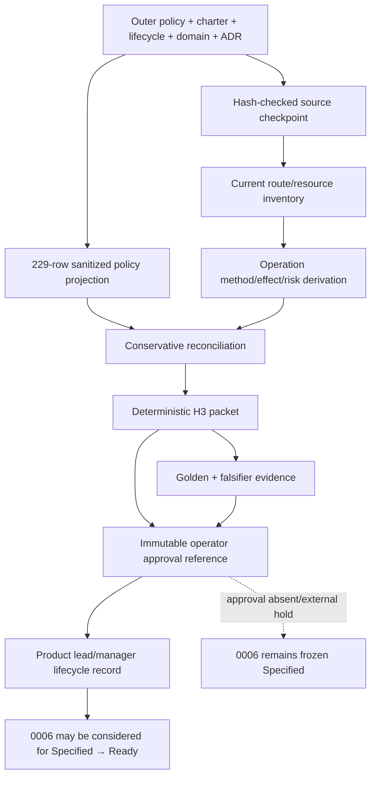

# Live design spec 0015 — H3 security decision packet

> **Summary:** One operator-facing journey that reads the authoritative redacted live access-policy snapshot and the exact current `mono-web` Symfony route/resource inventory, then emits a deterministic, sanitized H3 decision packet. The packet recommends fail-closed behavior, keeps every legacy public candidate and every opaque per-user slot visible, and records why each item is matched, missing, ambiguous, or unresolved. It is a decision aid, not H3 approval, an authorization implementation, or public/provider authority.

## Metadata

| Field | Value |
|---|---|
| Stable ID | `0015` |
| Status | `implementation accepted/integrated` at integrated HEAD `5d27398370282e640551d61f1ade8ea6e04a0c32`; not `Release-ready`/`Operating`; H3 external operator disposition remains open and 0006 stays `Specified` |
| Lifecycle | `Conforming` on `2026-08-11`; `Release-ready`/`Operating` are not entered |
| Product-lead acceptance | `ACCEPT` for 0015 intent at reviewed HEAD `ceefe71` on `2026-08-11` |
| Review | Security review `agent://SecurityH3PacketCodeReview0015` — `PASS`; runtime review `agent://SecurityH3PacketRuntimeVerify0015` — `PASS` |
| Implementation capsule/base | Planned owner/task `SecurityH3PacketImpl0015`; branch `impl/0015-security-h3-decision-packet`; worktree `/tmp/mono-web-security-h3-impl-0015-20260811`; source HEAD `e0eea29c92c3f3e936a50b12a43220fc5762fbca`; integrated HEAD `5d27398370282e640551d61f1ade8ea6e04a0c32`; packet SHA-256 `sha256:e8d622741b99b8e6ab11c12b879f3a275f45b2f735a7d31ee64781f060cb7b8e`
| Journey | One operator decision journey: source checkpoint → inventory → reconciliation → packet → external operator-approval handoff |
| Exact source checkpoint | `mono-web` commit `f55fc050efecd03895b08f5417324c414c44dcf4` |
| Worktree for this spec | `/tmp/mono-web-security-h3-spec-0015-20260811` |
| Current writer mutation | `design-specs/0015-security-h3-decision-packet.md` only |
| Intended consumer | Operator, product lead, and the 0006 handoff after the external operator disposition |
| Current blocker | H3 external operator disposition remains open; it blocks `Release-ready` and the `0006` handoff but not the `Conforming` packet state. This lane authorizes no external effect; public/provider/production action still requires separate operator authority and lifecycle evidence. |
| Evidence boundary | Technical route/resource identifiers, methods, classes, counts, hashes, reason codes, opaque slot IDs, and status only. No names, email addresses, user IDs, credentials, tokens, raw policy export, or provider/production data. |

## Authority and boundary

The authority routing is deliberately narrow:

- Program direction is [`docs/product-lead-charter.md`](../docs/product-lead-charter.md).
- Lifecycle state, evidence, capsules, drift, and operator authority are [`docs/agentic-development-lifecycle.md`](../docs/agentic-development-lifecycle.md).
- Domain authorization meaning is [`docs/domain-model.md`](../docs/domain-model.md), especially explicit department scope, derived `RoleGrant`, and default-deny `Action × Scope` decisions.
- Stage-0 topology is [`docs/decisions/0001-cloudflare-topology-and-migration-architecture.md`](../docs/decisions/0001-cloudflare-topology-and-migration-architecture.md). It grants no provider, route, deployment, production, data, or rollback authority.
- The policy input is the outer file `/srv/share/projects/vektorprogrammet/docs/live-access-policy-2026-08-10.md`. It is read-only evidence, not permission to expose a route.
- The current parity line is the Symfony application at this exact checkpoint. The current source is observed input, not accepted intent for a security implementation.
- 0006 (`design-specs/0006-current-line-security-evidence.md`) remains frozen and unchanged. This spec supplies a possible H3 evidence/disposition handoff only; it does not revise, implement, or accept 0006.

The product lead remains read-only to production code. This spec authorizes no public route, route cutover, provider action, credential use, database/data action, deployment, or cleanup of operational data.

## Goal, constraints, and values

### Goal

Give one operator a deterministic packet that answers:

> Which of the 62 legacy empty/public candidates still correspond to current `mono-web` operations, what are the exact methods and side-effect/risk classes, and how must each of the three redacted per-user grant slots be disposed of without inferring approval?

The packet is complete only when it retains every legacy policy row (including rows that have no current route), every current operation (including operations absent from the policy), all 62 public candidates, and all three opaque per-user slots.

### Constraints

- **Fail closed:** every effective decision is `deny` until an immutable operator approval record explicitly says otherwise. `allow`, `public`, an empty policy rule, a missing rule, a route name, a successful parse, or a count is not approval.
- **Explicit public approval:** a legacy empty/public candidate may become public only through an explicit operator approval record for its packet row ID, exact method, exact typed policy key, response boundary, and expiry/review date. A missing or ambiguous current operation is never made public.
- **Per-user slots are not inferred:** each of the three redacted slots requires exactly one explicit disposition: `retain_with_owner` (opaque owner reference plus removal date), `replace_with_role_or_team` (role/team rule plus scope), or `remove` (removal date/effective time). No slot may be copied, expanded, or silently retained.
- **No identity disclosure:** the generator drops the policy display-name cell for per-user rows before any artifact, log, error, digest input, or evidence export. It emits only slot IDs, redacted subject counts, technical resource/method values, and hashes. An operator-owned private mapping may satisfy “named owner”; the packet contains only its opaque reference digest.
- **No method inference:** methods are uppercase and explicit. `GET` is not assumed read-only; legacy `GET` delete/toggle-like operations and any source with an unresolved effect remain high-risk/unknown and denied.
- **No copied authority:** the packet contains normalized projections and source references/hashes, never the full outer policy or copied normative text. A hash proves which input was read; it does not change that input's authority.
- **Determinism:** no wall-clock field, hostname, locale, absolute checkout path, random ID, identity, or environment-specific ordering may enter the generated JSON. Every list is sorted by a defined key and every digest uses compact UTF-8 canonical JSON with no terminal newline.
- **Current-line only:** this is an H3 decision-packet lane, not the later Identity/authorization bounded-context replacement and not a public-content or Cloudflare lane.

### Values

- Preserve uncertainty as data. `missing`, `ambiguous`, `parse_error`, and `unknown` are packet states, not reasons to broaden access.
- Keep observation, derivation, and human approval as distinct relations.
- Make the packet reproducible from a named checkpoint and source hashes.
- Give the operator an exact, reversible disposition surface. An explicit operator denial is a valid completed disposition; silence is not.

## Frozen source verdict and integrity pins

The following are the inputs read for this draft. Whole-file hashes are SHA-256 over the exact UTF-8 bytes.

| Input | Use | Frozen hash or checkpoint |
|---|---|---|
| `/srv/share/projects/vektorprogrammet/docs/live-access-policy-2026-08-10.md:1-264` | Redacted 229-row policy snapshot and the only source for the 62 empty/public candidates and three per-user slots | `sha256:f981132f0e8ba6c7e3fcae07bb47ad96b85788ef994bd6706c5f4e7d6ba034ca` |
| `/srv/share/projects/vektorprogrammet/docs/product-lead-charter.md` | Current-line order, public-content separation, and operator boundary | `sha256:d731fb63212ca1412cbd5edc928f4f16fa01efe1c509e1dbb199f601d455ca85` |
| `/srv/share/projects/vektorprogrammet/docs/agentic-development-lifecycle.md` | One-journey spec/capsule contract and `Specified → Ready` gate | `sha256:a13956a1a2b6cbf09a58c460071827728f16ae7febe961275c905747ed29f809` |
| `/srv/share/projects/vektorprogrammet/docs/domain-model.md` | Default-deny, explicit department scope, derived role grants, and no per-user core mechanism | `sha256:4a9c2ec62abf6fdc1f2eb879366f6d9696176346e92df299acc5b2fe252517e2` |
| `/srv/share/projects/vektorprogrammet/docs/decisions/0001-cloudflare-topology-and-migration-architecture.md` | Current Symfony authority and no-provider/no-public-authority boundary | `sha256:f4d5b9b423132b81c44b075b269e70fed2da6da0f0b368ba3e63f2ef8d18a180` |
| `mono-web` | Exact implementation input checkpoint | `f55fc050efecd03895b08f5417324c414c44dcf4` |

At this checkpoint the static route/resource source manifest is 337 files and 1,373,680 bytes. The manifest is the sorted set of the exact paths below, represented as `{bytes, path, sha256}` records and hashed as compact canonical JSON:

```text
apps/server/composer.lock
apps/server/config/routes.yaml
apps/server/config/packages/security.yaml
apps/server/config/packages/framework.yaml
apps/server/config/packages/api_platform.yaml
apps/server/src/App/**/Controller/*.php
apps/server/src/App/**/Api/Resource/*.php
apps/server/src/App/**/Api/State/*.php
apps/server/src/App/**/Infrastructure/Entity/*.php
```

Frozen source-manifest digest: `sha256:43060f2cbba6b8b7246efade28ca7056c5140fd8646c3f38db043663537f8fdc`. The glob expansion is part of the input contract: paths are POSIX-relative, sorted bytewise, de-duplicated, and missing/unreadable paths are fatal `H3_SOURCE_UNAVAILABLE` rather than silently omitted. The four fixed configuration file hashes are:

```text
apps/server/config/routes.yaml                         c0c785912847355728f6c88a99c82c7432bc10f9892a02795d40dcbdda5d6614
apps/server/config/packages/security.yaml               fd9bf9c79c19041097397ecd4f346c8169d2f4beeca50296c55dc306e76fab32
apps/server/config/packages/framework.yaml              32ef9c0899912f53df573942d3000f286b345b678b2ca1a2efd10d7c32496142
apps/server/config/packages/api_platform.yaml           514f756efe8503d20240c4204941401936caa0fadb50c3a68df4380d68404671
```

A changed checkpoint, outer hash, source-manifest hash, or fixed configuration hash is `Drift`; the generator must not refresh an observation and continue.

## One exact operator journey

The journey is one serialized decision surface. The operator reviews the generated packet and signs a separate disposition record. The generator does not perform any external effect.

### J0 — Enter the checkpoint and establish isolation

1. Start from `f55fc050efecd03895b08f5417324c414c44dcf4` in the named worktree. Record the full commit, branch, worktree, generator version, and exact input paths in the evidence envelope, not in the deterministic packet.
2. Verify that only the future dedicated generator/evidence paths are writable. Do not load credentials, `.env` files, production databases, provider profiles, raw backups, or per-user policy data.
3. Read the outer policy directly. Do not make a repository copy. If the path is absent or its hash differs, stop with `H3_SOURCE_UNAVAILABLE` or `H3_SOURCE_HASH_DRIFT`.
4. Use a temporary directory outside the repository for mutated falsifier inputs. Remove it after the evidence receipt; it is never a source of authority.

### J1 — Build the current route/resource inventory

The future generator reads the exact static input set above and emits two sanitized intermediate evidence files before the packet:

- `evidence/security-h3/0015/current-route-inventory.json` — every resolved Symfony route row, including attribute routes, YAML routes, API Platform operations, imported route owners, login/logout, and vendor-owned imports. Each row has `route_name`, `path_template`, explicit `methods`, owner/controller reference, source refs, and a stable operation key. A route with no resolved method is retained with `methods: []` and `H3_METHOD_UNRESOLVED`.
- `evidence/security-h3/0015/current-resource-inventory.json` — every API Platform resource operation from `Api/Resource` and `Infrastructure/Entity` metadata, including operation class, URI template, method, provider/processor reference, and source refs. An operation is not dropped because a provider/processor cannot be resolved.
For `api_resource` rows, `resource_key` is retained when the current metadata exposes one. It is an observation, never inferred from a URI template, route name, controller, or method.

The generator may obtain the resolved route rows using the checkpoint's Symfony route collector (future capsule command: `php bin/console debug:router --format=json --env=test` from `apps/server/`), but the command output is an input observation and must be hashed. Static source hashes and the route/resource JSON hashes must both be present. No generated inventory is authority over the outer policy or domain model.

Inventory invariants:

1. A row key is `(inventory_kind, route_name, path_template, method, operation_id)`. Exact duplicate keys are retained with `H3_DUPLICATE_OPERATION`; no route is collapsed by path alone.
2. API methods are taken from resolved metadata (`Get`/`GetCollection`/`Post`/`Put`/`Patch`/`Delete` or the resolved route). A missing or contradictory method is unresolved.
3. A source line, owner/controller, and source-file SHA-256 are attached to every row. A row with no source edge is unresolved.
4. Imported/vendor routes remain visible. If their source cannot be resolved from the checkpoint, they receive `H3_ROUTE_OWNER_UNRESOLVED` and fail closed.
5. The current inventory includes operations that have no legacy policy row. They are not treated as public because they are current or reachable.
6. For `inventory_kind: api_resource`, a non-null `resource_key` is the only resource-key matching input; a null or conflicting key remains unresolved and cannot match by URI template, route name, or method.

### J2 — Derive side-effect and risk classes

The generator derives classes from the operation metadata and source references. It must not claim runtime safety from a method string or a class name alone.

`sideEffectClasses` is a sorted, non-empty set. Its closed vocabulary is:

```text
credential_or_authority | durable_state | filesystem_or_binary |
identity_or_session | none_observed | outbound_or_command | unknown
```

The canonical vocabulary JSON is `["credential_or_authority","durable_state","filesystem_or_binary","identity_or_session","none_observed","outbound_or_command","unknown"]`; its pinned SHA-256 is `sha256:e1477008c6e35e258d576f674794100d5db800e4355c48c871d327b156b2fd6f`.

| Class | Meaning |
|---|---|
| `none_observed` | Source inspection finds no durable, identity, filesystem, credential, or outbound effect; this is static evidence only. |
| `durable_state` | Create/update/delete or another durable domain transition is possible. |
| `identity_or_session` | Login, logout, reset, password, activation, profile/identity, session, token, or revocation state is involved. |
| `filesystem_or_binary` | Upload, delete, path resolution, signature, file browser, image, or binary read/write is involved. |
| `outbound_or_command` | Mail, SSO, webhook, network, shell/process, deployment, or provider effect is involved. |
| `credential_or_authority` | Role, team, department, access rule, grant, or credential authority changes. |
| `unknown` | Any call/effect is untraced, contradictory, or not provable from the named source edge. |

The generator emits every applicable class, sorted lexicographically. An untraced call, unresolved processor/provider, parse gap, or contradictory source **must** include `unknown` and `H3_UNKNOWN_EFFECT`; it also receives `H3_DEFAULT_DENY`. `none_observed` is allowed only when no unknown/untraced path remains. A `GET` operation that toggles, deletes, accepts/cancels, signs, sends, or otherwise mutates is `durable_state` or `outbound_or_command`, not `none_observed`. `sideEffectClasses` is a classification observation, not runtime proof.

### J3 — Normalize the policy without exposing identities

Parse the policy table at lines 31–264. The source snapshot's `229` total includes 228 real rule rows plus the table-header sentinel that the snapshot itself counts in its `resource-name-style (6)` metric (`5 real + header`). The normalizer therefore emits one non-decision `source_header` census row for that header; it is not a route, candidate, slot, or authorization grant. The normalizer:

- preserves the 1-based data-row ordinal (header excluded) for real rows, source line, resource text, explicit typed key (`method` + path/route, or `resourceKey`), sorted role labels, sorted team labels, and redacted subject count;
- omits the display-name cell from every per-user row before constructing JSON, logs, errors, or digest material;
- creates `policy_row_id: policy-row-<ordinal>` for real rows, `policy_row_id: policy-header-01` for the sentinel, and `slot_id: h3-per-user-slot-<01..03>` for the three slots;
- treats an empty roles/teams row as a **legacy public candidate** only when `per_user_count` is absent; it remains `deny_pending_h3` until an immutable operator approval reference exists;
- treats the three rows with redacted per-user subjects as slots, not as public candidates, regardless of their empty role/team cells;
- retains the source-declared role/team summary metrics instead of guessing a new authority from empty cells; raw `roles[]` and `teams[]` remain the auditable projection;
- never attempts to reconstruct, guess, hash, or enumerate the redacted identities.

The header sentinel has `visibility_class: source_header`, `match_status: source_header`, no method/path/resource-key decision, and `H3_POLICY_HEADER_SENTINEL`. It exists only so the packet can reconcile the source snapshot's published counts without pretending that a Markdown header is an AccessRule.

The normalized policy has these expected source-summary counts and invariants:

| Projection | Expected value |
|---|---:|
| Source census entries emitted | 229 (228 real rows + 1 header sentinel) |
| Real routing-style rows | 223 |
| Resource-name-style source metric | 6 (5 real rows + 1 header sentinel) |
| Empty/public candidates | 62 |
| Role-only source metric | 72 |
| Team-scoped source metric | 92 |
| Per-user slots | 3 |
| Count invariant | `62 + 72 + 92 + 3 = 229`; `223 + 6 = 229` |

The source summary metrics are emitted as source observations. The packet does not silently reinterpret overlapping role/team labels to manufacture a different count; it preserves those labels and records any future source-summary disagreement as `H3_POLICY_COUNT_MISMATCH`.

The deterministic public-candidate ordinal set is:

```text
1, 2, 7, 14, 15, 16, 17, 19, 20, 21, 22, 24, 26, 27, 31, 32, 33,
41, 42, 43, 44, 45, 68, 72, 78, 79, 80, 81, 82, 83, 84, 85, 94, 95,
96, 97, 98, 99, 100, 103, 104, 107, 119, 132, 133, 134, 138, 148, 155,
157, 172, 173, 174, 175, 176, 177, 178, 183, 184, 185, 186, 187
```

This is a compact golden assertion, not a copied policy table. The three slot ordinals are `127`, `129`, and `131` (source lines `161`, `163`, and `165`). Their source subject cardinalities are retained only as redacted counts `1`, `1`, and `5`; the packet never contains the names in those cells.
The five real methodless resource rows are legacy ordinals `224..228`: `224,225` have `policyKeyKind: resource_key` and `resourceKey: all_departments`; `226,227,228` have `policyKeyKind: resource_key` and `resourceKey: survey_admin`. They have no `method`, `pathTemplate`, or `routeName`; the source table header is not one of these rows.

### J4 — Reconcile policy rows to current operations

Matching is typed and exact. Every normalized policy row has `policyKeyKind` and one corresponding key:

1. `policyKeyKind: routing` has `method` and `pathTemplate`; it matches only a current route operation with the exact `(method, path_template)` pair.
2. `policyKeyKind: route_name` has `method` and `routeName`; it matches only a current route/imported operation with the exact `(method, route_name)` pair.
3. `policyKeyKind: resource_key` has `resourceKey` only; it matches only a current `api_resource` operation with the exact `resource_key`. The current operation's method, URI template, and route name cannot substitute for `resource_key`; a resource-key match does not inherit a method.
4. A routing key never falls back to a route name or resource key, a route-name key never falls back to a path or resource key, and a resource key never falls back to a path, route name, or method. A resource label, controller class, or route owner cannot substitute for the typed key.
5. A match with more than one current owner is `ambiguous`, retains all current rows, and receives `H3_AMBIGUOUS_MATCH` plus `H3_DEFAULT_DENY`.
6. A policy candidate with no exact typed current operation is retained with `match_status: missing_current_operation`, `H3_LEGACY_CANDIDATE_MISSING_ROUTE`, and an effective deny recommendation.
7. A current operation with no exact typed policy row is retained with `match_status: current_not_in_policy`, `H3_CURRENT_OPERATION_UNSEEN_IN_POLICY`, and an effective deny recommendation.
8. Same path with another method is a distinct operation. A method mismatch receives `H3_METHOD_MISMATCH`; a key-kind mismatch receives `H3_KEY_KIND_MISMATCH`; no wildcard or method inheritance is allowed. A method attached to a `resource_key` policy row is invalid.
9. A source parse or hash failure retains a sanitized source pointer when possible, marks the row unresolved, and prevents an approval-ready packet.
10. Scoped role/team rows are included in the 229-row reconciliation projection. Their presence does not authorize a public row and does not turn a per-user slot into a role/team grant.

The default recommendation for every row is `deny`. The only packet state that can be changed by the operator is an explicit external approval reference for an exact candidate or slot ID. The generator does not apply that disposition to Symfony or to any policy store.

### J5 — Emit and independently check the packet

The future generator writes the machine-readable packet to `evidence/security-h3/0015/decision-packet.json`. It also writes the source/hash and golden/falsifier receipts listed below. The deterministic packet contains no `generated_at`, host, branch, absolute worktree path, display name, email, account number, credential, token, raw request, raw response, or copied outer authority.

A packet is `invalid` (and cannot be handed off as H3-complete) if any required source hash, row count, route/resource row, side-effect/risk class, derivation edge, or reason code is missing. An invalid packet must still be sanitized and deterministic when its inputs are readable, so a reviewer can see the exact unresolved failure; an unreadable authority input produces only a failure receipt and no approval-ready packet.

### J6 — Operator review and external approval record

The operator reviews all 62 candidate rows, all three opaque slots, and all current-unmatched/missing/ambiguous rows. A public candidate is never approved by the generator, product lead, test result, route reachability, or an empty legacy rule. The operator may explicitly deny every candidate, which is a complete fail-closed disposition.

The operator owns the approval decision and records it in the separate artifact `evidence/security-h3/0015/operator-disposition.json` (or in an operator-controlled system with a sanitized reference). This spec defines a record shape and immutable reference, not a signing system or identity verifier. If the operator's system authenticates or signs its record, that mechanism remains outside this schema and outside the generator's claims.

Required operator approval record fields:

| Field | Requirement |
|---|---|
| `schema_version` | Exact `h3-operator-disposition/v1` |
| `approval_id` | Immutable operator-issued identifier; one approval record has one ID |
| `approval_artifact_ref` | Exact immutable path/URI/transcript/artifact reference that a product lead/manager can inspect |
| `approval_artifact_sha256` | Digest of the referenced immutable artifact, when the operator system supplies one; not an authenticity claim by the generator |
| `packet_sha256` | Exact digest of the canonical packet content; stale packet records are rejected |
| `source_manifest_sha256` | Exact source-manifest digest used by the packet |
| `policy_sha256` | Exact outer policy hash; no alternate policy path is accepted |
| `operator_ref` | Opaque operator reference supplied by the operator system. The generator does not authenticate or resolve identity. |
| `environment` | Explicit environment and decision scope; `production` does not itself authorize an effect |
| `public_decisions` | Exactly one entry for every candidate ID: `deny` or `approve_public`, exact typed policy key, response boundary, reason code, effective time, and review/expiry date |
| `per_user_decisions` | Exactly one entry for each of `h3-per-user-slot-01..03`: `retain_with_owner`, `replace_with_role_or_team`, or `remove` |
| `retain_with_owner` fields | Opaque `owner_ref`, owner validity/expiry, and mandatory `removal_date`; operator's private named-owner mapping is not copied |
| `replace_with_role_or_team` fields | Exact role or team rule, explicit department/global scope, replacement effective time, and no per-user subject |
| `remove` fields | Removal effective time/date and reason; no replacement is inferred |
| `unresolved_acknowledged` | Empty after every candidate/slot has a disposition; missing/ambiguous current rows may only be acknowledged as deny/blocker, never public |
| `rollback_ref` | Reversible removal/deny action reference and owner; closing rollback remains operator-only |
| `supersedes` / `revokes` | Prior approval reference when replacing or revoking one |

The generator may validate JSON shape, packet/source hashes, exact candidate/slot cardinality, and immutable reference fields. It must not create, authenticate, sign, mutate, or infer operator identity or authority. The operator record contains no copied policy text and no identity-bearing per-user material. A private system may retain the identity-to-`owner_ref` mapping under operator control; that mapping is not part of this packet or its evidence.

### J7 — Handoff, cleanup, and stop condition

1. The packet, source manifest, golden receipt, falsifier receipt, and immutable operator approval reference are handed to the product lead/manager.
2. The operator owns the disposition. The product lead/manager validates that the immutable approval reference covers this exact packet/source hash and records/schedules 0006's `Specified → Ready` transition under the lifecycle. The generator cannot perform that transition and must not edit 0006.
3. If the approval record/reference is missing, stale, incomplete, or references a different packet/source hash, the handoff stops with `H3_OPERATOR_APPROVAL_REFERENCE_REQUIRED` or `H3_DISPOSITION_STALE`; 0006 remains `Specified`. This is an expected external hold, not generator `Drift`.
4. Remove temporary fixture inputs and raw command output. Retain only sanitized JSON, hashes, counts, reason codes, source references, and the immutable approval reference. No provider, remote, production, or operational-data cleanup is performed by this journey.

## Machine-readable packet contract

`decision-packet.json` is a UTF-8 JSON object validated against the closed `h3-decision-packet/v1` schema below. The future file `apps/server/tools/security-h3/0015/schema.json` must be byte-equivalent to this schema. `additionalProperties: false` is required at every object level; unknown fields are a schema failure, not an ignored extension.

```json
{
  "$schema": "https://json-schema.org/draft/2020-12/schema",
  "$id": "h3-decision-packet/v1",
  "type": "object",
  "additionalProperties": false,
  "required": ["schema_version","status","recommendation","source","reconciliation","policy_rows","legacy_public_candidates","per_user_slots","current_operations","unresolved","reason_codes","derivation_edges"],
  "properties": {
    "schema_version": {"const": "h3-decision-packet/v1"},
    "status": {"enum": ["generated","invalid"]},
    "recommendation": {"const": "fail_closed"},
    "source": {"$ref": "#/$defs/source"},
    "reconciliation": {"$ref": "#/$defs/reconciliation"},
    "policy_rows": {"type": "array","minItems": 229,"maxItems": 229,"items": {"$ref": "#/$defs/policyRow"}},
    "legacy_public_candidates": {"type": "array","minItems": 62,"maxItems": 62,"items": {"$ref": "#/$defs/candidate"}},
    "per_user_slots": {"type": "array","minItems": 3,"maxItems": 3,"items": {"$ref": "#/$defs/slot"}},
    "current_operations": {"type": "array","items": {"$ref": "#/$defs/operation"}},
    "unresolved": {"type": "array","items": {"$ref": "#/$defs/unresolved"}},
    "reason_codes": {"type": "array","uniqueItems": true,"items": {"$ref": "#/$defs/reasonCode"}},
    "derivation_edges": {"type": "array","items": {"$ref": "#/$defs/edge"}}
  },
  "allOf": [
    {
      "if": {"properties": {"status": {"const": "invalid"}}},
      "then": {"properties": {"unresolved": {"minItems": 1}}}
    }
  ],
  "$defs": {
    "sha256": {"type": "string","pattern": "^sha256:[0-9a-f]{64}$"},
    "source": {
      "type": "object","additionalProperties": false,
      "required": ["policy_path","policy_sha256","mono_web_commit","source_manifest_sha256","route_inventory_sha256","resource_inventory_sha256","side_effect_vocabulary_sha256","input_mode","fixture_manifest_sha256"],
      "properties": {
        "policy_path": {"type": "string","minLength": 1},
        "policy_sha256": {"$ref": "#/$defs/sha256"},
        "mono_web_commit": {"type": "string","pattern": "^[0-9a-f]{40}$"},
        "source_manifest_sha256": {"$ref": "#/$defs/sha256"},
        "route_inventory_sha256": {"$ref": "#/$defs/sha256"},
        "resource_inventory_sha256": {"$ref": "#/$defs/sha256"},
        "side_effect_vocabulary_sha256": {"$ref": "#/$defs/sha256"},
        "input_mode": {"enum": ["frozen","fixture_injection"]},
        "fixture_manifest_sha256": {"anyOf": [{"$ref": "#/$defs/sha256"},{"type": "null"}]}
      },
      "allOf": [
        {"if": {"properties": {"input_mode": {"const": "frozen"}}},"then": {"properties": {"policy_path": {"const": "/srv/share/projects/vektorprogrammet/docs/live-access-policy-2026-08-10.md"}}}},
        {"if": {"properties": {"input_mode": {"const": "fixture_injection"}}},"then": {"properties": {"policy_path": {"pattern": "^fixture://h3-0015/"}}}},
        {"if": {"properties": {"input_mode": {"const": "fixture_injection"}}},"then": {"properties": {"fixture_manifest_sha256": {"const": "sha256:d4f043a1c97a61d83fa3127c09d16266ac5ca62e9e337300f23c80fe0e203f1a"}}}},
        {"if": {"properties": {"input_mode": {"const": "frozen"}}},"then": {"properties": {"fixture_manifest_sha256": {"type": "null"}}}}
      ]
    },
    "reconciliation": {
      "type": "object","additionalProperties": false,
      "required": ["policy_counts","current_counts","invariants","policy_row_projection_sha256","public_candidate_count","per_user_slot_count"],
      "properties": {
        "policy_counts": {"type": "object","additionalProperties": false,"required": ["census_entries","routing_rows","resource_metric","public_candidates","role_only","team_scoped","per_user_slots"],"properties": {
          "census_entries": {"const": 229},"routing_rows": {"const": 223},"resource_metric": {"const": 6},"public_candidates": {"const": 62},"role_only": {"const": 72},"team_scoped": {"const": 92},"per_user_slots": {"const": 3}
        }},
        "current_counts": {"type": "object","additionalProperties": false,"required": ["route_rows","resource_operations"],"properties": {"route_rows": {"type": "integer","minimum": 0},"resource_operations": {"type": "integer","minimum": 0}}},
        "invariants": {"type": "array","minItems": 2,"items": {"type": "string"}},
        "policy_row_projection_sha256": {"$ref": "#/$defs/sha256"},
        "public_candidate_count": {"const": 62},
        "per_user_slot_count": {"const": 3}
      }
    },
    "policyKey": {
      "type": "object","additionalProperties": false,
      "required": ["policyKeyKind"],
      "properties": {
        "policyKeyKind": {"enum": ["routing","route_name","resource_key"]},
        "method": {"type": "string","pattern": "^[A-Z]+$"},
        "pathTemplate": {"type": "string","minLength": 1},
        "routeName": {"type": "string","minLength": 1},
        "resourceKey": {"type": "string","minLength": 1}
      },
      "allOf": [
        {"if": {"properties": {"policyKeyKind": {"const": "routing"}}},"then": {"required": ["method","pathTemplate"],"not": {"anyOf": [{"required": ["routeName"]},{"required": ["resourceKey"]}]}}},
        {"if": {"properties": {"policyKeyKind": {"const": "route_name"}}},"then": {"required": ["method","routeName"],"not": {"anyOf": [{"required": ["pathTemplate"]},{"required": ["resourceKey"]}]}}},
        {"if": {"properties": {"policyKeyKind": {"const": "resource_key"}}},"then": {"required": ["resourceKey"],"not": {"anyOf": [{"required": ["method"]},{"required": ["pathTemplate"]},{"required": ["routeName"]}]}}}
      ]
    },
    "policyRow": {
      "type": "object","additionalProperties": false,
      "required": ["policy_row_id","source_line","roles","teams","subject_count_redacted","visibility_class","matched_operation_ids","match_status","recommendation","reason_codes","source_ref_ids","derivation_edge_ids"],
      "properties": {
        "policy_row_id": {"type": "string","pattern": "^policy-(row-[0-9]{3}|header-01)$"},
        "legacy_row_ordinal": {"type": "integer","minimum": 1,"maximum": 228},
        "source_line": {"type": "integer","minimum": 31,"maximum": 264},
        "policyKeyKind": {"enum": ["routing","route_name","resource_key"]},
        "method": {"type": "string","pattern": "^[A-Z]+$"},
        "pathTemplate": {"type": "string","minLength": 1},
        "routeName": {"type": "string","minLength": 1},
        "resourceKey": {"type": "string","minLength": 1},
        "roles": {"type": "array","items": {"type": "string","minLength": 1}},
        "teams": {"type": "array","items": {"type": "string","minLength": 1}},
        "subject_count_redacted": {"type": ["integer","null"],"minimum": 0},
        "visibility_class": {"enum": ["public_candidate","role_only","team_scoped","per_user_slot","source_header"]},
        "matched_operation_ids": {"type": "array","items": {"type": "string"}},
        "match_status": {"enum": ["matched","missing_current_operation","current_not_in_policy","ambiguous","source_header","unresolved"]},
        "recommendation": {"enum": ["deny","deny_pending_h3","not_applicable"]},
        "reason_codes": {"type": "array","uniqueItems": true,"items": {"$ref": "#/$defs/reasonCode"}},
        "source_ref_ids": {"type": "array","minItems": 1,"items": {"type": "string"}},
        "derivation_edge_ids": {"type": "array","minItems": 1,"items": {"type": "string"}}
      },
      "allOf": [
        {"if": {"properties": {"visibility_class": {"const": "source_header"}}},"then": {"required": ["match_status"],"properties": {"match_status": {"const": "source_header"},"recommendation": {"const": "not_applicable"}}}},
        {"if": {"properties": {"visibility_class": {"const": "per_user_slot"}}},"then": {"required": ["legacy_row_ordinal","policyKeyKind","subject_count_redacted"],"properties": {"subject_count_redacted": {"type": "integer","minimum": 1}}}},
        {"if": {"properties": {"visibility_class": {"enum": ["public_candidate","role_only","team_scoped"]}}},"then": {"required": ["legacy_row_ordinal","policyKeyKind"]}},
        {"if": {"not": {"properties": {"visibility_class": {"const": "source_header"}}}},"then": {"required": ["policyKeyKind"],"allOf": [
          {"if": {"properties": {"policyKeyKind": {"const": "routing"}}},"then": {"required": ["method","pathTemplate"],"not": {"anyOf": [{"required": ["routeName"]},{"required": ["resourceKey"]}]}}},
          {"if": {"properties": {"policyKeyKind": {"const": "route_name"}}},"then": {"required": ["method","routeName"],"not": {"anyOf": [{"required": ["pathTemplate"]},{"required": ["resourceKey"]}]}}},
          {"if": {"properties": {"policyKeyKind": {"const": "resource_key"}}},"then": {"required": ["resourceKey"],"not": {"anyOf": [{"required": ["method"]},{"required": ["pathTemplate"]},{"required": ["routeName"]}]}}}
        ]}}
      ]
    },
    "candidate": {
      "allOf": [
        {"$ref": "#/$defs/policyRow"},
        {"properties": {"visibility_class": {"const": "public_candidate"}}}
      ]
    },
    "slot": {
      "type": "object","additionalProperties": false,
      "required": ["slot_id","policy_row_id","policyKeyKind","method","subject_count_redacted","allowed_dispositions","reason_codes"],
      "properties": {
        "slot_id": {"type": "string","pattern": "^h3-per-user-slot-0[1-3]$"},
        "policy_row_id": {"type": "string","pattern": "^policy-row-[0-9]{3}$"},
        "policyKeyKind": {"enum": ["routing","route_name"]},
        "method": {"type": "string","pattern": "^[A-Z]+$"},
        "pathTemplate": {"type": "string","minLength": 1},
        "routeName": {"type": "string","minLength": 1},
        "subject_count_redacted": {"type": "integer","minimum": 1},
        "allowed_dispositions": {"const": ["retain_with_owner","replace_with_role_or_team","remove"]},
        "reason_codes": {"type": "array","uniqueItems": true,"items": {"$ref": "#/$defs/reasonCode"}}
      }
    },
    "operation": {
      "type": "object","additionalProperties": false,
      "required": ["operation_id","inventory_kind","resource_key","methods","sideEffectClasses","risk_classes","match_status","recommendation","reason_codes","source_ref_ids","derivation_edge_ids"],
      "properties": {
        "operation_id": {"type": "string","minLength": 1},
        "inventory_kind": {"enum": ["route","api_resource","imported_route"]},
        "resource_key": {"type": ["string","null"],"minLength": 1},
        "route_name": {"type": ["string","null"]},
        "operation_id_from_metadata": {"type": ["string","null"]},
        "path_template": {"type": ["string","null"]},
        "methods": {"type": "array","items": {"type": "string","pattern": "^[A-Z]+$"}},
        "owner_ref": {"type": ["string","null"]},
        "controller_or_resource_ref": {"type": ["string","null"]},
        "provider_or_processor_ref": {"type": ["string","null"]},
        "sideEffectClasses": {"type": "array","minItems": 1,"uniqueItems": true,"items": {"enum": ["credential_or_authority","durable_state","filesystem_or_binary","identity_or_session","none_observed","outbound_or_command","unknown"]}},
        "risk_classes": {"type": "array","minItems": 1,"uniqueItems": true,"items": {"type": "string","minLength": 1}},
        "classification_basis_refs": {"type": "array","minItems": 1,"items": {"type": "string"}},
        "policy_row_ids": {"type": "array","items": {"type": "string"}},
        "match_status": {"enum": ["matched","current_not_in_policy","ambiguous","unresolved"]},
        "recommendation": {"enum": ["deny","deny_pending_h3"]},
        "reason_codes": {"type": "array","uniqueItems": true,"items": {"$ref": "#/$defs/reasonCode"}},
        "source_ref_ids": {"type": "array","minItems": 1,"items": {"type": "string"}},
        "derivation_edge_ids": {"type": "array","minItems": 1,"items": {"type": "string"}}
      }
    },
    "unresolved": {
      "type": "object","additionalProperties": false,"required": ["status","reason_codes","source_ref_ids"],
      "properties": {"row_id": {"type": ["string","null"]},"operation_id": {"type": ["string","null"]},"status": {"type": "string","minLength": 1},"reason_codes": {"type": "array","minItems": 1,"uniqueItems": true,"items": {"$ref": "#/$defs/reasonCode"}},"source_ref_ids": {"type": "array","minItems": 1,"items": {"type": "string"}}}
    },
    "edge": {
      "type": "object","additionalProperties": false,"required": ["edge_id","edge_type","from","to","derivation"],
      "properties": {"edge_id": {"type": "string","minLength": 1},"edge_type": {"enum": ["authority_input","observed_inventory","derived_projection","derived_classification","reconciles","human_assertion"]},"from": {"type": "array","minItems": 1,"items": {"type": "string"}},"to": {"type": "array","minItems": 1,"items": {"type": "string"}},"derivation": {"type": "string","minLength": 1}}
    },
    "reasonCode": {
      "enum": ["H3_POLICY_HEADER_SENTINEL","H3_DEFAULT_DENY","H3_LEGACY_EMPTY_CANDIDATE","H3_LEGACY_CANDIDATE_MATCHED","H3_LEGACY_CANDIDATE_MISSING_ROUTE","H3_CURRENT_OPERATION_UNSEEN_IN_POLICY","H3_AMBIGUOUS_MATCH","H3_METHOD_MISMATCH","H3_KEY_KIND_MISMATCH","H3_METHOD_UNRESOLVED","H3_DUPLICATE_OPERATION","H3_ROUTE_OWNER_UNRESOLVED","H3_UNKNOWN_EFFECT","H3_GET_SIDE_EFFECT","H3_SOURCE_PARSE_ERROR","H3_SOURCE_UNAVAILABLE","H3_SOURCE_HASH_DRIFT","H3_POLICY_COUNT_MISMATCH","H3_PER_USER_SLOT_REDACTED","H3_PER_USER_DISPOSITION_REQUIRED","H3_RETAIN_OWNER_REQUIRED","H3_REPLACE_RULE_REQUIRED","H3_REMOVE_DATE_REQUIRED","H3_PUBLIC_APPROVAL_REQUIRED","H3_OPERATOR_APPROVAL_REFERENCE_REQUIRED","H3_DISPOSITION_STALE","H3_PII_INPUT","H3_NONDETERMINISTIC_OUTPUT","H3_FIXTURE_MODE_REQUIRED","H3_FIXTURE_MANIFEST_DRIFT","H3_FIXTURE_SOURCE_FORBIDDEN"]
    }
  }
}
```

The packet schema's `minItems`/`maxItems`, `const`, `enum`, and `if/then` clauses enforce the fixed 229/62/3 cardinalities, source-header behavior, typed key shape, closed side-effect vocabulary, and invalid-packet unresolved requirement. Cross-array references (candidate IDs, slot IDs, and operation IDs) are checked by the generator as explicit invariants; a missing or duplicate reference is invalid even though JSON Schema cannot compare arbitrary array contents.

The operator approval record is a separate closed schema. It contains no key or authenticity fields and makes no authenticity claim:

```json
{
  "$schema": "https://json-schema.org/draft/2020-12/schema",
  "$id": "h3-operator-disposition/v1",
  "type": "object",
  "additionalProperties": false,
  "required": ["schema_version","approval_id","approval_artifact_ref","packet_sha256","source_manifest_sha256","policy_sha256","operator_ref","environment","public_decisions","per_user_decisions","unresolved_acknowledged","rollback_ref"],
  "properties": {
    "schema_version": {"const": "h3-operator-disposition/v1"},
    "approval_id": {"type": "string","pattern": "^op-[A-Za-z0-9._:-]+$"},
    "approval_artifact_ref": {"type": "string","minLength": 1},
    "approval_artifact_sha256": {"$ref": "#/$defs/sha256"},
    "packet_sha256": {"$ref": "#/$defs/sha256"},
    "source_manifest_sha256": {"$ref": "#/$defs/sha256"},
    "policy_sha256": {"$ref": "#/$defs/sha256"},
    "operator_ref": {"type": "string","pattern": "^operator:[A-Za-z0-9._:-]+$"},
    "environment": {"type": "string","minLength": 1},
    "public_decisions": {"type": "array","minItems": 62,"maxItems": 62,"uniqueItems": true,"items": {"$ref": "#/$defs/publicDecision"}},
    "per_user_decisions": {"type": "array","minItems": 3,"maxItems": 3,"uniqueItems": true,"items": {"$ref": "#/$defs/slotDecision"}},
    "unresolved_acknowledged": {"type": "array","maxItems": 0,"items": {"type": "string"}},
    "rollback_ref": {"type": "object","additionalProperties": false,"required": ["ref","owner_ref"],"properties": {"ref": {"type": "string","minLength": 1},"owner_ref": {"type": "string","pattern": "^operator:[A-Za-z0-9._:-]+$"}}},
    "supersedes": {"type": ["string","null"]},
    "revokes": {"type": ["string","null"]}
  },
  "$defs": {
    "sha256": {"type": "string","pattern": "^sha256:[0-9a-f]{64}$"},
    "key": {"type": "object","additionalProperties": false,"required": ["policyKeyKind"],"properties": {"policyKeyKind": {"enum": ["routing","route_name","resource_key"]},"method": {"type": "string","pattern": "^[A-Z]+$"},"pathTemplate": {"type": "string","minLength": 1},"routeName": {"type": "string","minLength": 1},"resourceKey": {"type": "string","minLength": 1}}, "allOf": [
      {"if": {"properties": {"policyKeyKind": {"const": "routing"}}},"then": {"required": ["method","pathTemplate"],"not": {"anyOf": [{"required": ["routeName"]},{"required": ["resourceKey"]}]}}},
      {"if": {"properties": {"policyKeyKind": {"const": "route_name"}}},"then": {"required": ["method","routeName"],"not": {"anyOf": [{"required": ["pathTemplate"]},{"required": ["resourceKey"]}]}}},
      {"if": {"properties": {"policyKeyKind": {"const": "resource_key"}}},"then": {"required": ["resourceKey"],"not": {"anyOf": [{"required": ["method"]},{"required": ["pathTemplate"]},{"required": ["routeName"]}]}}}
    ]},
    "publicDecision": {
      "type": "object","additionalProperties": false,"required": ["candidate_id","decision","reason_code"],
      "properties": {"candidate_id": {"type": "string","pattern": "^policy-row-[0-9]{3}$"},"decision": {"enum": ["deny","approve_public"]},"reason_code": {"type": "string","minLength": 1},"exact_policy_key": {"$ref": "#/$defs/key"},"response_boundary": {"type": "string","minLength": 1},"effective_at": {"type": "string","format": "date-time"},"review_by": {"type": "string","format": "date-time"}},
      "allOf": [{"if": {"properties": {"decision": {"const": "approve_public"}}},"then": {"required": ["exact_policy_key","response_boundary","effective_at","review_by"]}}]
    },
    "slotDecision": {
      "type": "object","additionalProperties": false,"required": ["slot_id","disposition","reason_code"],
      "properties": {"slot_id": {"type": "string","pattern": "^h3-per-user-slot-0[1-3]$"},"disposition": {"enum": ["retain_with_owner","replace_with_role_or_team","remove"]},"reason_code": {"type": "string","minLength": 1},"owner_ref": {"type": "string","pattern": "^owner:[A-Za-z0-9._:-]+$"},"removal_date": {"type": "string","format": "date"},"replacement": {"type": "object","additionalProperties": false,"required": ["subject_kind","subject_ref","scope"],"properties": {"subject_kind": {"enum": ["role","team"]},"subject_ref": {"type": "string","minLength": 1},"scope": {"type": "string","minLength": 1}}},"effective_at": {"type": "string","format": "date-time"}},
      "allOf": [
        {"if": {"properties": {"disposition": {"const": "retain_with_owner"}}},"then": {"required": ["owner_ref","removal_date"]}},
        {"if": {"properties": {"disposition": {"const": "replace_with_role_or_team"}}},"then": {"required": ["replacement","effective_at"]}},
        {"if": {"properties": {"disposition": {"const": "remove"}}},"then": {"required": ["removal_date","effective_at"]}}
      ]
    }
  }
}
```

The product lead/manager validates `approval_artifact_ref` and its immutable record/transcript/artifact against the packet hashes and the lifecycle record; the generator never authenticates identity, evaluates a key, or turns a reference into authority. The `public_decisions` and `per_user_decisions` arrays must each have exact cardinality and unique IDs; the generator additionally checks that their IDs equal the packet's 62 candidate IDs and three slot IDs.

## Reason codes and treatment

| Code | Trigger | Required packet treatment |
|---|---|---|
| `H3_POLICY_HEADER_SENTINEL` | Snapshot resource metric counts the table header | Emit one non-decision `source_header` row; never match or approve it |
| `H3_DEFAULT_DENY` | Any row before an immutable operator approval reference | `recommendation: deny`; always present on unresolved/public-candidate rows |
| `H3_LEGACY_EMPTY_CANDIDATE` | Policy row has empty role/team and no per-user count | Include in the 62-element candidate projection; no approval |
| `H3_LEGACY_CANDIDATE_MATCHED` | Candidate has exactly one current operation match | Retain match and still require explicit public decision |
| `H3_LEGACY_CANDIDATE_MISSING_ROUTE` | Candidate has no current operation | Retain row; `missing_current_route`; deny |
| `H3_CURRENT_OPERATION_UNSEEN_IN_POLICY` | Current operation has no policy row | Retain operation; deny; never infer public/private approval |
| `H3_AMBIGUOUS_MATCH` | More than one current owner/operation matches | Retain every match; unresolved; deny |
| `H3_KEY_KIND_MISMATCH` | Routing, route-name, and resource-key kinds are compared or substituted, or a resource key carries method/path/route-name fields | Keep rows unresolved; deny; never fall back between key kinds |
| `H3_METHOD_UNRESOLVED` | Route/resource method absent or contradictory | `methods: []`; unresolved; deny |
| `H3_DUPLICATE_OPERATION` | Exact current operation key occurs more than once | Retain duplicates and owners; unresolved; deny |
| `H3_ROUTE_OWNER_UNRESOLVED` | Imported route owner cannot be resolved | Retain import row; unresolved; deny |
| `H3_UNKNOWN_EFFECT` | Source cannot prove side-effect class or a call is untraced | `sideEffectClasses` includes `unknown`; risk includes `unknown`; deny |
| `H3_GET_SIDE_EFFECT` | GET source has durable/outbound/file/credential effect | Classify effect explicitly; high-risk; deny unless separately approved |
| `H3_SOURCE_PARSE_ERROR` | Source/parser cannot produce a required field | Retain sanitized source pointer; invalid/unresolved; deny |
| `H3_SOURCE_UNAVAILABLE` | Required input path cannot be read | No approval-ready packet; failure receipt only |
| `H3_SOURCE_HASH_DRIFT` | Source bytes differ from pinned input | Stop; do not refresh or approve |
| `H3_POLICY_COUNT_MISMATCH` | Header counts or derived classes do not reconcile | Invalid packet; no operator handoff |
| `H3_PER_USER_SLOT_REDACTED` | One of the three redacted slots is parsed | Emit slot ID/count only; never identity |
| `H3_PER_USER_DISPOSITION_REQUIRED` | Slot has no external operator approval choice | Unresolved; deny; 0006 remains blocked |
| `H3_RETAIN_OWNER_REQUIRED` | Retain choice lacks opaque named-owner reference/removal date | Reject disposition; no inferred retain |
| `H3_REPLACE_RULE_REQUIRED` | Replace choice lacks role/team and explicit scope | Reject disposition; no inferred replacement |
| `H3_REMOVE_DATE_REQUIRED` | Remove choice lacks effective removal date/time | Reject disposition; no inferred removal completion |
| `H3_PUBLIC_APPROVAL_REQUIRED` | Candidate lacks an exact external operator approval reference | Deny; no inferred public access |
| `H3_OPERATOR_APPROVAL_REFERENCE_REQUIRED` | Approval record/reference is absent, malformed, or cannot be inspected by the product lead/manager | Reject handoff; 0006 stays `Specified` |
| `H3_DISPOSITION_STALE` | Record packet/source/policy hash does not match | Reject handoff; regenerate/review |
| `H3_PII_INPUT` | Identity-bearing value would enter a packet/log/digest | Redact before output; if it cannot be safely redacted, stop |
| `H3_NONDETERMINISTIC_OUTPUT` | Ordering, time, locale, host, or random data changes packet bytes | Falsifier; no handoff |
| `H3_FIXTURE_MODE_REQUIRED` | A semantic falsifier attempts to read or mutate frozen authority inputs | Reject the run; semantic cases use isolated fixture injection |
| `H3_FIXTURE_MANIFEST_DRIFT` | Fixture manifest bytes differ from the pinned manifest digest | Reject the fixture run; no source claim |
| `H3_FIXTURE_SOURCE_FORBIDDEN` | Fixture mode contains an absolute authority path, credential, identity, or provider input | Reject and sanitize; no evidence claim |

Reason codes are identifiers, not authority. A reason code cannot approve a row.

## Source → derivation and hash edges

The packet must carry explicit typed edges. A generic “related to” link is insufficient.

| `E-POLICY-AUTHORITY` / `authority_input` | Outer policy path + whole-file SHA-256 + line range `31-264` | `policy_rows[*]`, `legacy_public_candidates[*]`, `per_user_slots[*]` | Parse the redacted table, preserve row ordinal, omit display names for per-user rows |
| `E-POLICY-CLASSIFY` / `derived_projection` | Normalized policy row fields | `visibility_class`, counts, candidate/slot projections | Empty roles/teams without a per-user count → candidate; redacted per-user count → slot; source header → sentinel |
| `E-ROUTE-OBSERVATION` / `observed_inventory` | Route collector output + hash and `config/routes.yaml` source hash | `current_operations[*]` where `inventory_kind=route` | Normalize route name, path, explicit methods, owner, and source refs |
| `E-RESOURCE-OBSERVATION` / `observed_inventory` | API resource metadata + resource/entity source hashes | `current_operations[*]` where `inventory_kind=api_resource` | Normalize `resource_key` when exposed, operation class, URI template, method, provider/processor, and source refs; unresolved keys remain visible |
| `E-EFFECT-DERIVATION` / `derived_classification` | Controller/resource/provider/processor source refs + file hashes | `sideEffectClasses`, `risk_classes[]` | Static source inspection with unknown preserved; every untraced call adds `unknown` and deny |
| `E-RECONCILIATION` / `reconciles` | Typed policy projections + current operations | `matched_operation_ids`, `match_status`, `unresolved[]` | Routing keys compare exact `(method,path_template)`; route-name keys compare exact `(method,route_name)`; resource keys compare exact `resourceKey → resource_key` only on `inventory_kind=api_resource`; no substitution |
| `E-APPROVAL-HANDOFF` / `human_assertion` | Immutable operator approval record/transcript/artifact reference | H3 handoff validation only | Product lead/manager inspects the external reference and packet/source hashes; generator does not authenticate or grant authority |

Hash chain (all values are lowercase SHA-256):

```text
source bytes
  └─ per-file SHA-256 → source manifest records {bytes,path,sha256}
      └─ compact canonical JSON SHA-256 → source_manifest_sha256
policy table projection
  └─ compact canonical JSON SHA-256 → policy_row_projection_sha256
route inventory JSON / resource inventory JSON
  └─ compact canonical JSON SHA-256 → route_inventory_sha256 / resource_inventory_sha256
packet fields excluding any self-hash
  └─ compact canonical JSON SHA-256 → packet_sha256 in the evidence sidecar and operator record
```

A packet never embeds its own hash. `packet_sha256` is computed over the exact emitted bytes (UTF-8, canonical field order, no terminal newline) and recorded in `evidence/security-h3/0015/packet.sha256` and the operator record.

## Golden and falsifier inputs

The generator has two explicit input modes:

1. `frozen` (default): read only the exact outer policy and f55fc source checkpoint. No semantic mutation is allowed.
2. `fixture_injection`: read only an isolated sanitized synthetic fixture supplied by the pinned manifest below. Fixture output is semantic falsifier evidence, never policy or H3 approval evidence. Absolute outer-doc paths, credentials, identity values, provider inputs, and live source hashes are rejected with `H3_FIXTURE_SOURCE_FORBIDDEN`.

The future fixture manifest path is `apps/server/tools/security-h3/0015/fixtures/falsifier-manifest.json`. Its canonical compact JSON has sorted top-level keys `cases`, `mode`, `schema_version`; each case has sorted keys `id`, `input`, `mutation`, `target`. The exact manifest bytes and digest are:

```json
{"cases":[{"id":"F1_missing_route","input":"route_inventory","mutation":"remove_operation","target":"policy-row-001"},{"id":"F2_new_current_operation","input":"route_inventory","mutation":"add_operation","target":"fixture-only-operation"},{"id":"F3_method_change","input":"policy_projection","mutation":"change_method","target":"policy-row-001"},{"id":"F4_duplicate_owner","input":"route_inventory","mutation":"duplicate_operation","target":"policy-row-001"},{"id":"F5_unknown_method","input":"route_inventory","mutation":"remove_method","target":"fixture-only-operation"},{"id":"F6_get_mutates","input":"route_inventory","mutation":"mark_side_effect","target":"policy-row-001"},{"id":"F8_count_drift","input":"policy_projection","mutation":"change_summary_count","target":"public_candidates"},{"id":"F9_identity_leak","input":"policy_projection","mutation":"inject_identity_marker","target":"h3-per-user-slot-01"},{"id":"F14_resource_key_wrong_kind","input":"policy_projection","mutation":"set_wrong_policy_key_kind","target":"policy-row-224"},{"id":"F15_resource_key_method","input":"policy_projection","mutation":"add_method_to_resource_key","target":"policy-row-224"}],"mode":"fixture_injection","schema_version":"h3-falsifier-manifest/v1"}
```

Pinned fixture-manifest SHA-256: `sha256:d4f043a1c97a61d83fa3127c09d16266ac5ca62e9e337300f23c80fe0e203f1a`. A changed manifest is `H3_FIXTURE_MANIFEST_DRIFT`; the semantic run stops. The fixture descriptor contains no copied policy, route source, name, email, user identifier, or authority text.

### Golden `G0 — frozen checkpoint`

Inputs: the exact outer policy hash above, commit `f55fc050efecd03895b08f5417324c414c44dcf4`, the 337-file source set above, and `input_mode: frozen`. Run twice with different process locale and temporary directory names. Expected:

- policy counts exactly `229 / 223 / 6 / 62 / 72 / 92 / 3` and both count invariants pass;
- `policy_rows` length `229`, `legacy_public_candidates` length `62`, `per_user_slots` length `3`, and `current_operations` contains every resolved inventory row;
- sanitized candidate projection digest `sha256:7c0b235011ec0e1473a40219ff1f248b016c5aa073c851b0fdda5dc6d2c165a3`;
- sanitized per-user slot projection digest `sha256:6391905e31dbc3e4e6c7b195d5ab54f45ce3ca06a0961ada00cca35e2e61a5ba`;
- candidate ordinals equal the set in J3 and slot ordinals equal `127,129,131`;
- resource-key projection contains exactly five methodless rows: ordinals `224,225` for `all_departments` and `226,227,228` for `survey_admin`; each omits `method`, `pathTemplate`, and `routeName`, and any matched operation is `inventory_kind: api_resource` with exact `resource_key`;
- both packet byte output and all sorted arrays are identical across runs; no names or PII markers occur;
- every candidate recommendation is deny-pending-H3 and every slot has `H3_PER_USER_DISPOSITION_REQUIRED`;
- `sideEffectClasses` is present, sorted, non-empty, and uses the pinned vocabulary digest `sha256:e1477008c6e35e258d576f674794100d5db800e4355c48c871d327b156b2fd6f`.

The two projection digests are SHA-256 over the compact JSON array of records with lexical keys exactly `{line, method, ordinal, pathOrRoute, perUserCount, resource, roles, teams}`. Candidate and slot arrays are sorted by ordinal. No display name is included.

### Semantic falsifiers in isolated fixture mode

F1–F6, F8–F9, and F14–F15 run only with `input_mode: fixture_injection`, the exact pinned manifest, and sanitized synthetic route/resource/policy projections. They must not mutate, copy, or reread frozen authority inputs:

| Case | Fixture mutation | Required result |
|---|---|---|
| `F1_missing_route` | Remove the synthetic current operation matching one candidate | Candidate remains; `H3_LEGACY_CANDIDATE_MISSING_ROUTE`; deny; packet does not shrink |
| `F2_new_current_operation` | Add one synthetic current operation absent from policy | Operation remains; `H3_CURRENT_OPERATION_UNSEEN_IN_POLICY`; deny |
| `F3_method_change` | Change one synthetic policy `GET` to `POST` without changing synthetic inventory | `H3_METHOD_MISMATCH`; separate rows; no wildcard/public result |
| `F4_duplicate_owner` | Add a second synthetic owner for one exact typed key | Both owners remain; `H3_AMBIGUOUS_MATCH`/`H3_DUPLICATE_OPERATION`; deny |
| `F5_unknown_method` | Remove or contradict a synthetic route/resource method | `H3_METHOD_UNRESOLVED`; empty method set; deny |
| `F6_get_mutates` | Mark a synthetic GET provider as delete/toggle/send/file-write | `H3_GET_SIDE_EFFECT`; `sideEffectClasses` includes a high-risk class or `unknown`; deny |
| `F8_count_drift` | Change a synthetic policy summary count or omit one synthetic row | `H3_POLICY_COUNT_MISMATCH`; invalid packet; no handoff |
| `F9_identity_leak` | Inject a synthetic identity marker into a redacted slot or source error | `H3_PII_INPUT`; no identity in packet/log/digest; stop if sanitization is not provable |
| `F14_resource_key_wrong_kind` | Reclassify `policy-row-224` as `routing` or `route_name`, without a valid typed resource-key shape | Closed schema/reconciliation branch rejects the row with `H3_KEY_KIND_MISMATCH`; no path/method fallback; deny |
| `F15_resource_key_method` | Add a method to `policy-row-224` or attempt to reconcile its `resourceKey` through a method-only operation | Closed schema rejects the forbidden method with `H3_KEY_KIND_MISMATCH`; exact resource-key match is not inferred; deny |

### Frozen-input and approval-schema falsifiers

| Case | Input/mutation | Required result |
|---|---|---|
| `F7_source_drift` | In `input_mode: frozen`, change one byte in one hashed source file in a disposable copy | `H3_SOURCE_HASH_DRIFT`; stop before approval-ready output. This is the only falsifier allowed to mutate a frozen input. |
| `F10_slot_omission` | Omit one slot decision from an operator approval record fixture | Closed schema/cardinality failure; `H3_PER_USER_DISPOSITION_REQUIRED`; 0006 remains `Specified` |
| `F11_bad_replacement` | Replace a slot with no role/team/scope, or retain with no owner/removal date | Closed schema conditional failure; `H3_REPLACE_RULE_REQUIRED` or `H3_RETAIN_OWNER_REQUIRED` |
| `F12_stale_approval` | Reference an immutable approval artifact with a different source or packet hash | `H3_DISPOSITION_STALE`; product lead/manager rejects handoff |
| `F13_locale_order` | Run frozen or fixture mode with locale/path enumeration order changed | Byte-identical packet required; otherwise `H3_NONDETERMINISTIC_OUTPUT` |

A falsifier is evidence about the generator contract only. It does not authorize a workaround, mutate authority, or weaken default deny.

## Evidence destination and proof limits

The future capsule's exact evidence paths are:

```text
evidence/security-h3/0015/current-route-inventory.json
evidence/security-h3/0015/current-resource-inventory.json
evidence/security-h3/0015/source-manifest.json
evidence/security-h3/0015/decision-packet.json
evidence/security-h3/0015/packet.sha256
evidence/security-h3/0015/golden-receipt.json
evidence/security-h3/0015/falsifier-receipt.json
evidence/security-h3/0015/falsifier-fixture-receipt.json
evidence/security-h3/0015/operator-disposition.json   # operator-owned, never generator-created
```

Required evidence rows:

| ID | Artifact | Claim | Limit |
|---|---|---|---|
| `E0` | Worktree/base/path record | Only this spec changed for the current lane; exact base is known | Does not prove security behavior |
| `E1` | `source-manifest.json` + hashes | Exact outer policy and current source inputs were read | Hashes prove identity, not correctness or approval |
| `E2` | Current route/resource inventories | Current operations, methods, owners, and exposed resource keys were enumerated | Static inventory is not runtime authorization evidence |
| `E3` | `decision-packet.json` | All 229 policy rows, 62 candidates, 3 slots, and current operations/resource keys are represented with reasons and derivation edges | Does not approve a route or mutate policy |
| `E4` | Golden receipt | Projection counts/digests and byte determinism pass | Proves only the named checkpoint/input |
| `E5` | Falsifier receipt | Missing, mismatch, drift, PII, unknown, and unreferenced-approval paths fail closed | Does not prove every possible source/parser failure |
| `E6` | Immutable operator approval reference | Operator made explicit candidate/slot decisions for this exact packet | External human authority; the generator does not authenticate it |
| `E7` | Product lead/manager lifecycle record | The product lead/manager validated the immutable approval reference and recorded/scheduled whether 0006 may move `Specified → Ready` | Must follow lifecycle ownership; this spec cannot perform it |

A generated packet is not security implementation evidence, route reachability evidence, runtime authorization evidence, a public allowlist, a provider plan, or a deployment record. It cannot close 0006's other security/conformance/release gates.

## Dependencies, conflicts, and exact future capsule

### Dependency graph



### Future implementation capsule (separate, not active)

A separate accepted capsule is required before `Building`. It may create or modify only this dedicated implementation/evidence island:

```text
apps/server/tools/security-h3/0015/generate.ts
apps/server/tools/security-h3/0015/schema.json
apps/server/tools/security-h3/0015/reason-codes.json
apps/server/tools/security-h3/0015/fixtures/golden.json
apps/server/tools/security-h3/0015/fixtures/falsifier-manifest.json
apps/server/tools/security-h3/0015/generate.test.ts
evidence/security-h3/0015/**
```

The future writer may read the frozen outer docs and the exact current source inputs, and may use temporary `/tmp/security-h3-0015-*` mutation directories. It may not edit `design-specs/0015-security-h3-decision-packet.md`, `design-specs/0006-current-line-security-evidence.md`, any `apps/server/src/App/**` production source, Symfony config, route/resource declarations, tests outside the dedicated 0015 tool path, any lockfile, outer docs, domain/decision records, provider/production/remote state, credentials, or operational data. It may not add a package, change a script, run a service, contact a provider, or grant a route. A future implementation capsule must remain non-overlapping with 0006's implementation/test surface; if it needs another path, it stops and requests a revised capsule.

### Dependencies and conflicts

| Dependency/resource | Boundary |
|---|---|
| Outer policy | Read-only authoritative input; hash drift blocks generation |
| Current Symfony source | Exact f55fc checkpoint; source-manifest drift blocks generation |
| 0006 | Frozen sibling spec; no edit or intent rewrite; the immutable operator approval reference is its H3 handoff input from this lane |
| Domain/lifecycle/ADR | Read-only terminology and authority boundaries; none grants access |
| Operator | Owns the disposition, approval record, public exposure, route/data action, and rollback closure |
| Provider/production/remote state | Forbidden; any request is Drift and a separate operator-authorized spec |

## Rollback and drift

Rollback for this journey is non-destructive: the operator revokes or supersedes the immutable approval record, return H3 to unresolved/deny, and leave 0006 at `Specified`. The operator owns any later policy, route, deployment, or data rollback. The generator never closes rollback.

Enter `Drift` and stop only when:

- any authority hash, exact base, source path, count, or row cardinality changes;
- a route/resource method, owner, effect, or risk class cannot be traced to a source edge;
- a current operation or legacy row disappears from the packet;
- identity-bearing material appears in output, logs, fixtures, or hashes;
- output changes across locale/order/time runs;
- an approval artifact reference is malformed or its packet/source hashes disagree;
- anyone asks this spec to approve public access, edit 0006, alter Symfony security, contact a provider, or use production data.

The absence of an operator approval record is **expected external hold `H3-HOLD-0015`**, not generator `Drift`, a circular dependency, or a packet-generation failure. The product lead/manager may schedule the lifecycle record only after the operator provides the immutable reference. A deployment or operator log cannot replace that reference.

## Lifecycle and definition of done

| State | Required condition | Exit |
|---|---|---|
| `Need` | H3 public/per-user decision problem is identified without an operator approval record | A draft one-journey spec exists |
| `Specified` | This spec has authority refs, exact base, source hashes, closed packet/operator schemas, reason codes, derivation edges, golden/falsifiers, evidence paths, rollback, and capsule boundaries | Product lead accepts intent; no implementation or H3 approval is implied |
| `Ready` | Separate generator capsule exists, dependencies/conflicts are known, golden/falsifier plan is accepted, and any external effect has its own operator scope | A bounded writer may build only the dedicated tool/evidence island |
| `Building` | Future writer generates the packet using synthetic/mutated local inputs only | Packet, receipts, cleanup, and deterministic checks pass |
| `Conforming` | Blind-first review confirms all rows/slots, sanitization, hashes, reason codes, and falsifiers | No linked Drift; lifecycle evidence is ready for product lead/manager review |
| `Release-ready` | Immutable operator approval reference exists for the exact packet and all H3 candidate/slot decisions are explicit | Product lead/manager may record/schedule H3 handoff to 0006; public exposure still needs its own gates and operator action |

Definition of done for this spec's intended journey:

- The future packet is valid, deterministic, and sanitized, or emits a deterministic failure receipt with a named reason.
- It contains all 229 policy rows, all 62 public candidates, all three opaque per-user slots/counts, every current route/API operation and method, side-effect/risk classes, match status, reason codes, source refs, and typed derivation/hash edges.
- The 62/72/92/3 and 223/6 reconciliations pass; no row is dropped because it is missing, unknown, or ambiguous.
- Golden output is byte-identical across repeated locale/order runs, and the falsifiers fail closed.
- No operator approval is fabricated. Only a later, separate immutable operator record can provide the H3 handoff input.
- 0006 is unchanged and remains frozen until the product lead/manager records a valid lifecycle transition after validating that external reference and all other 0006 gates remain satisfied.

## Drift log

| ID | Status | Observation / disposition |
|---|---|---|
| `D-0015-01` | Open until future evidence | The outer policy is a redacted snapshot and explicitly does not identify per-user principals. The packet preserves only three opaque slots and source subject counts. |
| `D-0015-02` | Open until future evidence | Current route/resource inventory and effect/risk classifications require a future dedicated generator capsule; this spec does not claim runtime authorization behavior. |
| `H3-HOLD-0015` | Expected external hold, not Drift | No immutable operator approval reference exists yet; 0006 remains frozen at `Specified` until the product lead/manager validates the operator-owned reference under the lifecycle. |
