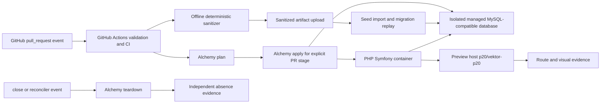

# Design spec 0020 — automated pull request preview delivery

## Metadata

| Field | Value |
|---|---|
| Stable ID | `0020` |
| Status | **Ready-for-review** — frozen intent; implementation has not started |
| Title | Automated pull request preview delivery |
| Owner | Preview delivery feature lead |
| Predecessor | PR #20, target `p20/vektor-p20` |
| Successor | PR #21, stacked on PR #20 |
| First target | `p20/vektor-p20` |
| Migration development host | `vektor.phibkro.org` |
| Forbidden production host | `vektorprogrammet.no` |
| Journey count | One pull request preview journey, including open, update, close, reconcile, and orphan cleanup |
| Current worktree | `/tmp/mono-web-pr-preview-0020-20260812` |

This file is the frozen intent for PR #21. It does not claim an implementation, provider access, a database, a deployed preview, a successful seed, or visual evidence. PR #21 will contain the implementation and the evidence required by this contract.

## Goal, constraints, and values

### Goal

Give a pull request author and reviewer one disposable, production-like preview for the exact pull request revision. The preview must run the current Symfony application in a PHP-capable container. It must use an isolated MySQL-compatible database with a deterministic sanitized seed. GitHub Actions must own event handling and runner execution. Alchemy v2 must own Cloudflare resource declaration, stage identity, resource lifecycle, and CI-portable remote state.

The preview must expose the homepage and dashboard through the first target `p20/vektor-p20`. It must provide a route inventory with non-404 and basic-state observations. It must provide visual evidence for every page where visual behavior is in scope. Closing the pull request must remove the preview resources. A scheduled reconciler must find and remove orphaned stages.

### Constraints

1. PR #21 stacks on PR #20. The implementation starts from the PR #20 integration base and records the exact source revision. It must not silently replace the base.
2. The first target remains `p20/vektor-p20`. A new target name, host mapping, or stage mapping requires a reviewed revision of this spec.
3. GitHub Actions remains the event and runner authority. The workflow receives pull request events, checks out the requested revision, runs repository CI, invokes the preview delivery command, and records evidence.
4. Cloudflare Workflows and Cloudflare Builds are not runner authorities for this journey. They cannot replace full Bun and PHP repository CI, trusted pull request checkout policy, or close-event cleanup.
5. Alchemy v2 is the only Cloudflare resource declaration and lifecycle tool. It uses explicit deterministic stages and remote CI-portable state. A CI run must be able to resume or reconcile a stage without a developer's local state directory.
6. Cloudflare Containers can run PHP and the Symfony runtime. Container disk is temporary runtime storage only. It is never database authority.
7. A Durable Object can coordinate or route a container. A Durable Object is rejected as the relational database for this preview. Its SQLite storage does not implement the current Symfony/MySQL semantics.
8. D1 and Durable Object SQLite are not substitutes for the current MySQL-compatible database. The first complete preview needs one isolated managed MySQL-compatible database per preview, or another provider resource that implements the same relational semantics and receives a separate accepted architecture decision.
9. The current Symfony/PHP/MySQL line is authoritative for parity. A database-free shell, D1 translation, DO SQLite translation, or synthetic-only fallback is not a complete PR #21 preview.
10. The first preview is blocked until the full MySQL-compatible sanitized seed and Symfony container work. A homepage/dashboard synthetic API can be a separately scoped partial experiment, but it cannot pass this spec's DoD or be called production-like.
11. The production migration host is `vektor.phibkro.org`. The string and domain `vektorprogrammet.no` are forbidden in preview configuration, output, evidence, requests, DNS work, and deployment commands.
12. The sanitizer runs offline before any provider upload. It emits only a sanitized artifact. It never uploads a raw backup, raw SQL dump, raw database file, raw log, or unreviewed extract.
13. The sanitizer is deterministic and fail-closed. It uses an explicit schema and column transform policy, a fixed clock, stable surrogate identifiers, and a complete relationship policy. It preserves schema shape and representative counts and distributions within the accepted seed report.
14. A complete attempt counter permits at most two complete delivery attempts for one pull request preview. A third attempt requires a reviewed spec revision. Re-running an idempotent step in the same attempt does not consume another attempt.
15. Cancellation is not teardown. A cancelled Actions run can leave a stage in `Deploying`, `Live`, or `Retiring`. The close workflow and orphan reconciler must repair that state. No design may rely on cancellation cleanup.
16. No credential, profile file, provider account identifier, production payload, personal data, or raw backup enters this repository or the evidence package. Provider credentials remain in GitHub environments or operator-controlled provider configuration.
17. No route cutover or production deployment is part of PR #21. The persistent non-production development host remains `vektor.phibkro.org`. `vektorprogrammet.no` remains outside every preview action.

### Values

| Value | Frozen interpretation |
|---|---|
| Provider honesty | A plan proves a plan, a deployment proves resource application, a request proves one runtime observation, and a browser run proves one user journey. No artifact proves more than its named claim. |
| One authority per concern | GitHub Actions owns events and runners. Alchemy owns Cloudflare resources and lifecycle. The managed MySQL-compatible service owns relational data. The sanitizer owns the sanitized seed artifact. The operator owns credentials and external authorization. |
| Deterministic delivery | The pull request number, source revision, target mapping, stage, artifact digest, resource names, and evidence identifiers are explicit. Hidden defaults are forbidden. |
| Fail closed | Missing credentials, missing provider capability, unknown schema, an unsafe column, a seed mismatch, an ambiguous route, a stale stage, or a cleanup failure blocks success. |
| Disposable isolation | Each preview has a stage and database that no other pull request can use. The stage expires or closes through a recorded lifecycle action. |
| Reversibility | The system can reconcile, retire, and remove one preview without account-wide cleanup or production changes. |
| Data minimization | The preview contains only the approved sanitized artifact and required synthetic configuration. Evidence contains metadata, counts, digests, and bounded route results, not raw payloads. |

## Current observations and source references

These observations are inputs to the design. They are not implementation evidence for PR #21.

| ID | Observation | Source |
|---|---|---|
| O-0020-01 | The current CI workflow runs TypeScript and PHP jobs for pushes to `main` and pull requests to `main`. It uses `actions/checkout`, Bun, Node 22, locked dependencies, and a PHP 8.4 job. Its concurrency group cancels in-progress runs. | `.github/workflows/ci.yml:1-41,67-95` |
| O-0020-02 | The current PHP CI database is SQLite in memory. The test Doctrine configuration selects `pdo_sqlite` and `:memory:`. This setup does not prove MySQL migration replay or production-like database behavior. | `apps/server/config/packages/test/doctrine.yaml:1-18`; `design-specs/0002-symfony-clean-checkout-bootstrap.md` §Current behavior and baseline |
| O-0020-03 | The current Symfony Dockerfile installs both `pdo_sqlite` and `pdo_mysql`. This supports a PHP container direction but does not prove a working preview image or database connection. | `apps/server/Dockerfile:1-13` |
| O-0020-04 | The current repository contains 72 Doctrine migration files. The migration set contains 71 MySQL-specific guards or constructs in the reviewed research snapshot. The migration set includes MySQL-specific types and DDL such as `AUTO_INCREMENT`, InnoDB, charset/collation, `MODIFY`, `CHANGE`, `ENUM`, and foreign-key operations. | `apps/server/migrations/*.php`; migration research record for PR #21 |
| O-0020-05 | The current test bootstrap creates schema and fixtures for SQLite. It does not execute the production migration chain. | `apps/server/tests/bootstrap.php`; `design-specs/0002-symfony-clean-checkout-bootstrap.md` §SQLite boundary |
| O-0020-06 | The current Alchemy declaration uses `Alchemy.localState()` and a `Cloudflare.Website.Vite` homepage resource. Local state is not portable between independent CI runners. | `infra/alchemy/alchemy.run.ts:1-29`; Alchemy v2 local-state source observation |
| O-0020-07 | Alchemy v2 stages are explicit isolated names, and destroy uses the same stage. Alchemy Cloudflare resources expose worker URLs and domain/route outputs. | [Alchemy stages](https://alchemy.run/environments/stages/); [Alchemy Cloudflare Worker source](https://github.com/sst/alchemy); reviewed Alchemy v2 source |
| O-0020-08 | Cloudflare Workflows provide durable Worker orchestration. They do not provide repository checkout or arbitrary full Bun and PHP CI. Cloudflare Builds provides a Workers build trigger surface, not this repository's complete CI and close-event cleanup contract. | [Cloudflare Workflows](https://developers.cloudflare.com/workflows/); [Cloudflare Builds API](https://developers.cloudflare.com/workers/ci-cd/builds/api-reference/) |
| O-0020-09 | Cloudflare Workers do not provide a PHP runtime. Cloudflare Containers can run a PHP image, but container disk cannot serve as relational database authority. | [Workers languages](https://developers.cloudflare.com/workers/runtime-apis/web-standards/); [Cloudflare Containers](https://developers.cloudflare.com/containers/) |
| O-0020-10 | D1 imports require SQLite-compatible SQL conversion. D1 is not a direct MySQL or PostgreSQL import target. Durable Object SQL storage is SQLite storage private to each object. | [D1 import/export](https://developers.cloudflare.com/d1/best-practices/import-export-data/); [D1 limits](https://developers.cloudflare.com/d1/platform/limits/); [Durable Object SQLite storage](https://developers.cloudflare.com/durable-objects/api/sqlite-storage-api/) |
| O-0020-11 | Existing fixture loaders contain PII-shaped values and time or random sources. They are not an approved production seed. | `apps/server/src/App/Support/DataFixtures/ORM/`; sanitizer research record for PR #21 |
| O-0020-12 | Existing homepage host mapping uses `vektor.phibkro.org` for development and reserved `p000` local proof. This spec retains `vektor.phibkro.org` and the separate first target `p20/vektor-p20`; it does not change the existing host authority. | `apps/homepage/src/lib/host.ts:1-47` |
| O-0020-13 | The lifecycle requires a live spec, bounded capsule, objective evidence, independent review, and operator authority for external effects. Runtime, deployment, database, and UI evidence have separate limits. | [`docs/agentic-development-lifecycle.md`](../../docs/agentic-development-lifecycle.md) §§2, 4–6, 9; [`docs/product-lead-charter.md`](../../docs/product-lead-charter.md) §§1–5, 7, 9–12 |

The observations above do not contain credentials, raw backup values, production identifiers, or personal data. A source disagreement enters `Drift`; it does not weaken this contract.

## Architecture decision

### Decision

Use GitHub Actions as the event and runner authority. Use Alchemy v2 as the Cloudflare declaration and resource lifecycle authority. Run Symfony in a Cloudflare Container. Provision one isolated managed MySQL-compatible database per preview, with database credentials supplied at the runtime boundary. Store sanitized seed artifacts in an encrypted provider-controlled artifact store with a short retention period. Use Alchemy remote CI-portable state for deterministic stage reconciliation. Use a Durable Object only when a later implementation proves that coordination or routing needs it; it must not own application relational data.

The preview graph is:

### Rejected alternatives

| Alternative | Decision | Reason |
|---|---|---|
| Cloudflare Workflows as CI runner | Reject | It cannot perform full repository checkout and full Bun plus PHP CI. It cannot replace GitHub's pull request event, permission, and artifact evidence model. |
| Cloudflare Builds as CI runner | Reject | It provides a Workers build trigger and preview surface. It does not provide the complete Symfony/MySQL CI, sanitizer, migration, route inventory, close teardown, and orphan reconciliation contract. |
| Durable Object SQLite as application database | Reject | DO SQL is SQLite per object. The current Symfony schema and migration semantics require MySQL-compatible relational behavior. DO storage also creates a different authority and transaction model. A DO can coordinate or route a container only. |
| D1 as application database | Reject | D1 requires SQLite SQL conversion and has D1-specific limits. A conversion would change the current MySQL parity contract. |
| Container filesystem as database | Reject | Container disk is ephemeral and is not a durable relational authority. |
| SQLite test configuration as preview database | Reject | The test path uses `pdo_sqlite`, in-memory schema creation, and fixture bootstrap. It does not prove the current migration and MySQL contract. |
| Raw production backup upload | Reject | It violates the seed safety law and exposes data that the preview does not need. |
| Synthetic API fallback for a complete preview | Reject | It hides the missing Symfony/MySQL behavior and would make a false production-like claim. |

### Provider and credential blockers

The following inputs are mandatory. A missing input blocks the preview and records a named `NeedsOperator` state. The implementation must not substitute a dummy value or silently use a default.

| Blocker | Required operator-owned input | Failure result |
|---|---|---|
| GitHub | Actions permissions for pull request events, artifacts, environments, and the required repository checks | Workflow cannot start or cannot publish bounded evidence |
| Cloudflare account | Account authority for the non-production stage, Containers, network, artifact storage, and the target `phibkro.org` mapping | Plan or apply stops before provider mutation |
| Cloudflare token | Least-privilege token or profile for the named Alchemy actions | Credential preflight fails without printing the value |
| Alchemy state | Remote state backend and access that every CI runner can use for the explicit stage | CI portability is not proven; apply is blocked |
| Container registry | Registry read authority for the PHP/Symfony image and the exact image digest | Container build or pull is blocked |
| MySQL provider | Isolated MySQL-compatible database capability, region, network, TLS, quotas, and per-preview credentials | Full preview is blocked; no SQLite substitution is legal |
| Sanitized source | Operator-approved source backup and schema/column policy | Sanitizer cannot start or cannot emit an artifact |
| DNS/TLS | Authority for the non-production preview mapping and certificate lifecycle | Runtime reachability is blocked; production is never used |
| Retention and cleanup | Provider retention policy for artifact, database, stage, and logs | Teardown and data minimization are not proven |

Provider blockers are not implementation defects. The PR must record them without revealing credentials or provider account identifiers. No account-wide cleanup command is permitted.

## Event and state machine

### Events

| Event | Required action | Safety rule |
|---|---|---|
| `pull_request.opened` | Create or reconcile the preview for the requested revision | Use the explicit PR stage and the exact head SHA. |
| `pull_request.reopened` | Reconcile the preview | Do not create a second stage. |
| `pull_request.synchronize` | Retire the prior revision's deployment state, then deploy the new revision | The stage remains unique to the pull request. Evidence names both old and new SHAs. |
| `pull_request.closed` | Run trusted close teardown for the stage | Teardown does not execute untrusted PR code. It uses base-branch workflow code and explicit stage identity. |
| `workflow_dispatch` with `reconcile` | Reconcile named or discovered stale stages | The command is idempotent and stage-scoped. |
| `workflow_dispatch` with `main-dev` | Deploy the exact approved source to `vektor.phibkro.org` | This is non-production development only. It never targets `vektorprogrammet.no`. |
| `schedule` orphan scan | Find stages whose PR is closed, missing, stale, or absent from the current ownership index | Remove only stages that match the safe orphan predicate. |
| Actions cancellation | Leave the stage for close teardown or reconciliation | Cancellation is not teardown and never proves absence. |

### States

| State | Entry condition | Observable state | Legal next states |
|---|---|---|---|
| `Absent` | No active stage exists | No preview resource is reachable, and absence evidence is recorded when required | `Requested` |
| `Requested` | Open, reopen, synchronize, dispatch, or reconcile event arrives | Event identity, PR number, head SHA, target, and attempt record exist | `Validating`, `NeedsOperator`, `Failed` |
| `Validating` | Actions runner has checked out the exact revision | Repository CI, policy, route manifest, and stage guards run | `SeedReady`, `NeedsOperator`, `Failed` |
| `SeedReady` | Sanitizer emits an approved artifact and digest | Artifact manifest, transform policy version, counts, distributions, and scan report exist | `Planned`, `NeedsOperator`, `Failed` |
| `Planned` | Alchemy plan and dependency checks pass | Plan names only the expected stage resources and no production target | `Applying`, `NeedsOperator`, `Failed` |
| `Applying` | Approved mutating action starts | Attempt ID and provider operation identifiers are recorded | `Seeding`, `NeedsOperator`, `Failed`, `Retiring` |
| `Seeding` | Container and database exist | Migration replay and sanitized import run against the isolated database | `Live`, `NeedsOperator`, `Failed`, `Retiring` |
| `Live` | Runtime and route checks pass | Preview URL, health, route census, and browser evidence identify the exact SHA and stage | `Retiring`, `Applying` for a synchronize event, `Failed` |
| `Retiring` | Close, synchronize replacement, expiry, or cleanup starts | Teardown runs against the same explicit stage and state | `Absent`, `NeedsOperator`, `Failed` |
| `NeedsOperator` | Credentials, provider capability, state, or approval is missing | No hidden retry or fallback occurs | `Requested`, `Planned`, `Retiring`, `Failed` after operator action |
| `Failed` | A falsifier or non-recoverable operation fails | Failure code, sanitized evidence, and current stage state exist | `Requested` only through a counted attempt or reviewed revision; `Retiring` for cleanup |

A state transition is valid only when the preceding state and event are present in remote state. An event replay must produce the same state and resource identity. A missing or conflicting state record is `NeedsOperator`, not a new default stage.

## Attempt counter and retry law

The attempt counter is per pull request, target mapping, and source revision family. Remote state stores:

- `prNumber`;
- target `p20/vektor-p20`;
- source head SHA;
- stage name;
- attempt number;
- attempt status;
- first and last timestamps;
- Alchemy operation identifiers;
- artifact digest;
- terminal cleanup observation.

The counter law is:

1. Start at `0` in `Requested`.
2. Increment atomically to `1` or `2` immediately before the first mutating provider call for that attempt.
3. Count an attempt as complete only after it reaches `Live` and then reaches `Absent`, or after a failed mutating operation reaches a terminal cleanup observation.
4. Resume an interrupted attempt by its attempt ID. Do not increment for idempotent polling, plan-only work, evidence collection, or a close teardown for the same attempt.
5. A cancellation after increment leaves the attempt open. Reconcile it before another mutating attempt starts.
6. Refuse a third mutating attempt. Record `AttemptLimitExceeded` and require a reviewed spec revision or explicit product-lead disposition.
7. Never reset the counter by deleting local state, changing a branch name, changing a workflow run, or creating a second stage.

An attempt is not complete when an Actions job merely exits, when a provider call returns, or when a deployment log exists. The stage must be reconciled and its cleanup status must be known.

## Sanitized seed safety law

The sanitizer is a separate offline boundary. It receives an operator-approved source backup through a controlled input path. It never runs in a pull request container with provider credentials and never reads a production network endpoint.

### Required transform policy

1. Freeze a policy version and a fixed clock before reading the source.
2. Allow only named tables, columns, types, and relationships. Reject an unknown table, column, type, or relationship.
3. Preserve the schema shape required by Symfony and Doctrine. Preserve foreign-key relationships and representative row counts and distributions recorded in the seed report.
4. Replace person, contact, account, address, authentication, token, photo, free-text, and external-identifier values with deterministic neutral values. Use stable surrogate IDs derived from a documented local mapping, not source identifiers.
5. Replace timestamps with values derived from the fixed clock and deterministic row ordinals. Do not call a random source, current time, network, or external service.
6. Preserve enum and status distributions that the named preview journeys need. Do not create a success state that the source policy does not allow.
7. Emit a canonical artifact manifest containing policy version, schema version, source snapshot identifier, row counts, bounded distributions, transform counts, and SHA-256 digests. Do not include raw row values.
8. Scan the emitted artifact and all evidence output for forbidden fields, source identifiers, names, emails, phone numbers, passwords, secrets, photos, and raw SQL values. A scan error fails the run.
9. Store temporary import databases and intermediate files outside the repository. Delete them after the sanitizer and record the deletion result. A cleanup failure blocks completion.
10. Upload only the sanitized artifact. Encrypt it in transit and at rest. Apply a short retention period and delete it after the preview stage is absent.
11. Never upload a raw backup, raw SQL dump, raw database file, raw fixture export, source archive, or unbounded log.

### Seed acceptance predicates

A seed passes only when all predicates are true:

- the policy digest matches the reviewed policy;
- the artifact digest is stable across two complete offline runs with the same input and policy;
- the schema manifest matches the Symfony migration and ORM boundary selected for this preview;
- row counts and named distributions match the accepted report;
- all required foreign-key and uniqueness checks pass in the MySQL-compatible database;
- migration replay reaches a terminal success state;
- the forbidden-data scan returns zero findings;
- no raw source file enters the artifact or evidence directory;
- temporary files are absent after cleanup.

A mismatch is a seed failure. The implementation must not edit the expected report to make a mismatch pass.

## Exact maintainer and reviewer journey

This is the one executable journey for PR #21. The implementation PR must record sanitized evidence for every step. The current spec records no execution.

### Phase 0 — Freeze the source and authority

1. Start from a clean worktree for PR #21 stacked on PR #20.
2. Record the exact PR #20 base SHA, PR #21 head SHA, worktree, branch, and target mapping `p20/vektor-p20`.
3. Confirm that PR #20 has green required checks for its declared scope. If PR #20 is not green, stop before preview mutation.
4. Confirm that the operator has recorded non-production authority for the named Cloudflare account, stage, database, artifact store, DNS/TLS mapping, and retention window.
5. Confirm that no repository or evidence path contains credentials, provider profiles, production identifiers, or raw backup data.

### Phase 1 — Receive the pull request event

6. Open or update the pull request and observe the GitHub Actions run for `opened`, `reopened`, or `synchronize`.
7. Confirm that the run uses the exact head SHA and the explicit target `p20/vektor-p20`.
8. Confirm least-privilege workflow permissions and that untrusted pull request code does not execute in the trusted close-cleanup workflow.
9. Confirm the concurrency group prevents two deploy mutators for the same PR stage. A replacement run must reconcile the prior state instead of assuming cancellation performed teardown.

### Phase 2 — Run repository CI and sanitize data

10. Run the repository's required Bun and PHP checks in GitHub Actions. Preserve failed statuses and their sanitized output.
11. Run the offline sanitizer with the fixed policy and fixed clock.
12. Run the sanitizer twice from the same approved source snapshot. Compare artifact digest, schema manifest, counts, distributions, and transform report.
13. Reject any raw or forbidden value. Upload only the sanitized artifact after the seed predicates pass.
14. Retain only the artifact manifest, digest, policy version, bounded counts, and safe operation identifiers in the PR evidence.

### Phase 3 — Plan and apply the isolated preview

15. Run Alchemy plan with explicit stage, profile, target, source SHA, and remote state configuration. The plan must contain the Symfony container, one isolated MySQL-compatible database, required artifact storage, the target preview mapping, and only the support resources needed by the accepted graph.
16. Reject a plan that contains `vektorprogrammet.no`, a production account or route, D1 or DO SQLite as the application database, a second PR stage, an account-wide cleanup, or an undeclared resource.
17. Start the first or second counted attempt only after the plan and operator approval pass.
18. Apply the plan through GitHub Actions. Record operation identifiers without recording credentials.
19. Run Symfony container boot, configuration, health, migration replay, and sanitized seed import against the isolated MySQL-compatible database.
20. Confirm that the container does not use container disk as database authority and that no application request reaches a production host.

### Phase 4 — Observe the preview

21. Resolve the exact preview URL for `p20/vektor-p20` and record DNS, TLS, response status, headers, and the source SHA shown by the application.
22. Run the complete route inventory generated from the homepage and dashboard route manifests. Each route must produce its required basic state, or an intentional application status that the route contract names. An unexpected `404`, redirect to production, blank response, or server error fails the journey.
23. Exercise `/health` or the accepted operational health endpoint. It must identify the target stage, source SHA, data-source class, and no-store behavior without exposing secrets or raw data.
24. Exercise representative homepage and dashboard pages. Capture browser status, console and page errors, hydration, client navigation, same-origin request inventory, forbidden request inventory, and the response status for each route.
25. Capture matched desktop and mobile screenshots for each route where visual evidence is applicable. Capture a video or equivalent recording for the complete named journey when the implementation lane requires it. Record viewport, browser, source SHA, stage, and evidence digest.
26. Do not accept a deployment log as a UI or route result. A route census without browser evidence does not prove visual behavior.

### Phase 5 — Close and reconcile

27. Close the pull request and observe the trusted close workflow. Confirm that it uses the same stage and remote state.
28. Run stage-scoped Alchemy teardown. Do not use an account-wide nuke or a guessed stage.
29. Independently check the preview URL, DNS, TLS certificate or route inventory, database, artifact store, and container resource after teardown. An empty provider list alone does not prove absence.
30. Run the scheduled orphan reconciler against a deliberately stale test stage under operator authority. Confirm that it removes only the safe orphan and leaves an active pull request stage unchanged.
31. Confirm that the cancelled-run scenario leaves a recoverable state and that reconciliation, not cancellation, performs cleanup.
32. Confirm the attempt counter, terminal state, artifact deletion, temporary-file cleanup, evidence digest, and worktree cleanliness.

The journey fails if any required phase is skipped, if a provider blocker is hidden, if a partial shell is called complete, or if a production host is touched.

## Evidence matrix

| Evidence ID | Artifact or observation | Required claim | Does not prove |
|---|---|---|---|
| E-0020-01 | PR #20 base and PR #21 head record | The implementation uses the intended stacked base and exact source SHA | Product parity or provider success |
| E-0020-02 | GitHub Actions run summary and sanitized logs | The declared Bun, PHP, policy, and workflow checks ran under GitHub Actions | A provider deployment or UI journey |
| E-0020-03 | Workflow event record | Open, reopen, synchronize, close, dispatch, and schedule events select the correct state path | Guaranteed cleanup after cancellation |
| E-0020-04 | Alchemy plan and remote-state record | The declared resource graph and explicit stage are deterministic and CI-portable | Resource reachability or domain semantics |
| E-0020-05 | Sanitizer manifest, policy digest, artifact digest, two-run comparison | The seed is deterministic, minimized, policy-compliant, and uploadable | Raw source safety beyond the scans performed |
| E-0020-06 | Migration replay and database report | The selected Symfony migration chain and sanitized seed run on the isolated MySQL-compatible database | All future schema versions or production data correctness |
| E-0020-07 | Container boot and health observation | PHP/Symfony runs against the selected database and reports safe provenance | Full application parity |
| E-0020-08 | Route inventory with response ledger | Named homepage and dashboard routes reach required basic states without unexpected 404s | Visual quality or all possible URLs |
| E-0020-09 | Browser console, pageerror, hydration, navigation, and request ledger | The named browser journey has no recorded browser failure or forbidden request | Unvisited user journeys |
| E-0020-10 | Matched screenshots and recording | The named visual journey is observable at recorded viewports and exact source SHA | Accessibility or product acceptance outside the captured states |
| E-0020-11 | Close teardown output and independent absence checks | The preview stage, database, artifact, route, and certificate effects are absent after close | Account-wide absence or unrelated stages |
| E-0020-12 | Orphan reconciler run | The scheduled repair removes a safe stale stage and preserves active stages | Recovery from every provider outage |
| E-0020-13 | Attempt ledger | No more than two complete attempts occur and cancellations do not reset the counter | Correctness of provider internals |
| E-0020-14 | Final path, secret, and raw-data scan | Only the allowed implementation paths changed and no sensitive data entered the repository or evidence | Secrets held outside the repository |

Evidence is sanitized before it enters the PR. Raw browser traces, raw network bodies, raw database output, raw backups, and credentials are deleted or retained only under an operator-controlled policy outside the repository.

## Falsifiers and drift handling

Each condition below falsifies this intent. The implementation must stop the affected path, preserve safe evidence, and create a `Drift` or `NeedsOperator` record. It must not weaken a predicate to continue.

- PR #21 does not stack on PR #20, or the first target is not `p20/vektor-p20`.
- PR #20 is not green, but preview mutation starts anyway.
- GitHub Actions is replaced by Cloudflare Workflows or Builds as event or runner authority.
- A trusted workflow checks out or executes untrusted pull request code during close cleanup.
- The workflow relies on cancellation to perform teardown.
- A synchronize event creates a second stage instead of reconciling the existing PR stage.
- The stage, target, source SHA, or remote-state key is implicit, mutable, or shared with another pull request.
- The attempt counter permits a third complete mutating attempt or resets after cancellation.
- Alchemy local state is the only state available to independent CI runners.
- A plan or request names `vektorprogrammet.no`, a production account, production DNS, production traffic, or production data.
- A plan uses D1, Durable Object SQLite, SQLite test storage, or container disk as application database authority.
- The Symfony container cannot boot against the selected MySQL-compatible database, or migration replay is omitted or replaced by schema creation.
- The managed MySQL-compatible database, network, TLS, credentials, or retention policy is missing and the workflow reports a complete preview anyway.
- The sanitizer reads a production network, calls an external service, uses the current clock, uses random data, or uses an unreviewed fixture loader.
- The sanitizer accepts an unknown table, column, relationship, or unsafe transform.
- The sanitizer output is different across identical runs, fails schema or relationship checks, contains forbidden values, or has unbounded counts.
- A raw backup, raw SQL, raw database file, raw fixture export, secret, profile, or personal data enters an upload, log, PR, artifact, or committed path.
- A raw backup upload succeeds even once. This is a security incident and a hard stop.
- The artifact is not encrypted, does not have a short retention period, or remains after the preview stage is absent.
- A page returns an unexpected 404, server error, blank state, production redirect, or forbidden network request.
- Route inventory covers only a hand-picked page set and omits the generated homepage or dashboard route manifest.
- Required visual evidence is absent, mismatched to the source SHA, or replaced by a deployment log.
- Close teardown uses a guessed stage, account-wide cleanup, or a different state key.
- Independent absence evidence is missing, or a database, artifact, container, DNS, route, or certificate remains after teardown.
- The orphan reconciler removes an active stage, misses a safe orphan, or cannot explain an unknown stage.
- A credential or provider blocker is hidden by a dummy value, default profile, synthetic account identifier, or partial shell.
- The worktree contains a path outside the ownership capsule, generated state, raw evidence, or secret material.

The feature lead links each falsifier to the source observation, runtime artifact, owner, and disposition. A changed product intent returns this spec to `Specified`; an implementation correction returns the lane to `Building` after review.

## Definition of done

PR #21 can claim completion only when every item below has objective evidence:

1. PR #20 is green at the recorded base, and PR #21 is a one-to-one stacked implementation PR for the frozen intent.
2. The exact target `p20/vektor-p20` deploys the exact PR #21 source SHA through GitHub Actions.
3. GitHub Actions handles open, reopen, synchronize, close, manual reconcile, main-development dispatch, and scheduled orphan reconciliation.
4. Alchemy v2 declares the required resources with explicit deterministic stages and CI-portable remote state.
5. The runtime uses a PHP-capable Symfony container and one isolated managed MySQL-compatible database per preview.
6. No Durable Object or D1 SQLite resource serves as application relational database authority. A DO, if present, only coordinates or routes.
7. The full Symfony migration and sanitized seed journey reaches a terminal success state on the selected database.
8. The sanitizer obeys the seed safety law, produces stable repeated digests, preserves the approved schema/count/distribution report, scans fail-closed, deletes temporary files, and uploads no raw backup.
9. The attempt ledger proves no more than two complete mutating attempts for the preview and proves that cancellation did not perform or imply teardown.
10. The route inventory covers the generated homepage and dashboard routes. Each required route has the accepted basic state and no unexpected 404 or forbidden request.
11. Browser evidence records status, console, pageerror, hydration, navigation, request, and failure observations for the named journey.
12. Visual evidence contains matched screenshots and, where applicable, a complete recording for the named desktop and mobile journeys. Evidence names viewport, browser, stage, source SHA, and digest.
13. Close teardown and independent absence checks prove that the preview stage, database, artifact, container, route, DNS/TLS, and certificate effects are absent.
14. The orphan reconciler removes a safe stale stage and preserves an active stage under a recorded test scenario.
15. No evidence, configuration, URL, request, log, or source path uses `vektorprogrammet.no`.
16. Provider and credential blockers are explicitly recorded. No secret, provider profile, production identifier, raw backup, or personal data enters the repository or PR evidence.
17. Independent code review and blind-first runtime verification pass against this frozen spec before any `Release-ready` discussion.
18. The implementation worktree is clean except for the committed PR #21 implementation paths and the expected ignored disposable state.

This DoD does not authorize production deployment, route cutover, data migration, or publication. It proves one bounded non-production preview journey only.

## File ownership capsule

### Current spec writer

| Field | Contract |
|---|---|
| Mutable path | `design-specs/0020-pr-preview-delivery.md` only |
| Base | Worktree `/tmp/mono-web-pr-preview-0020-20260812`, branch `feat/0020-pr-preview-delivery` |
| Allowed action | Create and commit this spec with message `docs(spec): define automated PR preview delivery` |
| Forbidden action | Any implementation, workflow, package, lockfile, app, server, database, provider, credential, DNS, artifact, route, or evidence mutation |
| Exit evidence | Exact commit SHA, exact file path, file SHA-256, and clean worktree report |

### Future PR #21 implementation writer

The future implementation writer receives a new capsule after this spec review. The writer may own only the paths named by that capsule, which must include the relevant GitHub Actions workflow, Alchemy declaration and state adapter, container/runtime files, sanitizer and seed policy, database provisioner adapter, route inventory/browser evidence harness, and tests. The writer must not edit this spec silently. Any change to the architecture, target, seed law, attempt law, provider authority, or production boundary returns through `Drift` and a reviewed spec revision.

The future writer must not mutate `vektorprogrammet.no`, the production database, raw backup storage, operator credentials, unrelated application domains, accepted domain laws, or another live spec. Generated build output, provider state, browser traces, raw logs, raw backups, and temporary databases are disposable and are not committed.

### Review and operator ownership

- The feature lead freezes the one-to-one PR and does not self-approve conformance.
- The blind-first verifier receives this spec, implementation, and objective evidence before author rationale.
- The operator owns credentials, provider actions, database cleanup, DNS/TLS actions, rollback, retention, and retirement.
- A provider action without recorded scope, actor, resource, time window, expiry, and revocation path is not authorized.

## Rollout and rollback plan

### Entry gate

Do not start the remaining rollout PRs until PR #20's `p20/vektor-p20` target is green for its declared checks, PR #21's complete preview journey passes, all linked Drift is closed, and the feature lead has frozen the one-to-one evidence package. The rollout plan is not a promise that these PRs exist or are implemented.

### Remaining nine PRs after p20 green

| Order | Future PR | Bounded purpose | Entry gate |
|---:|---:|---|---|
| 1 | PR #22 | Harden shared GitHub Actions event, permission, concurrency, and evidence contracts | PR #21 DoD and p20 green |
| 2 | PR #23 | Freeze the offline sanitizer policy, deterministic artifact format, and seed report | PR #22 green; source and policy review |
| 3 | PR #24 | Integrate the isolated MySQL-compatible provider and credential boundary | PR #23 green; provider authority recorded |
| 4 | PR #25 | Harden the Symfony PHP container, migration replay, health, and external-service guards | PR #24 green; database runtime evidence |
| 5 | PR #26 | Complete homepage and dashboard route inventory and browser failure ledger | PR #25 green; runtime route source stable |
| 6 | PR #27 | Add visual evidence capture, digest binding, and retention cleanup | PR #26 green; named visual journey stable |
| 7 | PR #28 | Add close teardown, cancellation recovery, attempt ledger, and orphan reconciliation | PR #27 green; stage lifecycle evidence |
| 8 | PR #29 | Run security, accessibility, data-minimization, and independent blind-first review | PR #28 green; no linked Drift |
| 9 | PR #30 | Run the final non-production rollout and rollback rehearsal for `vektor.phibkro.org` | PR #29 green; operator authority and release checklist |

Each PR remains one bounded journey or one bounded platform concern. No PR in this list can promote `vektorprogrammet.no`, replace Symfony/MySQL without a separate accepted decision, or upload a raw backup. If p20 becomes red, pause this list and return affected work to `Drift`.

### Rollback

1. If a preview runtime observation fails, stop new attempts and record the failed source SHA, stage, and evidence.
2. If the preview is unsafe or reaches a forbidden host, the operator revokes the named capability and runs stage-scoped teardown immediately.
3. Preserve the remote state and sanitized evidence needed for diagnosis. Delete raw or sensitive temporary material under the operator retention policy.
4. Verify database, artifact, container, DNS/TLS, route, and certificate absence independently.
5. Do not use account-wide cleanup. Do not alter production. Do not reset the attempt counter.
6. Product-lead disposition returns the lane to `Specified` when intent changes or to `Building` when implementation changes. A new attempt requires the remaining attempt budget; a third attempt requires a reviewed revision.

## Authority table

| Concern | Sole authority | Boundary |
|---|---|---|
| Program order | [`docs/product-lead-charter.md`](../../docs/product-lead-charter.md) | This spec applies the order; it grants no provider or production authority. |
| Lifecycle and gates | [`docs/agentic-development-lifecycle.md`](../../docs/agentic-development-lifecycle.md) | This spec names the journey and evidence; lifecycle status cannot be inferred from a workflow job. |
| Topology and persistence decision | Accepted architecture decision for PR #21, plus this frozen spec for the preview contract | A provider plan cannot replace an accepted architecture decision. |
| Pull request events and runners | GitHub Actions workflow and GitHub event contract | Actions does not own Cloudflare resource state or production credentials. |
| Cloudflare resource graph | Alchemy v2 declaration and remote CI-portable state | Alchemy does not prove runtime behavior or domain semantics. |
| PHP/Symfony runtime | The committed container image and Symfony source at the exact SHA | A container boot does not prove all routes or database parity. |
| Relational database | The isolated managed MySQL-compatible provider resource | Container disk, D1, and DO SQLite are not database authority. |
| Seed artifact | The versioned sanitizer policy and artifact manifest | The artifact is sanitized input, not a raw backup or production source of record. |
| User-visible route behavior | The application route contract and browser evidence for this journey | A route inventory does not prove accessibility or unvisited flows. |
| Visual behavior | Matched screenshots/recording and their provenance | A screenshot cannot prove provider teardown or database correctness. |
| External effects | Operator action record | This spec and a workflow do not grant standing authority. |
| Runtime truth | Operator observation record | A disagreement enters `Drift`; it is not edited away. |

## Drift log and review conditions

At this frozen revision there is no implementation result to accept. The following conditions remain explicit review holds rather than hidden assumptions:

- the exact managed MySQL-compatible provider and its Cloudflare network path;
- the exact sanitized seed source snapshot and approved schema/column transform policy;
- the exact Alchemy remote-state backend and least-privilege provider scopes;
- the exact target host mapping for `p20/vektor-p20` under the existing non-production domain;
- the exact Symfony container dependency and migration replay repair required by the current migration observations;
- the exact route inventory emitted by the final homepage and dashboard source;
- the exact visual evidence destination and retention window.

Each hold has a named blocker above. The implementation cannot hide a hold with a synthetic value or incomplete journey. A provider or source observation that conflicts with this contract requires a linked review and a status return through the lifecycle.

## Source index

- [`docs/agentic-development-lifecycle.md`](../../docs/agentic-development-lifecycle.md)
- [`docs/product-lead-charter.md`](../../docs/product-lead-charter.md)
- [`design-specs/0001-cloudflare-local-preview-spine.md`](./0001-cloudflare-local-preview-spine.md)
- [`design-specs/0005-cloudflare-alchemy-preview.md`](./0005-cloudflare-alchemy-preview.md)
- [`design-specs/0011-cloudflare-homepage-dev-deployment.md`](./0011-cloudflare-homepage-dev-deployment.md)
- [GitHub pull request events](https://docs.github.com/en/actions/reference/workflows-and-actions/events-that-trigger-workflows#pull_request)
- [GitHub workflow cancellation](https://docs.github.com/en/actions/reference/workflows-and-actions/workflow-cancellation)
- [GitHub workflow concurrency](https://docs.github.com/en/actions/reference/workflows-and-actions/workflow-syntax#concurrency)
- [GitHub workflow permissions](https://docs.github.com/en/actions/reference/workflows-and-actions/workflow-syntax#permissions)
- [Alchemy stages](https://alchemy.run/environments/stages/)
- [Alchemy CI](https://alchemy.run/environments/ci/)
- [Cloudflare Containers](https://developers.cloudflare.com/containers/)
- [Cloudflare Workflows](https://developers.cloudflare.com/workflows/)
- [Cloudflare Builds API](https://developers.cloudflare.com/workers/ci-cd/builds/api-reference/)
- [D1 import and export](https://developers.cloudflare.com/d1/best-practices/import-export-data/)
- [D1 limits](https://developers.cloudflare.com/d1/platform/limits/)
- [Durable Object SQLite storage](https://developers.cloudflare.com/durable-objects/api/sqlite-storage-api/)

## Frozen review statement

This document is the complete design contract for automated PR preview delivery in PR #21. It is ready for independent review. It contains no implementation claim. The first target remains `p20/vektor-p20`; the migration development host remains `vektor.phibkro.org`; `vektorprogrammet.no` is never a preview target. The preview is not complete until the Symfony container and full MySQL-compatible sanitized seed work against the current migration contract. No raw backup upload is legal. A maximum of two complete attempts applies. The remaining nine PRs wait for p20 green.
