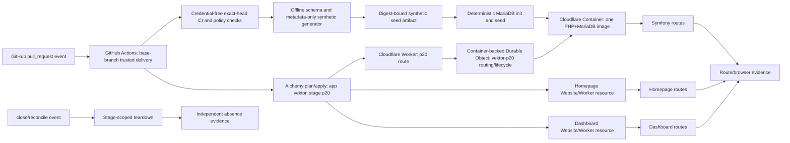

# Design spec 0020 — automated pull request preview delivery

## Metadata

| Field | Value |
|---|---|
| Stable ID | `0020` |
| Status | **Ready-for-review** — frozen intent; implementation has not started |
| Title | Automated pull request preview delivery |
| Owner | Preview delivery feature lead |
| Predecessor | PR #20, target `p20/vektor-p20` |
| Successor | PR #21, stacked on PR #20 |
| First target | `p20/vektor-p20` |
| Migration development host | `vektor.phibkro.org` |
| Forbidden production host | `vektorprogrammet.no` |
| Journey count | One pull request preview journey, including open, update, close, reconcile, and orphan cleanup |
| Current worktree | `/tmp/mono-web-pr-preview-0020-20260812` |

This file is the frozen intent for PR #21. It does not claim an implementation, provider access, a database, a deployed preview, a successful seed, or visual evidence. PR #21 has two ordered delivery phases in one contract: bootstrap authority lands on `main`, then the implementation runs against the exact PR #21 head. Until bootstrap lands, checks remain credential-free and plan-only. PR #21 will contain the implementation and the evidence required by this contract.

## Goal, constraints, and values

### Goal

Give a pull request author and reviewer one disposable, production-like preview for the exact pull request revision. The preview runs the current Symfony application in a PHP-capable Cloudflare Container image that also contains MariaDB for the first preview session. It uses a deterministic fully synthetic seed that implements the MySQL-compatible schema contract. GitHub Actions owns event handling and runner execution. Alchemy v2 owns Cloudflare resource declaration, stage identity, resource lifecycle, and CI-portable remote state.

The preview exposes the homepage and dashboard through the first target `p20/vektor-p20`. It provides a frozen route inventory with non-404 and basic-state observations, plus visual evidence for every page in scope. Closing the pull request removes the preview resources. A scheduled reconciler finds and removes only proven orphaned PR stages.

### Constraints

1. PR #21 stacks on PR #20. The implementation starts from the PR #20 integration base and records the exact source revision. It must not silently replace the base.
2. The first target remains `p20/vektor-p20`: logical target `p20`, Alchemy app `vektor`, Alchemy stage `p20`, canonical hostname `p20.vektor.phibkro.org`, and resource prefix `vektor-p20`. The host parser must preserve the existing three-digit grammar `p[0-9]{3}`, including reserved `p000`, `p001`, and `p999`, and add the bounded two-digit grammar `p[1-9][0-9]` for stages `10` through `99`; delivery allow-lists only `p20` for this spec. `p1000` remains invalid. PR #21 must preserve the existing host tests and add tests for `p20`, the two-digit bounds, `p000`, `p001`, `p999`, and rejection of `p1000`. Any other target, host, or stage mapping requires a reviewed revision of this spec.
3. GitHub Actions remains the event and runner authority. The workflow receives pull request events, checks out the requested revision for credential-free CI, invokes only trusted base-branch delivery tooling for provider mutation, and records evidence.
4. Cloudflare Workflows and Cloudflare Builds are not runner authorities for this journey. They cannot replace full Bun and PHP repository CI, trusted pull request checkout policy, or close-event cleanup.
5. Alchemy v2 is the only Cloudflare resource declaration and lifecycle tool. It uses the explicit stage `p20` and remote CI-portable state. A CI run must be able to resume or reconcile the stage without a developer's local state directory. Third-party Actions are pinned by full commit SHA.
6. The mandatory runtime path is `preview host -> Cloudflare Worker -> container-backed Durable Object -> Cloudflare Container -> Symfony`. The Worker and Durable Object own routing and container lifecycle only; they own no relational state. The stage's one isolated container image includes PHP/Symfony and MariaDB in the same container. The container filesystem and MariaDB data directory are temporary preview-session state, not a durable authority.
7. D1 and Durable Object SQLite are not substitutes for the current MySQL-compatible semantics. The Durable Object is mandatory for the Cloudflare Container binding, but its SQLite storage is not used by Symfony. A replacement of the container instance may lose mutations; the deterministic synthetic seed is rehydrated on the next stage boot. This limitation is preview-only and is recorded in health and evidence.
8. The selected first-preview architecture is container-local MariaDB: the PHP/MariaDB image and one exact `vektor-p20-container` instance provide MySQL-compatible relational behavior without an external database provider. No unresolved database-provider decision remains. Exact Cloudflare account, token, remote-state, registry, DNS/TLS, and retention availability remains a preflight blocker, not an architecture ambiguity.
9. The current Symfony/PHP/MySQL line is authoritative for parity. A database-free shell, D1 translation, DO SQLite translation, or synthetic-only application fallback is not a complete PR #21 preview.
10. The first complete preview needs the full Symfony container and the deterministic synthetic seed. A homepage/dashboard synthetic API can be a separately scoped partial experiment, but it cannot pass this spec's DoD or be called production-like.
11. `vektorprogrammet.no` is forbidden as a preview target, DNS or route target, deployment target, credentialed endpoint, or outbound runtime destination. Existing source references are recorded in O-0020-13; PR #21 must replace or override those values in rendered output and block egress to that host before route/browser evidence. Configuration, logs, and evidence must contain no such host.
12. A minimal base-trusted bootstrap workflow and tool must land on `main` before a credentialed preview of the exact PR #21 head can run. Until that bootstrap commit is merged, PR #21 runs credential-free CI and plan-only checks. After bootstrap merge and rebase, an immutable `main` reusable workflow builds the exact head in a credential-free job without provider secrets, produces a source/archive digest with fixed trusted commands, verifies the expected repository, head, and digest, and builds/promotes the container with base-owned Dockerfile/tooling. No untrusted lifecycle, synthetic seed generator, or deploy script executes with credentials. The bootstrap and implementation remain two delivery phases of one PR #21 contract.
13. The trusted delivery workflow consumes only a digest-bound image and the fully synthetic seed artifact. Provider credentials never enter the image, container environment, application runtime, or artifacts. Runtime egress is deny-by-default and limited to named non-production dependencies; the browser and container request ledger must assert zero requests to `vektorprogrammet.no`.
14. The synthetic seed generator runs from the reviewed schema and metadata-only seed contract. It emits no source rows, source identifiers, timestamps, relationship topology, or production-derived values. Raw backups remain local and unopened by CI. It emits exactly the accepted 65-table schema and exactly 45,955 synthetic rows, with minimum-cohort and privacy rules stated below.
15. The seed generator is deterministic and fail-closed. It uses an explicit schema and state policy, a fixed clock, stable synthetic identifiers, and generated relationships from schema constraints only. It preserves only the reviewed metadata count/distribution targets and named UI states; it never pseudonymizes or copies production topology.
16. A complete attempt counter permits at most two complete mutating apply attempts for one repository+PR preview ledger. A third attempt requires a reviewed spec revision. Re-running an idempotent step in the same attempt does not consume another attempt.
17. Cancellation is not teardown. A cancelled Actions run can leave a stage in `Applying`, `Seeding`, `Live`, or `Retiring`. The close workflow and orphan reconciler must repair that state. No design may rely on cancellation cleanup.
18. No credential, profile file, provider account identifier, production payload, personal data, or raw backup enters this repository or the evidence package. The operator owns credentials and external authorization; the trusted workflow uses only least-privilege secrets.
19. No route cutover or production deployment is part of PR #21. The persistent non-production development host remains `vektor.phibkro.org`; the separate migration-production deployment remains after p20 is green only under the already-granted operator authorization. `vektorprogrammet.no` remains outside every preview action.

### Values

| Value | Frozen interpretation |
|---|---|
| Provider honesty | A plan proves a plan, a deployment proves resource application, a request proves one runtime observation, and a browser run proves one user journey. No artifact proves more than its named claim. |
| One authority per concern | GitHub Actions owns events and runners. Base-branch delivery tooling owns trusted mutations. Alchemy owns Cloudflare resources and lifecycle. The container-local MariaDB instance owns preview-session relational state. The synthetic seed generator owns seed bytes. The operator owns credentials and external authorization. |
| Deterministic delivery | The repository, PR number, source revision, target mapping, stage, artifact and image digests, resource names, route-contract digest, and evidence identifiers are explicit. Hidden defaults are forbidden. |
| Fail closed | Missing credentials, missing provider capability, unknown schema, an unsafe seed rule, a seed mismatch, an ambiguous route, a stale stage, an unsafe orphan predicate, or a cleanup failure blocks success. |
| Disposable isolation | Each preview has one exact stage and one `vektor-p20-container` namespace that no other pull request can use. The stage expires or closes through a recorded lifecycle action. |
| Reversibility | The system can reconcile, retire, and remove one preview without account-wide cleanup or production changes. |
| Data minimization | The preview contains only the approved synthetic artifact and required synthetic configuration. Evidence contains metadata, counts, digests, and bounded route results, not source rows or raw payloads. |

## Current observations and source references

These observations are inputs to the design. They are not implementation evidence for PR #21.

| ID | Observation | Source |
|---|---|---|
| O-0020-01 | The current CI workflow runs TypeScript and PHP jobs for pushes to `main` and pull requests to `main`. It uses `actions/checkout`, Bun, Node 22, locked dependencies, and a PHP 8.4 job. Its concurrency group cancels in-progress runs. | `.github/workflows/ci.yml:1-41,67-95` |
| O-0020-02 | The current PHP CI database is SQLite in memory. The test Doctrine configuration selects `pdo_sqlite` and `:memory:`. This setup does not prove MySQL migration replay or production-like database behavior. | `apps/server/config/packages/test/doctrine.yaml:1-18`; `design-specs/0002-symfony-clean-checkout-bootstrap.md` §Current behavior and baseline |
| O-0020-03 | The current Symfony Dockerfile installs both `pdo_sqlite` and `pdo_mysql`. This supports a PHP container direction but does not prove a working preview image or database connection. | `apps/server/Dockerfile:1-13` |
| O-0020-04 | The current repository contains 72 Doctrine migration files. The migration set includes MySQL-specific types and DDL such as `AUTO_INCREMENT`, InnoDB, charset/collation, `MODIFY`, `CHANGE`, `ENUM`, and foreign-key operations; the 65-table preview schema must therefore retain MySQL semantics. | `apps/server/migrations/*.php`; `apps/server/src/App/` entity and mapping sources |
| O-0020-05 | The current test bootstrap creates schema and fixtures for SQLite. It does not execute the production migration chain. | `apps/server/tests/bootstrap.php`; `design-specs/0002-symfony-clean-checkout-bootstrap.md` §SQLite boundary |
| O-0020-06 | The current Alchemy declaration uses `Alchemy.localState()` and a `Cloudflare.Website.Vite` homepage resource. Local state is not portable between independent CI runners. | `infra/alchemy/alchemy.run.ts:1-29`; Alchemy v2 local-state source observation |
| O-0020-07 | Alchemy v2 stages are explicit isolated names, and destroy uses the same stage. Alchemy Cloudflare resources expose worker URLs and domain/route outputs. | [Alchemy stages](https://alchemy.run/environments/stages/); [Alchemy Cloudflare Worker source](https://github.com/sst/alchemy); reviewed Alchemy v2 source |
| O-0020-08 | Cloudflare Workflows provide durable Worker orchestration. They do not provide repository checkout or arbitrary full Bun and PHP CI. Cloudflare Builds provides a Workers build trigger surface, not this repository's complete CI and close-event cleanup contract. | [Cloudflare Workflows](https://developers.cloudflare.com/workflows/); [Cloudflare Builds API](https://developers.cloudflare.com/workers/ci-cd/builds/api-reference/) |
| O-0020-09 | Cloudflare Workers do not provide a PHP runtime. Cloudflare Containers can run a PHP image, but container disk cannot serve as relational database authority. | [Workers languages](https://developers.cloudflare.com/workers/runtime-apis/web-standards/); [Cloudflare Containers](https://developers.cloudflare.com/containers/) |
| O-0020-10 | D1 imports require SQLite-compatible SQL conversion. D1 is not a direct MySQL or PostgreSQL import target. Durable Object SQL storage is SQLite storage private to each object. | [D1 import/export](https://developers.cloudflare.com/d1/best-practices/import-export-data/); [D1 limits](https://developers.cloudflare.com/d1/platform/limits/); [Durable Object SQLite storage](https://developers.cloudflare.com/durable-objects/api/sqlite-storage-api/) |
| O-0020-11 | Existing fixture loaders contain PII-shaped values and time or random sources. They are not an approved production seed; the first preview uses a schema- and metadata-only synthetic generator instead. | `apps/server/src/App/Support/DataFixtures/ORM/`; `apps/server/migrations/*.php` |
| O-0020-12 | Existing homepage host mapping uses `vektor.phibkro.org` for development and reserved `p000` local proof. PR #21 preserves the `p[0-9]{3}` grammar, including `p001` and `p999`, adds bounded `p[1-9][0-9]` stages `10` through `99` for the `p20` target, rejects `p1000`, and must preserve and extend host tests. | `apps/homepage/src/lib/host.ts:1-47`; `apps/homepage/test/host.test.ts` |
| O-0020-13 | The committed source has existing production-host references that must not become preview targets or outbound requests: Symfony metadata templates, the admin metadata template, the dashboard fallback avatar, and the Symfony user-picture URL builder. PR #21 must replace or override those values in rendered output and block egress before observation. | `apps/server/templates/base.html.twig`; `apps/server/templates/adminBase.html.twig`; `apps/dashboard/app/routes/dashboard.tsx`; `apps/server/src/App/Identity/Infrastructure/UserService.php` |
| O-0020-14 | The lifecycle requires a live spec, bounded capsule, objective evidence, independent review, and operator authority for external effects. Runtime, deployment, database, and UI evidence have separate limits. | [`docs/agentic-development-lifecycle.md`](../../docs/agentic-development-lifecycle.md) §§2, 4–6, 9 (durable locator `/srv/share/projects/vektorprogrammet/docs/agentic-development-lifecycle.md`); [`docs/product-lead-charter.md`](../../docs/product-lead-charter.md) §§1–5, 7, 9–12 (durable locator `/srv/share/projects/vektorprogrammet/docs/product-lead-charter.md`) |

The observations above do not contain credentials, raw backup values, production identifiers, or personal data. A source disagreement enters `Drift`; it does not weaken this contract.

## Architecture decision
### Decision

Use GitHub Actions as the event and runner authority. Use reviewed base-branch delivery tooling and Alchemy v2 as the Cloudflare declaration and resource-lifecycle authorities. Build a digest-bound image containing Symfony/PHP and MariaDB, and deploy exactly one isolated `vektor-p20-container` instance for the first preview. The container-backed Durable Object is mandatory because it is the Cloudflare Container binding; it owns routing and lifecycle only, never relational data. Generate the fully synthetic seed offline from schema and metadata-only inputs, upload only its digest-bound artifact, and initialize MariaDB deterministically on first boot. Use Alchemy remote CI-portable state for deterministic stage reconciliation. Use a separate durable tombstone namespace for attempt state; stage destroy never selects it.

#### Frozen identity and resource contract

| Field | Frozen value |
|---|---|
| Repository | `vektorprogrammet/mono-web` |
| PR / logical target | `21` / `p20` |
| Alchemy app / stage | `vektor` / `p20` |
| Canonical hostname | `p20.vektor.phibkro.org` |
| Resource prefix / container instance | `vektor-p20` / exactly `vektor-p20-container` |
| Remote-state key | `vektor/p20` |
| Concurrency key | `preview-vektor-p20` |
| Cleanup selector | `app=vektor,stage=p20,pr=21,target=p20` and exact resource IDs recorded in the ownership manifest |
| Database identity | MariaDB namespace `vektor-p20` inside the exact `vektor-p20-container` instance; no external database resource |
| Source/image/seed binding | exact head SHA; image digest; synthetic artifact digest |
| Immutable provider resource IDs | Worker, container-backed Durable Object namespace/migration, Container image and instance, homepage, dashboard, route, DNS/TLS, and artifact resource IDs are recorded in the planned ownership manifest; the exact container instance is `vektor-p20-container` |

#### Accepted resource graph

The plan allow-list is exactly: Alchemy app/stage state, one Worker route, one container-backed Durable Object namespace and migration, one Cloudflare Container instance named exactly `vektor-p20-container`, one digest-bound PHP+MariaDB image reference, one homepage Website/Worker resource, one dashboard Website/Worker resource, the digest-bound synthetic artifact location, and the target hostname/route support resources. Each Worker, Durable Object, database, image, and frontend resource has an immutable provider ID recorded in the planned ownership manifest. No relational provider, raw-backup source, production route, account-wide resource, or undeclared resource is allowed. Teardown deletes only those exact IDs after equality and prefix membership checks; resource absence never deletes the attempt ledger or tombstone.

### Rejected alternatives

| Alternative | Decision | Reason |
|---|---|---|
| Cloudflare Workflows as CI runner | Reject | It cannot perform full repository checkout and full Bun plus PHP CI. It cannot replace GitHub's pull request event, permission, and artifact evidence model. |
| Cloudflare Builds as CI runner | Reject | It provides a Workers build trigger and preview surface. It does not provide the complete Symfony/MySQL CI, synthetic seed generation, migration, route inventory, close teardown, and orphan reconciliation contract. |
| Durable Object SQLite as application database | Reject | DO SQL is SQLite per object. The current Symfony schema and migration semantics require MySQL-compatible relational behavior. A DO can coordinate or route a container only. |
| D1 as application database | Reject | D1 requires SQLite SQL conversion and has D1-specific limits. A conversion would change the current MySQL parity contract. |
| Container-local MariaDB as application database | Adopt | It preserves the current MySQL-compatible Symfony contract inside the one isolated preview container. |
| Container filesystem as database | Reject | Container disk is ephemeral and is not a durable relational authority. |
| SQLite test configuration as preview database | Reject | The test path uses `pdo_sqlite`, in-memory schema creation, and fixture bootstrap. It does not prove the current migration and MySQL contract. |
| Raw production backup upload | Reject | It violates the seed safety law and exposes data that the preview does not need. |
| External generic relational provider or provider-specific substitution | Reject | It violates the adopted container-local MariaDB architecture and would change the MySQL-compatible preview contract. The one isolated container remains the relational authority. |
| Synthetic API fallback for a complete preview | Reject | It hides the missing Symfony/MySQL behavior and would make a false production-like claim. |

### Provider and credential blockers

The following inputs are mandatory. A missing input blocks the preview and records a named `NeedsOperator` state. The implementation must not substitute a dummy value or silently use a default.

| Blocker | Required operator-owned input | Failure result |
|---|---|---|
| GitHub | Actions permissions for pull request events, artifacts, environments, and the required repository checks | Workflow cannot start or cannot publish bounded evidence |
| Cloudflare account | Account authority for the non-production stage, Container, Worker, DO namespace, homepage/dashboard resources, and target `phibkro.org` mapping | Plan or apply stops before provider mutation |
| Cloudflare token | Least-privilege token or profile for the named Alchemy actions | Credential preflight fails without printing the value |
| Alchemy state | Remote state backend and access that every CI runner can use for app `vektor`, stage `p20` | CI portability is not proven; apply is blocked |
| Container registry | Registry read authority for the exact PHP+MariaDB image digest | Container pull is blocked; no mutable tag is accepted |
| Synthetic seed artifact | Digest-bound artifact produced from the reviewed schema/metadata contract | Seed initialization is blocked; raw source is never requested |
| DNS/TLS | Authority for the non-production preview mapping and certificate lifecycle | Runtime reachability is blocked; production is never used |
| Retention and cleanup | Provider retention policy for image, artifact, stage, container, route, and logs | Teardown and data minimization are not proven |

Provider blockers are not implementation defects. The PR must record them without revealing credentials or provider account identifiers. No account-wide cleanup command is permitted.

## Event and state machine

### Events

| Event | Required action | Safety rule |
|---|---|---|
| `pull_request.opened` | Enter `Requested`, then execute `Validating → SeedReady → Planned → Applying → Seeding → Live` | Same-repository only for credentialed preview; exact head SHA, target `p20`, and ledger key are explicit. |
| `pull_request.reopened` | Reconcile the existing PR stage through the same sequence when budget remains; after the cap, perform plan/evidence only | Never create a second stage or reset the ledger. |
| `pull_request.synchronize` | Enter `Retiring`, remove the prior revision, pass through `Absent → Requested`, then execute `Validating → SeedReady → Planned → Applying → Seeding → Live` for the new SHA | This is the only legal update path. It cannot jump directly to `Applying`. Open plus synchronize may consume the two total mutating attempts. |
| `pull_request.closed` | Enter `Retiring`, run trusted close teardown, then reach `Absent` | Uses base-branch workflow code and exact stage identity; close teardown does not consume an attempt. |
| `workflow_dispatch` with `reconcile` | Reconcile one named PR stage or run the safe orphan scan | Plan-only when no matching ledger exists; deletion requires the exact orphan predicate below. |
| `workflow_dispatch` with `main-dev` | Deploy exact approved source to persistent `vektor.phibkro.org` using the separate `main-dev` ledger | Manual dispatch and operator evidence are required. It has no preview teardown and does not consume the PR #21 ledger or cap. It never targets `vektorprogrammet.no`. |
| `schedule` orphan scan | Discover only candidate PR stages by prefix and ownership tags, then evaluate the exact predicate below | Non-PR, `main-dev`, unknown, conflicting, or API-error observations become `NeedsOperator`, never deletion. |
| Actions cancellation | Leave the stage for close teardown or reconciliation | Cancellation is not teardown and never proves absence or consumes a third mutation. |

### States

| State | Entry condition | Observable state | Legal next states |
|---|---|---|---|
| `Absent` | No active `vektor-p20` PR resources remain, or teardown has independently proved absence | Exact stage, generation, immutable ownership IDs, and absence checks are recorded; the attempt ledger and tombstone remain | `Requested`, `NeedsOperator` |
| `Requested` | Open, reopen, synchronize after `Absent`, or named reconcile event arrives | Repository, PR, head SHA, target, stage, ledger key, and attempt record exist | `Validating`, `NeedsOperator`, `Failed` |
| `Validating` | Trusted base-branch workflow has checked the exact head SHA in credential-free mode | CI, trust matrix, stage guards, route contract, egress policy, and resource identity checks exist | `SeedReady`, `NeedsOperator`, `Failed` |
| `SeedReady` | Reviewed schema/metadata-only generator emits the accepted synthetic artifact and digest | 65-table manifest, exactly 45,955 rows, cohort/privacy report, named UI states, and scan report exist | `Planned`, `NeedsOperator`, `Failed` |
| `Planned` | Alchemy plan and dependency checks pass against remote state | Exact allow-listed graph, digests, route contract, and no production target are recorded | `Applying`, `NeedsOperator`, `Failed` |
| `Applying` | Operator approval and remaining PR-wide attempt budget pass; the atomic ledger increment occurs immediately before the first mutating provider call | Attempt ID, source SHA, image/seed digests, and provider operation IDs exist | `Seeding`, `NeedsOperator`, `Failed`, `Retiring` |
| `Seeding` | Worker, container-backed DO, exact `vektor-p20-container`, homepage, and dashboard resources exist | MariaDB migration replay and deterministic seed initialization run inside `vektor-p20-container` | `Live`, `NeedsOperator`, `Failed`, `Retiring` |
| `Live` | Runtime, route, health, egress, and browser checks pass against the frozen contract | Host, exact SHA, image/seed digests, route ledger, request ledger, and visual evidence exist | `Retiring`, `Failed` |
| `Retiring` | Close, synchronize replacement, expiry, cancellation recovery, or safe orphan cleanup starts | Teardown runs against the same app/stage/generation and allow-list | `Absent`, `NeedsOperator`, `Failed` |
| `NeedsOperator` | Credentials, provider capability, trust approval, state, API observation, or cleanup proof is missing | No hidden retry, fallback, or deletion occurs | `Requested`, `Planned`, `Retiring`, `Failed` after explicit operator action |
| `Failed` | A falsifier or non-recoverable operation fails | Failure code, sanitized evidence, ledger, and current stage state exist | `Requested` only through the same ledger and remaining budget; `Retiring` for cleanup |

A transition is valid only when the preceding state, event, exact ledger key, and remote-state generation are present. Synchronize must complete `Live → Retiring → Absent → Requested → Validating → SeedReady → Planned → Applying → Seeding → Live`; no shortcut is legal. Replayed events preserve the same resource identity. Missing, conflicting, stale, or unverified state is `NeedsOperator`, not a new default stage.

### Safe orphan predicate and TTL

The scheduled reconciler may delete only a stage satisfying every condition: (a) the candidate belongs to the exact immutable provider IDs in the planned resource ownership manifest, resource name is the exact `vektor-p20-container` or an explicitly recorded companion ID with prefix `vektor-p20-`, stage is exactly `p20`, and ownership tags are `app=vektor`, `stage=p20`, `pr=21`, `target=p20`; (b) the authenticated GitHub API reports the owning PR closed; (c) that closed observation succeeds twice, with observations at least one hour apart; (d) remote Alchemy state generation is unchanged between those observations; (e) no active deploy, teardown, or reconcile lease exists; (f) every selected resource is in the stage plan allow-list; and (g) the exact orphan TTL of 24 hours since the first successful closed observation has elapsed. Candidate discovery uses the prefix only to find candidates; deletion uses exact IDs, exact equality, and the recorded prefix membership.

An unknown/non-PR/main-dev stage, missing or conflicting ownership tag, API timeout/error, unknown PR, missing/corrupt remote state, generation change, active lease, non-allow-listed resource, resource without an exact ownership-manifest ID, or resource with a prefix but no exact ID match is `NeedsOperator` and is never deleted. Compare-and-delete must use the observed generation and exact selectors. `vektor.phibkro.org` and all other non-PR resources are permanently out of scope.

The mutating attempt ledger key is exactly `(repository, pullRequestNumber, target=p20, stage=p20)`. Source head SHA is recorded on each ledger row but is never part of the key and never resets the counter. A separate `(repository, target=main-dev, stage=main-dev)` ledger is used only by explicit manual main-dev dispatch and is not subject to the PR #21 budget.

The attempt ledger is a separate remote durable-state namespace. Alchemy stage destroy never selects or deletes that namespace. A tombstone records the PR identity, target, stage, last known generation, terminal state, and close time, and remains retained for at least 30 days through close and reopen. Initialize a ledger or tombstone only when the exact key is absent. Resource absence never deletes either record. Operator deletion of a ledger or tombstone requires a separate explicit authorization and evidence.

Remote state stores the ledger key, source head SHA, stage, generation, attempt number/status, first/last timestamps, image and seed digests, Alchemy operation identifiers, route-contract digest, lease, and terminal cleanup observation. Initialize the PR ledger to `0` only when no row exists for this exact key. Re-entry to `Requested`, branch rename, workflow change, cancellation, SHA change, local-state deletion, or second-stage creation never resets it.

The PR counter law is:

1. Increment atomically to `1` or `2` immediately before the first mutating apply call. Opening and synchronize may consume the two total mutating attempts.
2. Count an attempt complete only after it reaches `Live` and then `Absent`, or after a failed mutating operation reaches terminal cleanup observation.
3. Resume an interrupted attempt by its attempt ID. Polling, plan-only work, evidence collection, close teardown, cancellation rehearsal, and pure event-handler tests do not consume an attempt.
4. After attempt `2`, refuse every new mutating apply for every later SHA, including reopen; record `AttemptLimitExceeded` and allow only plan/evidence/reconciliation until a reviewed spec revision or explicit product-lead disposition.
5. A cancellation after increment leaves the attempt open. Reconcile it before another mutating attempt starts. Cancellation never performs or implies teardown.

An attempt is not complete when an Actions job exits, a provider call returns, or a deployment log exists. Stage absence and cleanup status must be known.

## Synthetic seed safety law

The seed is generated offline from the reviewed Symfony schema, migration metadata, and metadata-only count/distribution targets. It never opens, mounts, parses, or receives a raw backup. Raw backups remain local and unopened by CI. The generator runs in credential-free trusted tooling, emits a digest-bound synthetic artifact, and never uses source rows, source identifiers, source timestamps, source relationship topology, or production-derived values.

### Required synthetic seed policy

1. Freeze the policy version, schema version, fixed clock, deterministic generator seed, and named UI-state fixtures before generation.
2. Generate exactly the reviewed 65-table schema, including MySQL-compatible types, keys, indexes, constraints, enum/status domains, and exactly 45,955 rows. A count or schema mismatch fails closed.
3. Generate relationships only from schema foreign-key constraints and deterministic synthetic graph rules. Never copy production foreign-key values, graph neighborhoods, row order, identifiers, timestamps, or topology.
4. Generate neutral values for person, contact, account, address, authentication, token, photo, free-text, and external-identifier fields. Every identifier is synthetic and namespace-bound to `vektor-p20`; no generated value may match a source value.
5. Use only the fixed clock and deterministic row ordinals. Do not call a random source, current time, network, external service, or source-data loader.
6. Match only the reviewed metadata distributions needed by the named UI states. Each cohort, status, and relationship cell has a minimum size of 10; sensitive or potentially identifying combinations are generalized or omitted. No evidence exposes cells below 10.
7. Include named homepage and dashboard states: empty, populated, loading-safe, validation-error, authorization-denied, and not-found handling where the route contract requires them. State fixtures contain no production-derived values.
8. Emit a canonical manifest containing policy/schema versions, generator seed, table/column counts, total row count, bounded distributions, UI-state names, transform/generation counts, and SHA-256 digests. It must contain no raw row values.
9. Scan the artifact and evidence for forbidden fields, source identifiers, names, emails, phone numbers, passwords, secrets, photos, raw SQL, and host references. A scan error fails the run. Verify synthetic namespace uniqueness and zero source-value overlap against the reviewed forbidden-value corpus without opening a raw backup in CI.
10. Run schema, foreign-key, uniqueness, minimum-cohort, and deterministic replay checks against the container-local MariaDB instance. Delete temporary import databases and intermediate files after generation/import; cleanup failure blocks completion.
11. Upload only the encrypted, digest-bound synthetic artifact. Apply the exact short retention TTL of 24 hours and delete it after the preview stage is absent.

### Seed acceptance predicates

A seed passes only when all predicates are true:

- the policy and schema digests match this spec and the reviewed 65-table manifest;
- two complete offline generations with the same policy and generator seed produce identical artifact and manifest digests;
- the artifact contains exactly 65 tables and exactly 45,955 rows;
- generated foreign-key, uniqueness, enum/status, minimum-cohort, and named UI-state checks pass in MariaDB;
- no source row, identifier, timestamp, relationship topology, raw value, forbidden host, credential, or personal data enters the artifact or evidence;
- source-value overlap and rare-cell/linkage checks return zero findings;
- migration replay reaches terminal success against MariaDB;
- no raw source file enters the artifact or evidence directory and all temporary files are absent after cleanup.

A mismatch is a seed failure. The implementation must not edit the expected schema, count, distribution, privacy, or UI-state report after observation to make a mismatch pass.

## Exact maintainer and reviewer journey

This is the one executable journey for PR #21. The implementation PR must record sanitized evidence for every step. The current spec records no execution.

### Frozen route contract

Before any `Live` observation, PR #21 must commit and review a deterministic route contract generated from the homepage and dashboard source manifests. The contract names every route, expected basic state or intentional application status, visual-evidence scope, and source-manifest digest. The generator may be deterministic, but the reviewed committed contract is authoritative for the run. It cannot be widened, weakened, or edited after an observation to make a mismatch pass; any route-source or expected-status change returns to `Drift` and requires a reviewed spec decision.

### Phase 0 — Freeze the source and authority

1. Start from a clean worktree for PR #21 stacked on PR #20.
2. Record the exact PR #20 base SHA, PR #21 head SHA, worktree, branch, identity table, and target mapping `p20/vektor-p20`.
3. Confirm that PR #20 has green required checks for its declared scope. If PR #20 is not green, stop before preview mutation.
4. Confirm preflight authority for the Cloudflare account/token, Alchemy remote state, exact image registry digest, DNS/TLS mapping, artifact retention, and cleanup. No external database provider or raw backup access is required.
5. Confirm that no repository or evidence path contains credentials, provider profiles, production identifiers, personal data, or raw backup data. Raw backups remain local and unopened by CI.

### Phase 1 — Receive the pull request event

6. Open or update the same-repository pull request and observe the GitHub Actions run for `opened`, `reopened`, or `synchronize`; fork PRs remain CI/plan-only unless the operator approves that exact SHA.
7. Confirm that credential-free CI uses the exact head SHA, while trusted provider mutation uses base-branch tooling and the explicit target `p20/vektor-p20`.
8. Confirm least-privilege workflow permissions, full-SHA action pins, no raw backup or provider credential in untrusted jobs, and no untrusted pull request code in trusted close cleanup.
9. Confirm the concurrency group prevents two deploy mutators for `vektor-p20`. A replacement run must reconcile the prior state instead of assuming cancellation performed teardown.

### Phase 2 — Run repository CI and generate data

10. Run the repository's required Bun and PHP checks in credential-free GitHub Actions. Preserve failed statuses and sanitized output.
11. Run the reviewed schema/metadata-only synthetic generator with the fixed policy, fixed clock, deterministic generator seed, 65-table manifest, minimum-cohort rules, and named UI states.
12. Run generation twice with identical inputs. Compare artifact digest, schema manifest, exact 45,955-row count, distributions, cohort/privacy report, UI-state report, and generator manifest.
13. Reject any source row, source identifier, source timestamp, copied topology, forbidden value, secret, personal data, or forbidden host. Upload only the encrypted digest-bound synthetic artifact after all predicates pass.
14. Retain only the artifact manifest, digest, policy/schema versions, bounded counts, route-contract digest, and safe operation identifiers in PR evidence.

### Phase 3 — Plan and apply the isolated preview

15. Run Alchemy plan with explicit app `vektor`, stage `p20`, target, source SHA, image digest, seed digest, remote state, route-contract digest, and exact allow-list. The plan must contain the Worker, container-backed Durable Object namespace/migration, one `vektor-p20-container` instance, digest-bound PHP+MariaDB image, homepage Website/Worker resource, dashboard Website/Worker resource, synthetic artifact location, target mapping, and only their support resources.
16. Reject a plan containing `vektorprogrammet.no`, a production account/route/credential/outbound destination, D1 or DO SQLite as application database, a second PR stage, an external generic relational provider or provider-specific database substitution, account-wide cleanup, mutable image tag, unpinned action, or undeclared resource.
17. Start the first or second counted attempt only after the plan, trust matrix, route contract, egress policy, and operator approval pass. Main-dev does not consume this ledger.
18. Apply the plan through trusted base-branch tooling in GitHub Actions. Record operation identifiers, resource tags, immutable ownership IDs, image/seed digests, and generation without recording credentials.
19. Boot the exact `vektor-p20-container` instance, start MariaDB, run Symfony migration replay, and initialize the synthetic seed deterministically. Health must state that MariaDB is container-local preview-session state and that replacement rehydrates the seed.
20. Confirm that the container-backed DO owns routing/lifecycle only, that no application request reaches `vektorprogrammet.no`, and that runtime egress is deny-by-default with only named non-production dependencies.

### Phase 4 — Observe the preview

21. Resolve `https://p20.vektor.phibkro.org` from the identity table and record DNS, TLS, response status, headers, and exact source/image/seed digests shown by the application.
22. Run every route in the committed route contract generated from the homepage and dashboard manifests. Each route must produce its frozen basic state or named intentional status. An unexpected `404`, redirect, blank response, server error, changed expected status, or production-host reference fails the journey.
23. Exercise `/health` or the accepted operational health endpoint. It must identify app `vektor`, stage `p20`, source SHA, image/seed digests, `container-local-mariadb`, and no-store behavior without secrets or raw data.
24. Exercise the homepage and dashboard routes. Capture browser status, console/page errors, hydration, client navigation, same-origin request inventory, egress-denial inventory, and zero-request assertion for `vektorprogrammet.no`.
25. Capture matched desktop and mobile screenshots for each route where visual evidence is applicable. Capture a video or equivalent recording for the complete named journey when the implementation lane requires it. Record viewport, browser, source/image/seed digests, stage, route-contract digest, and evidence digest.
26. Do not accept a deployment log as a UI or route result. A route census without browser evidence does not prove visual behavior.

### Phase 5 — Close and reconcile

27. Close the pull request and observe the trusted close workflow. Confirm that it uses the same app/stage, remote-state key, generation, and base-branch tooling.
28. Run stage-scoped Alchemy teardown. Do not use an account-wide nuke or a guessed stage. Delete the Worker, DO namespace, Container, image/namespace resources, homepage, dashboard, route, DNS/TLS mapping, and synthetic artifact by exact selectors.
29. Independently check the preview URL, DNS, TLS certificate or route inventory, container/image resources, artifact location, and remote state after teardown. An empty provider list alone does not prove absence.
30. Run pure event-handler tests for open, reopen, synchronize, close, reconcile, main-dev, schedule, and cancellation paths. Then run the scheduled orphan reconciler against a deliberately stale PR stage under operator authority. Confirm that it removes only the exact safe orphan and leaves an active PR stage, `main-dev`, and homepage stack unchanged.
31. Dispatch `main-dev` manually with operator evidence and the separate ledger; confirm it targets only `vektor.phibkro.org`, does not consume the p20 cap, and has no preview teardown path.
32. Confirm that the cancelled-run scenario leaves a recoverable state and that reconciliation, not cancellation, performs cleanup. Confirm the attempt counter, terminal state, artifact deletion, temporary-file cleanup, evidence digest, and worktree cleanliness.

The journey fails if any required phase is skipped, if a provider or trust blocker is hidden, if a partial shell is called complete, if the frozen route contract is changed after observation, or if a production host is touched.

## Evidence matrix

| Evidence ID | Artifact or observation | Required claim | Does not prove |
|---|---|---|---|
| E-0020-01 | PR #20 base and PR #21 head record | Intended stacked base, exact source SHA, and frozen identity are used | Product parity or provider success |
| E-0020-02 | GitHub Actions trust matrix, run summary, full-SHA action list, and sanitized logs | Credential-free exact-head CI and trusted base-branch delivery checks ran with no raw backup or provider secret | Provider deployment or UI journey |
| E-0020-03 | Workflow event record and pure event-handler test report | Open, reopen, synchronize, close, reconcile, main-dev, schedule, and cancellation select the exact state path | Guaranteed cleanup after cancellation |
| E-0020-04 | Alchemy plan, resource graph, ownership manifest, tags, digests, and remote-state generation | The exact Worker → DO → Container → Symfony path plus homepage/dashboard resources is deterministic and CI-portable | Runtime reachability or domain semantics |
| E-0020-05 | Synthetic manifest, policy/schema digests, artifact digest, two-run comparison, cohort/privacy/UI-state report | The 65-table exactly 45,955-row seed is deterministic, synthetic, privacy-safe, policy-compliant, and uploadable | Raw-source safety beyond the recorded closed-world checks |
| E-0020-06 | MariaDB migration replay, schema/constraint report, and seed initialization output | Symfony migration and synthetic seed run inside the isolated container-local MariaDB namespace | Future schema versions or production data correctness |
| E-0020-07 | Container boot and health observation | PHP/Symfony runs against container-local MariaDB, reports replacement/rehydration limitation, and identifies safe provenance | Full application parity |
| E-0020-08 | Committed route contract, source-manifest digest, route inventory, and response ledger | Every generated homepage/dashboard route reaches its frozen basic state without unexpected 404s | Visual quality or unvisited URLs |
| E-0020-09 | Browser console, pageerror, hydration, navigation, same-origin, egress-denial, and forbidden-host request ledgers | Named browser journey has no browser failure and zero requests to `vektorprogrammet.no` | Unvisited user journeys |
| E-0020-10 | Matched screenshots and recording | Named visual journey is observable at recorded viewports and exact source/image/seed/route-contract digests | Accessibility or product acceptance outside captured states |
| E-0020-11 | Close teardown output and independent absence checks | Preview Worker, DO, Container, image/namespace, homepage, dashboard, route, DNS/TLS, and seed artifact effects are absent after close; ledger tombstone remains | Account-wide absence or unrelated stages |
| E-0020-12 | Orphan reconciler dry-run, two closed observations one hour apart, generation compare-and-delete, and active/main-dev/homepage preservation report | Only the exact safe orphan is deleted; unknown/API-error/non-PR stages are preserved | Recovery from every provider outage |
| E-0020-13 | PR attempt ledger, tombstone namespace, and separate main-dev ledger | No more than two PR-wide mutating attempts; cancellation and SHA changes do not reset; stage destroy does not delete tombstones; main-dev is separate | Correctness of provider internals |

Evidence is sanitized before it enters the PR. Raw browser traces, raw network bodies, raw database output, raw backups, and credentials are deleted or retained only under an operator-controlled policy outside the repository.

## Falsifiers and drift handling

Each condition below falsifies this intent. The implementation must stop the affected path, preserve safe evidence, and create a `Drift` or `NeedsOperator` record. It must not weaken a predicate to continue.

- PR #21 does not stack on PR #20, or the identity table, exact target, preserved and extended host grammar, stage, prefix, concurrency key, or cleanup selector differs.
- A fork PR receives provider credentials, raw backup access, artifact write authority, or credentialed runtime deployment without explicit approval of that exact SHA.
- Provider-mutating tooling executes from the PR head instead of reviewed base-branch tooling, or a third-party Action is not pinned by full commit SHA.
- A trusted workflow checks out or executes untrusted pull request code during close cleanup or credentialed promotion.
- The bootstrap commit is not on `main`, or pre-bootstrap PR #21 checks receive provider credentials or perform mutation.
- The workflow relies on cancellation to perform teardown.
- A synchronize event skips `Live → Retiring → Absent → Requested → Validating → SeedReady → Planned → Applying → Seeding → Live`, creates a second stage, or deploys without the frozen route contract.
- The stage, target, source SHA, image digest, seed digest, route-contract digest, remote-state key, or immutable ownership ID is implicit, mutable, or shared with another pull request.
- The attempt counter permits a third PR-wide mutating attempt, resets after re-entry/SHA/cancellation, or main-dev consumes the p20 ledger.
- Alchemy local state is the only state available to independent CI runners.
- A plan, request, runtime egress, rendered output, configuration, log, evidence item, DNS/route/deployment target, or credentialed endpoint names `vektorprogrammet.no`, or rendered output retains an unoverridden production value.
- A production host is not both replaced or overridden in rendered output and egress-blocked before observation.
- A plan uses D1, Durable Object SQLite, SQLite test storage, container disk, an external generic relational provider, or a provider-specific database substitution as Symfony's application database authority.
- The Worker → container-backed DO → Container → Symfony path, one-container PHP+MariaDB image, homepage resource, dashboard resource, or exact `vektor-p20-container` instance is absent or duplicated.
- Symfony cannot boot against container-local MariaDB, migration replay is omitted or replaced by schema creation, or replacement rehydration is not deterministic.
- The synthetic generator opens raw source, uses source rows/identifiers/timestamps/topology, unknown schema, random/current time/network, fails exact 65-table/exactly 45,955-row/minimum-cohort/UI-state/privacy checks, or emits different identical-run digests.
- A raw backup, raw SQL, raw database file, raw fixture export, secret, profile, personal data, source value, copied topology, or forbidden host enters an upload, log, PR, artifact, or committed path.
- The artifact is not encrypted, does not have the exact 24-hour retention TTL, or remains after the preview stage is absent.
- The committed route contract is missing, self-certified, widened/edited after observation, or route inventory omits generated homepage/dashboard manifests.
- A page returns an unexpected 404, server error, blank state, production redirect, changed expected status, or forbidden network request.
- Close teardown uses a guessed stage, account-wide cleanup, a different state generation/key, or a resource name without an exact ownership-manifest ID; independent absence evidence is missing.
- Stage destroy deletes the separate attempt ledger or tombstone, resource absence initializes or deletes either record, retention is shorter than 30 days, or operator deletion lacks separate authorization.
- The orphan reconciler deletes an active, unknown, API-error, non-PR, main-dev, or homepage stage; it deletes without exact immutable ownership IDs, exact equality and prefix membership, two observations one hour apart, 24-hour TTL, stable generation, no lease, and allow-listed resources.

## Definition of done

PR #21 can claim completion only after the base-trusted bootstrap commit is merged on `main` and every item below has objective evidence:

1. PR #20 is green at the recorded base, and PR #21 remains one one-to-one delivery contract with two ordered phases: base-trusted bootstrap first, then the preview implementation at the exact head.
2. The exact identity target `p20/vektor-p20` resolves to `https://p20.vektor.phibkro.org`, deploys the exact PR #21 source SHA through the immutable `main` reusable workflow, and passes the preserved and extended authorized host grammar tests.
3. GitHub Actions handles open, reopen, synchronize, close, manual reconcile, main-development dispatch, and scheduled orphan reconciliation; pure event-handler tests cover all paths.
4. Alchemy v2 declares app `vektor`, stage `p20`, the Worker → container-backed DO → Container path, homepage and dashboard resources, explicit deterministic names/tags, immutable ownership IDs, and CI-portable remote state.
5. The runtime uses one PHP-capable Symfony plus MariaDB image and exactly one isolated `vektor-p20-container` instance. MariaDB is container-local preview-session state; replacement rehydrates the synthetic seed.
6. The container-backed DO owns routing/lifecycle only. No Durable Object SQLite, D1, SQLite test storage, external generic relational provider, provider-specific database substitution, or container filesystem abstraction is Symfony's application database authority; container-local MariaDB is the adopted authority.
7. Full Symfony migration replay and deterministic synthetic seed initialization reach terminal success in MariaDB.
8. The synthetic seed is exactly the reviewed 65-table schema and exactly 45,955 rows, passes deterministic repeated digests, distributions, minimum cohorts, linkage/privacy rules, named UI states, and fail-closed scans, and uploads no raw backup.
9. The PR ledger key is exactly repository+PR+target+stage, the separate tombstone namespace survives stage destroy and close/reopen retention, proves no more than two total mutating attempts across all SHAs, and proves cancellation did not perform or imply teardown. Main-dev uses a separate ledger and does not consume p20 budget.
10. The committed, reviewed route contract is frozen before `Live`; the complete generated homepage and dashboard route inventory has each expected basic state/status with no unexpected 404 or forbidden request.
11. Browser evidence records status, console, pageerror, hydration, navigation, same-origin, egress-denial, and zero-request observations for `vektorprogrammet.no`; rendered output replaces or overrides every production-host value.
12. Visual evidence contains matched screenshots and, where applicable, a complete recording for named desktop/mobile journeys. Evidence names viewport, browser, stage, source/image/seed/route-contract digests.
13. Close teardown and independent absence checks prove that Worker, DO, Container, image/namespace, homepage, dashboard, route, DNS/TLS, synthetic artifact, and remote-state effects are absent, while the separate ledger tombstone remains.
14. The orphan reconciler deletes only the exact safe orphan after exact ownership IDs, equality and prefix membership, authenticated closed-PR observations twice one hour apart, stable remote generation, no lease, allow-listed resources, and 24-hour TTL; active, main-dev, homepage, unknown, and API-error stages remain.
15. No preview evidence, configuration, URL, request, log, or source path uses `vektorprogrammet.no`; pre-existing source references are replaced or overridden in rendered output and blocked by egress before observation.
16. Trust and preflight blockers are explicitly recorded: the bootstrap commit lands on `main` before credentialed preview, pre-bootstrap PR #21 checks are credential-free and plan-only, and post-bootstrap trusted jobs verify repository/head/source digest before promotion. Same-repository credentialed deployment only; fork PRs are CI/plan-only unless exact-SHA operator approved. No secret, provider profile, production identifier, raw backup, personal data, or mutable image tag enters repository or evidence.
17. Independent code review and blind-first runtime verification pass against this frozen spec before any `Release-ready` discussion.
18. The implementation worktree is clean except for the committed PR #21 implementation paths and expected ignored disposable state.

## File ownership capsule

### Current spec writer

| Field | Contract |
|---|---|
| Mutable path | `design-specs/0020-pr-preview-delivery.md` only |
| Base | Worktree `/tmp/mono-web-pr-preview-0020-20260812`, branch `feat/0020-pr-preview-delivery` |
| Allowed action | Create and commit this spec with message `docs(spec): finalize preview delivery contract` |
| Forbidden action | Any implementation, workflow, package, lockfile, app, server, database, provider, credential, DNS, artifact, route, or evidence mutation |
| Exit evidence | Exact commit SHA, exact file path, file SHA-256, clean worktree report, and closure map for each final correction |

### Future PR #21 implementation writer

The future implementation writer receives a new capsule after this spec review. The writer may own only the paths named by that capsule, which must include the relevant GitHub Actions bootstrap workflow and trusted source-digest tool, immutable base-owned Dockerfile and container/runtime files, synthetic seed generator and policy, container-local MariaDB initialization, route inventory/browser evidence harness, and tests. The writer must not edit this spec silently. Any change to the architecture, target, seed law, attempt law, provider authority, or production boundary returns through `Drift` and a reviewed spec revision.

The future writer must not mutate `vektorprogrammet.no`, the production database, raw backup storage, operator credentials, unrelated application domains, accepted domain laws, or another live spec. Generated build output, provider state, browser traces, raw logs, raw backups, and temporary databases are disposable and are not committed.

### Review and operator ownership

- The feature lead freezes the one-to-one PR and does not self-approve conformance.
- The blind-first verifier receives this spec, implementation, and objective evidence before author rationale.
- The operator owns credentials, provider actions, database cleanup, DNS/TLS actions, rollback, retention, and retirement.
- A provider action without recorded scope, actor, resource, time window, expiry, and revocation path is not authorized.

## Rollout and rollback plan

### Entry gate

Do not start the remaining rollout PRs until PR #20's `p20/vektor-p20` target is green for its declared checks, PR #21's complete preview journey passes, all linked Drift is closed, and the feature lead has frozen the one-to-one evidence package. The rollout plan is not a promise that these PRs exist or are implemented.

### Remaining nine PRs after p20 green
| Order | Future PR | Bounded purpose | Entry gate |
|---:|---|---|---|
| 1 | PR #22 | Harden shared GitHub Actions event, permission, concurrency, and evidence contracts | PR #21 DoD and p20 green |
| 2 | PR #23 | Freeze the offline synthetic seed policy, deterministic artifact format, and seed report | PR #22 green; source and policy review |
| 3 | PR #24 | Harden the container-local MariaDB runtime and credential boundary | PR #23 green; provider authority recorded |
| 4 | PR #25 | Harden the Symfony PHP container, migration replay, health, and external-service guards | PR #24 green; database runtime evidence |
| 5 | PR #26 | Complete homepage and dashboard route inventory and browser failure ledger | PR #25 green; runtime route source stable |
| 6 | PR #27 | Add visual evidence capture, digest binding, and retention cleanup | PR #26 green; named visual journey stable |
| 7 | PR #28 | Add close teardown, cancellation recovery, attempt ledger, and orphan reconciliation | PR #27 green; stage lifecycle evidence |
| 8 | PR #29 | Run security, accessibility, data-minimization, and independent blind-first review | PR #28 green; no linked Drift |
| 9 | PR #30 | Run the final non-production rollout and rollback rehearsal for `vektor.phibkro.org` | PR #29 green; operator authority and release checklist |

Each PR remains one bounded journey or one bounded platform concern. No PR in this list can promote `vektorprogrammet.no`, replace Symfony/MySQL without a separate accepted decision, or upload a raw backup. If p20 becomes red, pause this list and return affected work to `Drift`.

### Rollback

1. If a preview runtime observation fails, stop new attempts and record the failed source SHA, stage, and evidence.
2. If the preview is unsafe or reaches a forbidden host, the operator revokes the named capability and runs stage-scoped teardown immediately.
3. Preserve the remote state and sanitized evidence needed for diagnosis. Delete raw or sensitive temporary material under the operator retention policy.
4. Verify database, artifact, container, DNS/TLS, route, and certificate absence independently.
5. Do not use account-wide cleanup. Do not alter production. Do not reset the attempt counter.
6. Product-lead disposition returns the lane to `Specified` when intent changes or to `Building` when implementation changes. A new attempt requires the remaining attempt budget; a third attempt requires a reviewed revision.

## Authority table

| Concern | Sole authority | Boundary |
|---|---|---|
| Program order | [`docs/product-lead-charter.md`](../../docs/product-lead-charter.md) (durable locator `/srv/share/projects/vektorprogrammet/docs/product-lead-charter.md`) | This spec applies the order; it grants no provider or production authority. |
| Lifecycle and gates | [`docs/agentic-development-lifecycle.md`](../../docs/agentic-development-lifecycle.md) (durable locator `/srv/share/projects/vektorprogrammet/docs/agentic-development-lifecycle.md`) | This spec names the journey and evidence; lifecycle status cannot be inferred from a workflow job. |
| Topology and persistence decision | This spec's **Architecture decision** and **Frozen identity and resource contract** sections | The selected container-local MariaDB architecture is authoritative; a provider plan cannot replace it. |
| Pull request events and runners | GitHub Actions workflow and GitHub event contract | Actions does not own Cloudflare resource state or production credentials. |
| Trusted mutation tooling | Base-trusted bootstrap workflow, immutable `main` reusable workflow, and pinned action SHAs | PR-head code cannot receive provider credentials or mutate resources. |
| Cloudflare resource graph | Alchemy v2 declaration and remote CI-portable state | Alchemy does not prove runtime behavior or domain semantics. |
| PHP/Symfony runtime | The digest-bound container image and Symfony source at the exact SHA | A container boot does not prove all routes or database parity. |
| Relational database | MariaDB inside the one isolated `vektor-p20-container` instance | Container-local state is preview-session only; DO SQLite, D1, and external providers are not authority. |
| Seed artifact | The versioned synthetic seed policy and artifact manifest | The artifact contains schema-generated values, not source rows or a raw backup. |
| User-visible route behavior | The committed route contract and browser evidence for this journey | A route inventory does not prove accessibility or unvisited flows. |
| Visual behavior | Matched screenshots/recording and their provenance | A screenshot cannot prove provider teardown or database correctness. |
| External effects | Operator action record | This spec and a workflow do not grant standing authority. |
| Runtime truth | Operator observation record | A disagreement enters `Drift`; it is not edited away. |

## Drift log and review conditions

At this frozen revision there is no implementation result to accept. The architecture and target are selected; only preflight availability and implementation observations remain:

- exact Cloudflare account/token scopes, Alchemy remote-state backend, registry digest, DNS/TLS mapping, artifact retention, and cleanup capability;
- exact committed synthetic schema manifest, generator policy digest, route contract, and visual evidence destination produced by PR #21;
- exact Symfony container dependency and migration replay repair required by current source observations.

These are preflight or implementation evidence holds, not architecture choices. A provider/source observation that conflicts with this contract requires a linked review and a status return through the lifecycle. No external database provider or raw backup access may be introduced as a hidden default.

## Source index

- [`docs/agentic-development-lifecycle.md`](../../docs/agentic-development-lifecycle.md) (durable locator `/srv/share/projects/vektorprogrammet/docs/agentic-development-lifecycle.md`)
- [`docs/product-lead-charter.md`](../../docs/product-lead-charter.md) (durable locator `/srv/share/projects/vektorprogrammet/docs/product-lead-charter.md`)
- [`design-specs/0001-cloudflare-local-preview-spine.md`](./0001-cloudflare-local-preview-spine.md)
- [`design-specs/0005-cloudflare-alchemy-preview.md`](./0005-cloudflare-alchemy-preview.md)
- [`design-specs/0011-cloudflare-homepage-dev-deployment.md`](./0011-cloudflare-homepage-dev-deployment.md)
- [GitHub pull request events](https://docs.github.com/en/actions/reference/workflows-and-actions/events-that-trigger-workflows#pull_request)
- [GitHub workflow cancellation](https://docs.github.com/en/actions/reference/workflows-and-actions/workflow-cancellation)
- [GitHub workflow concurrency](https://docs.github.com/en/actions/reference/workflows-and-actions/workflow-syntax#concurrency)
- [GitHub workflow permissions](https://docs.github.com/en/actions/reference/workflows-and-actions/workflow-syntax#permissions)
- [Alchemy stages](https://alchemy.run/environments/stages/)
- [Alchemy CI](https://alchemy.run/environments/ci/)
- [Cloudflare Containers](https://developers.cloudflare.com/containers/)
- [Cloudflare Workflows](https://developers.cloudflare.com/workflows/)
- [Cloudflare Builds API](https://developers.cloudflare.com/workers/ci-cd/builds/api-reference/)
- [D1 import and export](https://developers.cloudflare.com/d1/best-practices/import-export-data/)
- [D1 limits](https://developers.cloudflare.com/d1/platform/limits/)
- [Durable Object SQLite storage](https://developers.cloudflare.com/durable-objects/api/sqlite-storage-api/)

## Frozen review statement

This document is the complete design contract for automated PR preview delivery in PR #21. It is ready for independent review because the entry architecture is executable: bootstrap lands on `main` before credentialed preview; pre-bootstrap checks are credential-free and plan-only; post-bootstrap trusted jobs verify exact repository, head, and source digest before promotion; the mandatory path is Worker → container-backed DO → Container → Symfony with container-local MariaDB; the exact `vektor-p20-container` identity and immutable ownership manifest are frozen; lifecycle, orphan, tombstone, attempt, route, evidence, host-override, and production-boundary laws are frozen. It contains no implementation claim. The first target is `p20/vektor-p20` at `https://p20.vektor.phibkro.org`; `vektorprogrammet.no` is never a preview target or outbound destination. Raw backups remain local and unopened by CI.
