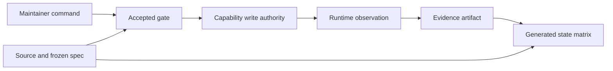

# Design spec 0075 — migration documentation site

## Metadata

| Field | Value |
| --- | --- |
| Stable ID | `0075` |
| Status | Frozen for implementation on 2026-08-31 |
| Source base | `0bc4aa3ac5506b6371d25972c9608eee8e35c17d` |
| Product | Vektorprogrammet migration documentation |
| Public host | `vektor-docs.phibkro.org` |
| Deployment stage | `docs-main` |
| Deployment system | Alchemy v2 and Cloudflare Workers static assets |

The operator authorized this documentation deployment and the new Cloudflare hostname. This authority applies only to the resources in this spec.

## Felt journey

A maintainer opens the documentation home page and sees the current migration posture. The page states that the public preview uses synthetic development data.

The maintainer then traces one receipt journey from the Symfony seam to the native route, domain authority, database Layer, dashboard view, and evidence.

The maintainer uses a how-to guide to prepare one capability cutover. Each step links to an executable repository command or an exact source file.

The maintainer finishes at the state matrix. The matrix distinguishes source claims, test observations, preview observations, and unsupported production claims.

The journey succeeds when the maintainer can answer these questions without repository archaeology:

1. Which system owns each write now?
2. Which legacy data can the native system read?
3. Which evidence applies to the capability?
4. Which gate must pass before a cutover?
5. Which source file owns the next change?

## Information architecture

The site uses Diataxis as its top-level structure.

### Tutorials

The tutorial section contains two ordered journeys:

1. A first orientation explains the repositories, runtimes, authority lines, and evidence classes.
2. A receipt trace follows one capability from a legacy route to native authority and preview evidence.

Tutorial text teaches one path. It does not become a command reference.

### How-to guides

The how-to section contains these procedures:

- add or migrate a capability
- run the local stack
- run parity and evidence gates
- update a frozen design spec
- deploy and recover a preview safely

Each command must exist in a checked-in package script, a checked-in procedure, or a tool help page. The documentation must not invent a command.

### Reference

The reference section contains these facts:

- a migration state matrix by capability and journey
- a runtime and capability graph
- Services, Layers, and `ManagedRuntime` rules
- route and API boundaries
- a generated design-spec and evidence index
- a glossary

One canonical machine-readable state file owns the matrix facts. A build script derives the human page and public JSON artifact from this file.

The design-spec and evidence index is generated from repository paths. Maintainers must not update a second manual list.

### Explanation

The explanation section covers these topics:

- reasons for the native migration
- correctness by construction
- one authority for each write
- read-only retention of legacy MySQL
- Effect Services and Layers
- Foldkit state ownership
- limits of parity evidence
- preview and production boundaries

Explanation pages describe decisions. They do not hide procedures inside descriptive text.

## Status model

The matrix uses explicit evidence classes. It must not use one word such as “done” for different claims.

| Status | Meaning |
| --- | --- |
| `legacy-authority` | The legacy Symfony/MySQL path remains the production authority. |
| `native-implemented` | Native source implements the capability. This status does not claim a runtime observation. |
| `native-observed` | A named evidence artifact records a native runtime observation. |
| `parity-observed` | A named parity artifact records the checked scope. It does not prove all behavior. |
| `cutover-accepted` | A frozen design spec accepts the capability cutover contract. |
| `production-cutover` | Repository evidence proves the production authority change. |
| `drifted` | Current source or evidence does not match the artifact claim. |
| `stale` | A newer accepted artifact supersedes the item. |
| `unsupported` | The repository contains no evidence for the claim. |

A row can have more than one status. Every status needs a source, design-spec, or evidence reference.

The home page must state the strongest warranted claim only. At the frozen base, it must not claim final parity or a production cutover.

The repository has no checked-in `STATE.md` at the frozen base. The generated reference must state this absence. It must not fabricate content for that file.

## Semantic and authority boundaries

The documentation models commands, observations, state, and evidence as different items.

The diagram does not claim that an observation proves the full system. The state matrix is a projection of repository sources and evidence.

Each capability write has one authority. A preview adapter cannot become production authority by routing traffic to it.

Legacy MySQL retention is read-only from the native boundary. Import and rehearsal procedures must use immutable snapshots or disposable data.

Effect Services define capabilities. Layers implement those capabilities. A composition root selects live Layers and creates the `ManagedRuntime`.

Foldkit owns browser state through `Model`, `Message`, pure `update`, and runtime effects. A React or route bridge must not become a second state owner.

## Source and evidence policy

Every important claim links to an exact repository file. A symbol name accompanies a file link when the file contains several authorities.

Repository links for current claims use the frozen base revision. Generated indexes use repository-relative paths and record the inspected source revision.

Evidence links state their scope. Test results are observations over tested cases. Browser results are runtime observations over the recorded route and fixture.

Accepted design specs can drift from source. The generated index must label these cases:

- `accepted-current` when named source and evidence exist
- `accepted-with-limits` when the artifact explicitly limits its claim
- `stale` when a newer design spec supersedes it
- `drifted` when current source contradicts it
- `unclassified` when automation cannot decide

The generator must fail on a missing matrix source or evidence path. It must not infer acceptance from a filename.

## Documentation implementation

Use the official `bun create vocs` scaffold, then adapt it inside `apps/docs`.

The frozen dependency target is the current registry set observed on 2026-08-31:

- `vocs@2.8.5`
- `waku@1.0.0-rc.0`
- `vite@8.2.2`

The package remains a Bun workspace. Vocs uses `renderStrategy: "full-static"`, `baseUrl: "https://vektor-docs.phibkro.org"`, and dead-link failures.

Built-in keyword search remains enabled. Vocs must emit per-page Markdown output and `llms.txt` or `llms-full.txt` agent-readable artifacts.

The full-static build must not enable server-only MCP, feedback, dynamic image, or AI retrieval endpoints.

The site uses a static Open Graph image or no Open Graph image. It does not reference the disabled dynamic endpoint.

The site marks the migration preview posture with `noindex`. This documentation host is public, but its content describes development and synthetic preview state.

## Deployment contract

Add one dedicated Alchemy Stack named `vektor-docs`. It accepts only the exact stage `docs-main`.

Use `Alchemy.localState()` under the dedicated stack and stage. This state path must not overlap an existing `vektor` stack record.

Deploy one assets-only Cloudflare Worker named `vektor-migration-docs`. The Worker serves the built `apps/docs/dist` directory.

The Worker has one custom domain: `vektor-docs.phibkro.org`. It disables `workers.dev` and version preview URLs.

The declaration contains no script, secret, environment binding, database, queue, Durable Object, service binding, route for another hostname, or production data.

The deployment wrapper requires an explicit Alchemy profile label. It rejects ambient stage and profile selectors.

The operator must run a plan before deploy. The plan can create or update only the docs Worker, its static assets, and its exact custom-domain binding.

If Alchemy reports an unowned Worker, domain conflict, unexpected DNS mutation, extra resource, or state collision, stop before mutation.

After deploy, a second plan must report no change. The ignored local Alchemy state remains the recovery authority for this exact stack and stage.

## Forbidden effects

This work must not change these items:

- production data
- application credentials
- existing preview services
- `vektor.phibkro.org`
- `vektorprogrammet.no`
- any existing Alchemy state record
- a Cloudflare resource outside the docs Worker and exact hostname binding

The implementation must not print, store, or commit a secret value.

## Acceptance

### Local product checks

The following checks must pass:

1. The Vocs generator completes without a missing source or evidence reference.
2. The Vocs production build completes with dead-link checking enabled.
3. Type checks pass for the docs package and deployment declaration.
4. The focused deployment contract tests pass.
5. Lint and format checks pass for changed code.
6. The built site contains HTML, assets, `migration-state.json`, and agent-readable text output.

### Documentation checks

The built site must include these representative pages:

- `/`
- `/tutorials/orientation`
- `/tutorials/receipt-journey`
- `/how-to/migrate-capability`
- `/how-to/run-local-stack`
- `/how-to/run-parity-gates`
- `/how-to/update-design-spec`
- `/how-to/deploy-recover-preview`
- `/reference/migration-state`
- `/reference/runtime-graph`
- `/reference/effect-runtime-rules`
- `/reference/routes-and-api`
- `/reference/design-spec-evidence-index`
- `/reference/glossary`
- `/explanation/native-migration`
- `/explanation/correctness-and-authority`
- `/explanation/effect-and-foldkit`
- `/explanation/evidence-limits`
- `/explanation/preview-production-boundary`

Navigation and keyword search must expose all four Diataxis categories.

### Live checks

The live HTTPS checks must record these observations:

- a valid TLS connection
- `200` for the home page and one page from each Diataxis category
- `200` for a hashed asset
- `200` for `/migration-state.json`
- `200` for an agent-readable output file
- a `robots` or page metadata rule that records the preview posture
- working navigation and keyword search
- no browser console error or page error on the checked pages

Sanitized plan, deploy, convergence, HTTP, and browser evidence belongs under `evidence/0075-migration-docs/`. Evidence must not contain profile labels, account IDs, tokens, cookies, or local absolute operator paths.
