# Enterprise models

**Status:** Draft target views. Revised 2026-09-24.

This document models the intended Vektorprogrammet replacement through 4EM and
ArchiMate viewpoints. It does not define a second business or architecture source.

- [system.md](system.md) defines business meaning and target behavior.
- [architecture.md](architecture.md) defines technical ownership and boundaries.
- [operational-responsibility-map.md](operational-responsibility-map.md) defines
  actors, end-to-end work, and replacement contracts.
- [STATE.md](../STATE.md) alone records current implementation and acceptance.

The diagrams use Mermaid for review in the repository. They use method vocabulary,
but they are not exports from a certified modeling tool.

## Shared capability keys

These keys connect both views. They identify business capabilities, not packages or
implementation status.

| Key       | Capability                                  |
| --------- | ------------------------------------------- |
| `CAP-ID`  | Identity, sessions, and profile             |
| `CAP-REC` | Recruitment and onboarding                  |
| `CAP-AFF` | Volunteer affiliation and placement         |
| `CAP-SVC` | School-demand planning and teaching service |
| `CAP-SUB` | Substitute coverage                         |
| `CAP-ORG` | Organization administration                 |
| `CAP-ECO` | Expense reimbursement                       |
| `CAP-SUR` | Surveys and school feedback                 |
| `CAP-PUB` | Public content, contact, and events         |
| `CAP-OPS` | Audit, delivery, migration, and recovery    |

## 4EM target model

The 4EM view uses its six connected submodels. The notation and submodel structure
follow _Overview of the 4EM Method_ by Sandkuhl, Stirna, Persson, and Wißotzki.

### Goals Model

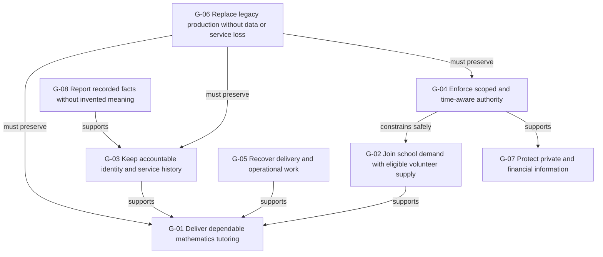

`G-01` is the primary goal. `G-06` is a migration goal, not evidence that cutover
has started or is authorized.

### Business Rules Model

| ID      | Rule                                                                                                                      | Source                                                                                                    |
| ------- | ------------------------------------------------------------------------------------------------------------------------- | --------------------------------------------------------------------------------------------------------- |
| `BR-01` | A Person is the stable human identity. Account, Profile, Appointment, Affiliation, and Placement remain separate.         | [Business facts](system.md#business-facts)                                                                |
| `BR-02` | Team membership must not imply volunteer affiliation.                                                                     | [Responsibility rules](operational-responsibility-map.md#responsibility-rules)                            |
| `BR-03` | Recommendation, invitation, account claim, affiliation, and placement are separate decisions.                             | [Recruitment and affiliation](system.md#recruitment-and-affiliation)                                      |
| `BR-04` | A coordinator confirms the roster and reviews its exceptions. A proposal does not create a placement or prove attendance. | [School demand and placement](system.md#school-demand-and-placement)                                      |
| `BR-05` | Authority requires a usable account, active relationship, covered scope, and allowed capability at the given instant.     | [Authority model](system.md#authority-model)                                                              |
| `BR-06` | The backend denies access by default. A hidden frontend action is not enforcement.                                        | [Authority model](system.md#authority-model)                                                              |
| `BR-07` | One transaction records current state, immutable history, command receipt, audit, and required outbox work.               | [Durable effects](system.md#durable-effects)                                                              |
| `BR-08` | External delivery starts after commit. Retry reuses the immutable first envelope and remains bounded.                     | [Delivery and providers](architecture.md#delivery-and-providers)                                          |
| `BR-09` | A report distinguishes current from historical, missing from unavailable, and recorded from inferred.                     | [Reporting](system.md#reporting)                                                                          |
| `BR-10` | A file path, team label, menu role, or pool membership does not grant business authority.                                 | [Expense reimbursement](system.md#expense-reimbursement) and [Authority model](system.md#authority-model) |
| `BR-11` | Receipt approval does not imply payment or bank-settlement authority.                                                     | [Reimburse an expense](operational-responsibility-map.md#reimburse-an-expense)                            |
| `BR-12` | Production data, providers, deployment, writer transfer, and destructive actions need explicit operator authority.        | [Cutover gates and authority](operational-responsibility-map.md#cutover-gates-and-authority)              |
| `BR-13` | A recommendation must not imply an admission decision. Add that decision only after the organization defines it.          | [Recruitment and affiliation](system.md#recruitment-and-affiliation)                                      |

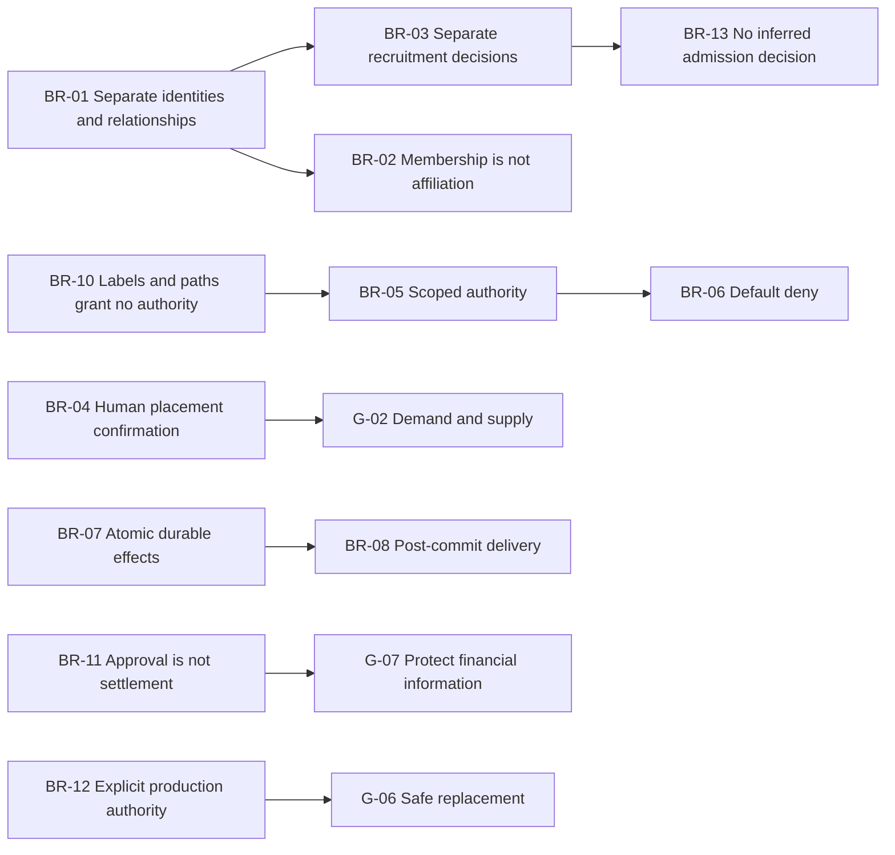

### Concepts Model

The model shows business concepts and their meaning-bearing links. It does not set
cardinalities that the canonical domain model does not define.

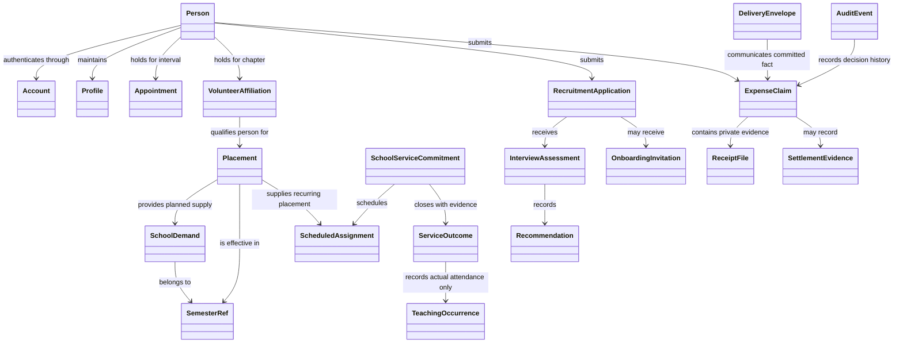

The [dated-service contract](system.md#dated-school-service) separates planned supply, dated commitments, terminal outcomes, and actual attendance.
Cancellation creates no occurrence. Unfulfilled service records an occurrence only when actual attendance exists.
Implementation and acceptance remain in [STATE.md](../STATE.md).

### Business Process Model

#### Recruit and affiliate a volunteer

```mermaid
flowchart LR
  BP01["BP-01 Submit application"]
  BP02["BP-02 Assign and schedule interview"]
  BP03["BP-03 Conduct interview"]
  BP04["BP-04 Record recommendation"]
  BP05["BP-05 Review and issue invitation"]
  BP06["BP-06 Claim or link account"]
  BP07["BP-07 Request affiliation"]
  BP08["BP-08 Establish affiliation"]
  BP09["BP-09 Confirm placement"]

  BP01 --> BP02 --> BP03 --> BP04 --> BP05 --> BP06 --> BP07 --> BP08 --> BP09
```

The sequence does not contain a generic accepted-applicant state. `BR-13` governs
any future admission decision.

#### Plan and deliver school service

```mermaid
flowchart LR
  BP10["BP-10 Capture school demand"]
  BP11["BP-11 Collect eligible supply and availability"]
  BP12["BP-12 Produce constrained roster proposal"]
  BP13["BP-13 Review exceptions"]
  BP14["BP-14 Confirm roster"]
  SVCPlan["Establish dated commitment and assignments"]
  BP15["BP-15 Notify participants"]
  BP17["BP-17 Resolve absence or substitution"]
  BP16["BP-16 Record actual attendance or no attendance"]
  BP18["BP-18 Record terminal decision and evidence"]
  Completed["Completed"]
  Cancelled["Cancelled"]
  Unfulfilled["Unfulfilled"]
  Occurrence["Attendance occurrence"]
  Closed["Immutable service history"]
  BP19["BP-19 Follow-up under explicit policy"]

  BP10 --> BP12
  BP11 --> BP12
  BP12 --> BP13 --> BP14 --> SVCPlan --> BP15 --> BP17 --> BP16 --> BP18
  BP18 --> Completed --> Occurrence --> Closed
  BP18 --> Cancelled --> Closed
  BP18 --> Unfulfilled
  Unfulfilled -->|actual attendance exists| Occurrence
  Unfulfilled -->|no attendance| Closed
  Closed -.->|required follow-up or optional certificate| BP19
```

This target process covers `CAP-SVC` and `CAP-SUB`. A terminal decision records its evidence atomically.
Covered and Uncovered describe an absence, not the whole service outcome.
Completion requires actual attendance that meets demand. Cancellation records no attendance.
Certificates are outside the mandatory core path. [State](../STATE.md#next) records unresolved operational obligations.

#### Reimburse an expense

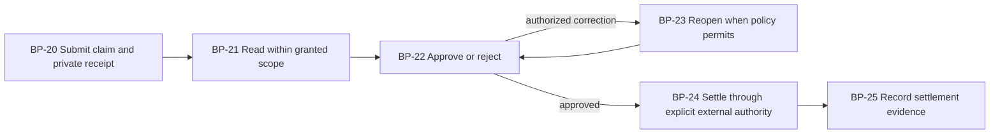

`BP-24` is outside the current product boundary. `BR-11` prevents approval from
being treated as settlement.

### Actors and Resources Model

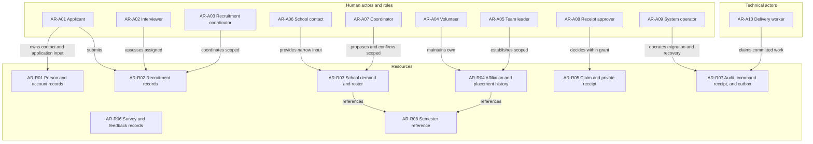

A Person can hold several roles. Assignment depends on relationship, scope, and
time. The arrows do not grant authority by themselves.

### Technical Components and Requirements Model

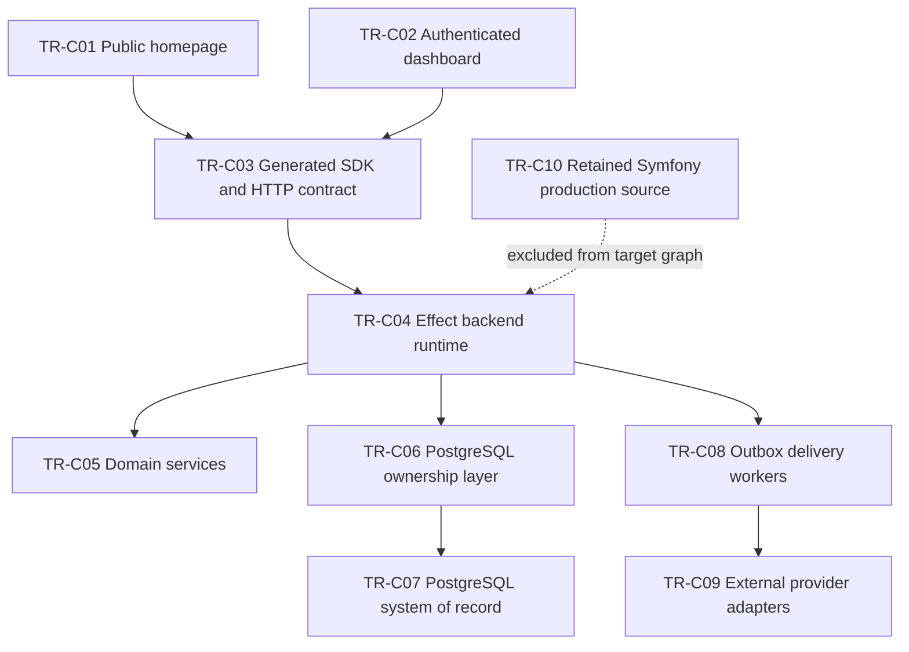

| ID       | Technical requirement                                                                                             |
| -------- | ----------------------------------------------------------------------------------------------------------------- |
| `TR-Q01` | Keep one modular backend until an observed operational need requires another deployment boundary.                 |
| `TR-Q02` | Keep business rules and capability requirements in the domain package.                                            |
| `TR-Q03` | Derive HTTP, OpenAPI, and SDK artifacts from one contract.                                                        |
| `TR-Q04` | Encode every external or durable boundary with Effect Schema.                                                     |
| `TR-Q05` | Use PostgreSQL constraints, transactions, locks, and compare-and-set revisions for owned invariants.              |
| `TR-Q06` | Enforce the same relationship-based authority for commands and queries.                                           |
| `TR-Q07` | Commit business facts and outbox work atomically. Deliver external effects after commit.                          |
| `TR-Q08` | Make provider, credential, schema, and storage configuration explicit. Fail before production serving.            |
| `TR-Q09` | Protect private files with ownership checks, no-follow traversal, restricted permissions, and lifecycle handling. |
| `TR-Q10` | Make one Foldkit Model own each stateful dashboard journey.                                                       |
| `TR-Q11` | Exercise the real browser, HTTP, and PostgreSQL path before accepting a journey.                                  |
| `TR-Q12` | Fence legacy writers before native ownership starts. Prove backup, recovery, reconciliation, and rollback.        |

The component graph comes from [Product shape](architecture.md#product-shape).
The requirements derive from the remaining architecture sections and production
gates.

### 4EM inter-model links

| From                      | Link                     | To                                                |
| ------------------------- | ------------------------ | ------------------------------------------------- |
| `G-01`, `G-02`            | motivate                 | `BP-10` through `BP-18` and `CAP-SVC`             |
| `G-03`, `G-08`            | motivate                 | `BR-01`, `BR-07`, `BR-09`, and history resources  |
| `G-04`, `G-07`            | motivate                 | `BR-05`, `BR-06`, `BR-10`, `TR-Q06`, and `TR-Q09` |
| `BR-03`, `BR-13`          | govern                   | `BP-01` through `BP-09`                           |
| `BR-04`                   | governs                  | `BP-12` through `BP-14`                           |
| Human roles               | perform within authority | Business processes                                |
| Business processes        | create or use            | Concepts and resources                            |
| `TR-C01` through `TR-C09` | support                  | `CAP-ID` through `CAP-OPS`                        |
| `G-06`, `BR-12`, `TR-Q12` | constrain                | production migration                              |

## ArchiMate target model

This section uses ArchiMate 3 vocabulary and relationship labels. It separates
motivation, strategy, business, application, technology, and migration views.

### Motivation and strategy viewpoint

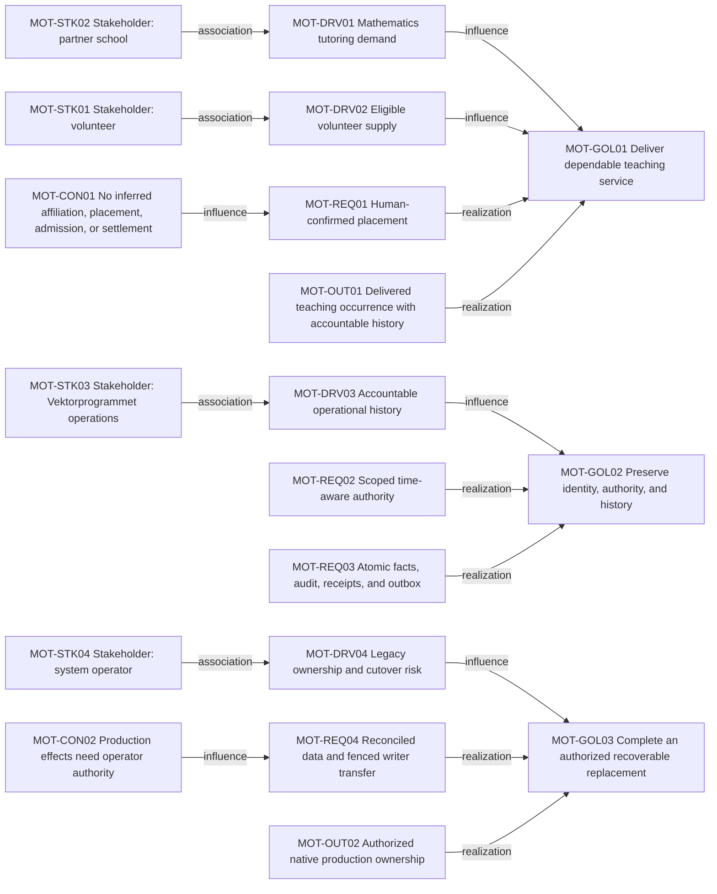

The strategy capabilities are the shared `CAP-*` keys. They group the behavior
needed to achieve these goals. They do not map one-to-one to deployable components.

### Business service viewpoint

```mermaid
flowchart TB
  subgraph Roles["Business roles"]
    BROL01["BUS-ROL01 Applicant"]
    BROL02["BUS-ROL02 Interviewer"]
    BROL03["BUS-ROL03 Recruitment coordinator"]
    BROL04["BUS-ROL04 Volunteer"]
    BROL05["BUS-ROL05 Team leader"]
    BROL06["BUS-ROL06 School contact"]
    BROL07["BUS-ROL07 Coordinator"]
    BROL08["BUS-ROL08 Receipt approver"]
  end

  subgraph Processes["Business processes"]
    BPR01["BUS-PRC01 Recruit and onboard volunteer"]
    BPR02["BUS-PRC02 Establish affiliation"]
    BPR03["BUS-PRC03 Plan and deliver school service"]
    BPR04["BUS-PRC04 Resolve substitute coverage"]
    BPR05["BUS-PRC05 Reimburse expense"]
  end

  subgraph Services["Business services"]
    BSV01["BUS-SVC01 Recruitment service"]
    BSV02["BUS-SVC02 Affiliation service"]
    BSV03["BUS-SVC03 Teaching service"]
    BSV04["BUS-SVC04 Coverage service"]
    BSV05["BUS-SVC05 Reimbursement service"]
  end

  subgraph Objects["Business objects"]
    BOBJ01["BUS-OBJ01 Application and assessment"]
    BOBJ02["BUS-OBJ02 Affiliation and placement"]
    BOBJ03["BUS-OBJ03 School demand and roster"]
    BOBJ04["BUS-OBJ04 Teaching occurrence"]
    BOBJ05["BUS-OBJ05 Claim, receipt, and settlement evidence"]
  end

  BROL01 -->|assignment| BPR01
  BROL02 -->|assignment| BPR01
  BROL03 -->|assignment| BPR01
  BROL04 -->|assignment| BPR02
  BROL05 -->|assignment| BPR02
  BROL06 -->|assignment| BPR03
  BROL07 -->|assignment| BPR03
  BROL04 -->|assignment| BPR04
  BROL07 -->|assignment| BPR04
  BROL04 -->|assignment| BPR05
  BROL08 -->|assignment| BPR05

  BPR01 -->|realization| BSV01
  BPR02 -->|realization| BSV02
  BPR03 -->|realization| BSV03
  BPR04 -->|realization| BSV04
  BPR05 -->|realization| BSV05

  BPR01 -->|access| BOBJ01
  BPR02 -->|access| BOBJ02
  BPR03 -->|access| BOBJ03
  BPR03 -->|access write| BOBJ04
  BPR05 -->|access| BOBJ05

  BSV01 -->|serving| BROL01
  BSV02 -->|serving| BROL04
  BSV03 -->|serving| BROL06
  BSV04 -->|serving| BROL04
  BSV05 -->|serving| BROL04
```

Role assignment is conditional. The authority relationship remains a separate
business fact and applies at the interaction time.

### Application cooperation viewpoint

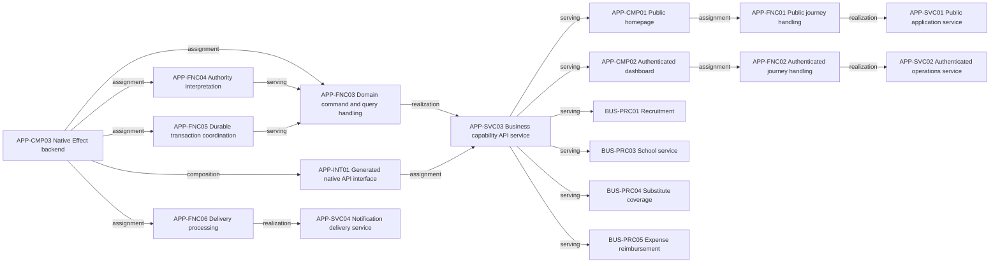

`packages/domain`, `packages/database`, `packages/http-api`, and `packages/sdk` are
implementation modules within these components and interfaces. Their exact
dependency graph remains authoritative in [architecture.md](architecture.md).

### Technology viewpoint

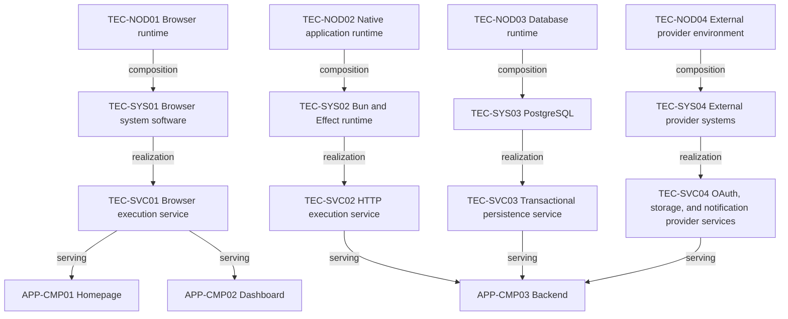

The target documents do not define a final production topology. This view therefore
stops at runtime responsibilities and explicit external provider seams.

### Implementation and migration viewpoint

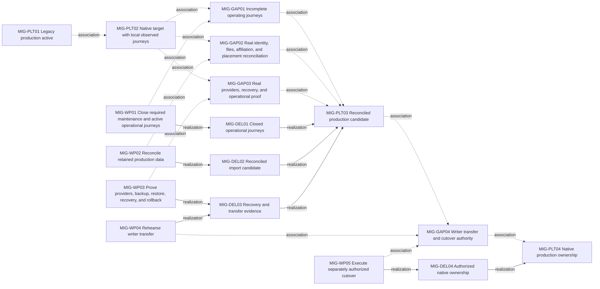

`MIG-PLT01` and the local observations in `MIG-PLT02` are current facts from
[STATE.md](../STATE.md). All later plateaus are targets. `MIG-WP05` requires new
operator authority and does not follow automatically from technical completion.

## Cross-model traceability

| Capability | 4EM anchors                                         | ArchiMate anchors                     | Canonical source                                                                                             |
| ---------- | --------------------------------------------------- | ------------------------------------- | ------------------------------------------------------------------------------------------------------------ |
| `CAP-ID`   | `G-03`, `BR-01`, `AR-R01`, `TR-Q06`                 | `MOT-GOL02`, `APP-FNC04`              | [Business facts](system.md#business-facts), [Identity and authority](architecture.md#identity-and-authority) |
| `CAP-REC`  | `BR-03`, `BR-13`, `BP-01`–`BP-09`                   | `BUS-PRC01`, `BUS-SVC01`              | [Recruitment and affiliation](system.md#recruitment-and-affiliation)                                         |
| `CAP-AFF`  | `BR-02`, `BP-07`–`BP-09`, `AR-R04`                  | `BUS-PRC02`, `BUS-SVC02`, `BUS-OBJ02` | [Return an existing volunteer](operational-responsibility-map.md#return-an-existing-volunteer)               |
| `CAP-SVC`  | `G-01`, `G-02`, `BR-04`, `BP-10`–`BP-18`            | `MOT-GOL01`, `BUS-PRC03`, `BUS-SVC03` | [Plan and deliver school service](operational-responsibility-map.md#plan-and-deliver-school-service)         |
| `CAP-SUB`  | `BP-17`, `AR-A04`, `AR-A07`                         | `BUS-PRC04`, `BUS-SVC04`              | [Substitute coverage](system.md#substitute-coverage)                                                         |
| `CAP-ECO`  | `G-07`, `BR-10`, `BR-11`, `BP-20`–`BP-25`           | `BUS-PRC05`, `BUS-SVC05`, `BUS-OBJ05` | [Expense reimbursement](system.md#expense-reimbursement)                                                     |
| `CAP-OPS`  | `G-05`, `G-06`, `BR-07`, `BR-08`, `BR-12`, `TR-Q12` | `MOT-GOL03`, `MIG-*`                  | [Cutover gates and authority](operational-responsibility-map.md#cutover-gates-and-authority)                 |

Capabilities without detailed diagrams still remain in the shared key list. Their
canonical behavior stays in the three source documents.

## Open model decisions

1. Define a coordinator admission decision only if it is a real business fact with
   named authority and lifecycle.
2. Define payment and settlement ownership before adding a finance integration.
3. Select the final production topology only after operational requirements justify
   it.
4. Promote the ArchiMate draft to an exchange file only if a maintained modeling tool
   becomes part of the workflow.

## Method references

- Sandkuhl, Stirna, Persson, and Wißotzki, [Overview of the 4EM Method](https://doi.org/10.1007/978-3-662-43725-4_7), 2014.
- The Open Group, [The ArchiMate Enterprise Architecture Modeling Language](https://www.opengroup.org/archimate-forum/archimate-overview).
- The Open Group, [ArchiMate 3.2 Specification](https://pubs.opengroup.org/architecture/archimate32-doc/).

## Maintenance rule

Change the canonical source document first. Update these views in the same change
when the modeled meaning changes. Record implementation progress only in
[STATE.md](../STATE.md). This prevents a target view from becoming false runtime
evidence.
